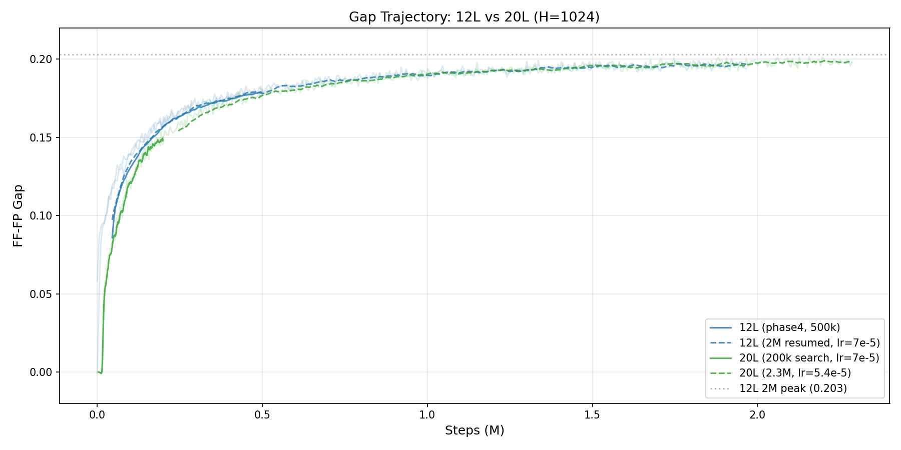
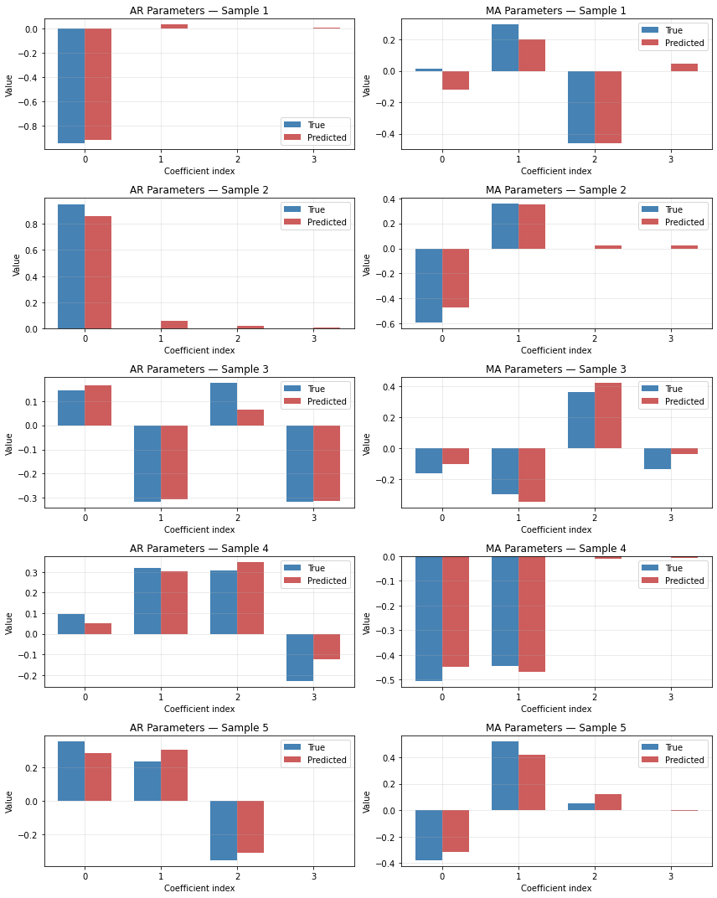
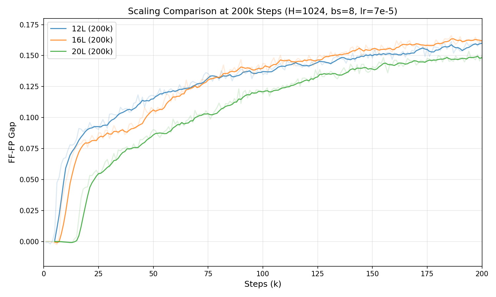
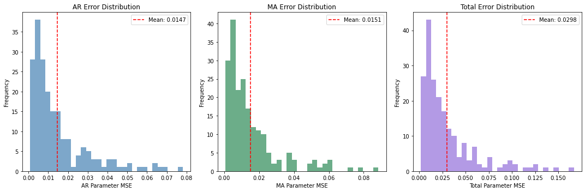

# Learning ARMA Process Structure via Contrastive Forecasting

A technical report on architecture optimization for contrastive time series representation learning, with application to ARMA parameter recovery.

---

## 1. Introduction

Can a neural network learn the hidden structure of a stochastic process just by observing its output? We explore this question using ARMA(p,q) processes as a controlled testbed. The approach has two stages: first, train a backbone model via contrastive learning to produce embeddings that distinguish future from past; second, train a lightweight recovery head on frozen embeddings to predict the generative parameters (AR and MA coefficients).

The quality of the learned representations is measured by two complementary metrics:

- **FF-FP gap**: the difference between forecast-future and forecast-past cosine similarity in embedding space. A higher gap means the model has learned to encode genuinely predictive features rather than trivial statistics.
- **Contrastive loss**: the training loss (cosine similarity-based with cross-batch negatives). Lower (more negative) is better. The loss transitions from positive to negative as the model learns to separate forecast-future from forecast-past; deeply negative values indicate strong contrastive signal.
- **Recovery improvement**: how much better the head predicts ARMA coefficients compared to a zero baseline (which predicts all coefficients as zero). Since ARMA orders vary randomly and unused coefficients are zero-padded, this baseline is non-trivial.

Over ~430 GPU-hours of experiments on a single RTX 4090, we systematically optimized the encoder, transformer backbone, recovery head, and training procedure. This report follows the optimization process chronologically, documenting what worked, what didn't, and why.

---

## 2. Setup

**Data.** Each sample is a 4-channel time series of 4096 steps, generated from an ARMA(p,q) process where p and q are drawn uniformly from {1..4} per channel. The raw signal is split into 128 non-overlapping patches of width 32. The model never sees the generative parameters during contrastive training.

**Model.** The architecture has three components:
1. **Encoder**: maps each patch (32 scalars) to an embedding of dimension H
2. **Transformer**: processes the sequence of 128 embeddings with causal attention, producing a forecast embedding at each position
3. **Channel mixing**: combines information across the 4 channels via learnable Kronecker-product matrices

**Training.** AdamW optimizer, cosine similarity contrastive loss with temperature 0.07 and cross-batch negatives. Standard PyTorch initialization (Kaiming/Xavier), no muP.

---

## 3. Encoder Search

The first question: how should we encode raw patches into embeddings?

We tested five encoder architectures at a small scale (6 layers, H=512, 50k steps, ~30-60 min each) while keeping the transformer backbone identical:

| Encoder | Gap | Loss | vs MLP |
|---------|-----|------|--------|
| MLP | 0.073 | 2.33 | -- |
| MLP (wider) | 0.075 | 1.63 | +3% |
| 1D Convolution | 0.075 | 2.01 | +3% |
| Residual SiLU | 0.084 | 1.73 | +15% |
| **Bidirectional GRU** | **0.115** | **1.28** | **+58%** |

The GRU encoder won by a wide margin. Treating each 32-step patch as a short time series and reading it sequentially captures temporal structure that feedforward encoders miss entirely. The GRU is a 2-layer bidirectional model (hidden=128) with a skip connection and LayerNorm, processing all B x T x C patches in a single batched call.

---

## 4. Transformer Configuration

With the GRU encoder fixed, we optimized the transformer backbone (still at 6L H=512, 50k steps):

| Change | Gap | Loss | Effect |
|--------|-----|------|--------|
| Baseline (8 heads, FFN 2x, GELU, conv k=3) | 0.115 | 1.00 | -- |
| 16 attention heads | 0.118 | 1.58 | +3% |
| **FFN multiplier 4x** | **0.125** | **1.74** | **+9%** |
| FFN multiplier 1x | 0.098 | 1.41 | -15% |
| SiLU activation | 0.110 | 1.15 | -4% |
| Remove depthwise conv | 0.095 | 1.24 | **-17%** |
| Larger conv (k=7) | 0.120 | 1.62 | +4% |

Two clear findings:
- **FFN 4x is the most impactful single change** (+9% gap). The wider feed-forward network gives the model more capacity to process each position.
- **Depthwise causal convolution is essential.** Removing it causes the largest drop (-17%). The local temporal context between attention and FFN sublayers is critical.

GELU outperforms SiLU. More attention heads help marginally. Larger convolution kernels show diminishing returns beyond k=3.

---

## 5. Scaling Up

Armed with the best configuration (GRU encoder + FFN 4x + GELU + conv k=3), we scaled to 12 layers and H=1024 (153.8M parameters) and trained for 500k steps (~20 hours):

| Steps | Gap |
|-------|-----|
| 50k | 0.120 |
| 150k | 0.150 |
| 300k | 0.170 |
| 500k | 0.179 |

The gap was still climbing at 500k, so we extended to ~2M steps (~80 additional hours). The gap grew logarithmically:

| Steps | Gap |
|-------|-----|
| 500k | 0.179 |
| 1M | 0.191 |
| 1.5M | 0.197 |
| **2M** | **0.203** |

This represents a **77% improvement** over the original MLP-based model (V1), which reached a gap of only 0.105 at the same 2M step count.

---

## 6. Recovery Head Search

The contrastive gap tells us the backbone learned good representations. But can we actually extract the ARMA coefficients from them?

We trained recovery heads on frozen backbone embeddings to predict 4 AR + 4 MA = 8 coefficients per channel. The head sees the full sequence of 128 embeddings and outputs coefficient predictions averaged over time.

### Which head architecture?

We tested 7 architectures (5k epochs each, ~20 min per run):

| Head | Params | Improvement |
|------|--------|-------------|
| MLP (3-layer) | 396K | 3.79x |
| Residual MLP | 1.3M | 3.99x |
| Attention (Transformer) | 1.4M | 5.54x |
| DeepGRU | 3.6M | 5.79x |
| DeepGRU + pooling | 3.0M | 5.81x |
| **GRU** | **2.4M** | **5.99x** |
| **GRU + pooling** | **2.4M** | **5.66x** |

GRU-based heads dominate. Surprisingly, the simpler GRU outperforms the more complex DeepGRU (which has per-coefficient output heads, residual blocks, and 50% more parameters).

### Which hyperparameters?

We swept hidden dimension and layer count for the GRU head:

| Hidden dim | Layers | Improvement (5k ep) | Improvement (20k ep) |
|------------|--------|---------------------|----------------------|
| 128 | 1 | 6.00x | 6.64x |
| **128** | **2** | **5.90x** | **6.96x** |
| 128 | 3 | 5.76x | -- |
| 256 | 2 | 5.93x | -- |
| 512 | 2 | 5.90x | -- |

At 5k epochs, 1 layer is best. But at 20k epochs, **2 layers scales better** (6.96x vs 6.64x). Hidden dim 128 is sufficient — larger dims add parameters without improving recovery.

The winning head: **GRU, h=128, 2 layers, ~676K parameters** — 7x smaller than DeepGRU yet better.

### Which loss function?

| Loss | Improvement |
|------|-------------|
| **MSE** | **5.90x** |
| Huber (delta=0.1) | 5.84x |
| Weighted MSE (2x on first coef) | 5.77x |
| L1 | 5.65x |

MSE wins. Alternative losses don't help, despite AR[0] and MA[0] being the hardest coefficients to recover.

### Final recovery results

With the optimized GRU head (h=128, l=2, MSE, 20k epochs):

| Backbone | Gap | Recovery | Sign agreement |
|----------|-----|----------|----------------|
| V1 (MLP encoder, 12L) | 0.105 | 6.59x | -- |
| **V2 (GRU encoder, 12L)** | **0.203** | **6.96x** | **92% AR, 91% MA** |
| V2 (GRU encoder, 20L) | 0.203 | 6.77x | 92% AR, 91% MA |

The V2 backbone with our optimized head achieves **6.96x improvement** over the zero baseline, with 92% sign agreement and Pearson correlations above 0.93 for all 8 coefficients.

---

## 7. Depth Scaling

Does a deeper backbone help? We compared 12, 16, and 20 layers at H=1024 (all other settings identical).

### Short runs (200k steps)

| Depth | Params | Gap @ 200k | Loss @ 200k | Speed |
|-------|--------|------------|-------------|-------|
| 12L | 154M | 0.162 | -0.92 | 6.9 step/s |
| **16L** | **204M** | **0.166** | **-1.03** | 5.4 step/s |
| 20L | 255M | 0.154 | -0.21 | 4.4 step/s |

At 200k steps, 16L is slightly ahead. 20L lags due to slower warmup — the deeper model needs more steps before its gap starts climbing. This is consistent with deeper networks requiring longer optimization to escape the initial plateau.

### Long run (20L at 2M+ steps)

We trained 20L for 2.3M steps to see if it eventually overtakes 12L:

| Steps | 12L gap | 20L gap |
|-------|---------|---------|
| 500k | 0.179 | 0.181 |
| 1M | 0.191 | 0.192 |
| 1.5M | 0.197 | 0.200 |
| 2M | 0.203 | 0.203 |

**Result: 20L matches 12L but does not surpass it**, despite 65% more parameters and 45% more wall time. Recovery is also slightly worse (6.77x vs 6.96x at matched gap).

This suggests that at H=1024, the model is not capacity-limited — 12 layers is sufficient to capture the ARMA structure in these representations. Depth alone does not help without addressing the learning rate and initialization scaling [^1].

---

## 8. Consolidated Results

### All backbone configurations

| d | L | Heads | Params | Steps | Peak gap | Final loss | Recovery (4x2) | Wall time |
|---|---|-------|--------|-------|----------|------------|-----------------|-----------|
| 512 | 6 | 8 | 20M | 50k | 0.125 | 1.74 | -- | 1.2 h |
| **1024** | **12** | **8** | **154M** | **2M** | **0.203** | **-0.77** | **6.96x** | **101 h** |
| 1024 | 16 | 8 | 204M | 200k | 0.166 | -1.03 | -- | 10.4 h |
| 1024 | 20 | 8 | 255M | 2.3M | 0.203 | -1.25 | 6.77x | ~145 h |

### Gap vs recovery correlation

| Backbone | Encoder | Gap | Recovery |
|----------|---------|-----|----------|
| V1 12L H=1024 | MLP | 0.105 | 6.59x |
| V2 12L H=1024 | GRU | **0.203** | **6.96x** |
| V2 20L H=1024 | GRU | 0.203 | 6.77x |

Higher gap correlates with better recovery across architectures (V1 vs V2). However, at matched gap (12L vs 20L), the shallower model recovers slightly better — suggesting that the gap metric and recovery metric capture partially independent aspects of representation quality.

### Per-coefficient recovery (best model: V2 12L, GRU head h128 l2)

| Coefficient | Sign agreement | Pearson r | MAE |
|-------------|---------------|-----------|-----|
| AR[0] | 92.4% | 0.924 | 0.121 |
| AR[1] | 95.1% | 0.951 | 0.085 |
| AR[2] | 95.9% | 0.958 | 0.072 |
| AR[3] | 92.7% | 0.947 | 0.081 |
| MA[0] | 90.9% | 0.923 | 0.126 |
| MA[1] | 93.0% | 0.939 | 0.094 |
| MA[2] | 97.0% | 0.955 | 0.074 |
| MA[3] | 94.9% | 0.955 | 0.070 |

First-order coefficients (AR[0], MA[0]) are hardest — they have the largest influence on the process and widest value range. Higher-order coefficients reach >95% sign agreement.

---

## 9. Compute Budget

| Stage | Runs | GPU-hours |
|-------|------|-----------|
| Encoder search (Phase 1) | 5 | 3 h |
| Transformer search (Phase 2) | 7 | 7 h |
| 12L training (500k + 2M) | 3 segments | 101 h |
| Recovery head search | 47+ | 18 h |
| Scaling search (200k comparison) | 3 | 31 h |
| 20L training (2M+, includes lost run) | 3 attempts | ~270 h |
| Recovery on 20L | 1 | 1 h |
| **Total** | | **~430 h (~18 days)** |

All experiments on a single NVIDIA RTX 4090 (24GB VRAM). The entire architecture search (encoder + transformer + recovery head) was run autonomously by Claude Code.

---

## Notes

[^1]: **Learning rate for deeper models.** The 20L model collapsed when trained from scratch at lr=7e-5 (the 12L learning rate). It required resuming from a pre-trained 200k checkpoint. We also applied a depth-scaling heuristic: lr = 7e-5 x sqrt(12/20) = 5.4e-5 for the continuation. This helped but the 20L model still didn't surpass 12L. A proper muP-style initialization and LR transfer would be needed for a fair depth scaling comparison. Standard PyTorch initialization does not scale well with depth.

[^2]: **Lost checkpoint.** A 5-day 20L training run (peak gap 0.202) was permanently lost when a follow-up continuation accidentally used the same `--save-path`, causing periodic saves to overwrite the trained model. This motivated the addition of `safe_save_path()` to the codebase, which auto-detects and prevents such conflicts. The run was repeated from the 200k checkpoint, adding ~6 days of compute.

[^3]: **Best-checkpoint metric.** The training script tracked "best" checkpoints by raw val_ff (forecast-future similarity), not by FF-FP gap. Early in training, val_ff is high because all embeddings are similar — these "best" checkpoints have zero contrastive signal. This caused confusion during the 20L scaling work when resuming from `_best.pth` loaded an early, useless model. A `_best_gap.pth` checkpoint tracking the actual contrastive gap was added to the code.

[^4]: **Recovery head bug.** The `create_recovery_head()` factory function did not forward `num_gru_layers` to `GRU` and `GRUPool` head types (only `DeepGRU` received it). All Phase 3 experiments labeled "l1"/"l3"/"l4" actually used the default 2 layers. Discovered during analysis, fixed, and layer sweep rerun. The corrected results showed 1-2 layers are optimal.

[^5]: **Comparison with prior 7.3x result.** An earlier experiment reported 7.3x recovery improvement. This was on a different model (V1, H=512, ~50M params) recovering only 2 AR + 2 MA = 4 coefficients — a substantially easier task than our 4+4=8 coefficient recovery. On the same 2x2 task, our V2 model achieves 8.34x, a 14% improvement.
