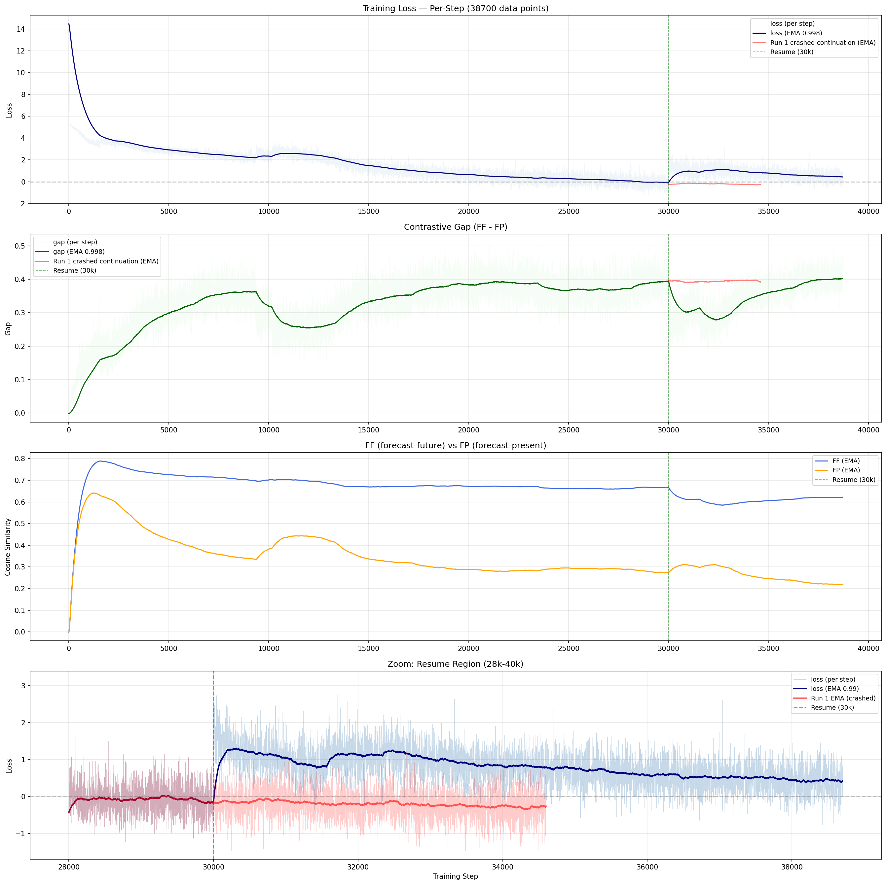
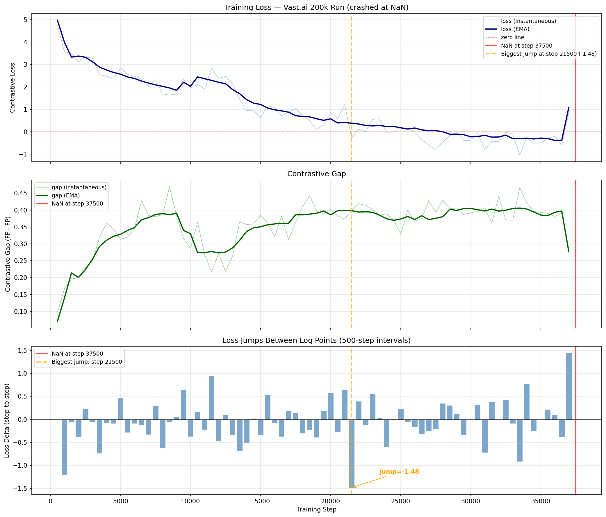

# Tiny backbone: first long streaming-data training

The architecture search ([contrastive-arma](../2026-04-12_contrastive-arma/contrastive-arma.md)) fixed the Tiny backbone recipe on short synthetic runs. This was the first time that recipe was trained long-form on HuggingFace-streamed bundle data — both to produce a usable backbone for the downstream forecasting work and to find out whether the checkpoint and data-loading infrastructure could survive a multi-day, multi-resume run. At first it could not: the run reached a usable backbone but only after surfacing two failures that every later run now avoids.

## Result

The backbone trained to a stable contrastive **gap** of ≈ 0.42, and its best checkpoint (`tiny_v2_best_gap`, gap 0.428) became the backbone reused by [head / rollout](../2026-04-16_head-rollout-comparison/head-rollout-comparison.md) and [encoder-comparison](../2026-04-19_encoder-comparison/encoder-comparison.md).

> *Contrastive **gap** = FF − FP, where FF = cosine(forecast, future) and FP = cosine(forecast, present). A higher gap means the forecast embedding resembles its own future more than its present — the quantity the contrastive loss exists to grow.*

Loss falls from ≈ 14 to near zero; the gap climbs to ≈ 0.42 within ~7k steps and holds there for the rest of the run. The dip-and-recovery around step 30,000 is not a property of the data or the model — it is the visible symptom of failure #2 below, an incomplete-state resume.

The run did not get there cleanly. Two infrastructure failures had to be fixed first, and fixing them is the durable result of this experiment.

## Protocol

| | |
|---|---|
| Backbone | Tiny: GRU patch encoder, 6 transformer layers, 8 heads, FFN ×4, GELU, depthwise causal conv k=3, H=512, patch W=16, RevEWMNorm span=32 (~20M params) |
| Loss | `cosine_similarity_batch` (cross-batch + cross-channel negatives, no within-time negatives), temperature 0.07 |
| Data | HuggingFace streaming bundles (`tiny_mixed_v1` / `base_mixed_v1`) |
| Optimiser | AdamW, batch 24, lr 1e-4 (constant), no gradient clipping |
| Hardware | Vast.ai, then Elisa (2× RTX 4090), across resumes |

The exact launch command was not preserved, so the values above are the trainer defaults the run used. The operational play-by-play — which machine ran which leg, and an interim fix that was tried and reverted — lives in [notes/INCIDENT_NAN_AND_RESUME.md](notes/INCIDENT_NAN_AND_RESUME.md).

## What we learned: two failures, two fixes

### 1. A single all-NaN data row poisons the whole run

The loss decays normally, then spikes to NaN and the run halts (here at step 37,500 on the 200k Vast.ai leg; a separate leg tripped the same way at step 24,970). The cause was one row in the data stream that was **entirely NaN**. The loader's forward-fill returned early when a sequence had no valid value at all, so the all-NaN row passed through untouched: NaN propagated RevEWMNorm → encoder → loss → gradients → optimiser, quietly corrupting the weights, and the next (clean) step then produced NaN everywhere.

**Fix:** the fill now reports whether a row is usable, and the loader **skips** any row still NaN after forward- then back-fill; a NaN/Inf guard in the training loop checkpoints and exits on contact instead of corrupting state; 14 regression tests pin the behaviour. This is divergence fixed in the data path, per the project rule — gradient clipping stays off.

### 2. A resume must restore more than the weights

The original checkpoint saved weights, optimiser moments, and the step counter — but not the `best_loss` and its step, the EMA loss/gap, the RNG state, or the true number of stream rows consumed. So every resume:

- reset `best_loss` to infinity and immediately overwrote the best-loss checkpoint;
- restarted the EMAs from scratch — the ~500-step metric wobble visible at the 30k resume above;
- replayed different augmentations (RNG not restored);
- mis-estimated its place in the stream (`step × rows_per_step` over-counts, because skipped rows are never consumed).

**Fix:** the checkpoint now carries `best_loss`/step, EMA loss and gap, RNG state (torch + numpy), and `hf_rows_consumed`, and the trainer restores all of it, so resumes are continuous. A `safe_run_name()` helper auto-suffixes the save path so a restart cannot overwrite a prior run's checkpoints.

## Caveats

- The headline **0.428** is the annotation carried on the saved checkpoint (and used by the downstream experiments); this run's own dashboard supports a ≈ 0.42 peak but stores no exact value or underlying CSV.
- The two crash steps (37,500 on the plotted 200k leg; 24,970 on the leg the incident note describes) are different legs of the same recipe with the same root cause — an all-NaN stream row — and neither leg has a surviving training log.
