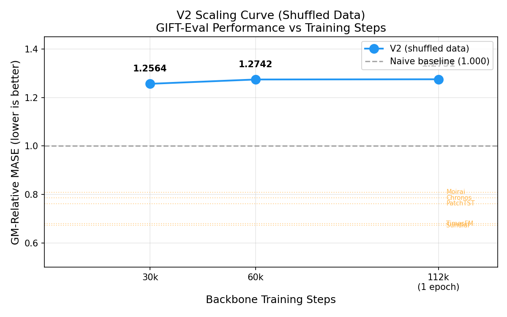

# GIFT-Eval Evaluation

Evaluation of the Tiny contrastive forecaster (~21M params) on the GIFT-Eval benchmark (97 configurations, 23 datasets, 7 domains). Includes training diagnostics, LR sweep, and per-domain comparison against published small foundation models.

## Key Result

GM-Relative MASE ~1.26 (below seasonal naive at 1.00). The scaling curve is flat from 20k to 80k backbone steps due to unshuffled training data (`tiny_mixed_v1`). A new dataset (`tiny_mixed_v2`) with proper inter-shard shuffling was prepared as a fix.

## Documents

| File | Description |
|---|---|
| [EXPERIMENT_STATUS.md](EXPERIMENT_STATUS.md) | Main experiment log: training curve, GIFT-Eval scores at 20k/50k/80k, NaN crash, data ordering root cause. |
| [DOMAIN_COMPARISON.md](DOMAIN_COMPARISON.md) | Per-domain comparison against 9 published small models. Domain-by-domain analysis with gap-to-close estimates. |
| [LR_SWEEP_EXPERIMENT.md](LR_SWEEP_EXPERIMENT.md) | Controlled LR sweep (1e-4 / 5e-5 / 1e-5) proving training instability is data-driven, not optimization-driven. |

## Training Curve

## LR Sweep

## V2 Scaling Curve

## Key Findings

1. **NaN crash at step 24,970**: all-NaN row in HF data silently passed through ffill. Fixed by skipping all-NaN rows entirely.
2. **Training instability is data-driven**: same dip pattern at steps 24k/35k/40k regardless of LR (1e-4, 5e-5, 1e-5). Not gradient explosion, not normalization artifacts.
3. **Flat scaling curve**: more backbone training does not improve GIFT-Eval MASE. Root cause: unshuffled dataset repeats the same distribution shift each epoch.
4. **Energy domain is the bottleneck**: 32 of 97 configs, our relative MASE 1.550 vs best small models at ~0.83. Fixing energy alone would move overall score from 1.26 to ~1.0.
5. **Sales and Nature are competitive**: relative MASE 0.83 and 0.95, both beating seasonal naive.

## Files

| File | Description |
|---|---|
| `fig_500k_training_curve.png` | Full training curve 0-262k steps |
| `fig_training_curve_clean_lr1e-4.png` | Clean run 0-69k (baseline for LR sweep) |
| `fig_lr_sweep_final.png` | LR sweep comparison plot |
| `fig_lr_sweep_preliminary.png` | Preliminary LR sweep (partial) |
| `fig_v2_scaling_curve.png` | V2 backbone MASE scaling curve |
| `plot_v2_scaling_curve.py` | Script to generate scaling curve plot |
