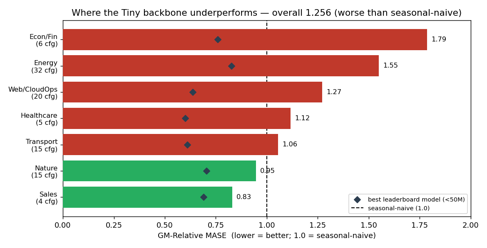
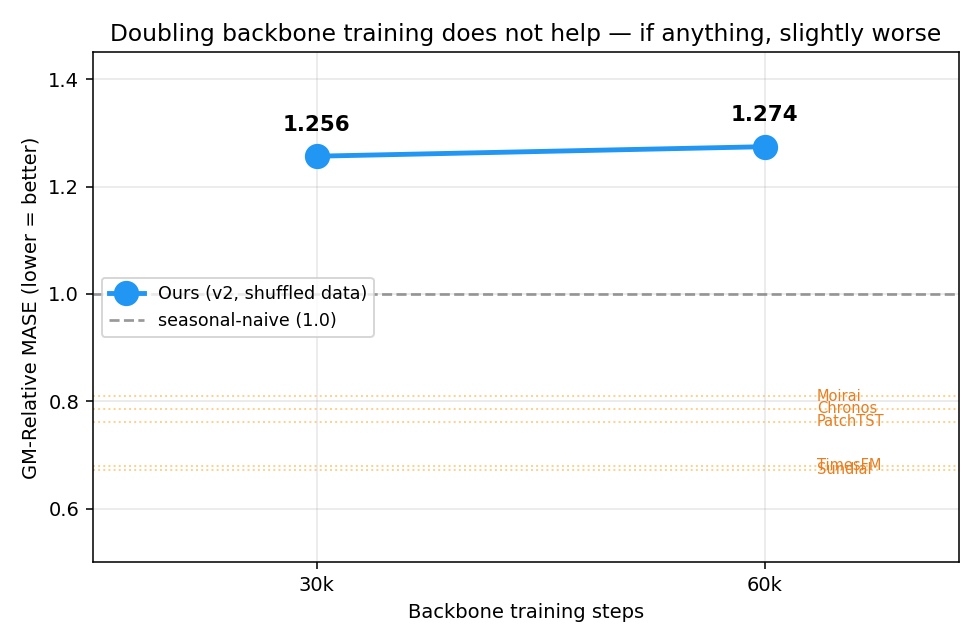
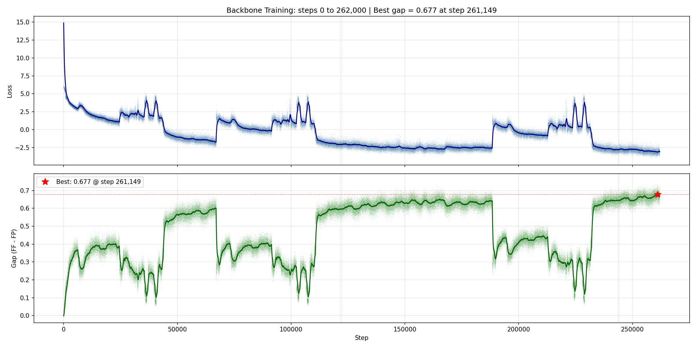

# GIFT-Eval: where, and why, the Tiny backbone underperforms

We froze the Tiny contrastive backbone, trained a forecasting head on top, and ran the official GIFT-Eval benchmark — both to get a leaderboard-comparable number and to find out *where* the model loses and *why*.

## Result

Overall **GM-Relative MASE 1.256** — worse than seasonal-naive (1.0), and last of the ten small models in the per-domain comparison ([notes/DOMAIN_COMPARISON.md](notes/DOMAIN_COMPARISON.md)). The deficit is concentrated, and three probes rule out the obvious training-side levers.

> *GM-Relative MASE = geometric mean over the 97 configs of (model MASE ÷ seasonal-naive MASE), where MASE is Mean Absolute Scaled Error. 1.0 = seasonal-naive; lower is better; the best leaderboard models reach ≈0.6–0.83 per domain.*

**Where it loses** — only Sales and Nature beat seasonal-naive:

Energy (1.55) is the biggest drag — a third of the benchmark (32/97 configs) and the worst score among the larger domains; pulling it alone to the leaderboard band (~0.85) would move the overall to ~1.03. Econ/Fin (1.79, six all-M4 configs) is the single worst-scoring domain. The leaderboard models (◆) sit at 0.6–0.83 in *every* domain, while our deficit is far from uniform — from +0.14 on Sales to ~+1.0 on Econ/Fin.

**Why not just train longer?** — doubling the backbone steps leaves the score flat:

**Why not tune the optimizer?** — the contrastive training (v1, *unshuffled* data) dipped at fixed steps each epoch; an LR sweep from a shared step-20k checkpoint shows those dips are learning-rate-invariant:

> *Contrastive gap (the plots' y-axis) = FF − FP: how much more a window's forecast resembles its own future (FF) than its present (FP) — the margin the contrastive loss grows.*

The dips track specific data shards, not the optimizer (gradient norms and AdamW update sizes were normal through them). Over the full v1 run the same shards collapse the gap every epoch, though it still climbs to 0.677:

The root cause is the dataset layout: in `tiny_mixed_v1` the GIFT-Eval pretraining data sits in the early shards and the synthetic data in the late ones, so every epoch replays the same shift. We rebuilt it as `tiny_mixed_v2` — the same data redistributed *across* all shards so each shard is a representative mix — and the GIFT-Eval MASE (the v2 scaling curve above, 1.256) did not improve.

## Protocol

- **Model under test:** frozen Tiny contrastive backbone (C=4, H=512, W=16, GRU encoder, 6 layers, RevEWMNorm span=32 — reversible EWMA input normalisation; ~20M) + a GRU forecasting head (h=128, 2 layers; ~0.6M) trained on top (AdamW); the backbone is frozen, only the head learns.
- **Benchmark:** the official GIFT-Eval suite via the `gift_eval` library + GluonTS — 97 configs across 7 domains — run as the leaderboard runs it (deterministic point forecast scored against seasonal-naive). Primary metric GM-Relative MASE.
- The headline is the v2 backbone — trained on the rebuilt, cross-shard-shuffled `tiny_mixed_v2` dataset — at its 30k-step checkpoint. Every number *for our model* is computed from the per-config eval outputs in [results/](results/) (raw MASE, seasonal-naive, relative, and domain per config); the leaderboard reference lines and per-domain ◆ are published GIFT-Eval figures (notes/DOMAIN_COMPARISON.md) — note the scaling-curve reference lines and the per-domain ◆ are two different leaderboard panels, both in the 0.6–0.83 range.

## What we learned

None of the training-side levers we tested moves the number: more backbone steps leave the MASE flat, rebuilding the dataset with cross-shard shuffling (`tiny_mixed_v2`) leaves it flat, and the training instability that could have explained a weak backbone is itself data-driven, not an optimizer fault (the dips are LR-invariant). The most likely remaining bottleneck — a hypothesis, since the architecture and head were not varied here — is the **pretraining data**: synthetic-only, it does not cover GIFT-Eval's real-world distributions, and the model is worst on the domains that most demand that structure (Energy's diurnal/weekly seasonality, Web/CloudOps telemetry, the M4 series of Econ/Fin). That is what motivated the periodic-synth-mix and real-data training lines that follow.

*(Operational detail — checkpoint inventory, the step-24,970 NaN-row crash and its fix, the RevEWMNorm-clamp side-thread — lives in [notes/](notes/).)*
