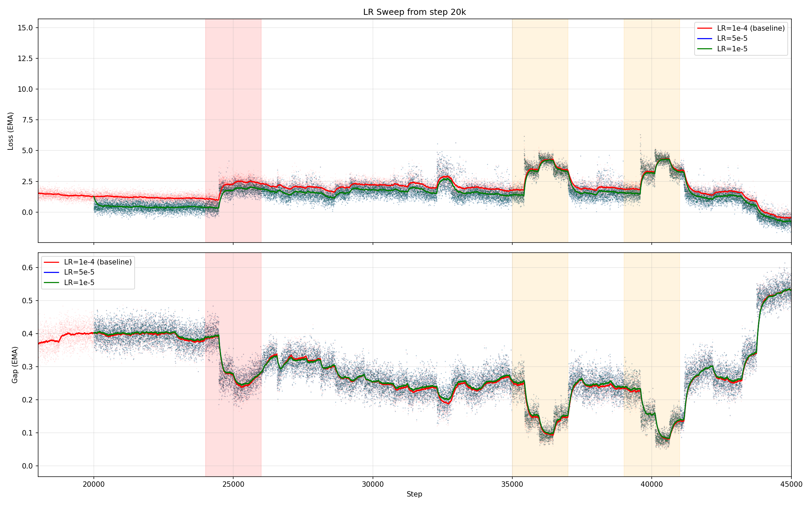

# LR Sweep Experiment: Is Learning Rate the Cause of the Training Dip?

## Date: 2026-04-15

## Hypothesis
The training instability at steps 24k, 35k, and 40k is caused by the
learning rate (1e-4) being too high. Lowering the LR should reduce or
eliminate the dip.

## Setup
- **Checkpoint**: `tiny_150k_20k.pth` (step 20k, with full AdamW optimizer state)
- **Data**: HF streaming, same order as baseline (skip_rows=1920000)
- **Steps**: 20001 → 45000 (covers all three crash episodes)
- **LRs tested**: 1e-4 (baseline from clean run), 5e-5, 1e-5

All three curves start from the **exact same point**: same model weights,
same optimizer momentum/variance, same data position. Only the LR differs.

## Result

**All three LRs produce the same dip pattern.**

The gap collapse at steps 24k, 35k, and 40k happens identically regardless
of learning rate. Even LR=1e-5 (10x lower than baseline) shows the exact
same instability.

## Supporting Evidence

### Gradient analysis
Per-batch gradient norms are normal across all shards, including the
problematic ones:
- Normal shards: L2 ~0.5-1.5, Linf ~0.05-0.19
- Problematic shards (235, 340-390): L2 ~0.6-2.2, Linf ~0.05-0.29
- **AdamW effective updates are identical** (~0.089 L2) across all shards

### RevEWMNorm analysis
The normalization handles extreme values correctly:
- Max |x_norm| = 4.06 across 49M values (normal data)
- Max |x_norm| = 3.5 on the extreme rows (mining difficulty 1.66e13)
- The vectorized cumsum EMA naturally adjusts stdev at transitions

### Shard audit
- Shard 235: 3 extreme rows (source 0: mining difficulty, market cap), max 1.66e13
- Shards 340-394 (episodes 2-3): **no extreme values** (max ~2.5e6)
- Episodes 2-3 are NOT caused by extreme data

## Conclusion

**The instability is data-driven, not optimization-driven.** The specific
data encountered at shards ~235 and ~340-394 causes the model's
contrastive representations to temporarily collapse. This is not caused by:
- ❌ Learning rate being too high
- ❌ Gradient explosion
- ❌ Normalization artifacts (RevEWMNorm handles extremes correctly)
- ❌ NaN or Inf in the data

Possible remaining causes:
- The contrastive loss landscape has sharp transitions at certain data distributions
- The model architecture (Tiny, 20M params) lacks capacity to handle all data types simultaneously
- The data mix shifts (GiftEval financial data appearing alongside synthetic ARMA)

## Decision
Accept the dip as natural training dynamics. The model recovers and
surpasses the pre-dip gap. Train longer (500k steps, multi-epoch).
