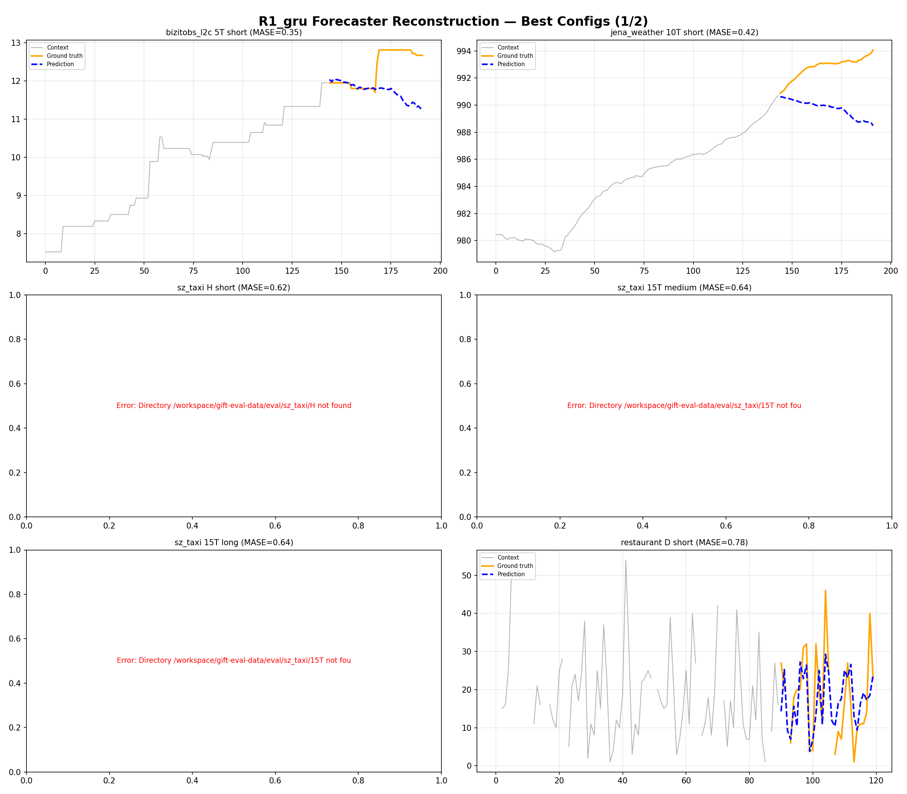
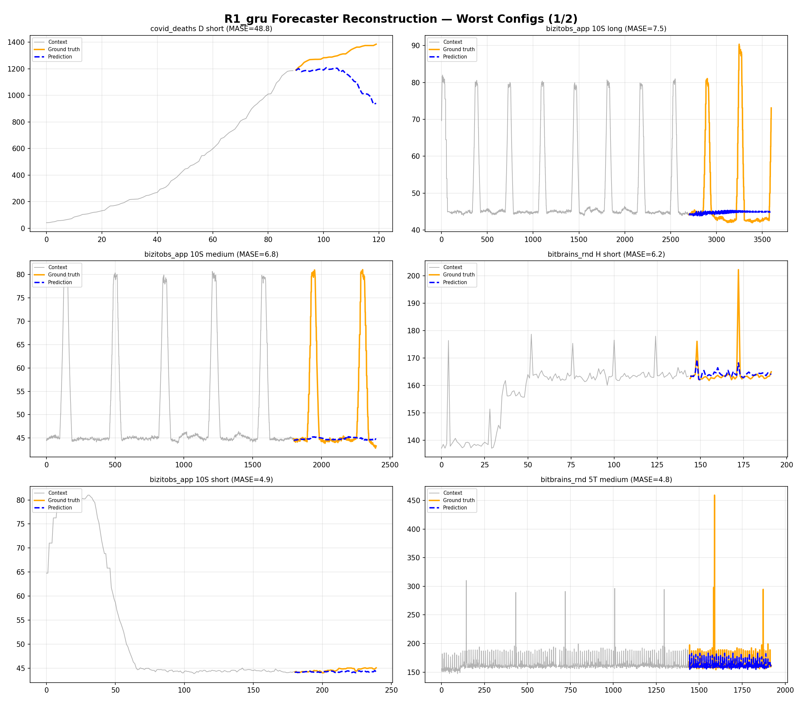
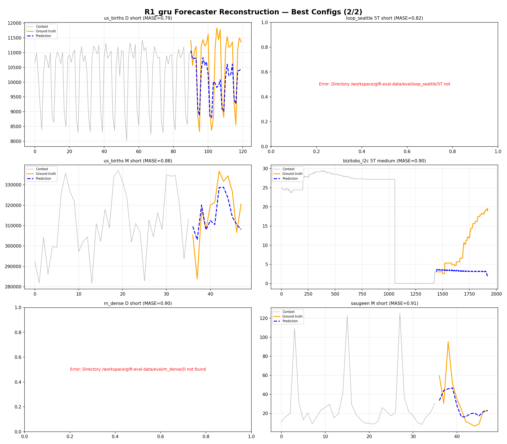
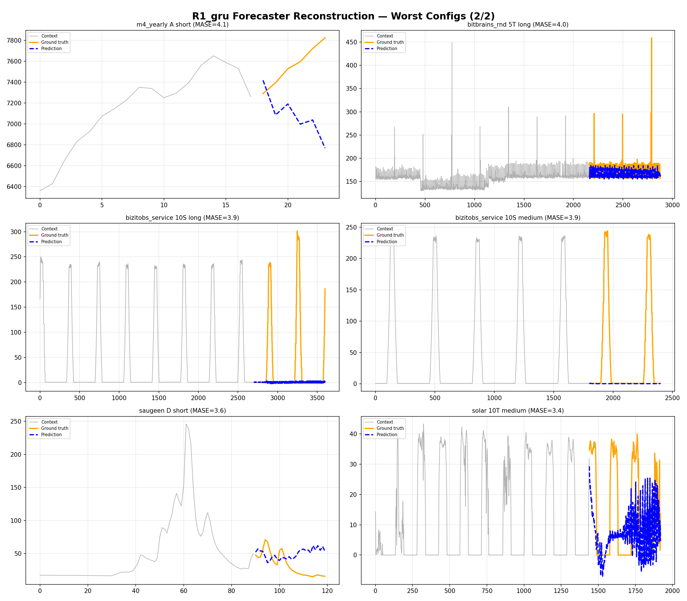

# Reconstruction Head Experiment

Tested whether training the prediction head to **reconstruct** the patch each latent represents (instead of predicting the future) fixes latent rollout quality. The backbone's contrastive training already makes f[t] approximate e[t+1], so the head's job should be decoding, not re-predicting.

## Key Result

R1 (forecaster reconstruction, W=16) achieves GM-Relative MASE 1.121, a **12% improvement** over the best value-space baseline (A1=1.275). This confirms that head misalignment was the bottleneck: once the head reconstructs what each latent represents, latent rollout substantially outperforms value-space rollout.

## Documents

| File | Description |
|---|---|
| [REPORT.md](../reconstruction-head.md) | Main results: R1/R2/R4 scores, analysis of why reconstruction works, W=16 vs W=128 comparison. |
| [DESIGN.md](DESIGN.md) | Experiment design: R1-R4 variant definitions, training targets, key insight diagram. |
| [FAILED_EXPERIMENTS.md](FAILED_EXPERIMENTS.md) | Failed attempts: B1-B4 prediction heads, R3 rolled reconstruction, fR4/fR5 wrong decode alignment, pre-PR#33 misalignment. |
| [FAILURE_MODES.md](FAILURE_MODES.md) | Per-config failure analysis of R1: periodic patterns, explosive trends, sharp spikes. |

## Results

| Head | Type | Output | Strategy | GM-Rel MASE |
|---|---|---|---|---|
| **R1** | **Forecaster recon** | **W=16** | **B4** | **1.121** |
| R2 | Encoder recon | W=16 | B4 | 1.165 |
| R4 | Encoder recon | W=128 | B3R | 1.191 |
| A2 | Value-space | W=16 | -- | 1.262 |
| A1 | Value-space | W=128 | -- | 1.275 |

## Best and Worst Predictions (R1)

| Best | Worst |
|---|---|
|  |  |
|  |  |

## Key Files

| File | Description |
|---|---|
| `plot_predictions.py` | Script to generate prediction plots |
| `scripts/eval_multi_head.py` | Multi-head GIFT-Eval evaluation script |
| `prediction_plots/` | All prediction visualizations (R1, R1p patch encoder, generic best/worst) |
