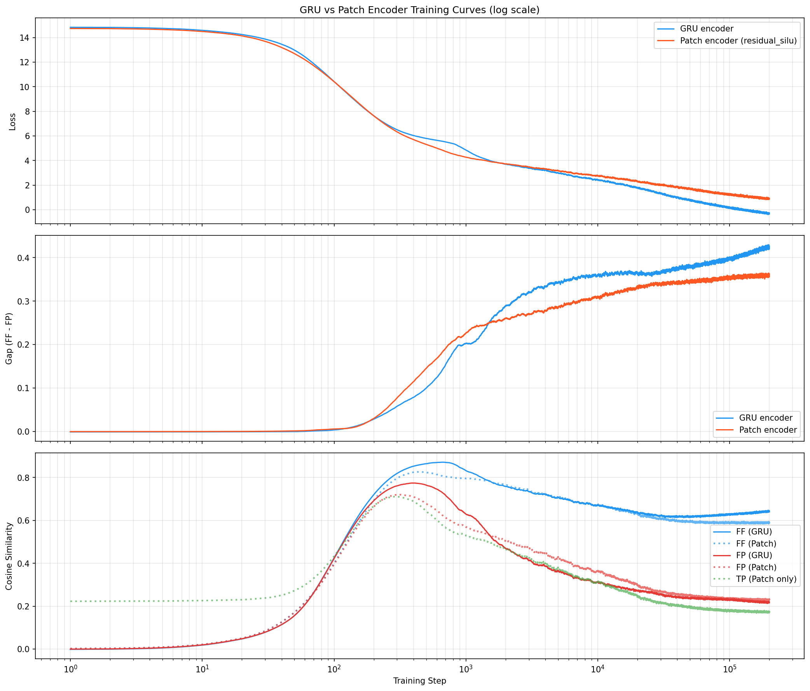

# Encoder Comparison: GRU vs Patch (residual_silu)

## Motivation

The backbone uses a GRU encoder that reads each W=16 patch as a sequence of 16
scalars. This sequential inductive bias was identified in the architecture search
as the strongest encoder choice (+62% gap over MLP baseline on synthetic ARMA data).

However, state-of-the-art time series foundation models like TimesFM use flat patch
encoders (residual MLP blocks) and achieve strong results at scale. The hypothesis:
the GRU's advantage may diminish with diverse real-world training data, and a simpler
patch encoder might scale better.

## Method

Two backbones trained from scratch on the same data and config, differing only in
the encoder:

| | GRU backbone | Patch backbone |
|--|---|---|
| Encoder | Bidirectional GRU, 2 layers, h=128 | ResidualSiLU MLP (Linear→SiLU→Linear + skip) |
| Encoder params | 538K | 544K |
| Total model params | 19,952,384 | 19,957,760 |
| Transformer | 6 layers, 8 heads, FFN 4x, H=512 | identical |
| Training data | HF `tiny_mixed_v2` (TimesFM-style composite) | identical |
| Training steps | 200,000 | 200,000 |
| Batch size | 24 | 24 |
| LR | 1e-4 (AdamW) | 1e-4 (AdamW) |

Encoder param counts are nearly identical (~538K vs ~544K), ensuring a fair
comparison. The only difference is how each patch is encoded: the GRU reads the
16 values sequentially; the residual_silu projects them as a flat vector.

## Results

### Training curves (log scale)

### Final metrics (200k steps)

| Metric | GRU | Patch | Ratio |
|--------|-----|-------|-------|
| Best gap | 0.428 | 0.364 | 0.85x |
| Final gap | 0.422 | 0.370 | 0.88x |
| Final FF | 0.637 | 0.616 | 0.97x |
| Final FP | 0.225 | 0.230 | 1.02x |

### Training dynamics

The log-scale plot reveals distinct phases:

1. **Steps 1–2k:** Patch encoder leads. Its gap rises faster initially — the flat
   projection allows faster gradient flow to the transformer layers.

2. **Steps 2k–20k:** Crossover. The GRU's sequential processing starts extracting
   temporal structure within patches that the flat encoder cannot.

3. **Steps 20k–200k:** GRU maintains a steeper slope in log-space. The gap
   difference widens rather than narrows.

Both encoders are still improving at 200k steps (no saturation in log-space).
The loss curves are roughly parallel, but the gap curves diverge — the GRU
converts equal loss reduction into a larger contrastive gap.

### Cosine similarity breakdown

The difference between encoders is entirely in **FF** (forecast-future similarity):
the GRU's FF sits consistently above the patch's FF. The **FP** (forecast-past)
curves are nearly identical. This means the GRU encoder produces latents that the
transformer can predict more accurately, without changing how well it separates
past from future.

**TP** (true-past, available for patch only) is ~0.20 — adjacent encoder latents
have low similarity, confirming the encoder produces distinct representations.

## Discussion

The architecture search (50k steps, synthetic ARMA data) showed a +62% gap
advantage for GRU over MLP. On diverse real-world data at 200k steps, the advantage
narrows to ~12% gap difference. The patch encoder closes much of the gap but does
not fully converge.

Three interpretations remain open:

1. **Parallel slopes:** GRU always stays ahead by a fixed margin. The sequential
   bias is a constant advantage at this scale.

2. **Patch catches up later:** With more training steps or data, the patch encoder's
   slope may increase (TimesFM-style scaling).

3. **GRU saturates first:** The sequential bottleneck eventually limits the GRU.
   A 500k+ step run would distinguish these.

At the current 20M-param / 200k-step scale, the GRU encoder is the better choice.
Whether this holds at larger scale remains an open question for future work.

## Files

| File | Description |
|------|-------------|
| `plots/encoder_comparison.png` | 3-panel training curves (log scale) |
| `results/encoder_comparison/gru_encoder_losses.csv` | GRU per-step metrics |
| `results/encoder_comparison/patch_encoder_losses.csv` | Patch per-step metrics (steps 1–27k) |
| `results/encoder_comparison/patch_encoder_r3_losses.csv` | Patch per-step metrics (steps 20k–200k, resumed) |
| `checkpoints/patch_encoder/tiny_patch_r3_best_gap.pth` | Patch backbone best checkpoint |
