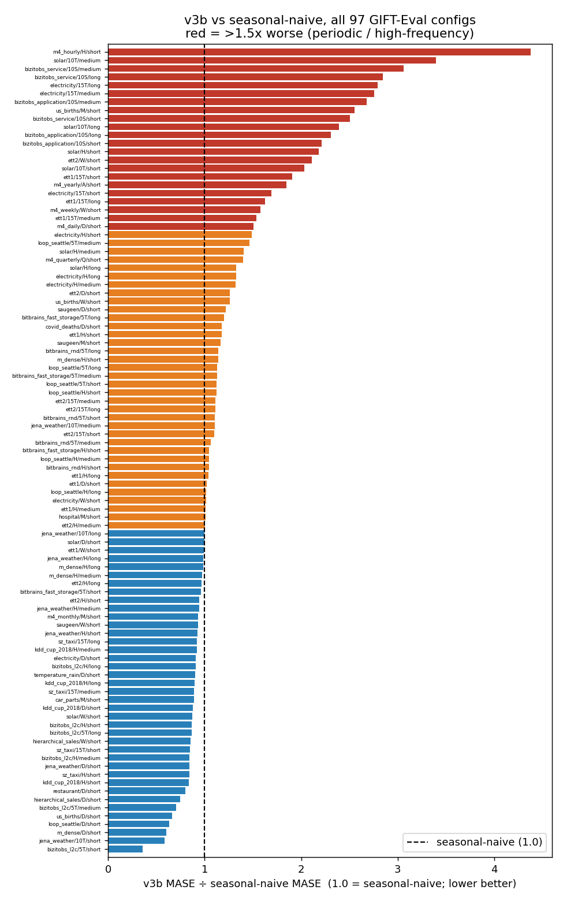

# v3b: training the Tiny backbone from scratch on real data

The v2 backbone (trained on synthetic data, then resumed) reached GM-Relative MASE 1.168 on GIFT-Eval but systematically under-predicted **periodic** datasets. v3b asked a clean question: does training the same Tiny recipe **from scratch on real-world bundle data** (`base_mixed_v1`) — instead of resuming the synthetic v2 — close the gap to the leaderboard, and in particular fix the periodic weakness?

## Result

It did not. v3b reached **GM-Relative MASE 1.186** (97 GIFT-Eval configs) — slightly *worse* than the synthetic-trained v2 (1.168 at 500k, the committed baseline in [periodic-synth-mix](../2026-04-27_periodic-synth-mix/periodic-synth-mix.md)). Training from scratch on real data did not help.

> *GM-Relative MASE = geometric mean, over the 97 benchmark tasks, of (model MASE ÷ seasonal-naive MASE). 1.000 is the seasonal-naive baseline; lower is better. For reference: TimesFM 0.680, Moirai 0.809, **v3b 1.186**.*

| Backbone | Steps | GM-Rel MASE |
|---|---|---|
| v2 (synthetic, then resumed) | 500k | 1.168 |
| **v3b (from scratch on real bundles)** | **~120k** | **1.186** |

The failure sits exactly where v2's did — on periodic and high-frequency series:

v3b beats seasonal-naive only on the non-periodic tail (jena_weather/10T 0.59, us_births/D 0.66, sz_taxi ≈ 0.85). The red band is the failure mode: m4_hourly 4.4×, solar/10T 2.0–3.4×, electricity/15T 2.8× the seasonal-naive error.

## Protocol

Three stages, each on a single machine:

1. **Backbone** — the Tiny recipe (C=4, H=512, W=16, GRU, 6 layers), `cosine_similarity_batch` loss (τ=0.07), AdamW batch 24, lr 1e-4, trained **from scratch** on HF `base_mixed_v1`. Target 500k steps; **shelved at ~120k** (see caveat). Vast.ai.
2. **Head** — R1 reconstruction-forecaster (W=16, GRU h=128), 30k steps, on the best-gap backbone. Elisa.
3. **Eval** — official GIFT-Eval, 97 configs, strategy B4. Elisa. Outputs in [results/R1v3b/](results/R1v3b/).

## What we learned

Training from scratch on real data did not fix the periodic-dataset weakness — it survived the switch from synthetic-then-resume to from-scratch-on-real. That is the result that motivated the next experiment, [periodic-synth-mix](../2026-04-27_periodic-synth-mix/periodic-synth-mix.md), which mixes 50% on-the-fly periodic synthetic series (sinusoid / square / saw) into training to add structure the real bundles lack.

## Caveats

- **Under target.** The backbone was shelved at ~120k of its 500k target after repeated Vast.ai preemptions, so the comparison to the 500k v2 baseline is not apples-to-apples — v3b is under-trained, and the honest reading is "no improvement *so far*," not a settled ceiling. The operational detail (preemption chain, ~$14 spent, the seven vastrun-kit reliability bugs filed) is in [notes/EXECUTION_LOG.md](notes/EXECUTION_LOG.md).
- **Backbone dynamics lost.** Only the GIFT-Eval outputs survive; the backbone training curves and checkpoints were never committed and are gone, so there is no training-dynamics figure here — only the downstream result.
