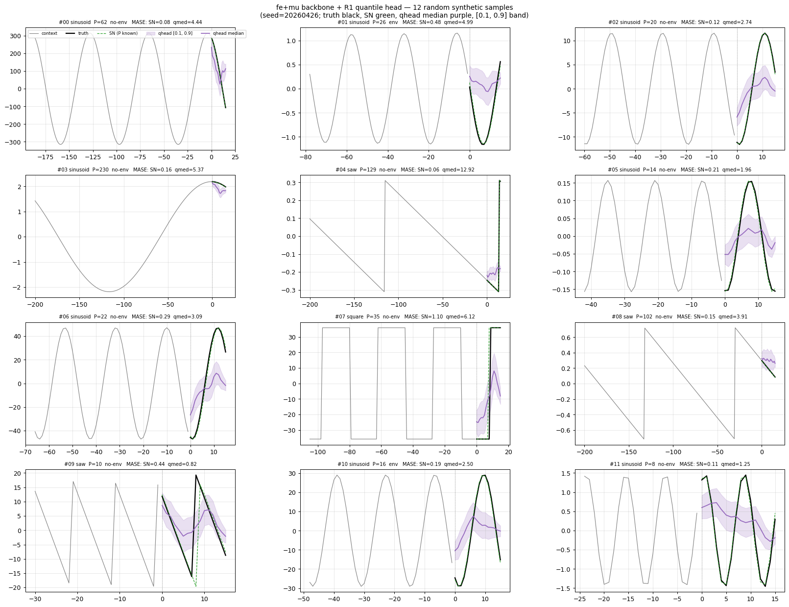

# Freq-Embedding Experiment Sequence — Report

Covers four ablations run on top of the 2026-04-27_periodic-synth-mix baseline (see
[`../2026-04-27_periodic-synth-mix/periodic-synth-mix.md`](../2026-04-27_periodic-synth-mix/periodic-synth-mix.md)):

- **#23** Frequency embedding (with and without mixup)
- **#26** Longer R1 head (30k → 90k, on the fe+mu backbone)
- **#24** Quantile (pinball-loss) head
- **#28** RevIN as a drop-in replacement for RevEWMNorm

All ablations use the same 30k-step, bs=24, mix_ratio=0.5 protocol as the
2026-04-27_periodic-synth-mix baseline, with the variation noted per arm.

## Naming

Each arm is a stack of changes, not a single switch. Concretely:

- `fe+mu` = freq embedding (dim=3) + mixup (p=0.3) on top of the
  2026-04-27_periodic-synth-mix baseline (fe alone, with mixup OFF, was a wash).
- `fe+mu+qh` = `fe+mu` backbone + quantile (pinball loss) head.
- `RevIN+qh` = `fe+mu` + RevIN replacing RevEWMNorm + quantile head.
  Note: RevIN+qh **includes** freq embedding and mixup; it's a
  single-variable change vs `fe+mu+qh` (the normaliser, not a fresh
  build).

So all our arm comparisons are stack-add-one-variable deltas, not
independent setups.

## Headline numbers

Skill scores vs Seasonal Naive computed on **43 univariate configs**
(SN baseline computation skipped multivariate datasets like bitbrains_*,
bizitobs_*, ett1/ett2 — see "caveats" below). Higher is better. SN = 0.

**Important**: which arm is "best" depends on the slice. On 43
univariate configs (skill-score table below), RevIN+qh wins both metrics.
On the full 97-config aggregate, fe+mu+qh wins WQL because RevIN's
m4_* / covid trend regressions drag the aggregate; RevIN+qh still
wins the **6 periodic focus configs** even on the 97 (WQL 0.393 vs 0.465).

| Arm | Params | Steps | GM-MASE | MASE skill | GM-WQL | WQL skill |
|---|---:|---:|---:|---:|---:|---:|
| v2 (R1, MSE) | 20M | 500k | 1.447 | −14.5% | 0.282 | −16.9% |
| v3b (R1v3b, MSE) | 20M | 120k | 1.486 | −17.6% | 0.287 | −19.0% |
| mix90 (R1v3c, MSE) | 20M | 90k | 1.552 | −22.8% | 0.303 | −25.7% |
| fe+mu (R1, MSE) | 20M | 30k | 1.493 | −18.2% | 0.291 | −20.5% |
| **fe+mu+qh** (qhead) | 20M | 30k | 1.491 | −18.0% | 0.254 | **−5.1%** |
| **RevIN+qh** (qhead) | 20M | 30k | **1.431** | **−13.2%** | **0.239** | **+1.1%** |
| Seasonal Naive | — | — | 1.264 | 0.0% | 0.241 | 0.0% |

Reference SOTA at our parameter scale (from the time-series-forecasting
wiki, 97-config aggregate): **Moirai-2.0-small (11.4M)** sits at MASE
skill **+27%**, WQL skill **+48%**. The gap is large and is dominated by
training-corpus scale (LOTSA full + many more steps) plus a probabilistic
output objective everywhere.

Detailed per-config table at
[`results/comparison_with_sn.csv`](results/comparison_with_sn.csv); plain-text
version at [`results/skill_scores.txt`](results/skill_scores.txt).

## What we learned

These are facts established by the experiments, not speculation.

### Quantile head produces a ~15-point WQL-skill jump over MSE

Going from `fe+mu` (MSE head, GM-WQL = 0.291) to `fe+mu+qh` (pinball
loss, GM-WQL = 0.254) drops raw GM-WQL by 12.7%. In skill-score terms
that's **−20.5% → −5.1%**, or **+15.4 points of WQL skill** at zero
MASE cost (MASE skills are −18.2% vs −18.0%, indistinguishable).

The mechanism is straightforward: the MSE head is forced to predict the
conditional mean and therefore *under-expresses* peak amplitudes — a
failure mode visible in the 2026-04-27_periodic-synth-mix prediction plots
([`../2026-04-27_periodic-synth-mix/plots/predictions/`](../2026-04-27_periodic-synth-mix/plots/predictions/)).
The quantile head's 0.9 quantile must cover peaks, so the model is
trained to express the full distribution, and the median (q=0.5) is no
worse for MASE than the MSE-trained point forecast.

### RevIN beats RevEWMNorm on cleanly periodic data, loses on trend

On the 6 periodic focus configs (where SN is essentially the right
answer), `RevIN+qh` improves the GM-Rel MASE from 2.660 (fe+mu+qh) to
**2.569** (-3.4%) and the GM-Rel WQL from 0.465 to **0.393 (-15.5%)**.
The biggest single win is **ett1/15T/short MASE 1.78 → 1.03 (-42%)** —
the lowest MASE any 30k-class arm achieved on this config.

But on growth/trend-heavy configs (m4_*, covid_deaths) RevIN regresses
hard: m4_hourly/H/short 4.88 → 6.94 (+42%), covid_deaths 57 → 136
(+138%). RevIN's static z-score can't track local trend. RevEWMNorm's
rolling mean was doing real work on these.

Aggregate-wise this is a wash to slight loss: **fe+mu+qh aggregate WQL
0.232 vs RevIN+qh 0.248 (+7%)** on all 97 configs (the 6.9% absolute
WQL difference). On the 43-config univariate slice we have SN baseline
for, RevIN+qh edges fe+mu+qh on both metrics (+7 MASE skill points,
+6 WQL skill points), but that slice excludes most of m4_*.

### Extending the head from 30k to 90k didn't help

Resuming the R1 head on the fe+mu backbone from 30k to 90k drops
**training-distribution MSE 0.087 → 0.071 (−18%)** but raises GIFT-Eval
WQL from 0.232 to ≈0.245 and the 6 periodic focus MASE from 2.653 to
2.706 (+2%). Classic OOD overfit: more head training fits base-bundles
better but doesn't transfer.

Per-config the picture is mixed: m4_hourly/H/short 5.16 → 4.92 (-5%
better), but ett2/W/short 1.76 → 2.08 (+18% worse). The head was *not*
undertrained at 30k; longer training causes selective overfitting on
specific configs.

### Frequency embedding alone (no mixup) doesn't help; with mixup, modestly does

`fe` (freq embedding, no mixup): GM-Rel MASE 1.218 vs CTRL 1.217 — flat.
The freq hint per patch, *without* training-time interpolation, doesn't
add signal because (a) all HF rows are tagged class 0 = unknown (no
plumbing of real freq metadata yet) and (b) the synth half already
exposes a wide spp range.

`fe+mu` (freq embedding + Beta(0.2, 0.2) mixup at p=0.3): GM-Rel MASE
1.194 (vs CTRL 1.217, vs mix30 1.216). On the 6 periodic focus configs
fe+mu = 2.653 vs mix30 = 2.707 (-2%) and beats mix90 (3× compute) on
aggregate. **The win is from mixup forcing continuous structure across
freq classes**; the embedding by itself is a wash.

### On its own training distribution, the head doesn't reproduce seasonal-naive

The synth grid plot
([`plots/synth_qhead_grid.png`](plots/synth_qhead_grid.png)) shows 12
random clean-periodic samples drawn from `src.synthetic_periodic`. SN
(with the *known* period) tracks ground truth nearly perfectly — that's
the design of the data. Our `fe+mu+qh` median visibly differs from SN
on most panels: amplitude damping and phase drift even on clean
in-distribution data.

User-flagged interpretation of that plot: the bottleneck is upstream of
the head, not in the head itself. The head was trained with pinball
loss on these exact distributions; if it could decode "next 16 samples
= last 16 of previous period" from the latents, it would. The fact
that it can't means the backbone's forecaster latent is **not preserving
enough phase information** at the patch boundary. Likely culprits:
contrastive objective rewarding "future ≠ past" without rewarding exact
period reproduction; W=16 patch collapsing within-patch phase into a
single H-dim token.

## Caveats

- **SN baseline only succeeded on 43 of 97 configs.** The local
  SN computation in `experiments/2026-04-27_periodic-synth-mix/scripts/seasonal_naive_check.py`-style
  setup chokes on multivariate datasets (bitbrains_*, bizitobs_*, ett1/ett2
  multi-channel). This is a SCRIPT limitation, not a model limitation.
  All our model arms HAVE been evaluated on the full 97 — it's just the
  SN baseline that's restricted to univariate. Skill scores in this
  report therefore reflect the 43-config slice, biased toward easier
  Transport / Energy / Sales / Healthcare configs.
- **For the full 97-config aggregate**, see
  [`../2026-04-27_periodic-synth-mix/periodic-synth-mix.md`](../2026-04-27_periodic-synth-mix/periodic-synth-mix.md)
  which uses the v3b summary's per-config SN_MASE values for relative
  MASE (but doesn't have SN_WQL).
- **The freq embedding ablation has a known scope limitation**: HF rows
  carry freq=0=unknown rather than their real source frequency. Even
  with the embedding ON, the backbone sees a constant freq for every
  real-data sample. The win we observed is plausibly less than the
  win a fully-plumbed embedding would give.
- **The RevIN backbone+head checkpoints were lost** to a partial-transfer
  SSH drop at end of #28 (only 2 MB of an 80 MB backbone arrived). The
  eval CSV survives. We have NO way to make the RevIN-arm synth-grid
  plot until the run is reproduced. PR #47 ships the fix
  (sync-loop rotation + safe_pull.sh + CLAUDE.md rules) so this
  doesn't happen again.

## Artefacts

- [`../2026-04-27_freq-embedding/notes/DESIGN.md`](../2026-04-27_freq-embedding/notes/DESIGN.md) — the
  freq-embedding design doc.
- [`../2026-04-27_freq-embedding/scripts/train.py`](../2026-04-27_freq-embedding/scripts/train.py) —
  backbone trainer with `--freq-emb-dim`, `--mixup-p`, `--rev-norm-kind`.
- [`../2026-04-27_freq-embedding/scripts/plot_multi_model.py`](../2026-04-27_freq-embedding/scripts/plot_multi_model.py) —
  5-arm comparison plotter (used for #25).
- [`../2026-04-27_freq-embedding/scripts/plot_qhead.py`](../2026-04-27_freq-embedding/scripts/plot_qhead.py) —
  focused 4-curve plotter incl. quantile uncertainty band (used for #27).
- [`../2026-04-27_freq-embedding/scripts/plot_synth_qhead.py`](../2026-04-27_freq-embedding/scripts/plot_synth_qhead.py) —
  12-panel grid on synthetic samples.
- [`plots/synth_qhead_grid.png`](plots/synth_qhead_grid.png) — diagnostic
  grid showing the head doesn't match SN on its own training distribution.
- [`plots/predictions/`](plots/predictions/) — multi-model prediction
  plots on the 6 periodic focus configs.
- [`plots/predictions_qhead/`](plots/predictions_qhead/) — same configs
  with the focused 4-curve qhead plot (truth + SN + fe+mu MSE +
  qhead median + uncertainty band).
- [`results/comparison_with_sn.csv`](results/comparison_with_sn.csv) —
  per-config MASE+WQL+SN-relative for every arm.
- [`results/skill_scores.txt`](results/skill_scores.txt) — aggregate
  skill-score table.

## Per-experiment reports (the 6 ablations covered above)

- [`../2026-04-27_exp_revin_repro/exp_revin_repro.md`](../2026-04-27_exp_revin_repro/exp_revin_repro.md) — EXP1
  (RevIN reproduction on mix=0.5).
- [`../2026-04-27_exp_patch_stats_mix05/exp_patch_stats_mix05.md`](../2026-04-27_exp_patch_stats_mix05/exp_patch_stats_mix05.md) —
  EXP4 (patch-stats on mix=0.5 + GIFT-Eval).
- [`../2026-04-27_exp_synth_only_redo/exp_synth_only_redo.md`](../2026-04-27_exp_synth_only_redo/exp_synth_only_redo.md) —
  fe+mu vs fe+mu+pstats × {30k, 60k} on mix=1.0.
- [`../2026-04-27_exp_span_sweep_real/exp_span_sweep_real.md`](../2026-04-27_exp_span_sweep_real/exp_span_sweep_real.md) —
  RevEWMNorm span sweep on mix=0.0.
- [`../2026-04-27_exp_span_sweep_synth/exp_span_sweep_synth.md`](../2026-04-27_exp_span_sweep_synth/exp_span_sweep_synth.md) —
  RevEWMNorm span sweep on mix=1.0.
- [`../2026-04-27_exp_revin_synth/exp_revin_synth.md`](../2026-04-27_exp_revin_synth/exp_revin_synth.md) — RevIN
  backbone on mix=1.0.

In-flight follow-up:
- [`../2026-04-27_exp_csb_synth/exp_csb_synth.md`](../2026-04-27_exp_csb_synth/exp_csb_synth.md) —
  cosine_similarity_batch loss on the span=512 best arm.

Per-arm GIFT-Eval CSVs:

- [`results/R1_freqemb_mix/`](../2026-04-27_freq-embedding/results/R1_freqemb_mix/) — fe (no mixup, 30k)
- [`results/R1_freqemb_mixup_mix/`](../2026-04-27_freq-embedding/results/R1_freqemb_mixup_mix/) — fe+mu (30k)
- [`results/R1_femu_90k/`](../2026-04-27_freq-embedding/results/R1_femu_90k/) — fe+mu, head 90k
- [`results/R1q_femu/`](../2026-04-28_exp_dualemb_3arm/results/R1q_femu/) — fe+mu+qh
- [`results/R1q_femu_revin/`](../2026-04-28_exp_dualemb_3arm/results/R1q_femu_revin/) — RevIN+qh
- [`results/R1v3c_mix_90k/`](../2026-04-27_freq-embedding/results/R1v3c_mix_90k/) — mix90
