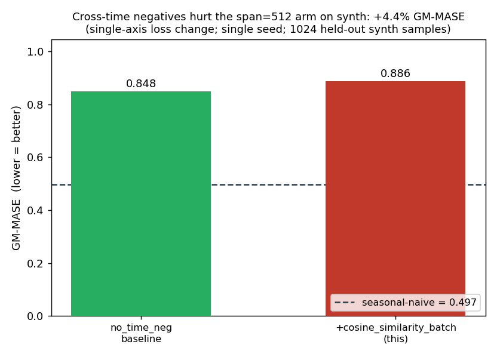

# Cross-time negatives on the span=512 best arm: a negative result on synth

## Question

The synth span sweep landed `span=512` as the best arm (GM-MASE 0.848).
Its loss, `cosine_similarity_batch_no_time_neg`, had the within-series
time negative removed during ARMA-era tuning. The paper-matching loss
`cosine_similarity_batch` re-introduces that term (plus cross-channel
time negatives). On periodic data, adjacent latents walk a non-trivial
manifold, so pushing them apart *might* sharpen the representation.
Does flipping **only** the loss flag on the otherwise-frozen best arm
help on in-distribution synth?

> *GM-MASE / GM-WQL = geometric mean over the eval set of MASE (point
> accuracy, scaled by per-series MAE) and WQL (weighted quantile loss,
> probabilistic accuracy). Lower is better; seasonal-naive = 0.497 /
> 0.344 on this protocol.*
>
> *"Cross-time negative" = pushing apart latents at adjacent timesteps
> (`h[b,t-1,c]` vs `h[b,t,c]`); `cosine_similarity_batch` also adds
> cross-channel time negatives (`hx[c1]` vs `hy[c2]`, summed over all c2).*

## Result

Adding the cross-time negatives made the arm **worse on both metrics** —
it did not help.

Switching to `cosine_similarity_batch` moved GM-MASE from **0.848 →
0.886 (+4.5% worse)** and GM-WQL from **0.413 → 0.434 (+5.1% worse)**.
The training-time contrastive gap was actually *higher* with the new
loss (~0.86 vs ~0.84 at peak) — but the larger gap did not translate
into better forecasts. So on synth, re-introducing the time negatives
hurt rather than helped.

The qualitative per-channel forecast grid shows nothing dramatic — the
familiar amplitude damping and slight phase drift on the 16-step
forecast, no obvious failure mode that would explain the regression:

## Protocol

| Knob | Value |
|---|---|
| Steps | 30k backbone + 30k qhead |
| Mix ratio | 1.0 (synth-only, in-distribution) |
| Freq emb | dim=3, mixup=0.3 |
| Reversible norm | RevEWMNorm span=512 |
| Loss | `cosine_similarity_batch` (re-includes cross-time negatives) |
| Backbone selector | `best_loss` |
| Eval | 1024 held-out synth samples; seasonal-naive 0.497 / 0.344 |

Single-axis change vs the existing `fe+mu @ 30k span=512` baseline (same
protocol and seed as the
[span sweep](../2026-04-27_exp_span_sweep_synth/exp_span_sweep_synth.md)),
which used `cosine_similarity_batch_no_time_neg`. Both GM numbers above
are the matching `arm` rows in
[`../2026-04-27__aggregate/results/synth_eval.csv`](../2026-04-27__aggregate/results/synth_eval.csv);
[`scripts/plot_csb_eval.py`](scripts/plot_csb_eval.py) reads that CSV and
emits the bar figure. Launch script: [`scripts/run.sh`](scripts/run.sh).

## What we learned (single seed)

Re-introducing the time negatives on the span=512 best arm regressed
both forecast metrics (+4.5% GM-MASE, +5.1% GM-WQL) on held-out synth at
this training scale. A higher training-time gap did **not** buy better
forecasts. This closes FOLLOWUP-1: on synth, the paper-matching loss is
not an improvement over `..._no_time_neg`.

## Hypotheses (single seed, not validated)

- **Cross-channel time negatives may be detrimental on synth.**
  `cosine_similarity_batch` sums `neg_xy = Σ_c2 sim(hx[c1], hy[c2])` over
  **all** channels, including c2≠c1. Synth channels are independent
  periodic signals with different per-channel periods, so this term
  pushes apart representations that needn't be related — plausibly the
  source of the regression. A within-channel-only time-negative variant
  would isolate this.
- **Possible single-seed sensitivity.** A 4–5% gap is within the seed
  band we'd expect at this scale; a second seed of either arm could
  shrink or flip it.

## Open questions

- Does a within-channel-only time negative (dropping the cross-channel
  terms) recover or beat the 0.848 baseline?
- Is the 4–5% gap real or seed noise — does a second seed hold the
  ordering?

---

### Annex: eval table & artefacts

| Arm | GM-MASE | GM-WQL | MASE skill | WQL skill |
|---|---:|---:|---:|---:|
| `fe+mu @ 30k span=512` (no_time_neg, baseline) | 0.848 | 0.413 | −71% | −20% |
| **`… span=512 +cosine_similarity_batch` (this)** | **0.886** | **0.434** | **−78%** | **−26%** |
| Seasonal Naive | 0.497 | 0.344 | 0% | 0% |

*Skill = percent improvement over seasonal-naive; negative = worse.
Source rows in
[`../2026-04-27__aggregate/results/synth_eval.csv`](../2026-04-27__aggregate/results/synth_eval.csv)
(local copy: [`results/synth_eval.csv`](results/synth_eval.csv)).*

- Backbone `checkpoints/tiny_femu_span512_synth30k_csb_FINAL.pth`
  (~80 MB), qhead `…_csb_FINAL.pth` (~2.5 MB) — **not tracked in git**.
- Loss CSVs: `tiny_femu_span512_synth30k_csb_losses.csv`,
  `R1q_femu_span512_synth30k_csb_losses.csv`.
- `run_v1.sh` is the earlier deprecated
  `cosine_similarity_batch_with_within_time_neg` variant, kept for
  provenance.
- The multi-resume training timeline (three remote-instance failures)
  is in [`notes/README.md`](notes/README.md).
