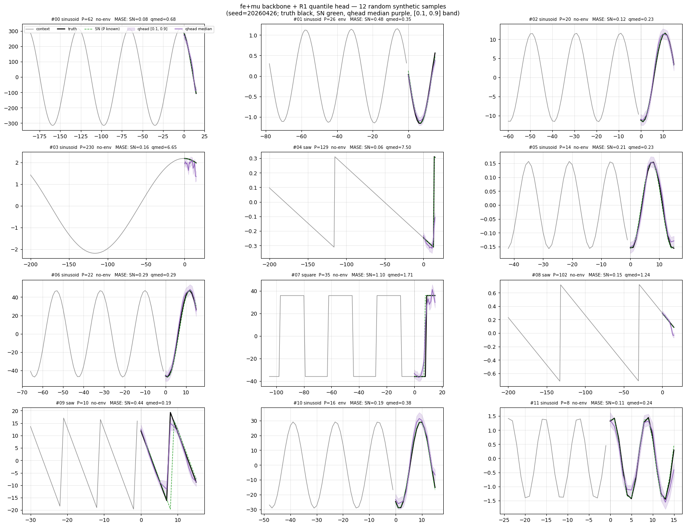

# Cross-time negatives on span=512 synth: this run's comparison was confounded — the clean follow-up reversed it

## Question

The synth span sweep landed `span=512` as the best arm (GM-MASE 0.848).
Its loss, `cosine_similarity_batch_no_time_neg`, has the within-series
time negative removed (a variant from earlier tuning). The paper-matching loss
`cosine_similarity_batch` re-introduces that term (plus cross-channel
time negatives). On periodic data, adjacent latents walk a non-trivial
manifold, so pushing them apart *might* sharpen the representation. Does
flipping **only** the loss flag on the otherwise-frozen best arm help on
in-distribution synth?

> *GM-MASE / GM-WQL = geometric mean over the eval set of MASE (point
> accuracy, scaled by per-series MAE) and WQL (weighted quantile loss,
> probabilistic accuracy). Lower is better; seasonal-naive = 0.497 /
> 0.344 on this protocol.*
>
> *"Cross-time negative" = pushing apart latents at adjacent timesteps
> (`h[b,t-1,c]` vs `h[b,t,c]`); `cosine_similarity_batch` also adds
> cross-channel time negatives (`hx[c1]` vs `hy[c2]`, summed over all c2).*
>
> *Backbone **selector** = which checkpoint is kept as FINAL. `best_gap` =
> the checkpoint at contrastive-gap saturation (the follow-up measured this
> at ≈step 1600 on synth — effectively early-stopped); `best_loss` = the
> lowest-backbone-loss checkpoint (later in training). On synth the two
> pick very different points.*

## Result

This run measured the `+cosine_similarity_batch` arm at **0.886 GM-MASE**
and compared it to the span sweep's published **0.848** baseline — an
apparent **+4.4% regression**. **That comparison is confounded:** the two
checkpoints differ on three axes at once, not one —

| | loss flag | selector | continuity |
|---|---|---|---|
| 0.848 baseline (span sweep) | `no_time_neg` | **`best_gap`** | clean |
| 0.886 this run (`+csb`) | `cosine_similarity_batch` | **`best_loss`** | **multi-resume** (8k→24k→30k) |

So the +4.4% cannot be attributed to the loss flag. (For the record, the
raw deltas: GM-MASE 0.848 → 0.886 = **+4.4%**; GM-WQL 0.413 → 0.434 =
**+5.2%**.)

**The clean follow-up reversed the conclusion.** The next day,
[`2026-04-28_exp_csb_pair_span512`](../2026-04-28_exp_csb_pair_span512/exp_csb_pair_span512.md)
retrained both arms single-shot with the **same** `best_loss` selector,
varying only the loss flag, and found `cosine_similarity_batch` (0.883)
**beats** `no_time_neg` (0.924) by **4.5% MASE / 3.9% WQL**. The dominant
confound here was the **selector**: under the same loss, `best_gap` (the
lost 0.848 baseline, early-stopped at gap saturation) forecasts **~9%
better** than `best_loss` (0.924), so the 0.848 baseline looked strong for
a reason unrelated to the loss. And this run's `+csb @ best_loss` (0.886)
≈ the clean `+csb @ best_loss` (0.883), so the multi-resume was
approximately clean — it was the `best_gap`-vs-`best_loss` selector gap,
not the loss, that produced the apparent regression.

The qualitative per-channel forecast grid shows nothing dramatic — the
familiar amplitude damping and slight phase drift on the 16-step
forecast, no obvious failure mode:

## Protocol

| Knob | Value |
|---|---|
| Steps | 30k backbone + 30k qhead |
| Mix ratio | 1.0 (synth-only, in-distribution) |
| Freq emb | dim=3, mixup=0.3 |
| Reversible norm | RevEWMNorm span=512 |
| Loss | `cosine_similarity_batch` (re-includes cross-time negatives) |
| Backbone selector | `best_loss` (lowest backbone loss) |
| Continuity | multi-resume — three remote failures, 8k→24k→30k |
| Eval | 1024 held-out synth samples; seasonal-naive 0.497 / 0.344 |

The comparison was *intended* as a single loss-flag flip against the
`fe+mu @ 30k span=512` span-sweep baseline (`cosine_similarity_batch_no_time_neg`),
but two unintended axes crept in — the checkpoint **selector** (`best_gap`
for the baseline, `best_loss` here) and **continuity** (clean vs
multi-resume) — so it is **not** a clean single-axis test, which is what
the follow-up was built to fix. Both GM numbers above are the matching
`arm` rows in
[`../2026-04-27__aggregate/results/synth_eval.csv`](../2026-04-27__aggregate/results/synth_eval.csv);
[`scripts/plot_csb_eval.py`](scripts/plot_csb_eval.py) reads that CSV and
emits the bar figure. Launch script: [`scripts/run.sh`](scripts/run.sh).

## What we learned (single seed)

- **This run's apparent regression was a selector artifact, not the loss.**
  Comparing `+csb @ best_loss @ multi-resume` (0.886) to the span-sweep
  `no_time_neg @ best_gap @ clean` (0.848) confounds three axes; the +4.4%
  is dominated by the `best_gap` → `best_loss` selector change (worth ~9%
  on its own).
- **The clean matched A/B inverts the conclusion: the time negatives net
  *help* on synth** — `cosine_similarity_batch` is **4.5% better** on MASE
  than `no_time_neg` once selector and continuity are held fixed
  ([`2026-04-28_exp_csb_pair_span512`](../2026-04-28_exp_csb_pair_span512/exp_csb_pair_span512.md)).
  FOLLOWUP-1 is resolved there — in the **opposite** direction from this
  run's apparent result.
- **Secondary finding (from the clean pair): on synth, min-loss ≠
  min-forecast-error.** `best_gap` (early-stop at gap saturation) beats
  `best_loss` by ~9%, so the contrastive objective and the downstream
  forecasting objective are imperfectly aligned at span=512.

*(The original draft's "higher training-time gap didn't buy better
forecasts" claim has been removed: the two loss CSVs it rested on are not
committed anywhere in the repo, and `notes/README.md` notes that the
loss-shape values are not comparable across these two arms — `cosine_similarity_batch`
has strictly more negative terms, so a higher gap is mechanical, not a
quality signal.)*

## Caveats

- Single seed per arm. Every GM-MASE/GM-WQL above is a single-seed point
  estimate over 1024 held-out samples, reported without a confidence
  interval. The ~4.5% (loss) and ~9% (selector) deltas are point
  differences, **not significance-tested** — the follow-up itself notes the
  gap "could partly be sampling noise."
- This run's backbone was multi-resume (8k→24k→30k); the clean pair shows
  that was ≈ a clean run for the csb arm, but it remains a confound for
  this report's standalone comparison.
- The loss-shape value isn't directly comparable to the baseline (the
  negatives differ) — only the downstream synth-eval metrics are.

## Open questions

- (Resolved by the clean pair) Does the loss flag help? **Yes** — +4.5%
  MASE with selector and continuity matched.
- Does `best_gap` also help the csb arm, and does the 4.5% gap hold across
  seeds? Tracked in the pair experiment's open questions.

---

### Annex: eval table & artefacts

| Arm | GM-MASE | GM-WQL | MASE skill | WQL skill | selector / continuity |
|---|---:|---:|---:|---:|---|
| `fe+mu @ 30k span=512` (no_time_neg, span-sweep baseline) | 0.848 | 0.413 | −71% | −20% | best_gap / clean |
| **`… span=512 +cosine_similarity_batch` (this run)** | **0.886** | **0.434** | **−78%** | **−26%** | best_loss / multi-resume |
| clean A (`no_time_neg`, matched — follow-up) | 0.924 | 0.449 | −86% | −31% | best_loss / clean |
| clean B (`csb`, matched — follow-up) | 0.883 | 0.432 | −77% | −26% | best_loss / clean |
| Seasonal Naive | 0.497 | 0.344 | 0% | 0% | — |

*Skill = percent improvement over seasonal-naive; negative = worse. All
five rows live in
[`../2026-04-27__aggregate/results/synth_eval.csv`](../2026-04-27__aggregate/results/synth_eval.csv);
the local [`results/synth_eval.csv`](results/synth_eval.csv) holds only
this run's `+cosine_similarity_batch` row (0.886). The baseline, seasonal-naive,
and clean A/B rows exist only in the aggregate CSV (the clean A/B rows are
produced by the follow-up experiment).*

- Backbone `checkpoints/tiny_femu_span512_synth30k_csb_FINAL.pth`
  (~80 MB), qhead `…_csb_FINAL.pth` (~2.5 MB) — **not tracked in git**.
- `run_v1.sh` is the earlier deprecated
  `cosine_similarity_batch_with_within_time_neg` variant, kept for
  provenance.
- The multi-resume training timeline (three remote-instance failures) is
  in [`notes/README.md`](notes/README.md).
