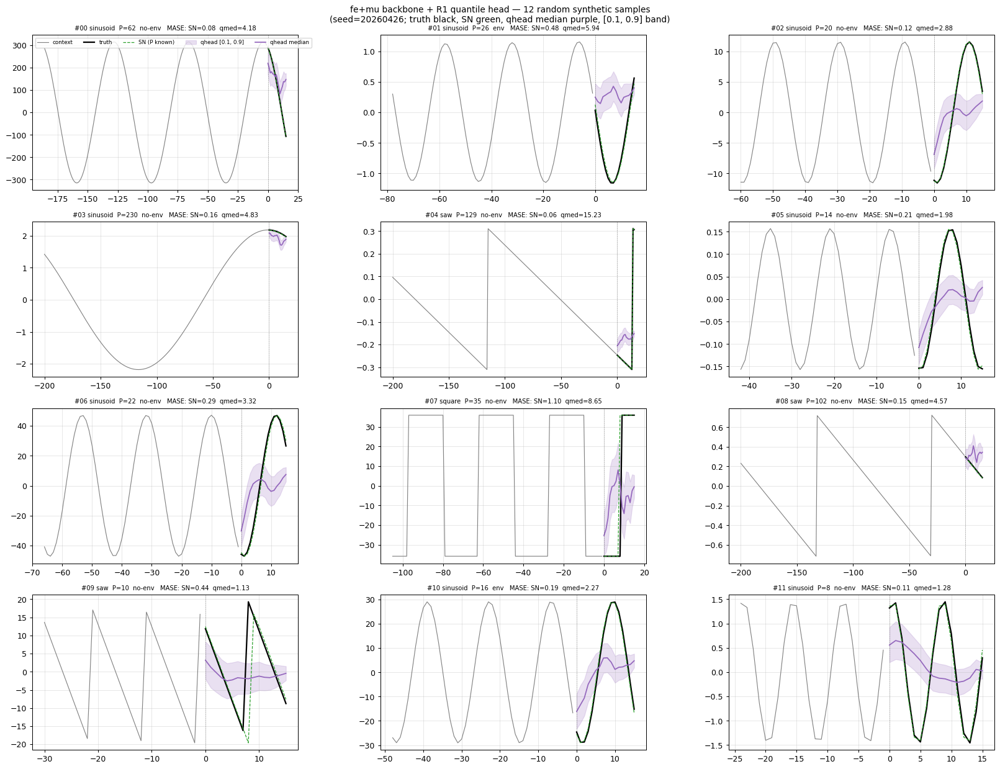

# EXP4 — Patch-stats on mix=0.5 + GIFT-Eval (initial design, deprecated by synth redo)

## Why

User-proposed architectural change: the contrastive backbone strips the
running mean/std via RevEWMNorm before patching, so the encoder loses
absolute level/scale information. Concat per-patch summary stats —
`dmean = (mean[t]−mean[t−1]) / std[t−1]` and `dlogstd = log(std[t]/std[t−1])` —
to the encoder input so the encoder can recover that information without
breaking reversibility.

This was the first patch-stats run, on the same mix=0.5 + GIFT-Eval
setup as the previous session's arms so it would be directly comparable.
**Superseded by the synth-only redo** (see [`exp_synth_only_redo.md`](../2026-04-27_exp_synth_only_redo/exp_synth_only_redo.md))
because the GIFT-Eval evaluation was 5h per run and ate iteration
time, and confounded "is the architecture better" with OOD transfer.

## Implementation

- `src/norm.py::compute_patch_stats(mean, stdev, W, kind='diff')`:
  returns `[B, T_patches, C, 2]` per-patch features. Diffs are zero-padded
  at t=0 (no previous patch).
- `src/models.py::ConfigurableModel`: gains `patch_stats_kind` constructor
  arg, encoder input widens W → W+2.
- `src/models.py::prepare_encoder_input`: factored helper called by both
  forward and `extract_*_latents` so the patch-stats path is consistent
  end-to-end.
- `experiments/2026-04-27_freq-embedding/scripts/train.py`: `--patch-stats {none,diff,raw}`.
- `experiments/2026-04-13_gift-eval/scripts/{train_forecasting_head,eval_gift_eval_official}.py`:
  `--patch-stats auto` auto-detects from encoder.skip in_features.

## Setup

| Knob | Value |
|---|---|
| Steps | 30k bb + 30k qhead |
| Mix ratio | 0.5 |
| Freq emb | dim=3 |
| Mixup | p=0.3 |
| Reversible norm | RevEWMNorm span=32 |
| **Patch stats** | **diff** (the new arm) |
| Loss | `cosine_similarity_batch_no_time_neg` |
| Eval | full 97-config GIFT-Eval B4 |

## Results

### Backbone (`tiny_femu_pstats`)

- Wallclock: 1.4h
- Best gap: **0.6256** at step 29500 (+33% over RevIN's 0.469, +36%
  over baseline fe+mu's ~0.46).
- Best loss: -0.5234 at step 29600.

The contrastive backbone gap improvement was the cleanest signal in
this run.

### Quantile head (`R1q_femu_pstats`)

- Wallclock: 1.9h
- Best loss: **0.071028** at step 30000
- *Worse* than RevIN's 0.052 head loss. The richer latents from the
  pstats backbone didn't make the head's job easier on this setup.

### GIFT-Eval (full 97 configs)

The eval crashed at config 80/97 with no error in the log (likely a
proxy disconnect that killed the python process); resumed cleanly via
`--resume`. Final aggregate over the 23 configs that have a local SN
baseline (univariate subset, prior session computed):

| Arm | MASE skill | WQL skill |
|---|---:|---:|
| fe+mu+qh (prior session) | -12.6% | -1.2% |
| RevIN+qh (prior session) | **-6.7%** | **+8.4%** |
| **patch-stats+qh (this run)** | **-13.4%** | **-4.4%** |

Patch-stats is **worse than both baselines** on this slice. The 6
periodic-focus configs split:
- ett1/15T/short: pstats 1.74, RevIN 1.03, fe+mu 1.78 — RevIN dominates
- ett2/W/short: pstats **1.65**, RevIN 1.76, fe+mu 1.76 — pstats wins
- m4_hourly/H/short: pstats 5.13, RevIN 6.94, fe+mu **4.92** — fe+mu wins

Mixed.

### Synth grid

Visually
indistinguishable from RevIN/fe+mu grids — same amplitude damping and
phase drift on clean periodics. Patch-stats does not fix the synth-grid
issue either (single seed, qualitative read).

## Bug caught and fixed during this run

`train.py::forward_step` reimplemented patching manually and silently
dropped the patch-stats concat. EXP4 stage 1 crashed at first batch
because the GRU encoder expected wider input than what was fed.
Routed `forward_step` through `model.prepare_encoder_input` and added
a regression test in `tests/test_norm.py` (`test_prepare_encoder_input_used_by_train_path`).

## What was measured (single seed)

- Backbone gap +33%, head training loss worse by ~36%.
- GIFT-Eval downstream: patch-stats is 1-3% worse than the fe+mu+qh /
  RevIN+qh baselines on the available 23-config slice.
- Synth grid: no visible improvement.

## Speculation (single seed, not validated)

The "richer latents from a higher-gap backbone" did not translate to
better forecasts at this training scale. Candidate explanations not
ruled out: (a) the head architecture is too small for the larger
information content; (b) patch-stats added noise the head had to
filter back out; (c) `(Δmean)/std` operator spikes on series that move
between very different absolute scales (user-flagged in
`feedback_patch_stats_dmean_op.md` — try asinh-diff or log-of-abs+sign
next).

## Artefacts

- Backbone: `checkpoints/tiny_femu_pstats_FINAL.pth` (not tracked in
  git; 80MB).
- Head: `checkpoints/R1q_femu_pstats_FINAL.pth` (not tracked in git).
- GIFT-Eval CSV: `results/R1q_femu_pstats/all_results.csv` (full 97;
  not in this worktree — was on the remote machine at run time).
- Synth grid: `plots/synth_qhead_grid_pstats.png`.
