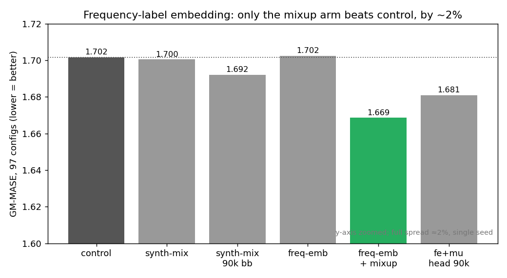

# Frequency-label embedding: does a cheap periodicity hint help?

The Tiny backbone fails on periodic GIFT-Eval datasets — it damps amplitude and drifts phase. State-of-the-art time-series foundation models condition on a series' frequency (via a token). This experiment tested a much cheaper version of that idea: a small learned **frequency-label embedding** — 10 frequency classes × 3 dimensions, 30 parameters — concatenated to every patch of the encoder input, plus a **mixup** variant that interpolates two samples' inputs *and* their frequency embeddings to teach continuous multi-period composition. Does either improve downstream GIFT-Eval?

## Result

A bare frequency embedding does nothing; the only gain comes from mixup, and it is small.

> *GM-MASE = geometric mean of MASE over all 97 GIFT-Eval configs (lower is better). These are raw MASE, not seasonal-naive-relative.*

- **freq-emb alone is a wash:** 1.702, identical to control (1.702). The label by itself carries no usable signal for this backbone.
- **freq-emb + mixup ("fe+mu") is the best arm:** 1.669, −1.9% vs control — and it beats the 3×-longer 90k-step backbone (1.692) at one-third the compute. The improvement is mixup's, not the label's.
- **A longer head hurts:** extending head training 30k → 90k (fe+mu, head 90k) regresses to 1.681 — the longer head overfits the training distribution.

**Honest caveat.** Every arm is single-seed and the spread is ≈ 2%, so the fe+mu win is plausibly within run-to-run noise. No arm beats seasonal-naive. And two structural limits cap what this could show: real/HF rows are tagged frequency-class 0 ("unknown"), so the embedding sees a *constant* for every real sample — the measured gain is from the synthetic half only; and "femu" here means frequency + mixup, **not** frequency + seasonality (the seasonality axis is wired into the trainer but not exercised in these arms).

## Arms

| Arm | freq-emb | mixup | backbone | head | GM-MASE |
|---|:---:|:---:|:---:|:---:|---:|
| control | – | – | 30k | 30k | 1.702 |
| synth-mix | – | – | 30k | 30k | 1.700 |
| synth-mix 90k | – | – | 90k | 30k | 1.692 |
| freq-emb | dim 3 | – | 30k | 30k | 1.702 |
| **freq-emb + mixup** | dim 3 | p=0.3 | 30k | 30k | **1.669** |
| fe+mu, head 90k | dim 3 | p=0.3 | 30k | 90k | 1.681 |

All arms share the Tiny backbone and a 50/50 real+synthetic data mix; the freq-emb arms add the 30-parameter embedding to each patch. Per-arm result CSVs are in [results/](results/).

## Protocol

Tiny backbone (C=4, H=512, W=16, GRU, 6 layers, RevEWMNorm span=32), `cosine_similarity_batch` loss (τ=0.07), AdamW lr 1e-4, weight-decay 0.1. Data: HF `base_mixed_v1` with `mix_ratio=0.5` (50% on-the-fly periodic synthetic). Frequency embedding: 10 classes × 3 dims, concatenated per-patch per-channel; mixup with p=0.3, λ ~ Beta(0.2, 0.2) applied to both the inputs and their embeddings. 30k backbone steps (90k for the two long-backbone variants), R1 reconstruction head, evaluated on the full GIFT-Eval suite (97 configs). Design rationale and the proposed (un-run) follow-up are in [notes/DESIGN.md](notes/DESIGN.md) and [notes/FOLLOWUP.md](notes/FOLLOWUP.md).

## What we learned

A frequency *label* alone is inert for this backbone; the only movement comes from mixup as a data augmentation, and it does not lift the model past seasonal-naive. The obvious next step — give real rows their true frequency instead of class 0 — is left open; the dual frequency + seasonality embedding it points to is tested next in [dualemb_3arm](../2026-04-28_exp_dualemb_3arm/exp_dualemb_3arm.md).

This experiment is one arm of a larger sequence (q-head, RevIN, dual-embedding); the cross-cutting comparison and the shared-script library live with the [aggregate report](../2026-04-27__aggregate/aggregate.md). This directory is also the shared-script home for that sequence — see [notes/SEQUENCE.md](notes/SEQUENCE.md).
