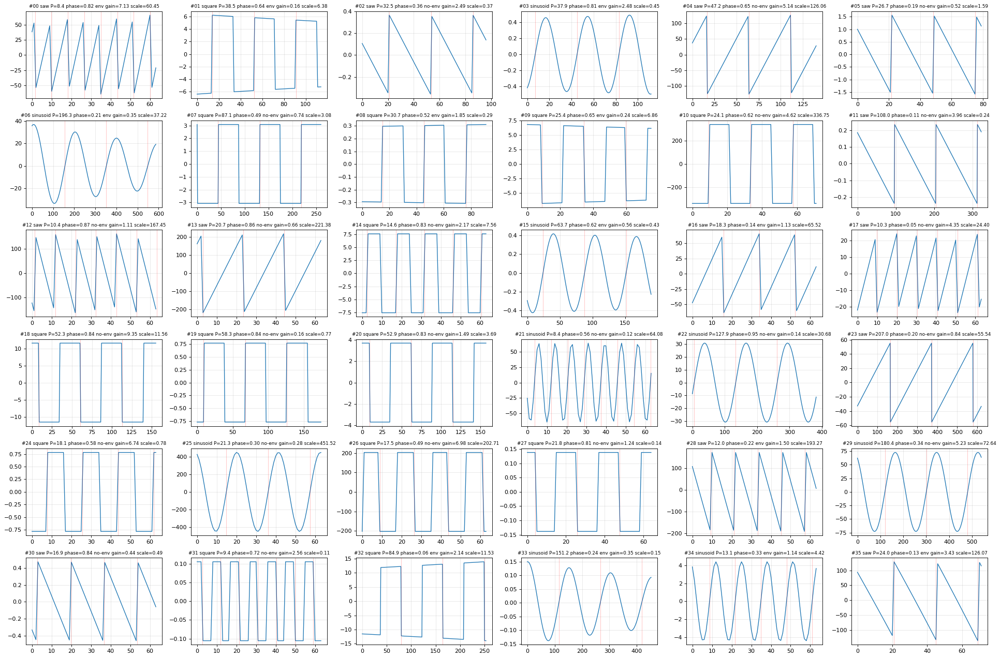
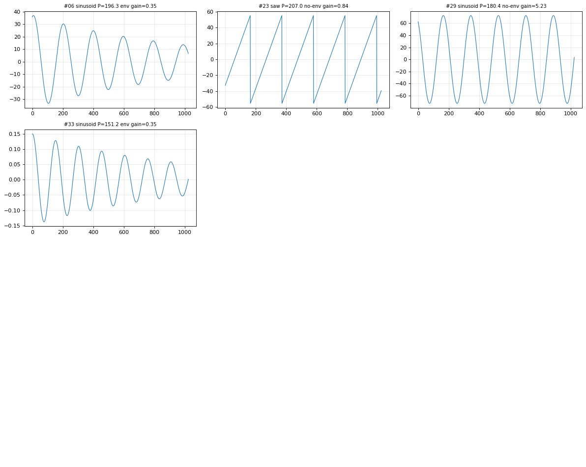
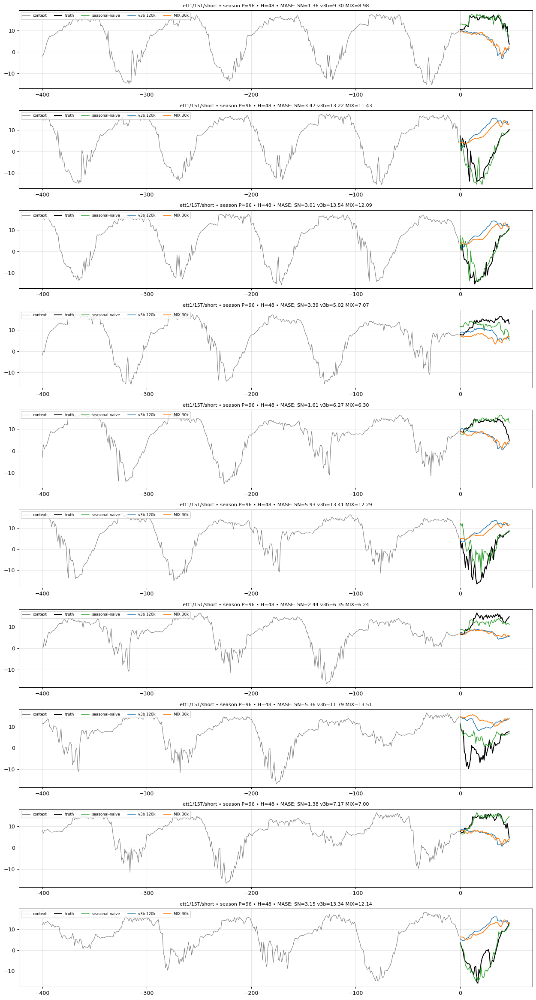
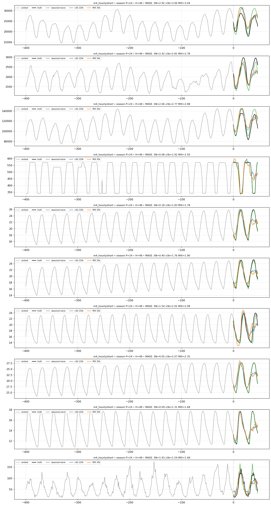
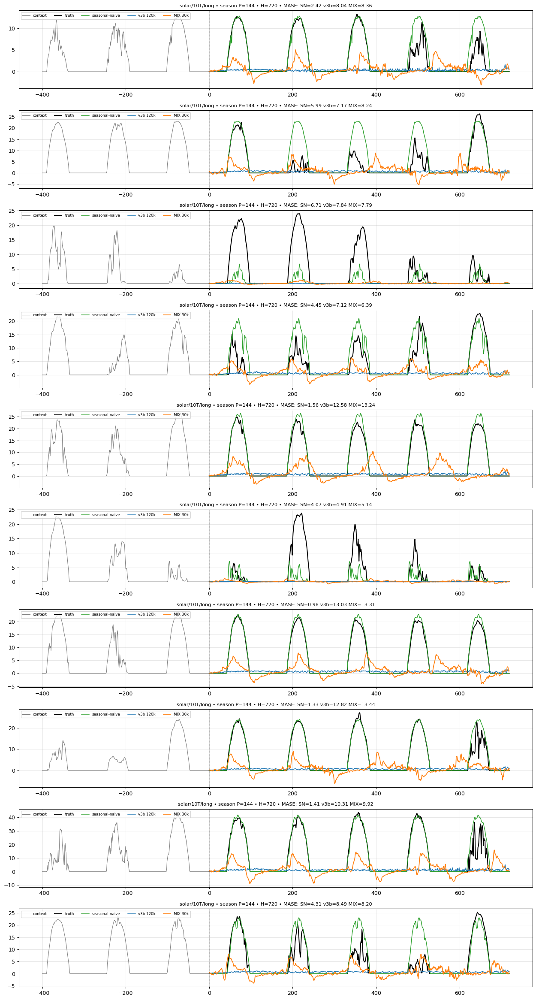
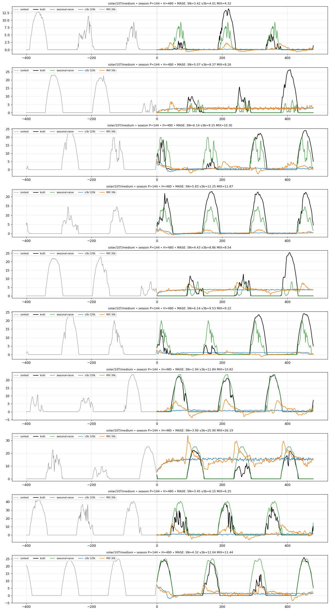
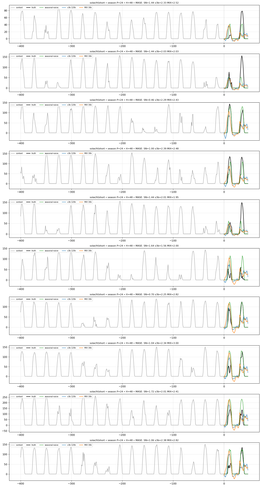

# Execution notes — periodic-synth-mix

Operational journey, cost, and infra incidents. Kept out of the report body
(science, not journey). Nothing here changes a result.

## Cost

- ~$4 of the $10 vast.ai balance.
- ~16 h total wall time: 2.1 h CONTROL + 1.3 h MIX backbone, 1.3 h + 1.8 h
  R1 heads, ~5 h + ~4 h GIFT-Eval.
- One 2 h stall on Stage 2a (prefetch-thread hang, below); resumed cleanly
  from the 10k checkpoint with no lost work.

## Session notes

- **vastrun-kit `attach-ssh` idempotency bug** (filed as kit issue #296) hit
  4 consecutive provisions. Worked around with a direct
  `vastai create instance` + `pytorch/pytorch:2.8.0-cuda12.8-cudnn9-runtime`.
- **Prefetch hang:** one 2 h Stage 2a hang on a 233-thread futex wait
  (HF-stream prefetch). Resumed cleanly from the 10k checkpoint; no recurrence.
- **Sync loop:** the local sync loop (5-min then 15-min cadence, atomic
  `.tmp → mv`, ≥70 MB min-size guard) caught every checkpoint without issue.

## Synth-validation extra plots

Two additional eyeballed-synth views beyond the `inspect_grid.png` grid in the
report body. Per-sample synth metadata for both is in
[`../plots/inspect_metadata.txt`](../plots/inspect_metadata.txt).

## Per-config forecast plots

Each figure is a 10-sample grid; per panel: grey = context, black = truth,
plus seasonal-naive / v3b / MIX forecasts over the 16-step horizon (legend in
panel 1). The report body embeds the representative `ett2_W_short.png` (MIX's
biggest win, −15.5%); the other five focus configs are below. The Δ% is the
MIX−CONTROL change in relative MASE from the focus-subset table.

