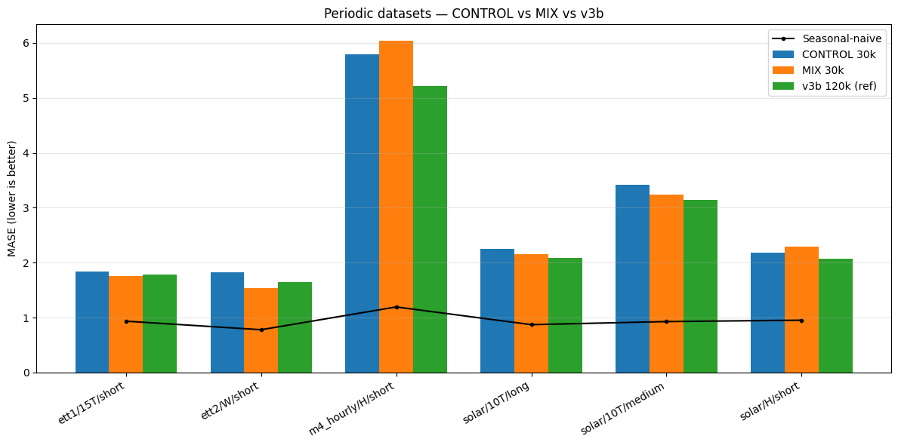
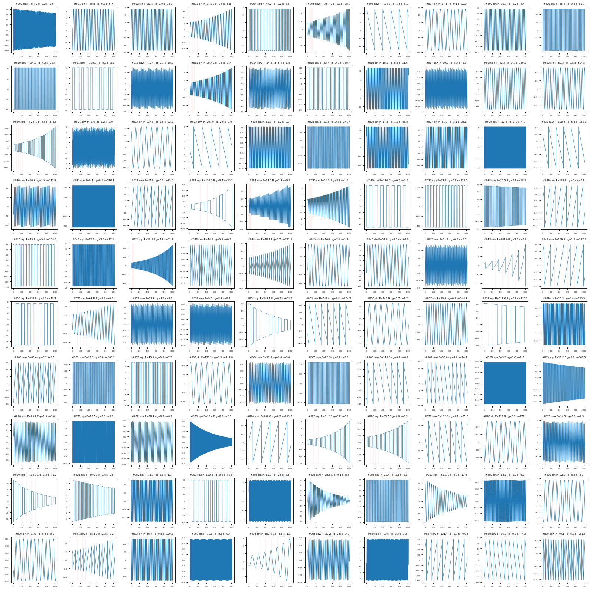
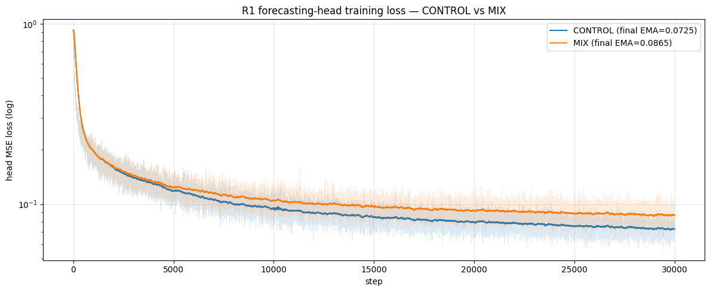

# Periodic synth mix — does clean-periodic synthetic data fix the periodic failures?

The v3b backbone underperformed seasonal-naive on a cluster of strongly
periodic GIFT-Eval datasets (the HANDOFF "periodic failure" set). The
question here: at **matched 30k-step compute**, does mixing 50% clean-periodic
synthetic data into every training batch teach the backbone to detect and
copy periods, and does that recover those failures — without hurting the rest?

## TL;DR

A **modest, uneven win on the 6 periodic failure datasets**, at essentially
zero aggregate cost and a small non-periodic tax.

- **Periodic subset GM-Rel MASE: 2.8025 (CONTROL) → 2.7066 (MIX), −3.4%.**
  MIX wins 4/6 focus configs. *(Single 30k-step paired run; see caveat below.)*
- Aggregate over all 97 configs: **1.2173 → 1.2164** — essentially tied.
- Non-periodic subset (91 configs): MIX **0.15% worse** — a small but real
  "generalisation tax" offsetting part of the periodic gain.
- Neither arm reaches seasonal-naive on any of the 6 focus configs at 30k:
  the deficit narrows, it does not close.

> *GM-Rel MASE (geometric-mean relative MASE) = geometric mean over configs of
> (model MASE ÷ seasonal-naive MASE). 1.0 = seasonal-naive; lower is better.
> MASE = Mean Absolute Scaled Error.*

> **Caveat — single run.** Each arm is one 30k-step run at seed 42; the arms
> are paired (identical except the data mix) but the −3.4% subset gain is not
> replicated across seeds, so treat magnitudes as indicative, not significant.

## Result — the periodic focus subset

> **Single seed (seed 42), one paired CONTROL/MIX run, no replication — these
> are single-run point estimates, no error bars, and no variance is quantified.**
> The −3.4% subset gain and the per-config Δ's below are point estimates from one
> run each; read magnitudes as indicative, not statistically established.

MIX (orange) beats CONTROL (blue) on **4 of 6** focus configs. The wins are
on weekly and fine-grained (15-/10-min) periodicity — exactly the regime the
synthesizer covers well. The two losses are the **hourly** configs
(m4_hourly/H, solar/H), where MIX is worse than CONTROL. Both arms sit well
above the seasonal-naive line: clean-synth narrows the gap but closes it
nowhere.

| Dataset | SN | CONTROL | MIX | v3b 120k | Δ (MIX−CTRL) | % |
|---|---:|---:|---:|---:|---:|---:|
| ett1/15T/short | 0.93 | 1.83 | **1.76** | 1.78 | **−0.08** | −4.1% |
| ett2/W/short | 0.78 | 1.82 | **1.54** | 1.64 | **−0.28** | **−15.5%** |
| m4_hourly/H/short | 1.19 | 5.79 | 6.04 | 5.22 | +0.25 | +4.3% |
| solar/10T/long | 0.87 | 2.25 | **2.16** | 2.08 | **−0.09** | −4.0% |
| solar/10T/medium | 0.93 | 3.42 | **3.24** | 3.15 | **−0.17** | −5.0% |
| solar/H/short | 0.95 | 2.18 | 2.30 | 2.08 | +0.12 | +5.4% |
| **GM-Rel** | — | **2.8025** | **2.7066** | **2.6037** | **−0.096** | **−3.4%** |

*(Source: [`results/periodic_datasets.txt`](results/periodic_datasets.txt).)*

The biggest win is **ett2/W/short (−15.5%)**, a weekly-granularity electricity
dataset. Eyeballing its forecast shows why MIX helps and where it still falls
short:

Top window: seasonal-naive copies a large spurious swing (its MASE 5.16) while
MIX (orange) holds near the true level. Bottom window: the signal is calmer
and every method is within noise. MIX wins this dataset by **avoiding SN's
worst over-shoots**, not by precisely reconstructing the weekly shape.

## Result — aggregate and where the win/loss lands

Aggregate GM-Rel is a tie; the action is entirely in the subset structure.

| Model | Training | GM-Rel MASE |
|---|---|---:|
| Seasonal-naive | — | 1.000 |
| R1 (v2 backbone) | 500k | 1.168 † |
| R1v3b (v3b backbone) | 120k | 1.1865 |
| **R1v3c_ctrl** | 30k from-scratch | **1.2173** |
| **R1v3c_mix** | 30k from-scratch | **1.2164** |

> *† The v2-backbone 1.168 is **carried from the originating v2 eval** (synthetic
> pre-train → resume, 500k steps), not recomputed from data committed here. It is
> the same figure cited in
> [`../2026-04-21_v3b-continuation/v3b-continuation.md`](../2026-04-21_v3b-continuation/v3b-continuation.md)
> and [`../2026-04-17_reconstruction-head/notes/FAILED_EXPERIMENTS.md`](../2026-04-17_reconstruction-head/notes/FAILED_EXPERIMENTS.md).
> The unreferenced `results/R1v3/all_results.csv` in this dir is **not** its source:
> recomputed against the SN column of `comparison.txt` it gives GM-Rel **1.1876**
> (script-reconstructed from per-config MASE, not a committed aggregate digest; a
> v3-family backbone, ≈ v3b's 1.1865), not 1.168. v3b (1.1865) and both v3c arms
> above are recomputed locally.*

The CONTROL–MIX aggregate gap is 0.0009 (within single-run noise). CONTROL at
30k is ~2.6% worse than v3b-120k — a modest under-training discount at matched
architecture. Splitting the 97 configs:

| Subset | n | GM-Rel CTRL | GM-Rel MIX | % |
|---|---:|---:|---:|---:|
| Periodic focus | 6 | 2.8025 | 2.7066 | **−3.4%** |
| Non-periodic | 91 | 1.1521 | 1.1539 | +0.15% |
| **All** | 97 | 1.2173 | 1.2164 | −0.07% |

*(Recomputed from [`results/comparison.txt`](results/comparison.txt).)* MIX
buys a −3.4% periodic gain for a +0.15% non-periodic tax; netted over 97
configs they cancel. By domain, the gain concentrates where period-copying
helps: **Econ/Fin** (6 configs, MIX wins 5/6, −0.10 GM-Rel — many m4 weekly/
quarterly/yearly series) and **Energy** (32 configs, MIX wins 21/32). **Sales**
regresses (n=4, small). The single worst regression is **us_births/M/short**
(+0.69 rel) — monthly data, short horizon.

## Protocol

Paired arms, identical except the batch composition (the only independent
variable). Full design in [`notes/DESIGN.md`](notes/DESIGN.md).

- **Backbone:** Tiny (C=4, H=512, W=16, GRU encoder + 6-layer transformer,
  RevEWMNorm span=32 — reversible EWMA input normalisation), config identical to
  v3b ([`scripts/train.py:52-57`](scripts/train.py); `encoder_type="gru",
  num_layers=6`). ~20M params (inherited v3b config; not separately measured in
  committed data).
- **Training:** 30 000 steps, batch 24, lr 1e-4, from scratch, seed 42.
  *base-bundles* = the `base_mixed_v1` real-time-series corpus on HF
  (`jeremycochoy/contrastive-training-base-bundles`).
  - **CONTROL (`tiny_v3c_ctrl`):** 24 base-bundles (real time series) rows/batch.
  - **MIX (`tiny_v3c_mix`):** 12 base-bundles + 12 on-the-fly periodic-synth rows.
- **Head:** R1 forecaster (reconstruction, forecast-len 16, GRU, MSE) trained on
  each frozen backbone, same 30k-step budget. Head GRU `hidden_dim=128,
  num_gru_layers=2` are the defaults of
  [`../2026-04-13_gift-eval/scripts/train_forecasting_head.py:94`](../2026-04-13_gift-eval/scripts/train_forecasting_head.py)
  invoked by [`scripts/run_remote.sh`](scripts/run_remote.sh) (which sets
  `--forecast-len 16 --reconstruction forecaster`); not overridden here.
- **Eval:** GIFT-Eval strategy B4 — the forecast rollout protocol used here:
  latent-space autoregressive rollout, decoding each step with the W-value head
  (`src/forecasting_head.py:955`, `forecast_B4`; one of the `--strategy` choices
  A1/A2/B1/B2/B3/B3R/B4). 97 configs, scored against seasonal-naive.
- **Synthesizer:** one primitive per series (sinusoid / square / saw),
  log-uniform samples-per-period in [8, 256], 50% sign-flip for square & saw,
  p=0.3 `exp(λt)` envelope (gain capped [0.1×, 10×]), log-uniform scale
  [0.1, 1000]. **No additive noise.**

The synth was validated as a teacher signal *before* training: on 1000 random
synth series, seasonal-naive (with the true period) beats persist-last-value by
15× (SN/naive MASE ratio **0.067**,
[`results/seasonal_naive_sanity.txt`](results/seasonal_naive_sanity.txt)) — so
"detect period, copy last period" is the right skill to learn from it.

## Training dynamics

All four values below are **read off the plot above** (the raw `*_losses.csv`
lived on the sync host and is not in the repo), so treat them as eyeball
estimates near end-of-run, not logged measurements.

| Arm | final loss EMA (est.) | final gap EMA (est.) |
|---|---:|---:|
| CONTROL | ~2.4 | ~0.32 |
| MIX | **~0.1** | **~0.54** |

By these estimates MIX's contrastive loss is roughly an order of magnitude lower
(~25×) and its gap ~60–70% higher than CONTROL — both ratios inherit the
plot-estimate inputs above.

> *Contrastive gap = FF − FP: how much more a window's forecast resembles its
> own future (FF) than its present (FP) — the margin the contrastive loss grows.*

This is **expected, not predictive of a downstream win**: the clean-periodic
half is trivial to separate from shuffled negatives, which drags the aggregate
loss down and inflates the gap. CONTROL's end-of-run gap (~0.32 by the plot)
sits close to v3b's at 120k, so CONTROL reaches a comparable gap in ~25% of the
steps — consistent with it being a valid matched-compute reference. (v3b's exact
best_gap is not in committed data here, so this is a visual comparison, not a
ratio of logged values.)

Head MSE below is read from the plot legend (final ~0.0725 / ~0.0865; step from
the curve), again a plot read-off, not a logged CSV:

| Arm | head final MSE (est.) | best MSE step |
|---|---:|---:|
| CONTROL | ~0.073 | 30000 |
| MIX | ~0.087 | 30000 |

The MIX head's MSE on real base-bundles data is **~19% higher**. The MIX
backbone encodes the clean-synth half very efficiently, but its latents are
slightly *less* linearly decodable on the noisier real half — the first hint
that the MIX representation specialised in a not-universally-helpful direction.

*(All training-dynamics numbers in this section are read off the two committed
plots above — the raw `*_losses.csv` lived on the sync host and is not in the
repo — so they are estimates, not measurements.)*

## What we learned

- **A pure-periodic synth signal does teach period detection** — the 4/6
  periodic wins, concentrated on weekly/fine-grained configs and in the
  Econ/Fin domain, are observed in this single seed-42 paired run (directional,
  not statistically established).
- **…but it does not transfer cleanly to noisy, multi-scale real data.** The
  two hourly losses (m4_hourly/H, solar/H) and the +19% head MSE point the same
  way. Likely causes, all consistent with a backbone over-trusting clean
  periodicity:
  1. **Real hourly data is multi-period** (daily P=24 *and* weekly P=168); a
     single-primitive synth never shows the weekly modulation, so the model
     locks onto the stronger short period.
  2. **Real hourly data is noisy** (solar weather irregularity); a clean-synth
     model over-projects its trust when the signal is noisier.
- **At this scale, more compute + a different backbone + synthetic pretrain
  beats this synth-data mix.** The v2 backbone (500k steps, synthetic pre-train;
  aggregate 1.168 carried from its originating eval, see † above) still beats the
  30k synth mix at aggregate — but it differs in three things at once (500k vs
  30k steps, v2 vs v3c backbone, and synthetic pretrain), so this is not isolated
  "compute". Synth helps the targeted slice but is not a shortcut around training
  budget.

## Addendum — extending MIX to 90k

To probe the periodic-specialisation trend, MIX was resumed from its 30k
`final` checkpoint for 60k more steps (same 50/50 mix), a fresh R1 head trained
on the 90k backbone, and full GIFT-Eval B4 re-run.
(Design: [`notes/FOLLOWUP_DESIGN.md`](notes/FOLLOWUP_DESIGN.md).)

| Arm | Aggregate | Periodic (6) |
|---|---:|---:|
| CTRL 30k | 1.2174 | 2.8029 |
| MIX 30k | 1.2165 | 2.7069 |
| **MIX 90k** | **1.2105** | **2.6565** |

*(Reconstructed from committed per-config MASE in
`../2026-04-27_freq-embedding/results/R1v3c_{ctrl,mix,mix_90k}/all_results.csv`,
scored against the SN column of `results/comparison.txt`. The MIX-90k aggregate
**1.2105** is script-reconstructed from those per-config values, not a committed
aggregate digest. CTRL/MIX 30k here use the full-precision freq CSVs; the main
table above re-derives the same two runs from `comparison.txt`'s 3-dp MASE — see
the reconciliation note below.)*

> *Reconciliation: the addendum's CTRL 1.2174 / MIX 1.2165 and the main table's
> CTRL 1.2173 / MIX 1.2164 are the **same two 30k runs**, differing only by
> 0.0001 — the main table re-derives them from `comparison.txt`'s 3-dp MASE while
> the addendum uses the full-precision freq-embedding CSVs (rounding, not
> different runs).*

3× more training improves what we asked it to: aggregate **−0.5%**, periodic
**−1.9%** vs MIX 30k. Per-config, **m4_hourly/H/short 6.04 → 5.40** (the biggest
single win — the 30k hourly regression recovers), **ett2/W/short 1.54 → 1.46**
(now the best across all arms), **solar/10T/long 2.16 → 2.26** (small
regression).

The freq-embedding follow-up reports that this periodic gain comes with a
growing non-periodic tax (its non-trend / stationary subsets degrade further at
90k) and that the v2 backbone still dominates every slice — i.e. the 50/50
synth ratio is the binding knob and over-trains the periodic specialisation.
Those subset numbers are defined and owned by that experiment
([`../2026-04-27_freq-embedding/`](../2026-04-27_freq-embedding/)); only the
aggregate and periodic columns above are reconstructible from data committed
here.

## Recommendations for follow-up

1. **Tune the mix ratio.** 50/50 was turned once; ~25% synth (or a curriculum
   annealing toward 0% over the back half) should cut the generalisation tax
   while keeping most of the periodic gain.
2. **Add a noisy-periodic variant** (`y = clean + ε`, σ log-uniform). The
   hourly losses (solar/H, m4_hourly/H) are the clean-synth assumption failing;
   noise should recover them.
3. **Add multi-period composition** (sum of two sinusoids, e.g. P=24 + P=168).
   A single-primitive synth cannot teach the daily+weekly structure real hourly
   data has — the specific gap on the hourly configs.

## Artefacts

All under `experiments/2026-04-27_periodic-synth-mix/`:

- [`notes/DESIGN.md`](notes/DESIGN.md) / [`notes/FOLLOWUP_DESIGN.md`](notes/FOLLOWUP_DESIGN.md) — design.
- [`notes/EXECUTION_NOTES.md`](notes/EXECUTION_NOTES.md) — cost, infra incidents, extra synth-validation plots.
- [`results/comparison.txt`](results/comparison.txt) — full 97-config CTRL / MIX / v3b side-by-side.
- [`results/periodic_datasets.txt`](results/periodic_datasets.txt) — 6-config focus table.
- [`results/seasonal_naive_sanity.txt`](results/seasonal_naive_sanity.txt) — SN / naive baselines on synth.
- Per-config raw MASE for the three arms: `../2026-04-27_freq-embedding/results/R1v3c_{ctrl,mix,mix_90k}/all_results.csv`.

Code: `src/synthetic_periodic.py`, `src/dataloader.py::create_mixed_periodic_dataloader`
(the factory `train.py` imports and calls; returns a `MixedPeriodicLoader`),
and [`scripts/`](scripts/) (train, inspect, sanity-check, plotting, comparison, sync).
