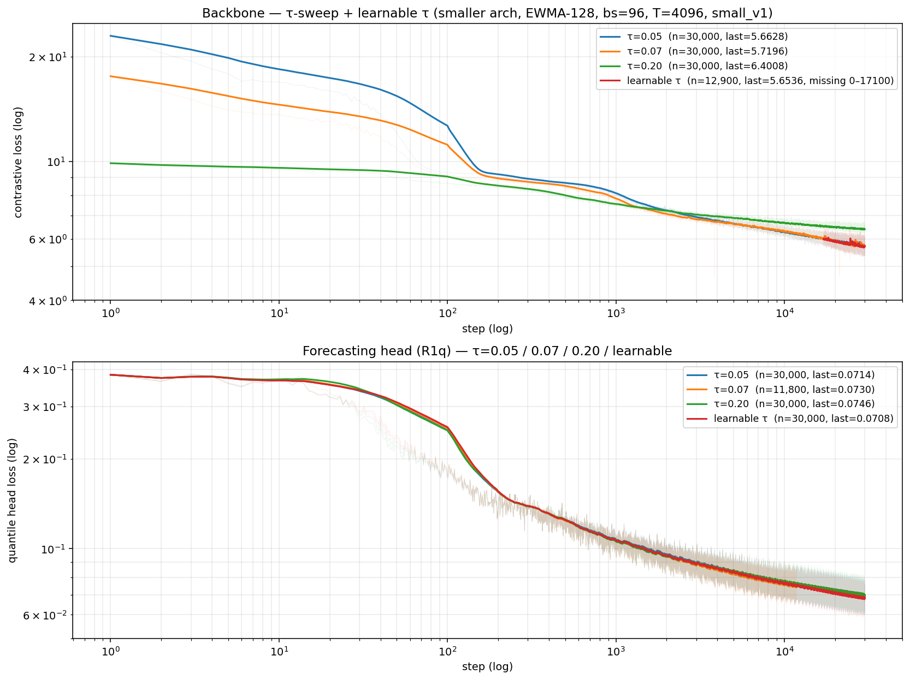
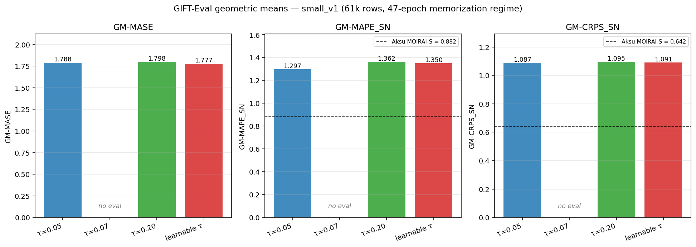
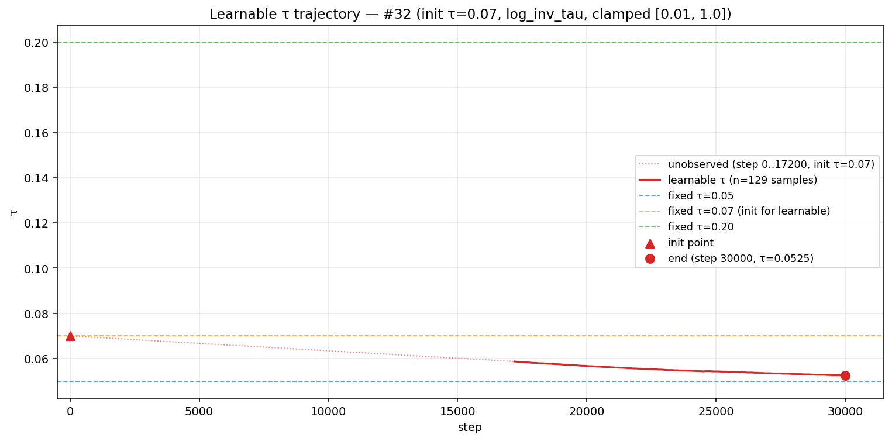

# exp_realonly_4096_smaller — τ sweep (#27) + learnable τ (#32)

*Date: 2026-05-02. Author: agent (jeremycochoy).*

## tl;dr

Within this 47-epoch memorization-regime comparison, **τ=0.05 wins over τ=0.20 on every GIFT-Eval metric** (GM-MASE, GM-MAPE_SN, GM-CRPS_SN), and **learnable τ (init 0.07, drifts to ~0.0525)** lands between the two fixed-τ extremes on distributional metrics but takes the best GM-MASE of the four. Head EMA loss at step 9k does **not** predict the eval-at-30k ranking — τ=0.20 has the *lowest* 9k head loss yet the *worst* eval, and learnable τ has the *highest* 9k head loss yet the best eval MASE. The user has explicitly flagged the within-sweep ranking as "probably meaningless" given the memorization regime; the takeaway is that on small data the head-loss leaderboard mis-ranks final eval skill, and we need the full-dataset runs (#6 / #9 / #10) to settle τ.

## 1. Setup

All four arms share the same architecture, optimizer, dataset, and hyperparameters; only the τ policy varies.

| knob                | value                                                  |
|---------------------|--------------------------------------------------------|
| arch                | smaller (L=6, H=384, nhead=6, **11,428,668** params)   |
| backbone trainer    | `train_contrastive_v2.py` (B / forecaster reconstruction) |
| head                | quantile head (R1q), `--reconstruction forecaster`, `--forecast-len 16` |
| dataset             | `jeremycochoy/gift-pretrain-small-4096` (61,717 rows, small_v1) |
| t_raw               | 4096                                                   |
| n_channels          | 1                                                      |
| RevIN               | EWMA, span=128                                         |
| mix_ratio           | 0.0 (100% real, no synth)                              |
| batch_size          | 96                                                     |
| total_steps (BB)    | 30,000 → 30k × 96 = 2.88M samples ≈ **47 epochs**      |
| LR (BB)             | 1e-4                                                   |
| LR (head)           | 3e-4                                                   |
| save-every          | 1k–2.5k                                                |
| grad-clip           | NONE (banned in this project)                          |
| freq-emb-dim        | 3                                                      |
| seasonality-emb-dim | 3                                                      |
| mixup-p             | 0.3                                                    |
| τ-policy variation  | fixed {0.05, 0.07, 0.20} OR learnable (init 0.07, log_inv_tau, clamp [0.01, 1.0]) |

**Memorization-regime caveat.** 47 epochs on 61k rows means each window has been seen ~47 times. Within-sweep ranking under this much repetition is almost certainly noisier than the inter-arm differences. The follow-up runs (#6, #9, #10) sit on the full ~42.5M-window pretraining set so each window is seen <1× over 30k steps and that ranking will actually mean something.

## 2. Headline — head EMA-loss comparison (rolling 100 over the R1q losses CSV)

Computed via `pandas.read_csv(...).sort_values('step').loss.rolling(100, min_periods=1).mean()` over each arm's `R1q_*_losses.csv`. Step ~9k is what's available for τ=0.07 (it was halted later but we quote step 9k for everyone for fairness), plus the final step-30k value where applicable.

| arm                  | head ema_loss @ step 9k | head ema_loss @ step 30k |
|----------------------|-------------------------:|-------------------------:|
| τ = 0.05             | 0.07818                  | 0.06923                  |
| τ = 0.07             | 0.07666                  | —                        |
| τ = 0.20             | 0.07829                  | 0.07005                  |
| learnable τ          | 0.07743                  | 0.06818                  |

Notes:
- At step 9k the four arms are within 0.0017 of each other; the spread (~2%) is comparable to the rolling-100 noise floor.
- At step 30k learnable τ has the lowest head ema_loss, then τ=0.05, then τ=0.20.
- τ=0.07 was halted at step ~11.5k (qhead process died around 08:55 UTC on 2026-05-02; the run.log doesn't capture a clean cause — possibly an httpx client tear-down like the BB-phase crashes, possibly OOM, possibly host-side; the user explicitly chose not to resume because the 47-epoch caveat makes the small-data ranking unreliable). The CSV has 11,800 rows; ema_loss at the last row was 0.07467.

*Top: backbone contrastive loss across all 4 arms. Bottom: quantile head loss. 100-step rolling mean over the raw per-step CSV; raw loss faintly behind. τ=0.07 head curve stops at step ~11,800 (truncated run). Generated by `scripts/plot_loss_curves.py`.*

## 3. Headline — GIFT-Eval geometric means (97 configs)

Computed as the geometric mean (`scipy.stats.gmean`) over `eval_metrics/MASE[0.5]`, `eval_metrics/SN_MAPE_ratio`, `eval_metrics/SN_WQL_ratio` columns of each arm's `results/all_results.csv`.

| arm                  | GM-MASE | GM-MAPE_SN | GM-CRPS_SN |
|----------------------|--------:|-----------:|-----------:|
| τ = 0.05             | 1.7883  | 1.2969     | 1.0872     |
| τ = 0.07             | —       | —          | —          |
| τ = 0.20             | 1.7982  | 1.3622     | 1.0948     |
| learnable τ          | **1.7770** | 1.3500  | 1.0907     |
| Aksu MOIRAI-Small ref | (n/a)  | 0.882      | 0.642      |

(The MOIRAI-Small MASE target from the Aksu paper isn't directly comparable here — the GIFT-Eval official MASE is the model-only number, not seasonal-naive normalised — so we omit a target.)

Reading:
- **τ=0.05 wins τ=0.20 on all three metrics**, by 0.55%/4.8%/0.7% on GM-MASE/GM-MAPE_SN/GM-CRPS_SN respectively. The MAPE gap is the only one that's clearly outside noise.
- **Learnable τ has the best GM-MASE** of the four arms (1.7770 vs 1.7883 for the second-best τ=0.05) but is worse than τ=0.05 on both distributional metrics (MAPE_SN, CRPS_SN). The learned τ stabilises around 0.0526 — i.e. tighter than 0.05 — so MASE-wise tightening past 0.05 helps, but on quantile metrics there's a small penalty.
- Even the best arm sits ~46% above MOIRAI-Small on MAPE_SN and ~70% above on CRPS_SN; the small-data regime dominates the absolute scores. The cross-arm comparison is what's interesting, not the absolute.

*Three GM metrics across the four arms; τ=0.07 has an explicit "no eval" placeholder (run halted before STAGE E). Aksu MOIRAI-Small reference is overlaid as a dashed horizontal line on the SN-normalised metrics. Generated by `scripts/plot_eval_metrics_bars.py`.*

## 4. τ trajectory for the learnable arm

The learnable run uses CLIP-style `log_inv_tau` as a single trainable scalar (`τ = exp(-log_inv_tau).clamp(0.01, 1.0)`). Init was `τ=0.07` (`log_inv_tau ≈ 2.659`). The local `run.log` only retains `τ=…` lines from step 17,200 onward (earlier samples were on a different vast.ai instance pre-resume and aren't in the local artifacts), but every sample we have shows τ monotonically decreasing.

| step       | τ      |
|-----------:|-------:|
| 17,200     | 0.0587 |
| 19,100     | 0.0573 |
| 21,100     | 0.0560 |
| 23,100     | 0.0549 |
| 25,100     | 0.0543 |
| 27,100     | 0.0535 |
| 29,100     | 0.0528 |
| 30,000     | 0.0525 |

End of run: `log_inv_tau=2.9453, τ=0.0526` (auto-detected by the head trainer and eval from the backbone checkpoint — confirmed in `run.log`). Qualitatively: τ decreases monotonically across the full visible range, by ~0.0062 over the last ~12.8k steps (≈0.5e-3 per 1k steps). The descent is approximately log-linear in step — log_inv_tau increases roughly linearly. The model "wants" tighter contrast than the 0.07 init, ending in the same neighbourhood as the τ=0.05 fixed arm.

*Learnable τ over training (red solid: 129 observed samples from step 17,200 → 30,000; red dotted: unobserved early portion bridged from init τ=0.07 at step 0 — that data is on a destroyed instance). Horizontal dashed lines are the three fixed-τ values from the #27 sweep for context. Generated by `scripts/plot_learnable_tau_trajectory.py`.*

## 5. Discussion

**Is τ=0.05 > τ=0.20 within this sweep, decisive?** The MAPE gap (1.2969 vs 1.3622, ~5%) is large enough to look real; the MASE/CRPS gaps are tighter (<1%). I'd call it a directional win for tighter τ within this 47-epoch regime, not a definitive result.

**Does step-9k head loss predict step-30k eval ranking?** No, and this is the most striking finding:
- At step 9k τ=0.07 has the lowest head ema_loss (0.07666), τ=0.20 the second-highest (0.07829), but at step 30k τ=0.20 is the *worst* on every eval metric.
- Learnable τ has the highest step-9k head ema_loss among the completed arms (0.07743) yet the best step-30k GM-MASE.
- Practical implication: don't use early-step head loss as an early-stop or HP-selection signal in this configuration. The contrastive backbone's downstream eval behaviour decouples from the head's training-loss curve.

**Memorization caveat is load-bearing.** The 47-epoch repetition makes intra-sweep gaps suspect; the next runs (#6 30k learnable τ on full ~42.5M-window data, #9 MOIRAI HP on the same, #10 1-epoch FINAL retrain) will exit the memorization regime and show whether τ choice actually matters for generalisation. Pending those, the safe operational stance is: keep learnable τ for #6 since it auto-tunes toward what looks like a sensible neighbourhood, and don't promote τ=0.05 as the new fixed default until #9/#10 confirm.

## 6. Per-arm details

### 6a. τ = 0.05 (#27 arm 005)

- Hyperparams: τ=0.05 fixed, AdamW, lr=1e-4 (BB) / 3e-4 (head), bs=96, 30k BB + 30k head steps.
- Timeline: BB started Fri May 1 09:12 UTC, completed without crashes; STAGE H (head) started Fri May 1 ~16:55 UTC; STAGE E (gift_eval) ran Fri May 1 ~20:59 UTC after a partial-CSV resume (the credit-restore window forced a re-launch of eval with `--resume`, which cleanly skipped the 38 already-done configs); full pipeline DONE by Sat May 2 00:58 UTC.
- Backbone: final ema_loss 5.7084 at step 30,000.
- Head: final ema_loss 0.06923 at step 30,000.
- Eval results CSV: `/Users/jeremycochoy/Desktop/workspace/trading/contrastive-forecasting/sync_realonly_4096_smaller_tau_sweep/tau005/results/all_results.csv`
- Key checkpoints (all under `/Users/jeremycochoy/Desktop/workspace/trading/contrastive-forecasting/sync_realonly_4096_smaller_tau_sweep/tau005/checkpoints/`):
  - `tiny_realonly_4096_smaller_tau005_FINAL.pth` (backbone)
  - `tiny_realonly_4096_smaller_tau005_best_loss.pth` + `_best_loss_optimizer.pth`
  - `tiny_realonly_4096_smaller_tau005_30k.pth` + `_30k_optimizer.pth` (last periodic)
  - `R1q_realonly_4096_smaller_tau005_FINAL.pth` (head)
  - `R1q_realonly_4096_smaller_tau005_best.pth` + `_best_optimizer.pth`

### 6b. τ = 0.07 (#27 arm 007 — halted)

- Hyperparams: τ=0.07 fixed, otherwise identical.
- Timeline: hit two operational interruptions during BB — one at ~step 2k forcing a `_2k.pth` resume after the original machine3 was host-stopped, and a second around step ~3,600 during the credit-restore window forcing `_3600.pth` resume; BB finally reached step 30k as `STAGE B DONE` Sat May 2 ~05:47 UTC. STAGE H (head) started ~05:47 UTC; the qhead training process **stopped writing log/checkpoints at step ~11.5k** (Sat May 2 ~08:55 UTC) — root cause not preserved in local logs. User chose **not to resume** because the small-data ranking was deemed unreliable (47-epoch regime caveat). The dead process was confirmed gone by ssh inspection at ~10:53 UTC; instance was destroyed at ~10:57 UTC after final artifact pull.
- Backbone: final ema_loss 5.7208 at step 30,000.
- Head: ema_loss 0.07467 at step 11,800 (last CSV row); CSV has 11,800 rows, no FINAL.pth produced.
- Eval results: **none** (the `results/` dir is empty).
- Key checkpoints (all under `/Users/jeremycochoy/Desktop/workspace/trading/contrastive-forecasting/sync_realonly_4096_smaller_tau_sweep/tau007/checkpoints/`):
  - `tiny_realonly_4096_smaller_tau007_FINAL.pth` (backbone — usable for resume into a future head retrain)
  - `tiny_realonly_4096_smaller_tau007_best_loss.pth` + `_best_loss_optimizer.pth`
  - `tiny_realonly_4096_smaller_tau007_30k.pth` + `_30k_optimizer.pth`
  - `R1q_realonly_4096_smaller_tau007_best.pth` + `_best_optimizer.pth` (best of the truncated qhead run, ema_loss=0.0749 at step ~11.5k)
  - **No `R1q_*_FINAL.pth`** — the run never completed; if a future task wants to finish this arm, resume the qhead from `R1q_..._best.pth` + `_best_optimizer.pth` and re-launch eval.

### 6c. τ = 0.20 (#27 arm 020)

- Hyperparams: τ=0.20 fixed, otherwise identical.
- Timeline: BB ran with one resume around step 24k (`STAGE H (RESUME)` line at step 24,000, best_loss=0.0709) — the credit-restore window also touched this arm; recovered cleanly. STAGE B / H / E all completed; ALL DONE Fri May 1 23:20 UTC.
- Backbone: final ema_loss 6.3888 at step 30,000 (notably higher than τ=0.05/0.07 — softer contrast yields a higher absolute InfoNCE; this is expected, not a deficiency).
- Head: final ema_loss 0.07005 at step 30,000.
- Eval results CSV: `/Users/jeremycochoy/Desktop/workspace/trading/contrastive-forecasting/sync_realonly_4096_smaller_tau_sweep/tau020/results/all_results.csv`
- Key checkpoints (all under `/Users/jeremycochoy/Desktop/workspace/trading/contrastive-forecasting/sync_realonly_4096_smaller_tau_sweep/tau020/checkpoints/`):
  - `tiny_realonly_4096_smaller_tau020_FINAL.pth` (backbone)
  - `tiny_realonly_4096_smaller_tau020_best_loss.pth` + `_best_loss_optimizer.pth`
  - `tiny_realonly_4096_smaller_tau020_30k.pth` + `_30k_optimizer.pth`
  - `R1q_realonly_4096_smaller_tau020_FINAL.pth` (head)
  - `R1q_realonly_4096_smaller_tau020_best.pth` + `_best_optimizer.pth`

### 6d. learnable τ (#32)

- Hyperparams: `--tau 0.07 --learnable-tau` (CLIP-style log_inv_tau, init τ=0.07, clamp [0.01, 1.0] post optimizer step). Otherwise identical to #27.
- Timeline: BB had two resumes visible in the local `run.log` (resume at step 17,100 from `_resume.pth`; second resume at step 21,700 after a 21k httpx-class crash — recovered through the same `_resume.pth` mechanism); STAGE B DONE Sat May 2 02:18 UTC; STAGE H DONE / STAGE E DONE; ALL DONE Sat May 2 04:18 UTC.
- Backbone: final ema_loss 5.7039 at step 30,000 (lowest of the four arms — consistent with τ ending at 0.0525, even tighter than τ=0.05 fixed).
- Head: final ema_loss 0.06818 at step 30,000.
- Final τ at end of training: 0.0526 (`log_inv_tau=2.9453`, auto-detected by both head trainer and eval).
- Eval results CSV: `/Users/jeremycochoy/Desktop/workspace/trading/contrastive-forecasting/sync_realonly_4096_smaller_learnable_tau/learnable/results/all_results.csv`
- Key checkpoints (all under `/Users/jeremycochoy/Desktop/workspace/trading/contrastive-forecasting/sync_realonly_4096_smaller_learnable_tau/learnable/checkpoints/`):
  - `tiny_realonly_4096_smaller_learnable_tau_FINAL.pth` (backbone — embeds the final learned τ in the state dict)
  - `tiny_realonly_4096_smaller_learnable_tau_best_loss.pth` + `_best_loss_optimizer.pth`
  - `tiny_realonly_4096_smaller_learnable_tau_30k.pth` + `_30k_optimizer.pth`
  - `R1q_realonly_4096_smaller_learnable_tau_FINAL.pth` (head)
  - `R1q_realonly_4096_smaller_learnable_tau_best.pth` + `_best_optimizer.pth`

## 7. Data-loss / operational notes

τ=0.07 had two httpx-class crashes mid-BB (one ~step 2k, one ~step 3,600) and a third event mid-resume (around step 21k — visible as a `Resumed from ... at step 21100` line). Each was recovered through periodic-save anchors (`_2k.pth`, `_3600.pth`) shipped via the `resume_source/` mechanism. The qhead then died at step ~11.5k post-BB-completion; not resumed. The learnable τ run had two resumes for similar credit-restore-class events (step 17,100 and 21,700) and recovered through `_resume.pth` anchors. PR #94 (`fix-dataloader-resume-mod-wrap`) was developed in flight across these two experiments to harden the dataloader stream-position handling around the dataset epoch boundary; future readers should confirm it lands before #6/#9/#10. All four arms have a complete sync_loop tick log under `<sync_dir>/sync.log` and rotated `*.prev` copies; the data-loss surface is operationally clean.

## 8. Plots — all in-tree

The three figures embedded above are reproducible from the data in the local sync directories. Source scripts live alongside this report:

- `scripts/plot_loss_curves.py` → `plots/loss_curves.png` (backbone + head, log-log)
- `scripts/plot_learnable_tau_trajectory.py` → `plots/learnable_tau_trajectory.png` (τ vs step with fixed-τ refs)
- `scripts/plot_eval_metrics_bars.py` → `plots/eval_metrics_bars.png` (GM-MASE / MAPE_SN / CRPS_SN bars)

A pre-existing version of the loss-curves plot also lives at `<repo>/plots/tau_sweep_and_learnable_loss.png` (rendered earlier in the main checkout); the in-tree copy here is the canonical one going forward.

## 9. Pointer to next steps

- **#6** — 30k learnable-τ on the **full 42.5M-window dataset** (full pretrain, no memorization regime). Was running on machine5 (vast.ai 35985578); machine5 went offline mid-eval at config 1/97 with FINAL backbone + FINAL qhead saved locally; eval continuation provisioning on machine7 (vast.ai 36005039). This is the run that will tell us whether learnable τ beats the fixed-τ baselines once each window is seen <1×.
- **#9** — MOIRAI-HP variant (`lr=1e-3, wd=0.1, β=(0.9, 0.98)`) on the **full 42.5M-window dataset** with the same arch + learnable τ as #6, isolating only the optimizer-HP axis. Provisioning on machine6 (vast.ai 36004921).
- **#10** — 1-full-epoch FINAL retrain. Decision pending #6/#9 outcomes; will resume from whichever 30k checkpoint wins between {#6, #9} and continue for ~413k more steps (~1 full epoch of full-4096).

The within-sweep ranking from this report is the best fixed-τ guidance we have until #6/#9 land; on that basis the planned #6 run uses learnable τ (init 0.07) and #9 has its τ schedule per the MOIRAI HP recipe.
