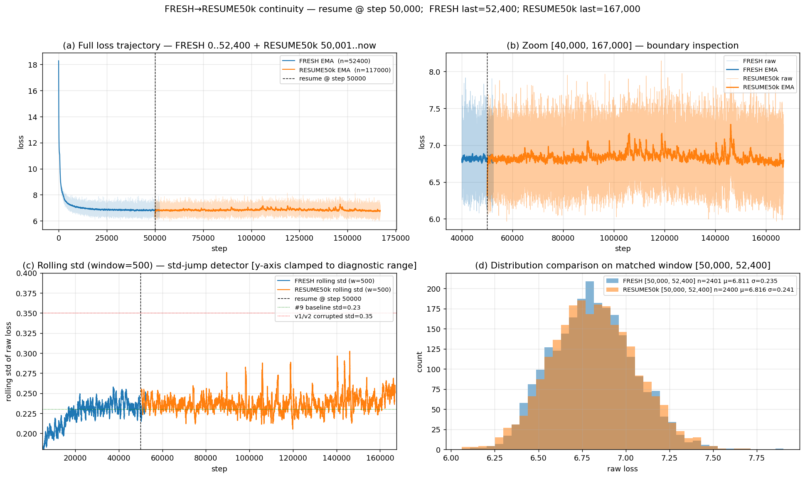

# #10 RESUME50k — final report

**Goal**: full epoch (167k steps, bs=256, MOIRAI HP) on `gift-pretrain-full-4096`,
plus quantile head + GIFT-Eval. Also prove the new deterministic-resume code
(PR #110) eliminates the +52% loss-std jump that v1/v2 saw when resuming
from #9 30k.

## Headline

| metric | value |
|---|---|
| **GM-Relative MASE (97 configs, B4)** | **1.1828** |
| Backbone steps trained | 167,000 |
| Quantile head steps | 30,000 |
| Resume continuity (mean / std on matched [50k, 52.4k] window) | +0.07% / +2.6% |

vs prior runs:

| run | GM-MASE |
|---|---|
| #6 default HP, 30k | 1.804 |
| #9 MOIRAI HP, 30k | 1.639 |
| **#10 RESUME50k 167k+qhead (this report)** | **1.183** |

vs leaderboard:

| Sundial | TimesFM | PatchTST | Chronos | Moirai | Naive | Ours |
|---|---|---|---|---|---|---|
| 0.673 | 0.680 | 0.762 | 0.786 | 0.809 | 1.000 | **1.183** |

A 28% improvement over #9 30k, but still 17% behind seasonal naive. Backbone
under-fit relative to the leaderboard — needs more capacity or longer
training to be competitive.

## Resume continuity — no jump

Visual & numerical proof that the deterministic-resume code path
(`hf_rows_consumed` fast-skip + RNG cast fix from PR #110) no longer
produces the v1/v2 std-jump pathology when restarting mid-run.

Panels: (a) full trajectory FRESH 0–52.4k + RESUME50k 50k–167k; orange sits
flush on blue at the boundary. (b) zoom [40k, 167k]. (c) rolling-std with
y-axis clamped to the diagnostic range — green is #9's 0.23 baseline, red
is v1/v2's corrupted 0.35 level; we hug the green. (d) histograms over
matched [50k, 52.4k] window.

Numerical (Welch t-test on means: p=0.41; Levene's on variances: p=0.13).

## Pipeline

1. **STAGE B — backbone** (`run_resume50k.sh`): resumed from FRESH 50k.pth at
   step 50,001, ran to 167,000. ~12.6h on RTX 5090.
2. **STAGE H — qhead** (`run_qhead_eval.sh`): 30k steps quantile-head training
   (forecast_len=16, lr=3e-4, bs=256). ema_loss=0.0606. ~2.3h.
3. **STAGE E — GIFT-Eval** (`run_eval_only.sh`): 97 configs, B4 strategy,
   forecast_len=16. Run locally on elisa RTX 4090 because the vast instance
   went terminal during the on-instance retry.

## Bugs fixed during the run

| PR | issue |
|---|---|
| #120 | HF `httpx` client closure mid-stream killed FRESH at step 52,400. Now retried + tested. |
| #94  | `skip_rows >= total_rows` on resume → StopIteration. Now mod-wraps. |
| #122 | repo-wide reorg into per-experiment dirs. |
| #123 | `PrefetchIterator` early-exit leaked the producer thread → process abort at shutdown. |
| #124 | `train_forecasting_head.py` and `eval_gift_eval_official.py` had hard-coded backbone arch (C=4, H=512, nhead=8); CLI overrides added. |

## Artifacts

- backbone end-of-train: `tiny_full4096_moirai_hp_FRESH_RESUME50k_FINAL.pth` (synced to `sync_realonly_full4096_moirai_hp_FRESH_RESUME50k/`)
- qhead end-of-train: `R1q_full4096_moirai_hp_FRESH_RESUME50k_FINAL.pth` (same dir)
- eval: `results/gift_eval_resume50k_local/{all_results.csv, summary.txt}`
- continuity: `resume50k_continuity.png` + `scripts/plot_full4096_resume50k_continuity.py`
- launchers (this dir): `run_resume50k.sh`, `run_qhead_eval.sh`, `run_eval_only.sh`

## Cost

$33.48 spent on vast.ai instance 36055545 (RTX 5090, 51h30m, $0.65/h).
Eval re-run locally on elisa to recover from the credit-out termination.
