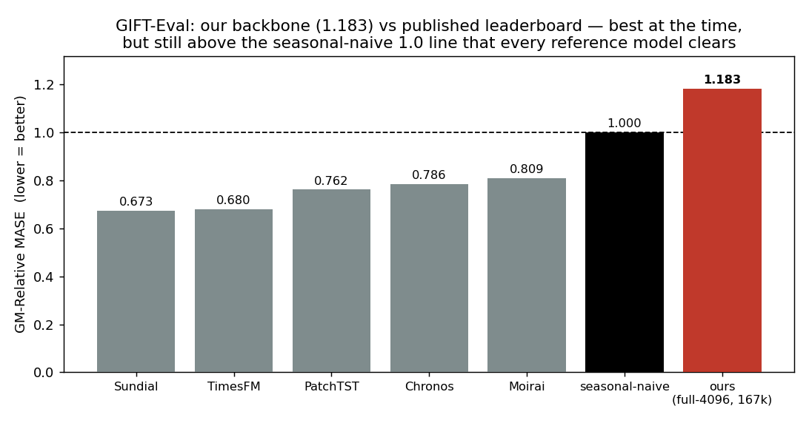
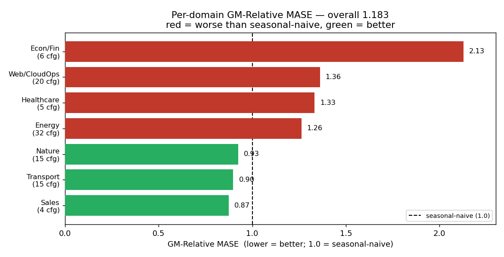

# Real-only full-4096, MOIRAI HP, one full epoch (167k): GM-Rel MASE 1.183 — project best, still behind seasonal-naive

*(run #10)*

## Question

Does a **full epoch** — 167,000 steps — of contrastive pretraining on the full real
`gift-pretrain-full-4096` corpus, with MOIRAI-style optimizer hyperparameters and a
quantile forecasting head, beat the earlier short runs on GIFT-Eval and close the gap
to the leaderboard? Secondary: does the new deterministic-resume code path (PR #110)
remove the loss-std jump that earlier resume attempts (v1/v2) showed when restarting
mid-run?

> *Primary metric **GM-Relative MASE** = geometric mean over the 97 GIFT-Eval configs
> of (model MASE ÷ seasonal-naive MASE), where MASE is Mean Absolute Scaled Error.
> 1.0 = seasonal-naive; lower is better; the best leaderboard models reach ≈0.67–0.81.*

## Result

**Overall GM-Relative MASE = 1.183** (recomputed as the geometric mean of the Relative
column over all 97 configs in [`results/gift_eval_resume50k_local/summary.txt`](results/gift_eval_resume50k_local/summary.txt);
it equals the committed aggregate **1.1828**). That is the project-best contrastive
backbone on GIFT-Eval at the time — but it still sits above the seasonal-naive 1.0 line
that every published reference model clears.

We land at 1.183 while the small-model leaderboard sits at 0.67–0.81 — so the backbone
is **~0.37 above the nearest small model (Moirai 0.809) and ~0.51 above the best
(Sundial 0.673)**, and **18% worse than seasonal-naive** (1.183 vs 1.0), a single
threshold no reference model fails.

**Where it wins and loses.** The aggregate hides a clean split: 3 of 7 domains already
beat seasonal-naive, 4 drag it back over the line.

Sales (0.87), Transport (0.90) and Nature (0.93) are already under 1.0. The drag is
**Econ/Fin (2.13, 6 configs)** — the worst domain by far, all M4 series — and the two
largest domains, **Energy (1.26, 32 configs)** and **Web/CloudOps (1.36, 20 configs)**,
which together are 52 of the 97 configs and keep the aggregate above 1.0. Healthcare
(1.33, 5 configs) is also red. The single worst configs are the bursty service-telemetry
series (`bizitobs_application/10S` 4.32 and `bizitobs_service/10S` 4.18 on the medium
horizon) and the hardest seasonal configs (`m4_hourly/H/short` 3.95, `solar/10T/long`
3.37, `solar/10T/medium` 3.31) — see
[`summary.txt`](results/gift_eval_resume50k_local/summary.txt) for the full per-config table.

**Progression on this axis.** Holding architecture and data fixed and moving along the
optimizer-HP / step-budget axis, the number fell monotonically:

The full epoch plus quantile head is a **−28% improvement over #9** (1.639 → 1.183) and
**−34% over #6** (1.804 → 1.183). The #6 = 1.804 and #9 = 1.639 figures are cited
cross-experiment values recorded in [`notes/REPORT_PLAN.md`](notes/REPORT_PLAN.md)
(the 30k head-to-head that #9 won and that motivated this run); they are not produced by
committed eval data in this directory and are kept as-reported. Only the final bar is
recomputed here.

### Secondary: deterministic resume leaves no jump

The resume in this run restarts the backbone mid-trajectory (from a 50k checkpoint), so
it is also the test of PR #110's deterministic-resume code (`hf_rows_consumed` fast-skip
+ RNG cast fix). Earlier resume attempts (v1/v2) raised the loss standard deviation by
~52% at the boundary; this one does not.

Over the matched [50k, 52.4k] window the resumed trajectory differs from the fresh one by
**+0.07% in mean and +2.6% in std** — within noise (Welch t-test on means p = 0.41,
Levene's test on variances p = 0.13). The deterministic-resume path is validated: it
reproduces the trajectory rather than perturbing it. *(This is a within-run continuity
check, not a held-out generalization claim. The continuity plot is committed; the scalar
statistics — the mean/std deltas, the Welch/Levene p-values, and the v1/v2 reference
levels — come from the run's training-loss diagnostic, whose CSV is not committed in this
directory.)*

## Protocol

- **Backbone under test** (`scripts/run_resume50k.sh`): Tiny contrastive backbone,
  C = 1 channel, H = 384, nhead = 6, 6 layers, T_raw = 4096, RevIN EWMA (span 128),
  learnable τ = 0.07, loss `cosine_similarity_batch`, mixup p = 0.3 — trained to
  **167,000 steps**, batch size 256, MOIRAI HP (**lr = 1e-3, weight-decay = 0.1,
  β = (0.9, 0.98)**, flat schedule, no warmup, no grad-clip). Data: real-only
  `jeremycochoy/gift-pretrain-full-4096` (path `small_v1`), mix-ratio 0.0. The run
  resumed from the fresh run's step-50k checkpoint and continued to step 167k (one full
  epoch).
- **Quantile head** (`scripts/run_qhead_eval.sh`): a quantile forecasting head on the
  **frozen** backbone — 30,000 steps, forecast_len = 16, lr = 3e-4, batch size 256.
- **Benchmark** (`scripts/run_eval_only.sh`): the official GIFT-Eval suite — 97 configs
  across 7 domains, **B4** strategy, forecast_len = 16, scored against seasonal-naive.
  Every "ours" number is computed from the committed per-config outputs in
  [`results/gift_eval_resume50k_local/`](results/gift_eval_resume50k_local/); the
  leaderboard reference numbers (Sundial / TimesFM / PatchTST / Chronos / Moirai /
  seasonal-naive) are published GIFT-Eval figures, the same references
  [`../2026-04-13_gift-eval/gift-eval.md`](../2026-04-13_gift-eval/gift-eval.md) uses.
- **Single run** per point — GIFT-Eval point scoring is deterministic, so the only noise
  is training-init; we do not have a seed sweep, so the cross-run deltas are not
  variance-bounded.

## What we learned

Step budget and a quantile head are the levers that moved the number on this axis: one
full epoch plus the head took the contrastive backbone from #9's 1.639 to **1.183**, a
**−28%** improvement and the project-best GIFT-Eval result at the time. But it is still
**18% behind seasonal-naive** and ~0.37–0.51 above the small-model leaderboard (Moirai
0.809 up to Sundial 0.673), and the deficit
is concentrated in Energy, Web/CloudOps and the M4-heavy Econ/Fin domains — the
real-world structure the small leaderboard models capture and an 11-ish-M-param
single-epoch backbone does not. The directional read is that the backbone is **under-fit
relative to the leaderboard**: closing the remaining gap most likely needs more capacity,
more / longer training, or a different data mix rather than more optimizer tuning (that
axis is now flat — #9 already beat #6 on HP alone, and this run shows the next gain came
from steps, not HP). Separately, the deterministic-resume code (PR #110) is validated:
restarting mid-run reproduces the trajectory with no std jump, so future long runs can be
resumed safely.

---

*Operational journey — cost ($33.48, vast.ai instance 36055545, RTX 5090, 51h30m), the
credit-out / eval-rerun-on-elisa recovery, the bugs fixed mid-run (#120/#94/#122/#123/#124),
and the full checkpoint/artifact inventory — lives in
[`notes/EXECUTION_NOTES.md`](notes/EXECUTION_NOTES.md). The pre-launch plan is in
[`notes/REPORT_PLAN.md`](notes/REPORT_PLAN.md).*
