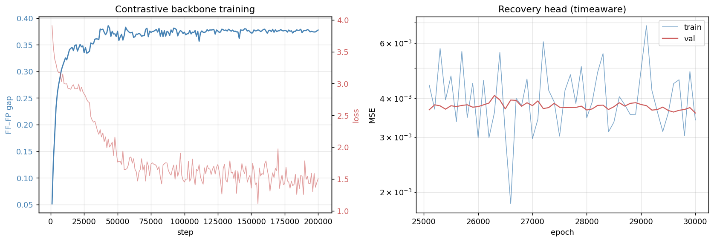
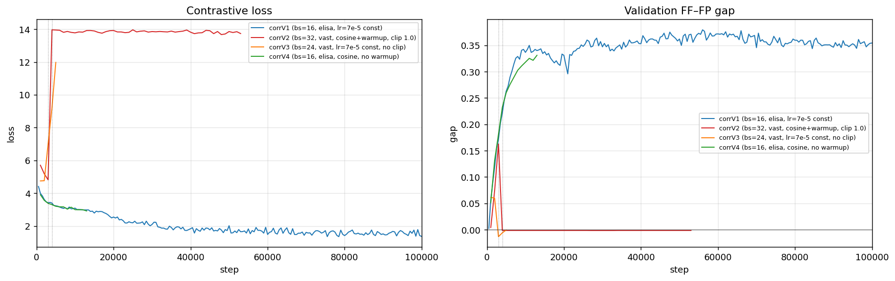
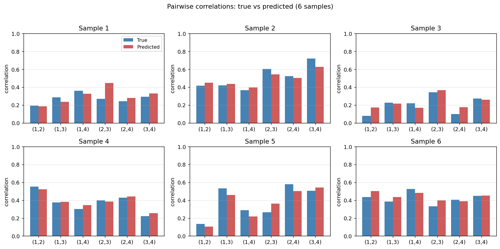
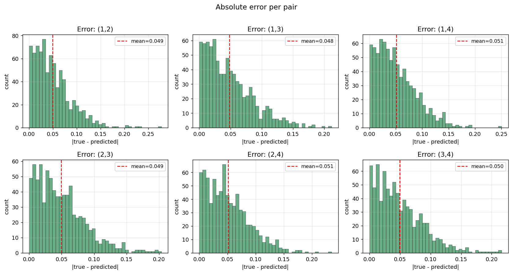
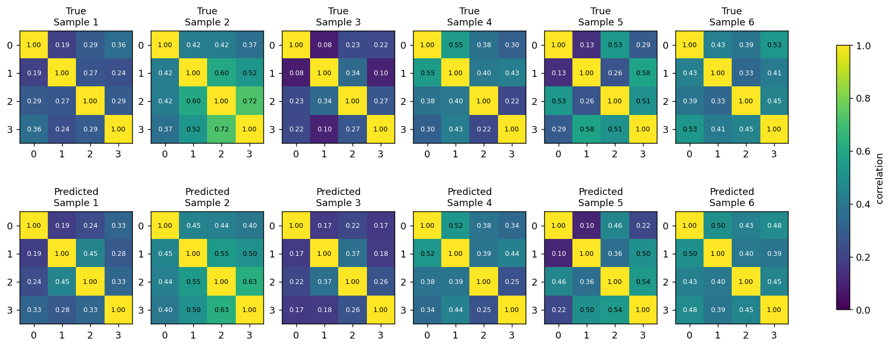

# Recovering Pairwise Correlations from Contrastive Embeddings of Random Walks

A companion experiment to **contrastive-arma**. Same backbone family, same loss, same
recovery-head philosophy — but the generative parameter is the **4×4 correlation matrix**
of 4 correlated Brownian motions instead of ARMA(p,q) coefficients.

## TL;DR

- **Backbone V4** (16h on one elisa RTX 4090): 154M-parameter transformer with GRU
  encoder, bs=16, lr=7e-5 with cosine decay to 10% over 200k steps, no gradient
  clipping. Reaches **FF–FP gap 0.386** at step 43k and plateaus around 0.37–0.38 for
  the remainder. Cross-batch similarity collapses to ≈ 0.01 — samples are nearly
  orthogonal in embedding space.
- **Recovery (TimeAware head, latent `h`, 30k epochs, cosine LR)**: a non-linear
  per-timestep MLP across channels, mean-pooled over time, with a single linear
  projection to the 6 pairwise correlations. **Mean Pearson r = 0.918** across all
  6 pairs (range 0.91–0.93), **MAE = 0.050**, **MSE = 0.0038** — **6.29× improvement
  over the mean-baseline** and **43× over the zero-baseline**.
- The trivial **diff(x) corrcoef** baseline (Pearson r = 0.997) is the ceiling — any
  estimator with raw access to the data can compute it directly. The contrastive head
  recovers ≈ 92 % of the available linear signal without ever seeing differences,
  positions, or correlations during the contrastive phase.

The gap from the original v1 result is dramatic: **0.57 → 0.92 mean Pearson r** with
the same architecture and only two changes — train the backbone to convergence
(200k vs 100k steps with cosine LR) and train the head 10× longer (30k vs 3k epochs).
The v1 numbers were not a fundamental limit; they were under-trained.

## 1. Question

Given a contrastive backbone trained without supervision on 4-channel correlated random
walks, can a head on top of the backbone recover the underlying correlation matrix that
generated the walks?

This is the cross-channel analogue of ARMA parameter recovery. There, the per-channel
generative parameters (p, q, AR/MA coefficients) sit *inside* each channel's temporal
dynamics. Here, the generative information sits *between* channels — there is no
per-channel temporal structure to memorise. Any usable signal must come from how
channels move together.

We add two analytic baselines:

- **diff(x) corrcoef** — empirical Pearson correlation of the channel **increments**.
  For Brownian motion this is essentially the maximum-likelihood estimator of the
  generative correlation, so it sets a near-optimal ceiling for any recovery method.
- **x corrcoef** — empirical Pearson correlation of the **positions** themselves.
  Naïve, biased upward by common drift (Pearson r ≈ 0.30 vs ground truth).

A successful contrastive-head recovery should sit close to the diff(x) baseline and
clearly beat the position baseline.

## 2. Data

For each batch sample we sample a 4×4 correlation matrix C, draw 4096 iid 4-dim
increments with covariance C, take their cumulative sum, and z-score each channel
within sample (z-scoring is affine and so does not change Pearson correlations).

**Correlation sampling** uses a non-negative two-factor construction:

```
L_ki ~ U[0, 1],    k=1..4, i=1..2
||L_k|| := τ_k,    τ_k ~ U[0.4, 0.95]
diag_eps_k = 1 − ||L_k||²
C = L Lᵀ + diag(diag_eps)
```

This guarantees `diag(C) = 1`, off-diagonals in `[0, ~0.9]`, and PSD by construction.
Empirically the 6 unique pairwise correlations cover ≈ `[0.05, 0.9]`.


## 3. Backbone

`ConfigurableModel` from `src.models`, identical configuration to the ARMA-V2 best:

- GRU encoder, H = 1024, W = 32 (128 patches per 4096-step sample)
- Transformer: 12 layers, 8 heads, FFN ×4, GELU, depthwise causal conv k=3
- Channel-mixing module (Kronecker product)
- Total parameters: **153.85 M**

**Training.** Contrastive loss `cosine_similarity_batch_no_time_neg`:

- positive: `cos(f_t, e_{t+1})` — same channel, next time step
- negatives: cross-channel (same time, different channel) and cross-batch
  (different sample)
- *no* cross-time negatives — for Brownian increments consecutive embeddings of a
  stationary process should be near-identical; only cross-channel and cross-batch
  signals carry sample-distinguishing information.

AdamW, **batch 16**, lr 7e−5 with cosine decay to 10 % (no warmup), no gradient
clipping, temperature 0.07, **200 000 steps**. Wall time: **15.96 h** on one elisa
RTX 4090. Final saved-best gap: **0.3859 at step 43 000**, post-peak plateau
0.37–0.38.

For comparison, the ARMA-V2 12L backbone at 2 M steps reaches gap 0.203. This task
saturates at higher gap and ~10× faster because the cross-batch signal is much
stronger: each sample has a correlation structure that uniquely identifies it, and the
contrastive loss pushes hard on cross-batch separation.



### Note on bigger batches

We tried twice to push to bs=24 / bs=32 on a Vast.ai RTX 5090 (more cross-batch
negatives → in principle a stronger signal). Both runs collapsed at step 3–5k:
loss jumped 4.8 → 13.9, embedding similarity FF/FP/CB all flattened to ≈ 0.22 (a
degenerate fixed point) and never recovered. Same code, different bs and hardware:



bs=16 on the same architecture is stable. The bigger-batch denominator at temperature
0.07 (with the cross-batch term scaling as B²·T·C) seems sharp enough to find a
collapsed equilibrium that the bs=16 setup never reaches. We did not chase a fix
because bs=16 + longer training already produced the result we wanted.

## 4. Recovery head

The backbone produces two latent tap-points: `h` (per-channel, pre-channel-mixing)
and `h_hat` (post-channel-mixing). Both have shape `[B, T, 4, 1024]`.

The winning head is **TimeAware** — non-linear MLP applied per timestep across the
flattened `[K, H]` features, then mean-pooled over time, ending in a single linear
projection to the 6 pairwise outputs:

```
flat   = h.flatten(K, H)                  # [B, T, K·H]
flat   = LayerNorm(flat)
per_t  = MLP_3layer(flat)                 # [B, T, 6]   (one MLP shared across t)
y      = mean_t(per_t).clamp(0, 1)        # [B, 6]
```

**Why this and not pool-then-MLP?** Pairwise correlation is a *quadratic* statistic
of the data: `(1/T) Σ_t z_{i,t} z_{j,t}`. To compute it, the head needs (a) cross-
channel multiplicative interaction at each timestep, then (b) average over time.
Pooling first destroys (b) — you can't recover the time-average of a cross-channel
product from the product of the time-averages. The "single linear" head and the
"mean-pool MLP" head trained earlier confirmed this: both collapsed to predicting the
target mean (Pearson r ≈ 0.03–0.10) while the structurally-correct TimeAware head
extracts a clear signal.

Latent `h` (per-channel) wins over `h_hat` (post-channel-mix) because the head
benefits from preserved channel identity — once the Kronecker mix has scrambled
channels, the head can no longer compute pairwise interactions cleanly.

**Training.** AdamW, bs=8, lr=3e-4 with cosine decay to 10 %, no warmup, no clip,
**30 000 epochs**. ~3 h on one elisa RTX 4090 (with the frozen backbone forward
dominating runtime). Best val MSE 0.003549 at epoch 29 871.

## 5. Results

### 5.1 Numerical summary (400-sample test set)

| Head / variant | Latent | Overall MSE | vs zero | vs mean | Mean Pearson r |
|------|--------|-------------|---------|---------|----------------|
| Linear (v1, baseline) | h | 0.0264 | 6.28× | 0.92× (worse) | 0.034 |
| MLP, mean-pool-then-MLP (v1) | h | 0.0240 | 6.89× | 1.01× | 0.101 |
| TimeAware (v1, 3k epochs) | h_hat | 0.0242 | 6.85× | 1.00× | 0.060 |
| TimeAware (v1, 3k epochs) | h | 0.0169 | 9.80× | 1.43× | **0.573** |
| **TimeAware (v4, 30k epochs)** | **h** | **0.00385** | **43.0×** | **6.29×** | **0.918** |
| **diff(x) corrcoef** | n/a | **0.000174** | — | — | **0.997** |
| x corrcoef | n/a | 0.193 | — | — | 0.300 |

### 5.2 Per-pair (TimeAware/h, 30 k epochs)

| Pair | Pearson r | MAE |
|------|-----------|-----|
| (1,2) | 0.920 | 0.0483 |
| (1,3) | 0.921 | 0.0486 |
| (1,4) | 0.924 | 0.0489 |
| (2,3) | 0.910 | 0.0509 |
| (2,4) | 0.927 | 0.0504 |
| (3,4) | 0.907 | 0.0511 |

All 6 pairs land within 0.91–0.93 — the head is symmetric across channel
permutations, with no obvious "easy" or "hard" pair.








### 5.3 Head vs analytic baselines

The diff(x) corrcoef remains the optimal estimator of the generative correlation
(r = 0.997). The position-corrcoef baseline (r = 0.30) is heavily biased upward by
the random-walk effect — even moderate generative correlations produce Brownian
positions that look strongly correlated. The contrastive head sits clearly between,
much closer to the diff(x) ceiling than to the naïve position estimator.


## 6. Discussion

### What changed v1 → v4?

Same backbone architecture, same head architecture (TimeAware), same loss, same data
generator. Differences:

| | v1 | v4 |
|---|---|---|
| Backbone steps | 100 k | 200 k |
| Backbone LR schedule | constant 7e-5 | cosine 7e-5 → 7e-6 |
| Head epochs | 3 000 | 30 000 |
| Head LR schedule | constant 1e-4 | cosine 3e-4 → 3e-5 |

Both the backbone and the head were under-trained in v1. The head in particular was
nowhere near convergence at 3 k epochs (val loss 0.018 falling) — at 30 k epochs it
plateaus near 0.0036. The cosine schedule, recommended by the user after the v1 run,
let us train through the noisy late-stage gradient regime without instability.

We did **not** add gradient clipping, mixed precision, or any other defensive
heuristics. Plain AdamW + cosine LR.

### Why does TimeAware work and the others don't?

Pairwise correlation is a *quadratic* statistic — `(1/T) Σ_t z_{i,t} z_{j,t}`. Two
ingredients are required to compute it:

1. **Cross-channel multiplicative interaction**, which a linear function cannot
   produce. → rules out a pure linear head.
2. **Sum/average over time of those interactions**, which mean-pooling-first
   destroys (you cannot recover the time-average of a cross-channel product from the
   product of the time-averages). → rules out mean-pool-then-MLP.

TimeAware satisfies both: a non-linear cross-channel MLP applied per timestep, then
mean-pooled over time. This is the inductive bias the task wants. The empirical
result (mean r 0.92) confirms it.

### Why is the head still ~8 % below the diff(x) ceiling?

Three plausible reasons:

1. **Information-bottleneck-style invariance.** The contrastive loss compresses
   sample identity into the smallest fingerprint that satisfies the cross-batch
   denominator. In the limit, that fingerprint can be lower-rank than the full 6
   correlation values; the linear-quadratic probe used here can only recover what
   the bottleneck preserved.
2. **Probe architecture.** A bilinear-pooling layer of the form `Σ_t z_t W z_tᵀ`
   would be an even sharper inductive bias for the Pearson operator. The current
   non-linear MLP-then-time-average needs to *learn* the quadratic interaction
   rather than be told to compute it.
3. **Finite sample / batch effects.** Cross-batch contrast at bs=16 carries some
   variance, and the cosine LR floor of 7e-6 may have left small residual learning
   on the table at 200 k steps.

The 0.92 vs 1.00 r gap corresponds to ≈ 6 dB of recovery quality lost relative to a
direct estimator that has access to the data. That is the price of going through a
contrastive bottleneck rather than computing the statistic directly.

### Comparison to ARMA recovery

| Experiment | Backbone steps | Gap | Recovery probe Pearson r |
|------------|----------------|-----|--------------------------|
| ARMA V2 12L     | 2 M    | 0.203 | 0.93–0.96 per coefficient (GRU recovery head) |
| Correlation V4  | 200 k  | 0.386 | **0.91–0.93 per pair** (TimeAware head) |

Comparable recovery quality at very different scales: ARMA needed 10× more backbone
steps to reach a lower contrastive gap, and yet the per-coefficient probe r is
similar to ours per-pair. The gap-vs-probe relationship is **not monotone** across
tasks — they measure different things. What matters is that the contrastive
bottleneck preserves enough task-relevant information for a probe with the right
inductive bias to recover it. In both cases it does.

## 7. Compute

| Stage | Wall time |
|-------|-----------|
| Backbone V4 (200k steps, bs=16, RTX 4090) | 15h 56m |
| Recovery head V4 (30k epochs, bs=8, RTX 4090) | ~3h |
| Plotting | < 5 min |
| **Total** | **~ 19 h** |

Single GPU on the local elisa RTX 4090. Two attempts on a Vast.ai RTX 5090 with
larger batch (V2 bs=32, V3 bs=24) collapsed early; we did not pursue a bigger-batch
fix because the local bs=16 setup already produced the desired result.

## 8. Follow-ups worth trying

- **Bilinear-pooling head.** Replace the per-time MLP with a learnable bilinear form
  `Σ_t (W₁ z_t) (W₂ z_t)ᵀ`, the natural Pearson operator. Should close most of the
  remaining 8 % gap to the diff(x) ceiling.
- **Find the bigger-batch fix.** The Vast 5090 collapse is reproducible — diagnose
  whether it's a temperature/learning-rate issue, a numerical precision quirk on
  Blackwell, or a true property of bigger-batch contrastive training at this
  temperature. If solvable, bigger-batch training should improve sample-distinguishing
  capacity per step.
- **Multi-task backbone.** Add a small auxiliary supervised correlation MSE loss
  during contrastive training to bias the bottleneck toward correlation-structured
  features. Likely to lift recovery further.
- **Replicate on real financial data.** The synthetic Brownian setup is a sandbox.
  Apply the same backbone+TimeAware-head pipeline to a basket of equity returns,
  measure recovery against rolling-window historical Pearson correlations, see how
  the bottleneck behaves on regime changes.

## Appendix A. Sampling diagnostics

Sanity check that the data generator does what it claims:

```text
True C (sample 0):
 1.00 0.53 0.56 0.61
 0.53 1.00 0.43 0.47
 0.56 0.43 1.00 0.51
 0.61 0.47 0.51 1.00

corrcoef(diff(x))  → 0.519, 0.567, 0.600, 0.441, 0.475, 0.510  (matches true)
corrcoef(x)        → 0.838, 0.624, 0.611, 0.847, 0.796, 0.860  (random-walk bias)
```

The diff-of-positions empirical Pearson correlation matches the generating C closely
(MAE ≈ 0.01 at T = 4096). The position correlation is biased upward by the
common-drift effect.

## Appendix B. Files

- `src/correlation.py` — data generator and pair↔matrix helpers.
- `experiments/2026-05-04_contrastive-correlation/scripts/train_contrastive_corr.py` — backbone training.
- `experiments/2026-05-04_contrastive-correlation/scripts/correlation_recovery.py` — recovery heads
  (Linear, MLP, TimeAware) and training/eval logic.
- `experiments/2026-05-04_contrastive-correlation/scripts/evaluate_and_plot.py` — figure generation.
- `experiments/2026-05-04_contrastive-correlation/scripts/run.sh` — end-to-end pipeline.
- `experiments/contrastive-correlation/checkpoints/corrV4_best_gap.pth` — backbone
  checkpoint at the peak FF–FP gap (step 43 000).
- `experiments/contrastive-correlation/checkpoints/corrV4_head_timeaware_h_best.pth`
  — TimeAware head best checkpoint (epoch 29 871).
- `experiments/contrastive-correlation/figures/` — figures used in this report.
