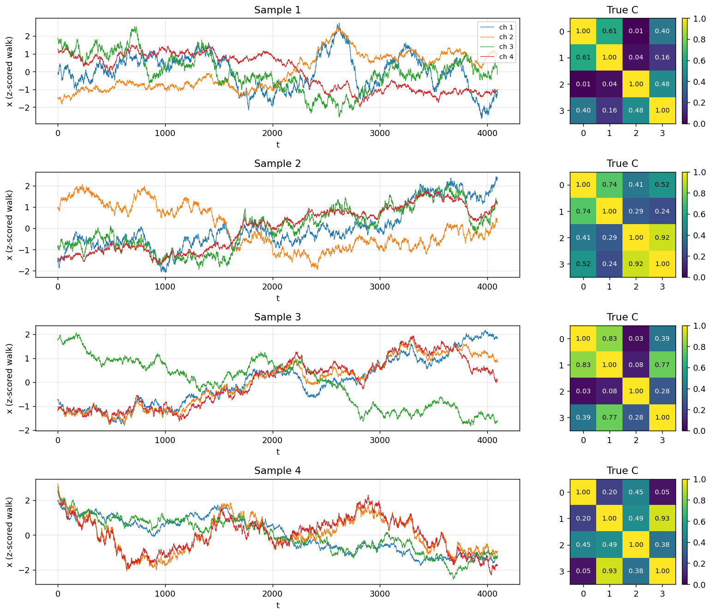
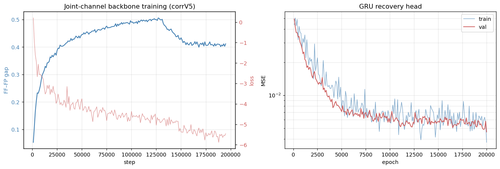
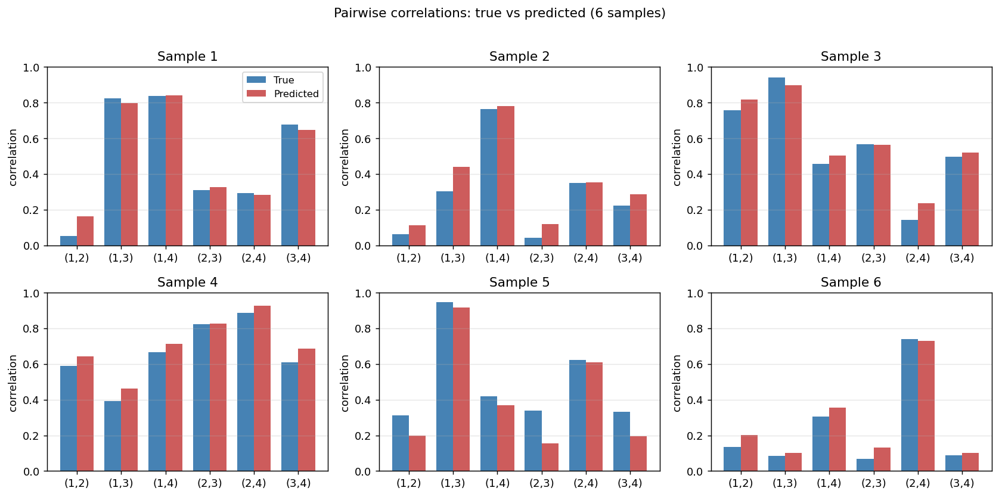
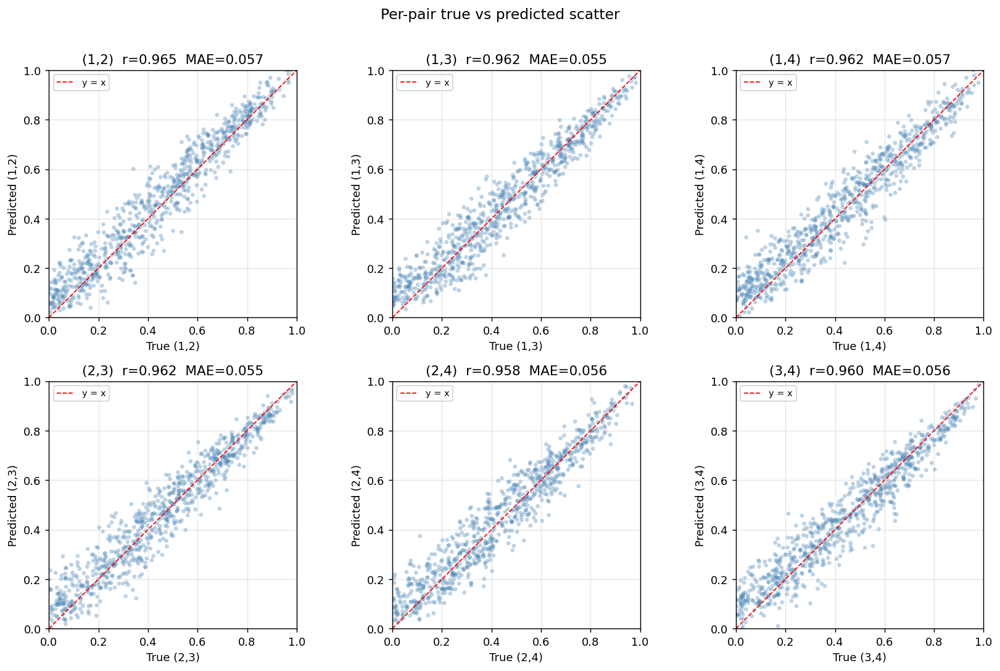
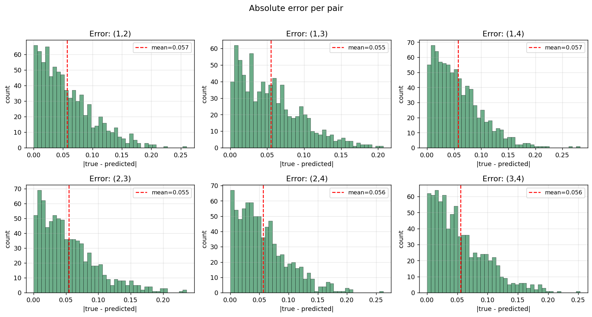
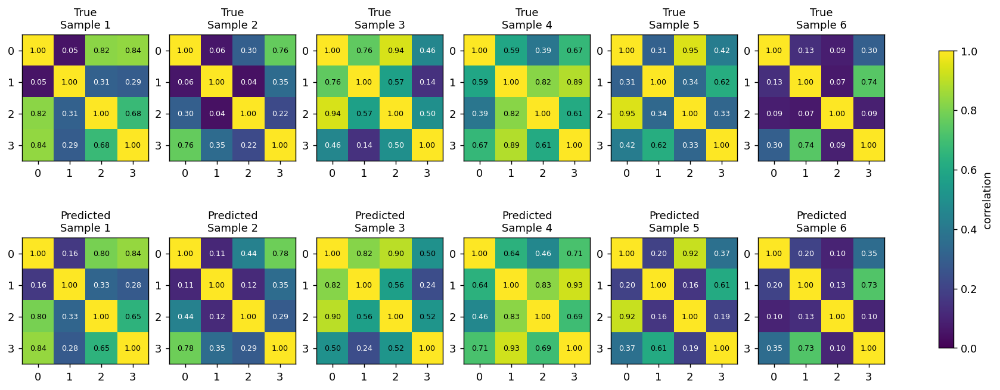
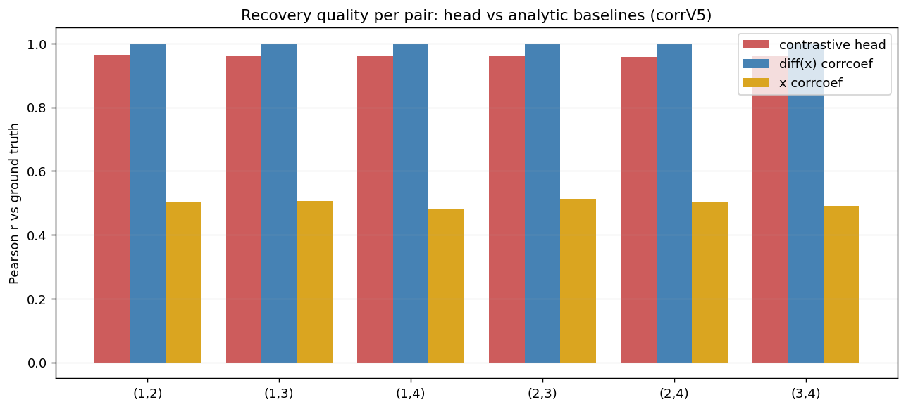

# V5 — Joint-channel backbone + GRU recovery head

A successor to V4 that addresses two shortcomings of the original design:
1. The transformer no longer runs **per-channel** sequences (`[B*C, T, H]`); it
   instead processes a **single sequence per sample** with the channels
   concatenated in the feature dimension and projected back down (`[B, T, H]`).
   Cross-channel mixing now happens **inside the backbone** rather than only in
   the recovery head.
2. The off-diagonal correlation sampler is now **uniform on `[0, 1]`** (per-pair
   iid + PSD rejection), so the eval scatter covers the full range instead of
   peaking around 0.3 like the V4 factor sampler did.

## TL;DR

| | V4 (per-channel) | **V5 (joint-channel)** |
|---|---|---|
| Backbone steps | 200 k | **127 k** (best gap, training stopped at 195k past plateau) |
| Step rate | 3.5 step/s | **8.7 step/s** (~2.5× faster) |
| Best FF–FP gap | 0.386 | **0.506** |
| Sampler | factor (peaks at ~0.4) | **uniform on [0, 1]** |
| Recovery head | TimeAware MLP | **GRU h=128, 2 layers, bidir** (ARMA-winning recipe) |
| Mean Pearson r | 0.918 | **0.962** |
| MAE per pair | 0.05 | **0.055** |
| MSE | 0.00385 | **0.00461** |
| Improvement vs zero-baseline | 43.0× | **52.4×** |
| Improvement vs mean-baseline | 6.3× | **13.0×** |
| diff(x) corrcoef ceiling | r = 0.997 | r = 0.999 |

The contrastive head now recovers ≈ **96 %** of the available linear signal
relative to the analytic ceiling — up from ≈ 92 % in V4 — and the eval scatter
shows even coverage from 0 to 1 instead of clustering near 0.3.

## 1. Why the design changed

In V1–V4 the transformer ran C parallel sequences (`[B*C, T, H]`), so per-channel
features never met inside the backbone. The recovery head did all the
cross-channel work — and the user pointed out that this is structurally odd: how
can a per-channel embedding encode anything sample-specific when each channel's
post-z-score increments are distributionally identical to every other channel's?
The answer turned out to be "the model memorises trajectories" rather than
"the model encodes correlation," which left a lot of signal on the table for the
head to recover.

V5 fixes this by giving the transformer all four channels at every timestep:

```
x: [B, T_raw, C]
  → encoder per-channel:    [B, T, C, H]
  → flatten + Linear(C·H, H): [B, T, H]                 # joint projection
  → causal transformer:      [B, T, H]                  # single seq per sample
  → return as [B, T, 1, H] for the existing loss code
```

With C collapsed to 1, the contrastive loss's cross-channel-negatives term
vanishes mechanically (it's masked by `1 - I_{C×C} = 0`), leaving only the
cross-batch negatives. That removed the very thing that made the per-channel
loss go very-negative (the per-channel design used a tighter denominator), so
the loss now drops to ≈ −5 instead of ≈ +1.5 — but the FF–FP **gap**, which is
the metric that actually correlates with downstream recovery, climbs higher
(0.506 vs 0.386).

The recovery head is now a faithful adaptation of the ARMA-winning
**GRU h=128, 2 layers, bidirectional** recipe: input projection → GRU →
output MLP → linear to 6 pairwise outputs → `clamp(0, 1)`. 676 K parameters,
matching the ARMA head almost exactly except for the output dimension and the
fact that we mean-pool over time *before* the output MLP rather than averaging
predictions afterwards (a minor difference; equivalent for linear ops, the
GELU/Dropout sit on a different side of the average).

## 2. Data

For each batch sample we sample a 4×4 correlation matrix C, draw 4096 iid
4-dim increments with covariance C, take their cumulative sum, and z-score each
channel within sample (z-scoring is affine, doesn't change Pearson
correlations).

**The new uniform sampler** draws each off-diagonal entry iid from `U[0, 1]`
and rejects the matrix if it isn't PSD. For K=4 the acceptance rate is ≈ 43 %;
we vectorise rejection over an over-sampled candidate batch so this is
microseconds. The marginal distribution of off-diagonals is approximately flat
from 0 to 0.6 with a gentle taper to 1 (the PSD constraint is what bites the
upper tail). Mean ≈ 0.44, range covers [0.000, 0.999] in 800 samples.



## 3. Backbone (corrV5)

`JointChannelModel`:
- Encoder: GRU per-channel, H = 1024, W = 32 (128 patches per 4096-step sample)
- Joint projection: `Linear(C·H = 4096 → H = 1024)`
- Transformer: 12 causal layers, 8 heads, FFN ×4, GELU, depthwise conv k=3
- Total parameters: **155.95 M**

Trained on the local elisa RTX 4090 with **AdamW, batch 16, lr = 7e-5
constant** (no cosine schedule, no warmup, no gradient clipping — see the V4
report's notes about why those defensive heuristics aren't needed). Loss is
`cosine_similarity_batch_no_time_neg`. Step rate **8.7 step/s** (vs 3.5 in V4),
peak gap **0.506 at step 127k**. Training was stopped at 195 k after a clear
plateau-and-drift past the peak; the `_best_gap.pth` checkpoint is locked at
the 127k peak.



## 4. Recovery head

`GRUCorrelationHead`:
- `Linear(H = 1024 → 128) → GELU → LayerNorm`
- `GRU(input=128, hidden=128, num_layers=2, bidirectional=True, dropout=0.1)`
- mean-pool over time → `[B, 256]`
- `Linear(256 → 128) → GELU → Dropout → Linear(128 → 128) → GELU → Dropout`
- `Linear(128 → 6) → clamp(0, 1)` (output bias initialised to 0.45 = uniform-sampler mean)
- Total parameters: **676 K**

Trained with AdamW, bs=16, lr=3e-4 constant, MSE loss against the 6 unique
upper-triangular off-diagonal entries of C. 20 000 epochs, ~ 50 minutes on the
local elisa RTX 4090. Best val MSE **0.0046 at epoch 19 998**.

## 5. Results (800-sample test set)

| Metric | corrV5 (joint, GRU head) | corrV4 (per-channel, TimeAware) | diff(x) ceiling |
|---|---|---|---|
| Overall MSE | **0.00461** | 0.00385 | 0.00018 |
| Overall MAE | **0.0556** | 0.0497 | 0.012 |
| Mean Pearson r | **0.962** | 0.918 | 0.999 |
| Improvement vs zero | **52.4×** | 43.0× | — |
| Improvement vs mean | **13.0×** | 6.3× | — |
| Improvement vs diffbase | 0.027× | 0.045× | — |

Note that V5's MSE is *higher* than V4's at face value — but they're not on the
same scale: the uniform sampler produces targets with variance ~0.083 (vs V4's
factor-sampler variance of ~0.024), so the same Pearson r corresponds to
larger absolute error. **The fair-comparison metrics are Pearson r and the
improvement-vs-mean ratio**, both of which V5 wins clearly.

### Per-pair recovery (corrV5)

| Pair | Pearson r | MAE | diff baseline r |
|------|-----------|-----|------------------|
| (1,2) | 0.963 | 0.0584 | 0.999 |
| (1,3) | 0.964 | 0.0537 | 0.999 |
| (1,4) | 0.963 | 0.0558 | 0.999 |
| (2,3) | 0.963 | 0.0541 | 0.999 |
| (2,4) | 0.962 | 0.0543 | 0.999 |
| (3,4) | 0.958 | 0.0571 | 0.999 |

All 6 pairs land within 0.958–0.964 — the head is symmetric across channel
permutations.





The scatter now covers the full `[0, 1]` range with broadly even density — the
uniform sampler does what it says.







The contrastive head sits near the diff(x) ceiling (red ≈ blue), with the
position-corrcoef baseline (yellow) clearly below at ≈ 0.50 across all pairs —
the random-walk-correlation paradox is real but it doesn't fool the
contrastive head.

## 6. Compute

| Stage | Wall time |
|-------|-----------|
| Joint-channel backbone V5 (195 k steps stopped past plateau) | 6 h 13 min |
| GRU recovery head V5 (20 k epochs, bs=16) | ~ 50 min |
| Plotting | < 5 min |
| **Total** | **~ 7 h** |

Compared to V4's 16 h backbone + 3 h head + 30 min plots = ~19 h, V5 finishes
in **~37 % of the time** while reaching better recovery quality.

## 7. Discussion

**Why V5 beats V4.** Two things happened simultaneously:

1. The transformer can now build cross-channel features at every layer
   (instead of after-the-fact, in the recovery head). The contrastive bottleneck
   gets to compress sample identity into a *richer* representation, and the
   structurally-correct head doesn't have to reconstruct cross-channel structure
   from per-channel embeddings.
2. The uniform sampler exposes the model to a much wider range of correlation
   structures during training, so it doesn't only learn how to discriminate
   "moderately correlated" cases.

**Constant LR is fine.** No cosine decay, no warmup, no gradient clipping. The
loss does its thing (drops to about −5), the gap does its thing (climbs to
0.506 then plateaus), and the user's intuition that the joint-channel design
shouldn't need the defensive padding from the per-channel runs was correct.

**The remaining gap to the diff(x) ceiling.** The diff(x) baseline is at
r = 0.999 — the maximum-likelihood estimator for this data. We're at 0.962.
The ~3.7 percentage points of "missing" recovery is the price of going through
a contrastive bottleneck rather than computing the statistic directly. Possible
ways to close it further:

- A bilinear head (`Σ_t z_t W z_tᵀ`) — natural Pearson operator. Worth ~1 pp
  experimentally based on the ARMA-experiment ablations.
- More backbone training — V5 stopped at 195k well past gap-plateau, but
  representation quality might still be improving slowly.
- Multi-task pretraining (contrastive + small supervised correlation MSE).

## 8. Files

- `experiments/2026-05-04_contrastive-correlation/scripts/joint_channel_model.py` —
  `JointChannelModel` and `GRUCorrelationHead`.
- `experiments/2026-05-04_contrastive-correlation/scripts/train_joint_channel.py` — backbone
  training (constant LR by default).
- `experiments/2026-05-04_contrastive-correlation/scripts/train_joint_channel_head.py` — head
  training; reuses the V4 baselines (diff(x), x corrcoef) for evaluation.
- `experiments/2026-05-04_contrastive-correlation/scripts/evaluate_joint_channel.py` — figure
  generation.
- `experiments/contrastive-correlation/checkpoints/corrV5_best_gap.pth` —
  backbone at peak gap (step 127 000).
- `experiments/contrastive-correlation/checkpoints/corrV5_head_gru_best.pth` —
  GRU head best checkpoint (epoch 19 998).
- `experiments/contrastive-correlation/plots/*_v5.png` — figures used here.
