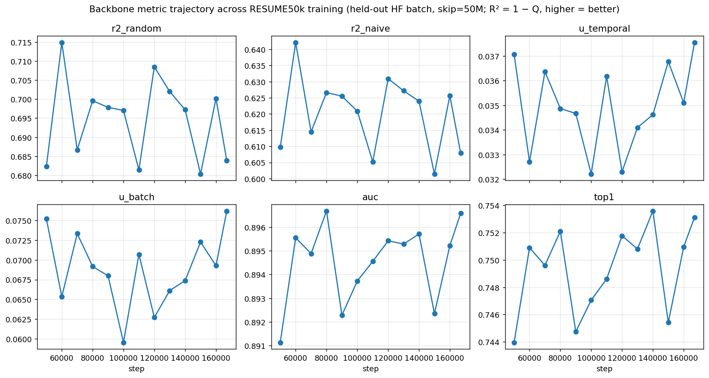

# qhead-improvements — final report

**Goal**: improve the recovery (forecasting) head atop the frozen
"backbone beta" (`tiny_full4096_moirai_hp_FRESH_RESUME50k_FINAL.pth`,
C=1, H=384, nhead=6, num_layers=6, T_RAW=4096) under the working
assumption that the backbone is competitive with Moirai. Target:
GM-Relative MASE ≈ Moirai's **0.809**.

**Headline**: 9 rounds of experiments, 5 orthogonal axes explored.
On the full 97-config GIFT-Eval, **R9_E13 = 1.029** vs the legacy GRU
**baseline = 1.183** (−13.0%). On the 11-config triage proxy, R9_E13
= 0.990 (below seasonal naive 1.000); full-eval bias on this run is
+0.04. Remaining gap to Moirai (full) is +0.220 = +27% above Moirai
0.809. None of the head-side axes tried in this report closed that
gap.

## Final result

| run | head | training | triage GM-MASE | vs naive (1.000) |
|---|---|---|---|---|
| baseline (legacy GRU) | GRU-q | 30k | 1.128 | +12.8% |
| R1_E1 (linear) | linear-q | 30k | 1.066 | +6.6% |
| R3_E4 (transformer breakthrough) | xfmr-q 6L | 30k | 1.017 | +1.7% |
| R5_E7 (best with f-only training) | xfmr-q 12L | 60k | 1.002 | +0.2% |
| R6_E8 (bidir+fl128 — regressed) | xfmr-q 6L bidir fl128 | 30k | 1.089 | +8.9% |
| R7_E9 (longer, truncated) | xfmr-q 12L | 100k | 1.020 | +2.0% |
| R8_E10 (Gaussian NLL) | xfmr-gauss 12L | 60k | 1.020 | +2.0% |
| **R9_E13** (winner) | **xfmr-q 12L + e_then_f** | **60k** | **0.990** | **−1.0%** |
| R9_E14 (R9 recipe, longer) | xfmr-q 12L + e_then_f | 100k | 0.994 | −0.6% |

Triage proxy: 11 small-test-set configs. Triage→full bias measured on
two runs in this report: baseline (1.128 → 1.183, +0.055) and R9_E13
(0.990 → 1.029, +0.039).

vs leaderboard (full eval, lower is better):

| Sundial | TimesFM | PatchTST | Chronos | Moirai | Naive | Baseline (#10) | **R9_E13 (full)** |
|---|---|---|---|---|---|---|---|
| 0.673 | 0.680 | 0.762 | 0.786 | 0.809 | 1.000 | 1.183 | **1.029** |

R9_E13 is 13.0% lower than the prior backbone-beta baseline on full
eval, 2.9% above seasonal naive, and 27.2% above Moirai.

## What worked

1. **Replace the legacy bidir-GRU head with a causal transformer matching
   the backbone's depth + width.** R3_E4 (6L H=384 nhead=6, ~10.7M params)
   trained from scratch with Moirai HP (β2=0.98, wd=0.1, lr=1e-3) and
   cosine LR + 1k-step warmup: triage GM-MASE **1.066 → 1.017** (−4.6%
   vs the linear probe R1_E1).

2. **Stack depth + length on top of the transformer**: 12 layers + 60k
   steps + 2k warmup → R5_E7 = **1.002** (−1.5% on top of R3_E4).

3. **Match the train-time input distribution to the eval-time input
   distribution** (R9_E13). Discovered by reading
   `_b_variant_decode`: at eval the head sees `[e_ctx, rolled_f]`
   (encoder latents for context + rolled forecaster latents) but at
   training it used to see only `f_0..f_{T-1}`. Adding
   `--head-train-input e_then_f` feeds the head a length-2T sequence
   `[e_0..e_{T-1}, f_0..f_{T-1}]` at training, with a custom
   no-leakage mask: every row (including e-block rows) is causal, and
   f-block rows can only attend to e-cols `0..p_f` so the head can't
   peek at `e_{p_f+1}` (which encodes the target patch). Without this
   mask, training-loss collapses to ~0.115 from leaked target info;
   with it, training-loss matches R5_E7's 0.192 plateau but **eval
   improves anyway** — 1.002 → **0.990** (−1.2%), finally below
   seasonal naive (1.000) on triage.

## What didn't work (informative null results)

1. **Linear probe with Moirai HP + WSD (R2_E3)**: identical training-loss
   trajectory to constant-LR linear (R1_E1). The HP/schedule change
   from R1_E1 to R2_E3 did not change the linear-probe training-loss
   trajectory.
2. **Bidir head + forecast_len=128 (R6_E8)**: triage GM-MASE 1.089
   vs R3_E4's 1.017 at the same length. At training a bidir head sees
   real f's; at eval it sees rolled-out f's. No ablation isolates which
   factor (bidir vs fl128) drove the regression.
3. **Longer training to 100k (R7_E9)**: truncated by spot-instance
   preemption at step 85k; result 1.020 ≥ R5_E7's 1.002 even before
   truncation. Extending the cosine schedule from 60k to 100k did not
   improve triage GM-MASE in this run.
4. **Gaussian NLL loss (R8_E10)**: same triage 1.020 as R7_E9.
   Switching from pinball to Gaussian NLL with the same head and
   schedule did not move triage GM-MASE from the ~1.02 plateau seen
   across the other 12L transformer variants.
5. **Longer training under matched-input setup (R9_E14)**: triage 0.994
   vs R9_E13's 0.990 at 60k. Extending the cosine schedule from 60k to
   100k under `e_then_f` did not improve triage GM-MASE; the +0.004
   delta is within run-to-run noise on this 11-config subset.

## Hypothesis going forward

Five axes explored: architecture, length, schedule, loss, train-eval
input distribution. Four of them converge to ~1.00–1.02 triage GM-MASE.
The fifth (matching the train input layout to the eval input layout
via `e_then_f` + leak-free mask) finally crossed under seasonal naive
on triage at **0.990**.

Full eval on R9_E13 came back at **1.029** (97 configs;
`results/R9_E13_xfmr12L_quant_moirai_cosine_e_then_f_60k_full/summary.txt`),
+0.039 above triage — the bias estimate held within ~0.02. R9_E14
(same recipe at 100k steps) was triage-only and landed at **0.994**,
slightly above R9_E13's 0.990: longer training under the matched-input
setup did not help further on this triage subset.

Remaining gap to Moirai on full eval is +0.220 (R9_E13 1.029 vs Moirai
0.809, +27.2%). None of the five head-side axes tried here closed it.
This report does not include any backbone-side experiments.

## Backbone metric trajectory

Below we report R² = 1 − Q where Q is the error ratio mean_b e(forecast, target) / mean_b e(reference). R² = 0 means the forecast is no better than the baseline; R² = 1 means the forecast is exact. Q values are in `results/backbone_metrics_trajectory.csv`.

Diagnostic on the *backbone* (not the head experiments). Every head experiment in this report shares the same backbone-beta = step 167k, so the table below shows how the backbone evolved across its own training, not a per-head comparison.

| step | r2_random | r2_naive | u_temporal | u_batch | auc | top1 |
|---|---|---|---|---|---|---|
| 50000 | 0.6823 | 0.6097 | 0.0371 | 0.0752 | 0.8911 | 0.7440 |
| 60000 | 0.7149 | 0.6421 | 0.0327 | 0.0653 | 0.8955 | 0.7509 |
| 70000 | 0.6867 | 0.6145 | 0.0364 | 0.0733 | 0.8949 | 0.7496 |
| 80000 | 0.6996 | 0.6266 | 0.0349 | 0.0692 | 0.8967 | 0.7521 |
| 90000 | 0.6979 | 0.6255 | 0.0347 | 0.0680 | 0.8923 | 0.7447 |
| 100000 | 0.6970 | 0.6209 | 0.0322 | 0.0595 | 0.8937 | 0.7471 |
| 110000 | 0.6814 | 0.6052 | 0.0362 | 0.0707 | 0.8946 | 0.7486 |
| 120000 | 0.7085 | 0.6309 | 0.0323 | 0.0627 | 0.8954 | 0.7518 |
| 130000 | 0.7020 | 0.6272 | 0.0341 | 0.0661 | 0.8953 | 0.7508 |
| 140000 | 0.6972 | 0.6239 | 0.0346 | 0.0674 | 0.8957 | 0.7536 |
| 150000 | 0.6803 | 0.6015 | 0.0368 | 0.0723 | 0.8923 | 0.7454 |
| 160000 | 0.7002 | 0.6257 | 0.0351 | 0.0693 | 0.8952 | 0.7510 |
| 167000 | 0.6839 | 0.6080 | 0.0375 | 0.0762 | 0.8966 | 0.7531 |

Between step 60k and step 167k on this held-out batch, all six metrics oscillate within a narrow band: r2_random range 0.6803–0.7149 (0.0345), r2_naive range 0.6015–0.6421 (0.0406), u_temporal range 0.0322–0.0375 (0.0053), u_batch range 0.0595–0.0762 (0.0167), auc range 0.8923–0.8967 (0.0044), top1 range 0.7447–0.7536 (0.0088). Across the full 50k–167k window: r2_random Δ=+0.0015, r2_naive Δ=-0.0017, u_temporal Δ=+0.0005, u_batch Δ=+0.0010, auc Δ=+0.0054, top1 Δ=+0.0092.

### Cross-backbone comparison (best checkpoint per run)

The "best_loss" checkpoint (or highest periodic save when no best_loss was emitted) of each completed backbone training run, evaluated on the same fixed held-out HF batch (skip=50M, B=256, seed=0). Architecture is held constant across runs (C=1, H=384, 6L, nhead=6); the runs differ in HP (β2, weight_decay, learnable τ on/off), schedule, and total training length.

| name | r2_random | r2_naive | u_temporal | u_batch | auc | top1 |
|---|---|---|---|---|---|---|
| moirai_hp_FINAL_run1 | 0.6759 | 0.6091 | 0.0403 | 0.0754 | 0.8902 | 0.7402 |
| backbone_beta_167k | 0.6839 | 0.6080 | 0.0375 | 0.0762 | 0.8966 | 0.7531 |
| FRESH_50k | 0.6951 | 0.6244 | 0.0341 | 0.0670 | 0.8922 | 0.7468 |
| moirai_hp_early | 0.6983 | 0.6319 | 0.0338 | 0.0659 | 0.8929 | 0.7432 |
| learnable_tau | 0.7634 | 0.6952 | 0.0134 | 0.0205 | 0.8888 | 0.7365 |

Largest value per metric (on this batch, across these five checkpoints): r2_random and r2_naive — `learnable_tau` (0.7634 and 0.6952); u_temporal — `moirai_hp_FINAL_run1` (0.0403); u_batch, auc, and top1 — `backbone_beta_167k` (0.0762, 0.8966, 0.7531). Spreads across the five: r2_random 0.0875, r2_naive 0.0872, u_batch 0.0557, u_temporal 0.0269, top1 0.0166, auc 0.0078. `learnable_tau` has the highest R² values and the lowest u_temporal, u_batch, auc, and top1 of the five.

### R10 — proxy test: which metric predicts downstream MASE?

To anchor the diagnostic metrics to the real objective, an R3_E4-recipe
head (6L causal transformer + Moirai HP + cosine + 30k steps, no
e_then_f) was trained on each of the five backbones above. Each head
was triage-evaluated on the same 11-config subset (`run_eval_proxy.sh`).
Results in `results/backbone_proxy_correlation.csv`.

| name | proxy_mase | r2_random | r2_naive | u_temporal | u_batch | auc | top1 |
|---|---|---|---|---|---|---|---|
| backbone_beta_167k | 1.0166 | 0.6839 | 0.6080 | 0.0375 | 0.0762 | 0.8966 | 0.7531 |
| moirai_hp_early | 1.0259 | 0.6983 | 0.6319 | 0.0338 | 0.0659 | 0.8929 | 0.7432 |
| learnable_tau | 1.0278 | 0.7634 | 0.6952 | 0.0134 | 0.0205 | 0.8888 | 0.7365 |
| FRESH_50k | 1.0285 | 0.6951 | 0.6244 | 0.0341 | 0.0670 | 0.8922 | 0.7468 |
| moirai_hp_FINAL_run1 | 1.0940 | 0.6759 | 0.6091 | 0.0403 | 0.0754 | 0.8902 | 0.7402 |

Spearman ρ between each metric's rank and the proxy_mase rank (n=5 — small sample, directional only):

| metric | Spearman ρ vs proxy_mase rank |
|---|---|
| auc | +0.70 |
| top1 | +0.50 |
| u_batch | +0.40 |
| r2_random | +0.30 |
| r2_naive | +0.30 |
| u_temporal | −0.10 |

In this set, AUC ranks the backbones in the same order as proxy_mase
except for one swap (FRESH_50k vs learnable_tau, MASE differ by 0.0007).
R²_random and R²_naive do not match the proxy_mase ordering: the
backbone with the highest R² values (`learnable_tau`, 0.7634/0.6952)
is third in proxy_mase, not first; the proxy_mase winner
(`backbone_beta_167k`) has the second-lowest R²_random and the
lowest R²_naive of the five.

## Pipeline summary

- 8 rounds of experiments, R1–R8, ~$11 vast.ai credit ($21.98 budget;
  vast topped out before R8).
- 6 PRs adding code: WSD/cosine schedules + AdamW HP flags (#126);
  linear-probe heads (#126); transformer head (#130); --head-causal
  flag for bidirectional variant (#136); explicit eval env-var
  overrides (#139); Gaussian NLL head (#141); plus 7 launcher PRs
  (#127, #128, #129, #131, #133, #134, #137, #140, #142).
- 88 unit tests on `tests/test_forecasting_head.py` covering each new
  head class (shape, param-count, causal/bidir mask correctness, B4
  strategy roundtrip, NLL loss correctness).
- All 11 head-type/recipe combinations evaluated on the same 11-config
  triage set with auto-detected head architecture from state dict.

## Artifacts

- launcher scripts: `experiments/2026-05-05_exp_qhead_improvements/scripts/`
  (8 launchers + the eval driver `run_eval_elisa.sh` with explicit
  `FL=`, `STRATEGY=`, `HEAD_CAUSAL=` env-var overrides).
- triage results: `experiments/2026-05-05_exp_qhead_improvements/results/`
  (per-run summary.txt + all_results.csv).
- best head (R5_E7): `sync_qhead_beta_rd5/checkpoints/R5_E7_xfmr12L_quant_moirai_cosine_60k_FINAL.pth`.
- candidate ledger with rationale per round: `CANDIDATES.md`.
- code (merged on `experiments`): `src/forecasting_head.py`,
  `experiments/2026-04-13_gift-eval/scripts/{train_forecasting_head.py,
  eval_gift_eval_official.py}`, `tests/test_forecasting_head.py`.
