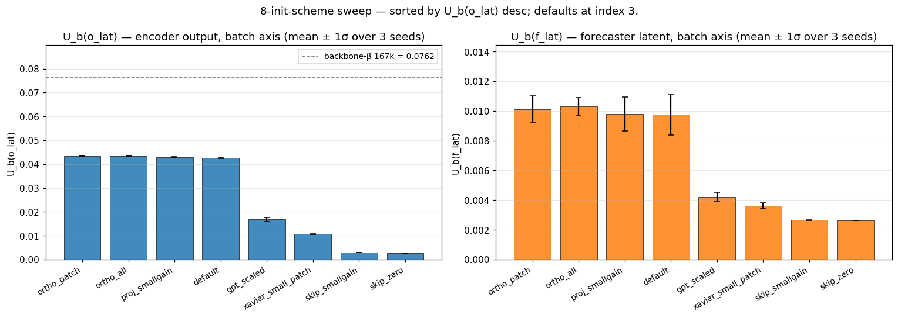
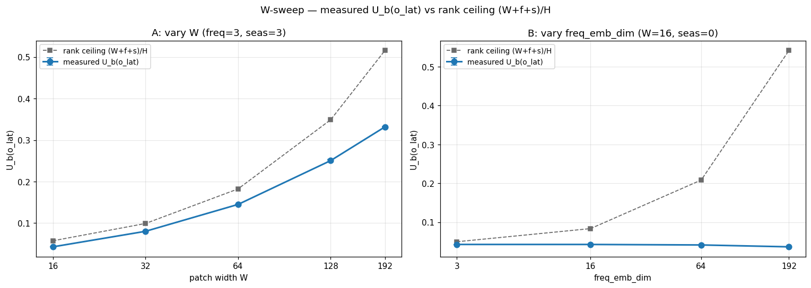
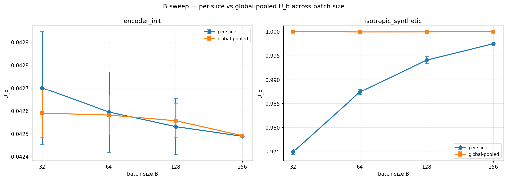
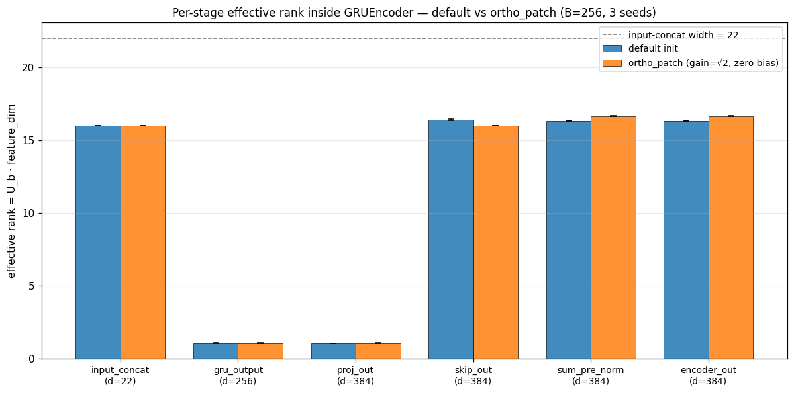
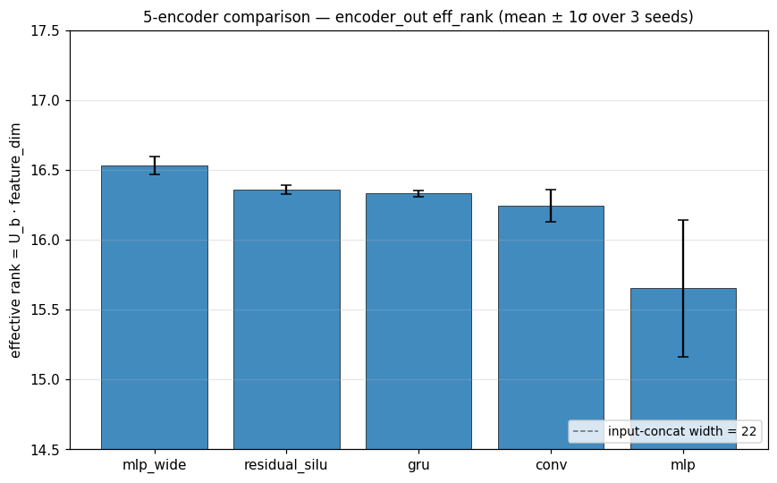
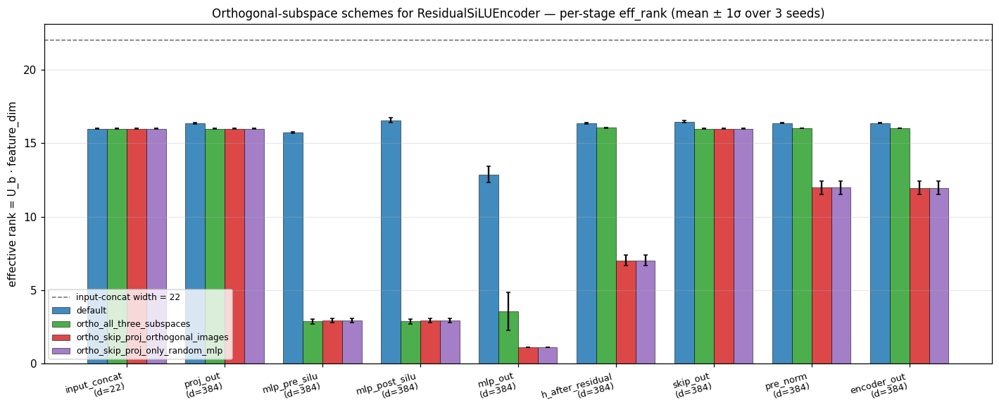

# exp_init_u_sweep — init-scheme sweep for encoder-latent dimension usage

## Goal / question

In training the contrastive-forecasting backbone we observe `U_b ≈ 0.003` on
the encoder latent `o_lat` after just 100 steps — i.e. the encoder's outputs
are nearly collinear across the batch axis right out of the gate.
Backbone-beta eventually converges to `U_b = 0.0762` at step 167k, but the
journey starts from a nearly-degenerate point. This experiment asks: **can
parameter init alone (or encoder choice, patch width, or batch size for
measurement) lift `U_b(o_lat)` at step 0, so the backbone starts from a
less-collapsed point?**

The answer up front: **no.** At default init, the per-token input concat
width (`d = W + freq_emb + seas_emb = 22` for the project default) caps init
`U_b(o_lat)` at ≈ 0.043 (effective rank ≈ 16 out of H=384). The only knob
that lifts it proportionally is widening the patch (W). Init-scheme tweaks
move things by a few percent at best; encoder choice (mlp / mlp_wide /
residual_silu / gru / conv) only moves `U_b(o_lat)` within ±0.002 — not
actionable. The step-100 collapse is driven by optimisation, not init.

---

## Protocol

**Model.** `ConfigurableModel(C=1, H=384, W=16, encoder_type="gru",
num_layers=6, nhead=6, ffn_mult=4.0, activation="gelu", depthwise_conv=3,
dropout=0.0, freq_emb_dim=3, seasonality_emb_dim=3, rev_norm_kind="ewma",
rev_norm_span=128)`. The default GRU patch head is GRU(2 layers,
bidirectional, hidden=128) → Linear(256→384), with a parallel Linear(22→384)
skip and a final LayerNorm.

**Inputs.** Synthetic gaussian, `B ∈ {32, 64, 128, 256}`, `T_raw = 4096`
(or 4032 when 4096 % W ≠ 0), `C = 1`, scaled by 0.5. `freq_ids` and
`seas_ids` ~ `U{0..3}`. CPU, eval mode, no training — single forward pass
per (scheme, seed) cell. 3 model seeds (42, 43, 44) per cell unless
otherwise noted.

**Measured.** `U = dim_usage(z, axis=k)` from `src.metrics.dim_usage` on
two latents:

- `o_lat` — encoder output (post-patch-head, pre-transformer);
- `f_lat` — forecaster latent (post-transformer).

Two axes: `U_t` over the time axis (axis=1), `U_b` over the batch axis
(axis=0). Effective rank = `U · feature_dim`. The metric is per-slice (clamp
each slice's U to [0, 1] then mean across slices); design-choice variants
(global-pooled, inverse-of-mean) are audited in §4.

**Sweep ranges.**

- 8 init schemes (default PyTorch + 7 alternatives that touch patch-head,
  transformer linears, or both): `default`, `ortho_patch`, `ortho_all`,
  `proj_smallgain`, `xavier_small_patch`, `gpt_scaled`, `skip_smallgain`,
  `skip_zero`.
- Patch widths `W ∈ {16, 32, 64, 128, 192}`; freq-embedding dims
  `∈ {3, 16, 64, 192}`; GRU-zero variant.
- Batch sizes `B ∈ {32, 64, 128, 256}`.
- 5 encoder types: `mlp`, `mlp_wide`, `residual_silu`, `gru`, `conv`.
- 4 orthogonal-subspace schemes for `ResidualSiLUEncoder`: `default`,
  `ortho_skip_proj_orthogonal_images`, `ortho_skip_proj_only_random_mlp`,
  `ortho_all_three_subspaces`. For each scheme, an orthogonal basis Q is
  sampled per-seed via `torch.linalg.qr(torch.randn(384, k))` (generator
  seed = `model_seed + 99_000`); proj/skip column slices are scaled by
  `sqrt(1/22)`.

---

## What we did

The experiment is a chain of seven sub-sweeps. Each isolates one knob
(init scheme, W, B, metric variant, internal stage, encoder type, init
*structure*) and reports `U_b(o_lat)` mean ± std across 3 model seeds.

### 1. 8-init scheme sweep (CSV: `results/init_u_sweep.csv`, `..._raw.csv`)

Left: `U_b(o_lat)` (encoder output, batch axis). Right: `U_b(f_lat)`
(forecaster latent, batch axis). Bars sorted left-to-right by
`U_b(o_lat)` desc; mean ± 1σ over 3 seeds. Dashed line on the left
panel is the backbone-beta 167k learnable-τ post-training reference
`U_b = 0.0762` (held-out, single batch).

Sorted by `u_b_o_mean` desc:

| scheme | u_b_o (o_lat batch) | u_t_o (o_lat time) | u_b_f (f_lat batch) | u_t_f (f_lat time) |
| :--- | ---: | ---: | ---: | ---: |
| **ortho_patch** | **0.0435 ± 0.0002** | **0.0434 ± 0.0001** | **0.0101 ± 0.0009** | 0.0032 ± 0.0000 |
| ortho_all | 0.0435 ± 0.0002 | 0.0434 ± 0.0001 | 0.0103 ± 0.0006 | 0.0031 ± 0.0000 |
| proj_smallgain | 0.0428 ± 0.0003 | 0.0428 ± 0.0001 | 0.0098 ± 0.0011 | 0.0032 ± 0.0000 |
| default (PyTorch) | 0.0427 ± 0.0002 | 0.0426 ± 0.0001 | 0.0097 ± 0.0014 | 0.0032 ± 0.0000 |
| gpt_scaled | 0.0168 ± 0.0008 | 0.0168 ± 0.0008 | 0.0042 ± 0.0003 | 0.0030 ± 0.0000 |
| xavier_small_patch | 0.0107 ± 0.0001 | 0.0107 ± 0.0001 | 0.0036 ± 0.0002 | 0.0030 ± 0.0000 |
| skip_smallgain | 0.0029 ± 0.0000 | 0.0029 ± 0.0000 | 0.0027 ± 0.0000 | 0.0029 ± 0.0000 |
| skip_zero | 0.0027 ± 0.0000 | 0.0027 ± 0.0000 | 0.0026 ± 0.0000 | 0.0030 ± 0.0000 |

`ortho_patch` (orthogonal init on `proj` and `skip` of the GRU patch head,
gain=√2, zero biases) tops the table at `U_b(o_lat) = 0.0435`, edging
default by ~2 % relative (0.0435 vs 0.0427) and tying `ortho_all` within
seed noise — so the patch head dominates and orthogonalising the
transformer linears / MHA in/out projections adds nothing on top. The
`skip_*` schemes drop init `U_b` directly to ~0.003, reproducing the
post-100-step collapse just by killing the skip path; this confirms the
skip path is what gives `o_lat` whatever batch-axis spread it has at init.
Smaller weights elsewhere (`xavier_small_patch`, `gpt_scaled`) also
degrade init U.

### 2. W-sweep — patch width / per-token input dim (CSV: `results/init_u_w_sweep.csv`)

Hypothesis: U at init scales as `(W + freq_emb_dim + seas_emb_dim) / H`,
with `H = 384`.

Left (sub-experiment A): vary W with freq=3, seas=3. Right
(sub-experiment B): vary freq_emb_dim with W=16, seas=0. Solid blue
line is measured `U_b(o_lat)` mean ± 1σ; dashed gray line is the
predicted `(W+f+s)/H` rank ceiling.

| sub-experiment | W | freq | seas | u_b_o (mean ± std) | u_t_o (mean ± std) | predicted (W+f+s)/H |
| :--- | ---: | ---: | ---: | ---: | ---: | ---: |
| A_vary_W | 16 | 3 | 3 | 0.0427 ± 0.0002 | 0.0426 ± 0.0001 | 0.0573 |
| A_vary_W | 32 | 3 | 3 | 0.0801 ± 0.0004 | 0.0798 ± 0.0005 | 0.0990 |
| A_vary_W | 64 | 3 | 3 | 0.1449 ± 0.0005 | 0.1452 ± 0.0006 | 0.1823 |
| A_vary_W | 128 | 3 | 3 | 0.2506 ± 0.0031 | 0.2490 ± 0.0019 | 0.3490 |
| A_vary_W | 192 | 3 | 3 | 0.3316 ± 0.0004 | 0.3336 ± 0.0069 | 0.5156 |
| B_vary_freq_emb | 16 | 3 | 0 | 0.0426 ± 0.0003 | 0.0425 ± 0.0001 | 0.0495 |
| B_vary_freq_emb | 16 | 16 | 0 | 0.0425 ± 0.0002 | 0.0424 ± 0.0003 | 0.0833 |
| B_vary_freq_emb | 16 | 64 | 0 | 0.0412 ± 0.0004 | 0.0410 ± 0.0002 | 0.2083 |
| B_vary_freq_emb | 16 | 192 | 0 | 0.0364 ± 0.0003 | 0.0358 ± 0.0002 | 0.5417 |
| C_gru_zero | 16 | 3 | 3 | 0.0428 ± 0.0003 | 0.0428 ± 0.0001 | 0.0573 |

Sub-experiment A confirms `U_b(o_lat)` scales monotonically with W:
0.0427 (W=16) → 0.3316 (W=192). Measured `U_b` sits below the
`(W+f+s)/H` ceiling at every W, but the order of magnitude tracks. Sub-experiment
B contradicts the rank-ceiling story for freq embeddings: as
`freq_emb_dim` grows from 3 to 192, observed `U_b` is flat or *decreasing*
(0.0426 → 0.0364), where the ceiling predicts a rise from 0.050 to 0.542 —
concatenated freq embeddings did not contribute usable rank to `o_lat`.
Sub-experiment C zeros the GRU branch's hidden→hidden weights and `U_b(o_lat)`
is indistinguishable from the matched A row (0.0428 vs 0.0427); the GRU
branch contributes effectively no rank at default init — the `skip` linear
path is the dominant rank source.

### 3. B-sweep — batch size for measurement (CSV: `results/init_u_b_sweep.csv`)

Compares per-slice (axis=0) vs global-pooled (over B·T·C samples), with an
isotropic synthetic control. B=256 has 1 seed for `encoder_init` (slowest
cell, budgeted).

Left: encoder_init (rank-collapsed signal). Right:
isotropic_synthetic (high-rank control). Per-slice (blue) vs
global-pooled (orange). Mean ± 1σ over 3 seeds (encoder_init B=256
has n=1, no error bar).

| setup | B | n | u_b_per_slice | u_b_global_pooled | u_t_per_slice |
| :--- | ---: | ---: | ---: | ---: | ---: |
| encoder_init | 32 | 3 | 0.0427 ± 0.0002 | 0.0426 ± 0.0001 | 0.0426 ± 0.0001 |
| encoder_init | 64 | 3 | 0.0426 ± 0.0001 | 0.0426 ± 0.0001 | 0.0426 ± 0.0001 |
| encoder_init | 128 | 3 | 0.0425 ± 0.0001 | 0.0426 ± 0.0001 | 0.0426 ± 0.0000 |
| encoder_init | 256 | 1 | 0.0425 ± 0.0000 | 0.0425 ± 0.0000 | 0.0425 ± 0.0000 |
| isotropic_synthetic | 32 | 3 | 0.9749 ± 0.0005 | 1.0000 ± 0.0000 | 0.9963 ± 0.0004 |
| isotropic_synthetic | 64 | 3 | 0.9874 ± 0.0005 | 0.9999 ± 0.0001 | 0.9966 ± 0.0007 |
| isotropic_synthetic | 128 | 3 | 0.9941 ± 0.0006 | 0.9999 ± 0.0000 | 0.9967 ± 0.0004 |
| isotropic_synthetic | 256 | 3 | 0.9975 ± 0.0001 | 1.0000 ± 0.0000 | 0.9968 ± 0.0005 |

For `encoder_init`, per-cell means of all three U variants sit in
0.0425–0.0427 across every B; per-slice and global-pooled agree within
≤ 0.0001 at every B, including B=32. The per-cell mean does not change
with B over this range, and the per-slice / global-pooled gap is already
negligible at B=32. For `isotropic_synthetic`, per-slice batch U rises
from 0.9749 (B=32) to 0.9975 (B=256), while global-pooled stays at
0.9999–1.0000 — so the per-slice variant *does* show small-B downward
bias on a high-rank input, but on the rank-collapsed encoder signal that
bias is below seed noise. Conclusion: "need B≈256 to measure U
meaningfully" is consistent with the isotropic control but **not** with
`encoder_init` at default init.

### 4. U-metric audit — per-slice vs global vs inverse-of-mean (CSV: `results/u_audit.csv`)

Compares `dim_usage` (`u_b_per_slice`, current implementation) against two
alternatives — `u_b_global_pooled` (pool first, then U) and
`u_b_inverse_of_mean` (1 / mean of per-slice 1/U) — and against a slow
nested-loop reference (`dim_usage_ref` in `scripts/u_audit.py`) on five
small inputs.

**Reference agreement.** Max abs diff between `src.metrics.dim_usage` and
the nested-loop reference: **5.96e-08**. Collinear input returns `1/d =
0.125`, orthonormal returns 1.0 — both match the docstring.

| setup | W | u_b ps | u_b gp | u_b iom | u_t ps | u_t gp | u_t iom |
| :--- | ---: | ---: | ---: | ---: | ---: | ---: | ---: |
| isotropic_synthetic | – | 0.9775 | 1.0000 | 1.0000 | 0.9968 | 1.0000 | 0.9997 |
| encoder_init | 16 | 0.0427 | 0.0426 | 0.0425 | 0.0426 | 0.0426 | 0.0426 |
| encoder_init | 64 | 0.1449 | 0.1447 | 0.1443 | 0.1452 | 0.1447 | 0.1449 |
| encoder_init | 192 | 0.3316 | 0.3309 | 0.3302 | 0.3336 | 0.3309 | 0.3311 |

No bug. Per-slice differs from global / iom by 0.022 on isotropic input
at `u_b` (n=32) and by ≤ 0.003 at every encoder-init W tested. The
W-sweep trend (`U_b` grows monotonically with W) holds for all three
variants. The averaging order (per-slice clamp then mean) is a design
choice; it does not change any of this experiment's qualitative
conclusions.

### 5. Per-stage U_b inside GRUEncoder (CSVs: `results/u_per_stage_default.csv`, `..._ortho.csv`)

GRUEncoder forward instrumented to stash every intermediate tensor (input
concat, GRU output, proj_out, skip_out, sum_pre_norm, encoder_out). For
each stage, `U_b = dim_usage(z, axis=0)`; `effective_rank = U_b ·
feature_dim`. B=256, T_raw=4096, 3 seeds.

Per-stage effective rank inside GRUEncoder, default (blue) vs
ortho_patch (orange, gain=√2 zero bias on `proj`/`skip`). Dashed
gray reference is the input-concat width (22). `gru_output` and
`proj_out` collapse to eff_rank ≈ 1 in both schemes; `skip_out` /
`sum_pre_norm` / `encoder_out` carry the input rank (≈ 16) through.

**Default init (mean over 3 seeds):**

| stage | feature_dim | U_b | effective_rank |
| :--- | ---: | ---: | ---: |
| input_concat | 22 | 0.7267 | 15.99 |
| gru_output | 256 | 0.0042 | 1.06 |
| proj_out | 384 | 0.0027 | 1.04 |
| skip_out | 384 | 0.0427 | 16.40 |
| sum_pre_norm | 384 | 0.0425 | 16.32 |
| encoder_out | 384 | 0.0425 | 16.33 |

**Orthogonal init on `proj` and `skip` (gain=√2, zero bias):**

| stage | feature_dim | U_b | effective_rank |
| :--- | ---: | ---: | ---: |
| input_concat | 22 | 0.7267 | 15.99 |
| gru_output | 256 | 0.0042 | 1.06 |
| proj_out | 384 | 0.0028 | 1.06 |
| skip_out | 384 | 0.0416 | 15.99 |
| sum_pre_norm | 384 | 0.0434 | 16.65 |
| encoder_out | 384 | 0.0433 | 16.64 |

The rank drop is at `gru_output`: effective rank goes from 15.99 at
`input_concat` (d=22) to 1.06 at `gru_output` (d=256). `proj_out` (d=384)
sits at 1.04 (default) / 1.06 (ortho) — same order. `skip_out` carries
the rank at 16.40 (default) / 15.99 (ortho). Orthogonal `proj`/`skip`
lifts `encoder_out` eff_rank by +0.31 (16.33 → 16.64) but leaves
`gru_output` at 1.06; a meaningful lift in encoder-output rank requires
init changes that affect `gru_output` itself (skipped here — GRU
non-linearities live in PyTorch's optimised kernel).

### 6. Five patch encoders compared (CSV: `results/init_u_per_encoder.csv`)

`mlp`, `mlp_wide`, `residual_silu`, `gru`, `conv`, all with default
PyTorch init, B=256, T_raw=4096, C=1, RevEWMA span=128, freq=3, seas=3,
H=384. 3 seeds.

`encoder_out` effective rank by encoder type, mean ± 1σ over 3
seeds. Sorted desc. Dashed gray reference is the input-concat width
(22). All five encoders sit in [15.65, 16.53]; `mlp` is the only
encoder noticeably below the rest.

| encoder_type | U_b (mean ± std) | eff_rank (mean ± std) |
| :--- | ---: | ---: |
| mlp_wide | 0.0430 ± 0.0002 | 16.53 ± 0.06 |
| residual_silu | 0.0426 ± 0.0001 | 16.36 ± 0.03 |
| gru | 0.0425 ± 0.0001 | 16.33 ± 0.02 |
| conv | 0.0423 ± 0.0003 | 16.24 ± 0.11 |
| mlp | 0.0408 ± 0.0013 | 15.65 ± 0.49 |

**Per-stage probe — `residual_silu` (3 seeds), CSV: `results/u_per_stage_residual_silu.csv`:**

| stage | feature_dim | U_b (mean ± std) | eff_rank (mean ± std) |
| :--- | ---: | ---: | ---: |
| input_concat | 22 | 0.7267 ± 0.0002 | 15.99 ± 0.00 |
| proj_out | 384 | 0.0426 ± 0.0001 | 16.36 ± 0.04 |
| mlp_pre_silu | 384 | 0.0410 ± 0.0002 | 15.73 ± 0.06 |
| mlp_post_silu | 384 | 0.0431 ± 0.0004 | 16.56 ± 0.16 |
| mlp_out | 384 | 0.0335 ± 0.0015 | 12.87 ± 0.56 |
| h_after_residual | 384 | 0.0426 ± 0.0002 | 16.35 ± 0.06 |
| skip_out | 384 | 0.0429 ± 0.0002 | 16.46 ± 0.07 |
| pre_norm | 384 | 0.0426 ± 0.0001 | 16.36 ± 0.03 |
| encoder_out | 384 | 0.0426 ± 0.0001 | 16.36 ± 0.03 |

All five encoders sit in `eff_rank ∈ [15.65, 16.53]` — within ±1 of the
input concat's eff_rank of 15.99. `mlp_wide` exceeds GRU by +0.20 in
eff_rank; `residual_silu` matches GRU within seed noise (+0.03); `mlp`
is the only encoder noticeably below GRU (-0.68 eff_rank, also highest
variance). Inside `residual_silu`, the SiLU non-linearity is the only
stage that lifts rank above the input concat's 15.99 (mlp_pre_silu 15.73
→ mlp_post_silu 16.56, `Δ ≈ +0.83`), but the second linear `mlp_out`
collapses to 12.87 ± 0.56, so the residual MLP branch contributes a
*lower-rank* update than the input itself. Encoder choice is not
actionable on its own.

### 7. Orthogonal-subspace inits for `ResidualSiLUEncoder` (CSV: `results/init_u_orthogonal_subspaces.csv`)

`encoder_type="residual_silu"`, W=16, H=384, freq=3, seas=3, B=256,
T_raw=4096, 3 seeds. For each scheme, an orthogonal basis Q is sampled
per-seed via `torch.linalg.qr(torch.randn(384, k))` (generator seed =
`model_seed + 99_000`); proj/skip column slices are scaled by
`sqrt(1/22)`.

Per-stage effective rank inside ResidualSiLUEncoder for the 4
schemes (default, ortho_all_three_subspaces,
ortho_skip_proj_orthogonal_images, ortho_skip_proj_only_random_mlp);
mean ± 1σ over 3 seeds. The two `ortho_skip_proj_*` schemes
collapse the proj+mlp branch to near rank 1 at `mlp_out`; only
`ortho_all_three_subspaces` recovers a non-trivial rank at `mlp_out`
(≈ 3.5), and only the default scheme reaches `encoder_out` eff_rank
≈ 16.36.

**`encoder_out` eff_rank by scheme (mean over 3 seeds):**

| scheme | encoder_out eff_rank |
| :--- | ---: |
| default | **16.36** |
| ortho_all_three_subspaces | 16.02 |
| ortho_skip_proj_orthogonal_images | 11.95 |
| ortho_skip_proj_only_random_mlp | 11.95 |

**Per-stage detail for `ortho_skip_proj_orthogonal_images` (mean over 3 seeds):**

| stage | feature_dim | U_b | eff_rank |
| :--- | ---: | ---: | ---: |
| input_concat | 22 | 0.7267 | 15.99 |
| proj_out | 384 | 0.0416 | 15.99 |
| mlp_pre_silu | 384 | 0.0077 | 2.95 |
| mlp_post_silu | 384 | 0.0077 | 2.95 |
| mlp_out | 384 | 0.0029 | 1.12 |
| h_after_residual | 384 | 0.0183 | 7.01 |
| skip_out | 384 | 0.0416 | 15.99 |
| pre_norm | 384 | 0.0312 | 11.97 |
| encoder_out | 384 | 0.0311 | 11.95 |

**Per-stage detail for `ortho_all_three_subspaces` (mean over 3 seeds):**

| stage | feature_dim | U_b | eff_rank |
| :--- | ---: | ---: | ---: |
| input_concat | 22 | 0.7267 | 15.99 |
| proj_out | 384 | 0.0416 | 15.99 |
| mlp_pre_silu | 384 | 0.0075 | 2.87 |
| mlp_post_silu | 384 | 0.0075 | 2.87 |
| mlp_out | 384 | 0.0092 | 3.54 |
| h_after_residual | 384 | 0.0418 | 16.05 |
| skip_out | 384 | 0.0416 | 15.99 |
| pre_norm | 384 | 0.0417 | 16.02 |
| encoder_out | 384 | 0.0417 | 16.02 |

No orthogonal-subspace scheme reached the default `encoder_out` eff_rank
of 16.36. `ortho_skip_proj_orthogonal_images` *dropped* it by 4.41
(11.95 vs 16.36); the proj+mlp branch collapses to a near-rank-1
contribution (`mlp_out` 1.12 vs default's 12.87) while only `skip_out`
carries rank. Orthogonalising the mlp output as well
(`ortho_all_three_subspaces`) recovers +4.07 vs the worst scheme but
still lands 0.34 below default. The hypothesis that orthogonal proj/skip
image subspaces lift `encoder_out` eff_rank to ~32 is not supported.
`ortho_skip_proj_orthogonal_images` and `ortho_skip_proj_only_random_mlp`
give identical numbers because they apply the same weight surgery (the
mlp is left at default in both).

---

## What we learned

- **Init `U_b(o_lat)` is rank-bounded by the per-token input concat width.**
  At default init, `U_b(o_lat) ≈ 0.043` (effective rank ≈ 16 out of
  H=384), set by `d = W + freq_emb + seas_emb = 22`. This is the
  headline insight: there is an **input-rank ceiling** that no init
  scheme on the projection layers can break.
- **The skip path carries that rank into `o_lat`; the GRU branch
  contributes effectively zero rank at init.** Per-stage probing shows
  `gru_output` collapses to eff_rank ≈ 1.06 (from input's 15.99), and
  `proj_out` inherits that. Killing the skip path (`skip_zero` /
  `skip_smallgain`) drops `U_b` to ~0.003 — exactly reproducing the
  post-100-step collapse value.
- **The step-100 collapse is driven by *optimisation*, not init.** Default
  init already gives `U_b(o_lat) ≈ 0.043` — about 14× the post-100-step
  value of 0.003. Within the first 100 SGD steps, optimisation drives
  the encoder output near a single direction the LayerNorm-on-
  skip-plus-residual structure rewards. Backbone-beta does eventually
  recover (`U_b = 0.0762` at step 167k).
- **Knobs that move init U_b proportionally:** patch width W only.
  W = 16 → 192 lifts `U_b(o_lat)` from 0.043 to 0.332.
- **Knobs that don't help (or hurt):** init scheme (`ortho_patch` is a
  ~+2 % free win, nothing beyond); freq-embedding dim (flat or
  decreasing as it grows from 3 → 192); encoder choice (all five within
  ±0.002); orthogonal-*subspace* schemes rescaled to magnitude
  `√(1/22)` (collapse the proj+mlp branch to near rank 1, lose 0.3–4.4
  in encoder_out eff_rank vs default).
- **Measurement is robust at B=32.** Per-slice U on the rank-collapsed
  encoder signal matches global-pooled within ≤ 0.0001 from B=32 onward;
  the metric implementation matches a nested-loop reference to 5.96e-08.
  No need for B=256 to measure this signal.
- **Implication for the project.** Fixing the step-100 collapse will
  need a loss / architecture change (e.g. anti-collinearity regulariser
  on `o_lat`, or removing the LayerNorm-after-residual that pins all
  batch members onto a shared direction), not an init change. As a
  cheap free win, swap the patch-head init to `ortho_patch`.
