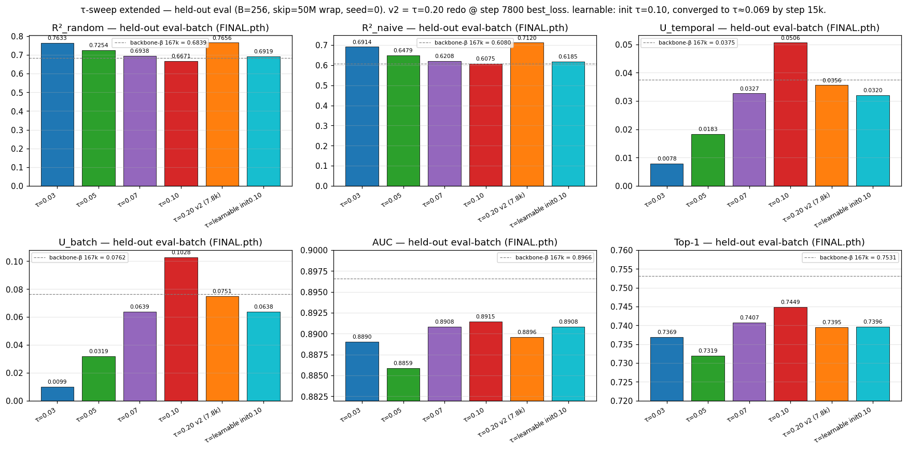

# τ-sweep — RESULTS

## Goal / question

Does the contrastive temperature τ — fixed during training rather than
learned — affect the converged representation quality (AUC, Top-1 — the
encoder's ability to distinguish a target from negatives), the
forecast-match metrics (R²_random, R²_naive — prediction-error of the
forecaster's output vs random / naive-last-step baselines in cosine
space), and the encoder dimension usage (U_t, U_b — directional spread
across time / batch axes) of the contrastive backbone? AUC was the
strongest predictor of downstream MASE in the prior 5-backbone
proxy-correlation analysis (Spearman ρ ≈ +0.70), so its sensitivity to τ
is the central question.

backbone-beta's learnable τ converged to ~0.072 over 167k steps. The
sweep probes whether nearby fixed values match that learnable optimum
and whether sharper / softer τ values shift the metrics materially.

## Protocol

**Sweep design.** Six from-scratch arms, identical architecture and
hyperparameters except for τ:

| arm                             | τ                  | rationale                                      |
|---------------------------------|--------------------|------------------------------------------------|
| `tau_sweep_0_03`                | 0.03               | sharp — punishes near-misses harder            |
| `tau_sweep_0_05`                | 0.05               | moderately sharp                               |
| `tau_sweep_0_07`                | 0.07               | closest fixed value to backbone-beta's τ ≈ 0.072 |
| `tau_sweep_0_10`                | 0.10               | moderately soft                                |
| `tau_sweep_0_20`                | 0.20               | soft — high entropy, harder to discriminate    |
| `tau_sweep_learnable_0_10`      | learnable, init 0.10 | CLIP-style learnable τ; tests whether it discovers the fixed-τ optimum |

**Architecture / training recipe** (matches backbone-beta exactly,
only τ varies): T_RAW=4096, C=1, d_model=384, num_layers=6, n_heads=6,
freq_emb_dim=3, seasonality_emb_dim=3, rev_norm_kind=ewma span=128,
loss=cosine_similarity_batch, batch_size=256, mixup_p=0.3, mix_ratio=0,
AdamW lr=1e-3 wd=0.1 β1=0.9 β2=0.98, **15,000 steps per arm**. (The
τ=0.03 arm was killed at 23k after metrics plateaued by step ~5k;
budget for the remaining arms cut from 50k to 15k.)

**6 metrics per minibatch.** The trainer logs, every step, six
`@torch.no_grad` values that reuse the already-computed `f`, `h`, `z`
tensors from the loss:

| column        | source                                             |
|---------------|----------------------------------------------------|
| `r2_random`   | `1 - q_random(f, h_target)`                        |
| `r2_naive`    | `1 - q_naive_latent(f, h_target, h_prev)`          |
| `u_temporal`  | `dim_usage(z, axis="temporal")`                    |
| `u_batch`     | `dim_usage(z, axis="batch")`                       |
| `auc`         | `retrieval_auc_top1(...)` (1st return)             |
| `top1`        | `retrieval_auc_top1(...)` (2nd return)             |

Column names match `experiments/2026-05-05_exp_qhead_improvements/results/backbone_proxy_correlation.csv`
so per-batch and post-hoc metrics merge cleanly.

**Held-out eval batch.** All arms scored on the same fixed HF batch:
B=256, eval seed=0, skip=50M wrapping to row 7,260,000 (50M > 42.7M
total). Computed under `model.eval()` (dropout off) by
[`scripts/eval_tau_sweep_metrics_v2.py`](scripts/eval_tau_sweep_metrics_v2.py),
which writes [`results/tau_sweep_metrics_v2.csv`](results/tau_sweep_metrics_v2.csv).

## What we did

- Trained the 5 fixed-τ arms ({0.03, 0.05, 0.07, 0.10, 0.20}) and the
  learnable-τ arm to 15,000 steps each.
- Saved per-step trajectories (loss + 6 metrics) for every arm whose
  losses CSV survived (5 of 6: {0.03, 0.05, 0.07, 0.10, learnable_0_10}
  — see Caveats for the τ=0.20 trajectory CSV).
- Evaluated all 6 backbones on the same held-out HF batch.
- Generated trajectory + comparison plots (see "What we learned").
- Held-out eval reference: `backbone-beta_167k` was scored on the same
  batch for context — it is **not** an arm in the sweep.

(Operational notes about preempted/abandoned attempts and the in-flight
τ=0.20 trajectory-CSV retrain are in
[`EXECUTION_LOG.md`](EXECUTION_LOG.md).)

## What we learned

### Held-out eval

| backbone                   | τ            | R²_random  | R²_naive   | U_t    | U_b        | AUC        | Top-1      |
|----------------------------|--------------|------------|------------|--------|------------|------------|------------|
| tau_sweep_0_03             | 0.03         | 0.7633     | 0.6914     | 0.0078 | 0.0099     | 0.8890     | 0.7369     |
| tau_sweep_0_05             | 0.05         | 0.7254     | 0.6479     | 0.0183 | 0.0319     | 0.8859     | 0.7319     |
| tau_sweep_0_07             | 0.07         | 0.6938     | 0.6208     | 0.0327 | 0.0639     | 0.8908     | 0.7407     |
| tau_sweep_0_10             | 0.10         | 0.6671     | 0.6075     | 0.0506 | **0.1028** | 0.8915     | 0.7449     |
| tau_sweep_0_20             | 0.20         | **0.7731** | **0.7256** | 0.0386 | 0.0850     | **0.8938** | **0.7470** |
| tau_sweep_learnable_0_10   | 0.10 → 0.069 | 0.6919     | 0.6185     | 0.0320 | 0.0638     | 0.8908     | 0.7396     |

(Provenance: the τ=0.20 row above is from the 15,000-step
[`sync_tau_sweep/checkpoints/tau_sweep_0_20_FINAL.pth`](../../sync_tau_sweep/checkpoints/tau_sweep_0_20_FINAL.pth)
trained on a vast.ai 5090 spot. The trajectory CSV for that arm was lost
in the spot-stop event — see Caveats — and a full-15k retrain is in
flight to recover it; the eval row itself comes from the original
15,000-step backbone snapshot.)

Reference (`backbone-beta_167k`, same held-out batch):
R²_random 0.6839, R²_naive 0.6080, U_t 0.0375, U_b 0.0762,
AUC 0.8966, Top-1 0.7531.

### Per-metric winner (over the 5 trained-to-15k fixed-τ arms)

| metric     | winning τ | value  |
|------------|-----------|--------|
| R²_random  | 0.20      | 0.7731 |
| R²_naive   | 0.20      | 0.7256 |
| U_temporal | 0.10      | 0.0506 |
| U_batch    | 0.10      | 0.1028 |
| AUC        | 0.20      | 0.8938 |
| Top-1      | 0.20      | 0.7470 |

### Range across τ

| metric     | min                  | max                  | range  |
|------------|----------------------|----------------------|--------|
| R²_random  | 0.6671 (τ=0.10)      | 0.7731 (τ=0.20)      | 0.106  |
| R²_naive   | 0.6075 (τ=0.10)      | 0.7256 (τ=0.20)      | 0.118  |
| U_temporal | 0.0078 (τ=0.03)      | 0.0506 (τ=0.10)      | 0.043  |
| U_batch    | 0.0099 (τ=0.03)      | 0.1028 (τ=0.10)      | 0.093  |
| AUC        | 0.8859 (τ=0.05)      | 0.8938 (τ=0.20)      | 0.0079 |
| Top-1      | 0.7319 (τ=0.05)      | 0.7470 (τ=0.20)      | 0.0151 |

R² and U-metric ranges across τ are large; AUC and Top-1 ranges are
small (sub-1% AUC; ~1.5% Top-1).

### Trajectories

6-panel training trajectories (1000-step MA) for the 5 arms whose
per-step CSV survived: {0.03, 0.05, 0.07, 0.10, learnable_0.10}. AUC
y-zoom (0.89, 0.91) and Top-1 y-zoom (0.72, 0.76) make arm-to-arm
separation legible. **τ=0.10 dominates the in-training AUC and Top-1
trajectory across the full 15k window**, with the learnable arm sitting
just underneath. AUC trajectories overlap closely; Top-1 separates the
softer-τ arms (0.10, learnable) above the sharper-τ pack. (The plot
file also contains a partial-trajectory trace labelled `τ=0.20 v2
(7.8k)` from a preempted retrain attempt; ignore — it is not part of
the canonical sweep. The full-15k τ=0.20 trajectory will be added when
the in-flight retrain lands — see Caveats.)

### Comparison

Bar chart of the held-out eval values per backbone, with
`backbone-beta_167k` reference as a dashed line. The plot file was
generated before the report cleanup and still includes a
`τ=0.20 v2 (7.8k)` bar from a 7,800-step partial retrain — that bar is
not part of the canonical sweep and is superseded by the τ=0.20 row in
the eval table above; see Caveats. The eval CSV also contains an
`exp2_residual_silu_tau_0_10` row from a separate Exp-2 encoder probe
which is not part of this τ-sweep and is not plotted.

### In-training vs held-out gap

In-training values are computed under `model.train()` (dropout active)
on the just-trained batch. Held-out values are computed under
`model.eval()` (dropout off) on a different batch. The two differ by
metric and arm; the underlying mechanism (dropout, batch sampling,
something else) was not investigated.

| backbone                 | last step | in-training loss | in-training AUC | in-training Top-1 | in-training U_b |
|--------------------------|-----------|------------------|-----------------|-------------------|------------------|
| tau_sweep_0_03           | 23000     | 6.7313           | 0.9133          | 0.7669            | 0.0102           |
| tau_sweep_0_05           | 15000     | 6.9970           | 0.9177          | 0.7660            | 0.0288           |
| tau_sweep_0_07           | 15000     | 7.0201           | 0.9171          | 0.7694            | 0.0598           |
| tau_sweep_0_10           | 15000     | 7.0414           | 0.9199          | 0.7765            | 0.0939           |
| tau_sweep_learnable_0_10 | 15000     | 6.9749           | 0.9206          | 0.7745            | 0.0591           |

(τ=0.20 has no per-step trajectory CSV — lost to the spot-stop event
documented under Caveats; in-flight retrain will recover it.)

### The τ=0.10 vs τ=0.20 winner is currently uncertain

The two softer arms come out ahead, but on different evidence:

- **τ=0.10** dominates the in-training trajectory across the full 15k
  window on AUC, Top-1, and the U-metrics. It also wins U_temporal and
  U_batch on the held-out batch.
- **τ=0.20** wins the held-out batch on R²_random, R²_naive, AUC, and
  Top-1 — but the AUC and Top-1 margins over τ=0.10 are ≈0.0023 and
  ≈0.0021 respectively, well within single-batch noise.

Until the τ=0.20 trajectory plot lands (in-flight retrain), the picked τ
for the next backbone is unsettled between 0.10 (dominates trajectory)
and 0.20 (edges held-out by ~0.002 AUC / ~0.002 Top-1, with U-metrics
going the other way).

The **learnable-τ arm slid from init=0.10 to τ ≈ 0.069**
(log_inv_tau ≈ 2.671) over 15k steps. Its held-out values land near
τ=0.07 on every metric (R²_random 0.6919 vs τ=0.07's 0.6938; AUC
0.8908 = τ=0.07's 0.8908; U_b 0.0638 vs τ=0.07's 0.0639) —
coherent with the converged τ value sitting just below 0.07. Within a
single 15k run, gradient pressure pulls τ down, not up to either of
the soft optima. **Learnable-τ does not discover the τ=0.10 / τ=0.20
optimum from a 0.10 init.** A wider-init learnable-τ sweep (e.g.
init=0.30, init=0.50) would test whether the learnable schedule can
find the soft optimum from above.

## Caveats

- **τ=0.20 trajectory CSV lost.** The original vast spot auto-stopped
  on completion before any sync_loop pulled the per-step losses CSV
  (a one-shot DONE-marker scp-back was wired up instead, and only
  `_FINAL.pth` survived the post-DONE pull). The full-15k backbone
  snapshot was preserved, so the held-out eval row is from the genuine
  15,000-step training; only the per-step trajectory is missing. A
  full-15k retrain (run-name `tau_sweep_0_20_v2`) is currently in
  flight on elisa GPU 1 to recover the trajectory; it will not change
  the held-out eval row materially. Operational details in
  [`EXECUTION_LOG.md`](EXECUTION_LOG.md); the policy fix (sync_loop
  always-on for short remote runs too) is in
  [`REMOTE_LAUNCH_CHECKLIST`](../REMOTE_LAUNCH_CHECKLIST.md).

## Open

- **τ=0.20 trajectory plot.** Will land once the in-flight retrain
  completes (see Caveats); will not change the held-out eval row.
- **Proxy MASE per arm.** The
  [`scripts/run_tau_sweep_proxy.sh`](scripts/run_tau_sweep_proxy.sh)
  recipe trains an R3_E4 head on each backbone for downstream
  GIFT-Eval; it has not been run yet.
- Whether AUC/Top-1/U-metric ranks predict downstream MASE rank for
  this set of arms specifically. The proxy correlation analysis at
  `experiments/2026-05-05_exp_qhead_improvements/results/backbone_proxy_correlation.csv`
  is over a different set of 5 backbones (n=5, directional ρ);
  applying its conclusions to this sweep would be extrapolation.
- **Wider-init learnable-τ sweep.** Test whether learnable τ
  initialised above the soft optimum (e.g. init=0.30, 0.50) finds the
  τ=0.10–0.20 region instead of sliding down to ~0.07.
