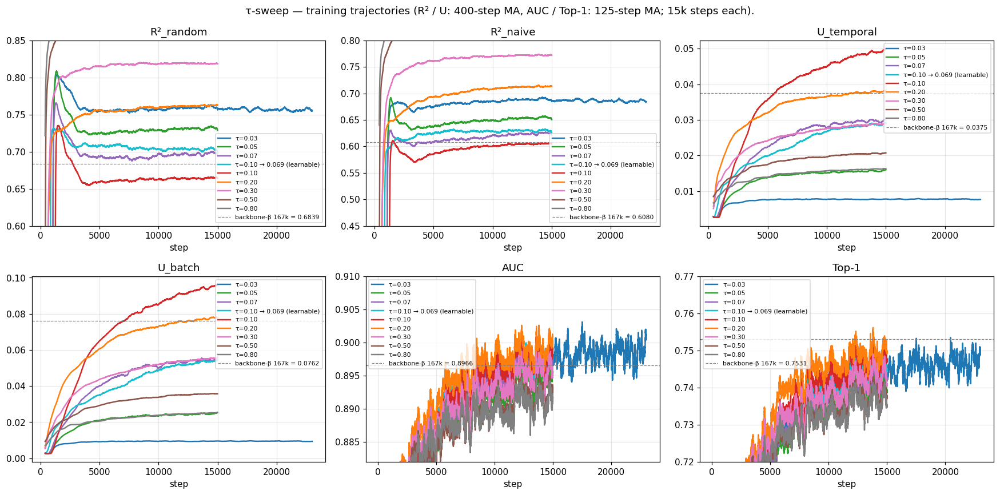
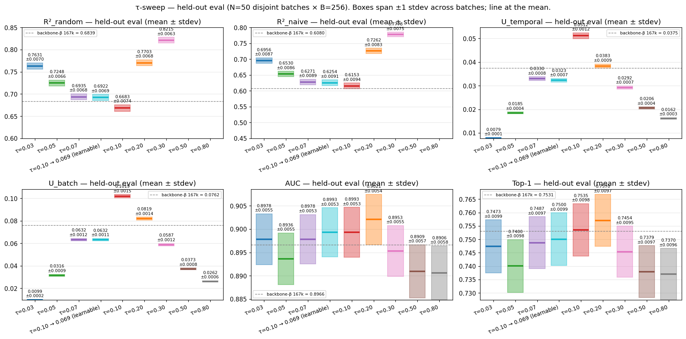

# τ-sweep — RESULTS

## Goal / question

Does the contrastive temperature τ — fixed during training — change
the encoder's representation quality, forecast-match metrics, and
dimension usage? backbone-beta's learnable τ converged to ~0.072 over
167k steps; the sweep probes whether nearby fixed values match that
optimum and whether sharper / softer τ values shift the metrics
materially.

## Protocol

**Sweep design.** Ten from-scratch arms (plus a second τ=0.20 retrain
for reproducibility), identical architecture and
hyperparameters except for τ:

| arm                          | τ                    | rationale                              |
|------------------------------|----------------------|----------------------------------------|
| `tau_sweep_0_03`             | 0.03                 | sharp                                  |
| `tau_sweep_0_05`             | 0.05                 | moderately sharp                       |
| `tau_sweep_0_07`             | 0.07                 | closest fixed value to backbone-β's τ ≈ 0.072 |
| `tau_sweep_learnable_0_10`   | learnable, init 0.10 | CLIP-style learnable τ                 |
| `tau_sweep_learnable_0_20`   | learnable, init 0.20 | learnable τ, wider init                |
| `tau_sweep_0_10`             | 0.10                 | moderately soft                        |
| `tau_sweep_0_20`             | 0.20                 | soft                                   |
| `tau_sweep_0_30`             | 0.30                 | very soft — extension above 0.20       |
| `tau_sweep_0_50`             | 0.50                 | very soft — extension                  |
| `tau_sweep_0_80`             | 0.80                 | very soft — extension                  |

**Architecture / training recipe** matches backbone-beta exactly, only
τ varies: 6-layer × 384-D transformer, GRU patch encoder, T_RAW=4096,
B=256, AdamW lr=1e-3, 15,000 steps per arm.

**6 metrics tracked per minibatch:**

| metric        | what it measures                                                                                  |
|---------------|---------------------------------------------------------------------------------------------------|
| `R²_random`   | forecast match vs random pair — improvement over a baseline that pairs forecasts with arbitrary held-out targets |
| `R²_naive`    | forecast match vs naive last-step — improvement over a "no-change" baseline that copies the previous encoder output as the prediction |
| `U_temporal`  | dimension usage along the time axis — how much of the 384-D encoder-output space is spanned by one series across its time positions (averaged over batch) |
| `U_batch`     | dimension usage along the batch axis — how much of the 384-D space is spanned by different series at the same time position (averaged over time) |
| `AUC`         | representation quality / discrimination — per-query, fraction of past-window negatives that the positive ranks above |
| `Top-1`       | representation quality / strict discrimination — fraction of queries where the positive beats every past-window negative simultaneously (strictest version of AUC) |

**Held-out eval.** All arms scored on **N=50 disjoint held-out batches**
(B=256 each, model.eval()) by
[`scripts/eval_multisample.py`](scripts/eval_multisample.py), writing
[`results/tau_sweep_metrics_multisample.csv`](results/tau_sweep_metrics_multisample.csv).
SEM (precision of the mean) = stdev/√50. `backbone-beta_167k` is shown
as a single-batch reference only, not an arm.

## What we learned

### Trajectories

In-training AUC and Top-1 trajectories cluster the **softer-τ arms
(0.10, learnable, 0.20)** above the sharper-τ pack across the full 15k
window. R²_random / R²_naive trajectories rise monotonically with τ —
τ=0.80 at the top, τ=0.50 below, τ=0.30 below, τ=0.20 below.

### Held-out eval (mean ± stdev, N=50 disjoint batches)

| backbone                 | τ            | R²_random           | R²_naive            | U_t                 | U_b                 | AUC                 | Top-1               |
|--------------------------|--------------|---------------------|---------------------|---------------------|---------------------|---------------------|---------------------|
| tau_sweep_0_03           | 0.03         | 0.7631 ± 0.0070     | 0.6956 ± 0.0087     | 0.0079 ± 0.0001     | 0.0099 ± 0.0002     | 0.8978 ± 0.0055     | 0.7473 ± 0.0099     |
| tau_sweep_0_05           | 0.05         | 0.7248 ± 0.0066     | 0.6530 ± 0.0086     | 0.0185 ± 0.0004     | 0.0316 ± 0.0009     | 0.8936 ± 0.0055     | 0.7400 ± 0.0098     |
| tau_sweep_0_07           | 0.07         | 0.6935 ± 0.0068     | 0.6271 ± 0.0089     | 0.0330 ± 0.0008     | 0.0632 ± 0.0012     | 0.8978 ± 0.0053     | 0.7487 ± 0.0097     |
| tau_sweep_learnable_0_10 | 0.10 → 0.069 | 0.6922 ± 0.0069     | 0.6254 ± 0.0091     | 0.0323 ± 0.0007     | 0.0632 ± 0.0011     | 0.8993 ± 0.0053     | 0.7500 ± 0.0099     |
| tau_sweep_learnable_0_20 | 0.20 → 0.07  | 0.6885 ± 0.0066     | 0.6226 ± 0.0087     | 0.0305 ± 0.0007     | 0.0586 ± 0.0011     | 0.8975 ± 0.0054     | 0.7469 ± 0.0095     |
| tau_sweep_0_10           | 0.10         | 0.6683 ± 0.0074     | 0.6153 ± 0.0094     | **0.0512 ± 0.0012** | **0.1019 ± 0.0015** | 0.8993 ± 0.0053     | 0.7535 ± 0.0098     |
| tau_sweep_0_20           | 0.20         | 0.7721 ± 0.0068     | 0.7294 ± 0.0082     | 0.0392 ± 0.0009     | 0.0837 ± 0.0015     | 0.9019 ± 0.0054     | 0.7566 ± 0.0099     |
| tau_sweep_0_20_v2        | 0.20         | 0.7703 ± 0.0068     | 0.7262 ± 0.0083     | 0.0383 ± 0.0009     | 0.0819 ± 0.0014     | **0.9021 ± 0.0054** | **0.7570 ± 0.0097** |
| tau_sweep_0_30           | 0.30         | 0.8215 ± 0.0063     | 0.7778 ± 0.0075     | 0.0292 ± 0.0007     | 0.0587 ± 0.0012     | 0.8953 ± 0.0055     | 0.7454 ± 0.0095     |
| tau_sweep_0_50           | 0.50         | 0.8646 ± 0.0053     | 0.8215 ± 0.0067     | 0.0206 ± 0.0004     | 0.0373 ± 0.0008     | 0.8909 ± 0.0057     | 0.7379 ± 0.0097     |
| tau_sweep_0_80           | 0.80         | **0.8895 ± 0.0048** | **0.8516 ± 0.0063** | 0.0162 ± 0.0003     | 0.0262 ± 0.0006     | 0.8906 ± 0.0058     | 0.7370 ± 0.0096     |

backbone-β_167k single-batch reference: R² 0.6839 / 0.6080,
U 0.0375 / 0.0762, AUC 0.8966, Top-1 0.7531.

### Per-metric winner (across all 11 evals)

| metric     | winner    | value             | runner-up               |
|------------|-----------|-------------------|-------------------------|
| R²_random  | τ=0.80    | 0.8895 ± 0.0048   | τ=0.50 (0.8646)         |
| R²_naive   | τ=0.80    | 0.8516 ± 0.0063   | τ=0.50 (0.8215)         |
| U_temporal | τ=0.10    | 0.0512 ± 0.0012   | τ=0.20 (0.0392)         |
| U_batch    | τ=0.10    | 0.1019 ± 0.0015   | τ=0.20 (0.0837)         |
| AUC        | τ=0.20    | 0.9021 ± 0.0054   | τ=0.10 (0.8993)         |
| Top-1      | τ=0.20    | 0.7570 ± 0.0097   | τ=0.20 (run 1, 0.7566)  |

**Pattern across τ:**
- **R²** rises monotonically with τ across the whole range
  0.10→0.80 (best at τ=0.80, worst at τ=0.10).
- **U** decreases monotonically with τ from 0.10 onward (best at τ=0.10).
- **AUC / Top-1** peak at **τ=0.20** and decrease on both sides.
  Δ(τ=0.20 − τ=0.10) = +0.0027 AUC at +3.6 SEM and +0.0035 Top-1 at
  +2.5 SEM (resolved by N=50). Δ(τ=0.20 − τ=0.80) = +0.0115 AUC at
  +14 SEM (decisive).

### Verdict

τ=0.20 is the **representation-quality optimum** — the only point that
maximises both AUC and Top-1. R²_random / R²_naive keep climbing past
τ=0.20 to a maximum at τ=0.80 (Δ ≈ +0.12 vs τ=0.20), but the
forecast-match gain is bought at the cost of AUC and Top-1, which roll
off monotonically past τ=0.20.

**Learnable-τ slides to τ ≈ 0.07 regardless of init** — both init=0.10
and init=0.20 arms converge to the τ=0.07 cluster (init=0.20 lands on
R²_random 0.6885 / AUC 0.8975, indistinguishable from the fixed τ=0.07
arm). Gradient pressure pulls τ down, not up; learnable-τ does not
discover the τ=0.20 optimum from any tested init.

