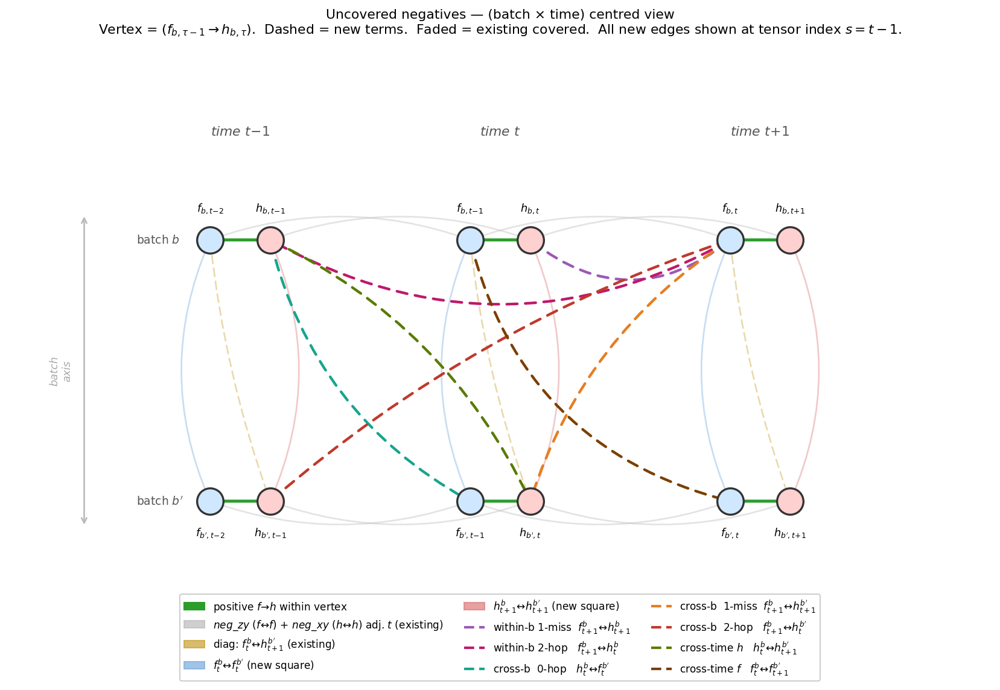
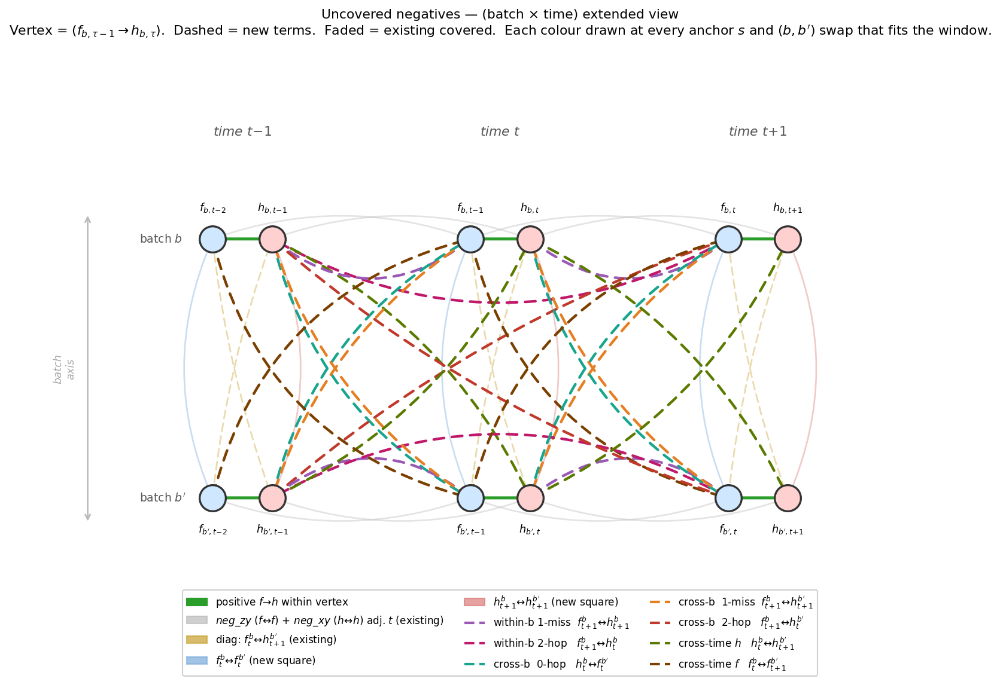

# Additional negative-pair terms — design-space map

**Question.** The contrastive loss already pulls apart several kinds of
negative pairs. Which negative-pair structures are *already* covered, and which
are *uncovered candidates* worth adding to a future ablation?

**Result.** Of 7 candidate pair-types laid out on the prediction graph, two
collapse out — WB1 is redundant with the existing `neg_xy_hat`, and CB0≡CB1 are
one loss term under the batch-swap `b ↔ b'`. That leaves **5 distinct new
pair-types to ablate: WB2, the merged CB0/CB1, CB2, CTH, CTF.**

> **This is a design note, not a results experiment.** Nothing was trained or
> measured here — it maps the candidate space and prunes the redundant edges so
> the follow-up ablation runs only the 5 that can actually change the loss. No
> metric is reported because none was produced.

## Notation

The diagrams sit on a 2×3 (batch × time) sub-window of the prediction graph.
Each vertex is one positive pair `(f_{b,τ-1} → h_{b,τ})`.

- `h_{b,τ}` — encoder embedding at position `τ`, batch `b`.
- `f_{b,τ}` — forecast emitted at `τ`, batch `b`; trained to predict `h_{b,τ+1}`.
- Anchor `(b, s, c)` — the index over which one InfoNCE ratio is computed
  (InfoNCE = the contrastive loss `-log[ e^{pos/τ} / Σ e^{·/τ} ]`, one positive
  in the numerator against a sum of negatives in the denominator), with
  positive pair `(f_{b,s,c}, h_{b,s+1,c})`, anchor index `s ∈ [0, T-2]`, channel
  `c`. A loss term is computed per anchor and summed over all anchors and all
  ordered batch pairs `(b, b')`, `b ≠ b'`.
- Top row = batch `b`, bottom row = batch `b'` (`b ≠ b'`).

## The map — two views

**Centred view** — each candidate-new edge drawn once, at the centred anchor
`s = t-1`. One colour, one line: the cleanest read of the 7 candidate
structures.



The dashed edges are the candidates; the faded edges are what the loss already
covers. Read off the structure of each candidate (within-batch vs cross-batch,
which time offset) here, then use the echoes view to see overlaps.

**Echoes view** — same diagram, but each colour is now also drawn at every
translation copy that fits the 6-vertex window: anchor `s ± 1`, plus the
`b ↔ b'` label-swap for cross-batch terms (the existing orange diagonal gains
its `b ↔ b'` mirror here too).



Because a term is summed over all anchors and all `(b, b')`, **adding one colour
to the loss creates many edges in this window** — the centred view hides that.
The echoes view makes it explicit and shows where two source colours physically
coincide: that overlap is exactly why **CB0 and CB1 are the same loss term**
under `b ↔ b'`.

## Edges, and how each maps to the loss

The existing-covered edges below are those produced by the
`cosine_similarity_batch_square` loss branch — the variant that extends the base
`cosine_similarity_batch` with the two missing clean batch-axis edges (it is the
`loss_shape` string dispatched at `src/loss.py:1552-1623`; see
`src/loss.py::contrastive_latent_loss`). The blue/red cross-batch f↔f and h↔h
edges are *new relative to the base loss* but already implemented in this
branch, so they are shown faded.

### Existing (faded)

| Colour | Pair (centred at anchor `s = t-1`) | Loss term |
|---|---|---|
| green solid | `(f_{b,τ-1}, h_{b,τ})` — positive | numerator of every InfoNCE ratio |
| grey | within-`b` `(f_{b,τ}, f_{b,τ+1})` and `(h_{b,τ}, h_{b,τ+1})` — adj. `τ` | `neg_zy` (f-side) + `neg_xy` (h-side) |
| orange (faded) | cross-`b` `(h_{b',τ+1}, f_{b,τ})` — h leads f by 1 | `neg_cross_batch` (`log_neg_cross_fe`) |
| blue | cross-`b` `(f_{b,τ}, f_{b',τ})` same `τ` | `neg_cross_batch_forecast` (`log_neg_cross_ff`) |
| red | cross-`b` `(h_{b,τ+1}, h_{b',τ+1})` same `τ` | `neg_cross_batch_embedding` (`log_neg_cross_hh`) |

> The labels `neg_cross_batch_forecast` / `neg_cross_batch_embedding` are the
> names used in the `cosine_similarity_batch_square` comment
> (`src/loss.py:1555-1556`); the computed tensors there are `log_neg_cross_ff`
> and `log_neg_cross_hh`.

The within-`b` same-`τ` `(h_{b,τ}, f_{b,τ})` pair is *also* already covered as
the same-channel diagonal of `neg_xy_hat` (`cos(h_{·,τ,c1}, f_{·,τ,c2})` summed
over `c1`, no `c1 ≠ c2` mask). It is not drawn faded (it would need a new legend
entry), but it is what makes WB1 redundant below. The explicit double-count
analysis is the comment block at the `cosine_similarity_batch_add_neg_htft`
branch, `src/loss.py:1378-1389`.

### Candidate-new (bright dashed)

Each row gives the pair as `(left, right)`; cosine similarity is symmetric, so
the order is cosmetic. Status says whether the pair is genuinely uncovered, or
whether some existing term — or just the cross-batch summation over `(b, b')` —
already separates it.

| Colour | Code | Pair structure | Status |
|---|---|---|---|
| purple | WB1 | within-`b` `(f_{b,τ}, h_{b,τ})` — same `τ` | **covered** by `neg_xy_hat` (c1=c2 part); an explicit term only double-weights the same-channel slice |
| magenta | WB2 | within-`b` `(f_{b,τ}, h_{b,τ-1})` — f leads h by 1 | **new** |
| teal | CB0 | cross-`b` `(h_{b,τ}, f_{b',τ})` — same `τ` | **new** |
| orange (bright) | CB1 | cross-`b` `(f_{b,τ}, h_{b',τ})` — same `τ` | **same term as CB0** under `b ↔ b'`; one implementation covers both colours |
| dark red | CB2 | cross-`b` `(f_{b,τ}, h_{b',τ-1})` — f leads h by 1 | **new** |
| olive | CTH | cross-`b` `(h_{b,τ-1}, h_{b',τ})` — adj. `τ` (h↔h) | **new** |
| brown | CTF | cross-`b` `(f_{b,τ}, f_{b',τ+1})` — adj. `τ` (f↔f) | **new** |

Pruning: WB1 is redundant (1), CB0 and CB1 are one term (2 colours → 1) — so the
7 candidate colours reduce to **5 distinct new pair-types**: WB2, the merged
CB0/CB1, CB2, CTH, CTF. Those 5 are what a follow-up ablation should add to the
loss one at a time.

## Reproducing

```
python3 experiments/2026-05-09_exp_additional_negatives/scripts/plot_additional_negatives_diagram.py
```

Writes both PNGs to `plots/`.
