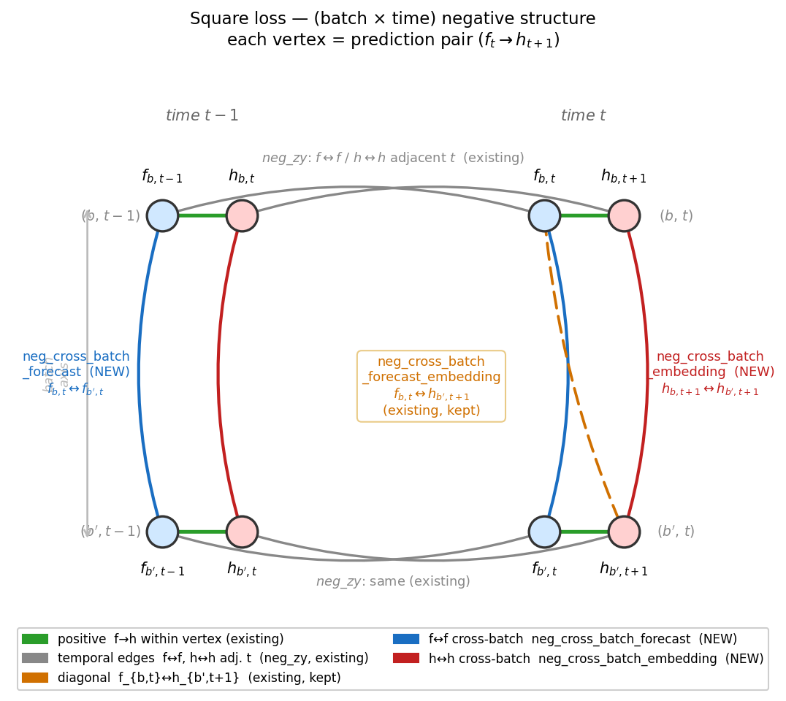
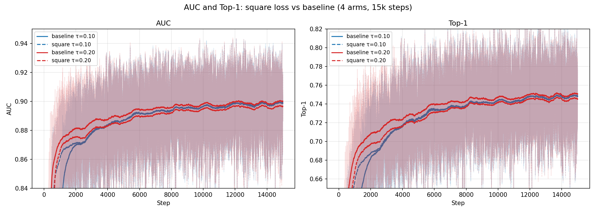
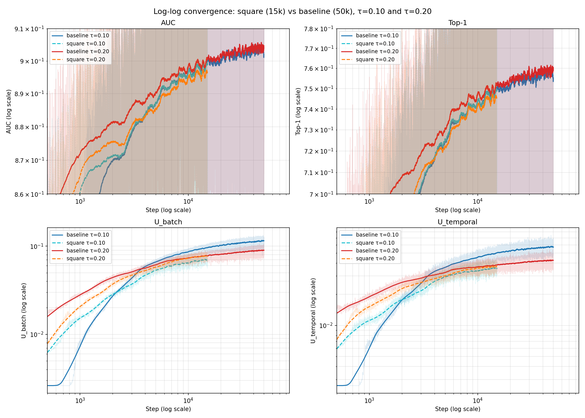
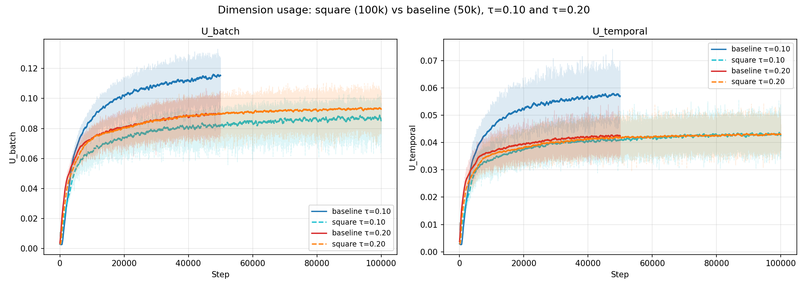

# Experiment: loss_extensions — square cross-batch negatives

## Goal

Compare AUC and Top-1 of `cosine_similarity_batch_square` against the
baseline `cosine_similarity_batch` at τ=0.10 and τ=0.20.

## What we changed

`cosine_similarity_batch_square` adds two cross-batch negative edges on
top of `cosine_similarity_batch`: **neg_cross_batch_forecast** (forecast
of element b vs forecast of b′≠b at the same t) and
**neg_cross_batch_embedding** (context h_{b,t+1} vs h_{b′,t+1}). They
tile the diagonal the base loss leaves empty, forming a 2×2 square of
negatives instead of a 1×2 rectangle.

Each vertex of the square is a `(f_t, h_{t+1})` prediction pair.
Baseline `cosine_similarity_batch` already wires the temporal edges
(grey: `neg_zy`, f↔f and h↔h across adjacent t within a single
sequence) and the inner cross-batch diagonal (orange:
`neg_cross_batch_forecast_embedding`, f-of-b vs h-next-of-b′). The new
**blue** edge repels forecasts of two different sequences at the same
t (`f_{b,t} ↔ f_{b′,t}`); the new **red** edge does the same on the
encoder side (`h_{b,t+1} ↔ h_{b′,t+1}`).

**Why we expect this to matter.** With only the diagonal and the
temporal edges, the loss never directly repels two different
sequences' representations *at the same instant* — only their
adjacent-step pairs and the f→h cross pair. Two sequences can drift to
share the same region of embedding space at time t and then "untwist"
one step later via the temporal/diagonal terms; every existing edge is
satisfied, but the local batch-discriminative structure at fixed t is
gone. If that twist happens, retrieval-at-fixed-t metrics — Top-1 and
AUC — should suffer even while the contrastive loss looks healthy.
Adding the same-time batch edges (blue, red) forbids that
configuration and is the motivation for testing the square variant.

## Protocol

| Setting | Value |
|---|---|
| Arms | 4: {baseline, square} × {τ=0.10, τ=0.20} |
| Steps | baselines 150 000, square arms 100 000, batch 256 |
| Dataset | GIFT-pretrain-full-4096 |
| Encoder | GRU, d=384, 6 heads, 6 layers |
| RevNorm | EWMA span=128, mixup p=0.3 |

Linear-axis plots clip x at 100 k so all four arms share one window;
the baselines' 100–150 k tail is used only to confirm the late plateau.

## AUC / Top-1

All four arms cluster within run-to-run noise; smoothed (W=1000)
baseline curves sit slightly above their square counterparts past
~5 k.

## Log-log

Squares are visibly delayed in the early ramp and close the gap by
~30 k. None of the curves look like clean straight lines on log-log —
they all bend toward the same plateau, which limits what we can read
out about scaling behaviour from this experiment alone.

## Dimension usage

`U_batch` and `U_temporal` measure how many embedding dimensions are
actively used along the batch and temporal axes (higher = less
collapsed). The τ=0.10 baseline keeps growing past where the square
plateaus; the τ=0.20 arms stay close. Higher `U_batch` is not
inherently better here: the highest-`U_batch` arm (baseline τ=0.10) is
also the highest-AUC arm.

## Late-window means

Per-step values are noisy (±0.02 AUC); means are over 10 k-step windows.

| Arm | Window | AUC | Top-1 | U_batch | U_temporal |
|---|---|---:|---:|---:|---:|
| baseline τ=0.10 | 40 001–50 000   | 0.9035 | 0.7574 | 0.1136 | 0.0571 |
| square   τ=0.10 | 40 001–50 000   | 0.9024 | 0.7571 | 0.0814 | 0.0408 |
| baseline τ=0.20 | 40 001–50 000   | 0.9039 | 0.7587 | 0.0890 | 0.0423 |
| square   τ=0.20 | 40 001–50 000   | 0.9014 | 0.7555 | 0.0891 | 0.0416 |
| baseline τ=0.10 | 90 001–100 000  | 0.9046 | 0.7597 | 0.1197 | 0.0593 |
| square   τ=0.10 | 90 001–100 000  | 0.9040 | 0.7607 | 0.0868 | 0.0430 |
| baseline τ=0.20 | 90 001–100 000  | 0.9053 | 0.7621 | 0.0941 | 0.0440 |
| square   τ=0.20 | 90 001–100 000  | 0.9031 | 0.7590 | 0.0930 | 0.0429 |
| baseline τ=0.10 | 140 001–150 000 | 0.9037 | 0.7589 | 0.1210 | 0.0598 |
| baseline τ=0.20 | 140 001–150 000 | 0.9058 | 0.7634 | 0.0959 | 0.0445 |

The 140–150 k baseline rows confirm the baselines are on a flat plateau
past 100 k. Squares' coverage stops at 100 k.

## Welch t-tests on AUC / Top-1 (overlap window 5 001–100 000, n=95 000)

| Comparison | Δ AUC | p_AUC | Δ Top-1 | p_Top-1 |
|---|---:|---:|---:|---:|
| baseline τ=0.10 vs square τ=0.10 | +0.0006 | 6.8e-16 | −0.0003 | 2.7e-02 |
| baseline τ=0.20 vs square τ=0.20 | +0.0027 | 1.3e-287 | +0.0040 | 5.1e-210 |
| baseline τ=0.10 vs baseline τ=0.20 (sanity) | −0.0008 | 5.8e-29 | −0.0023 | 2.0e-67 |
| square τ=0.10 vs square τ=0.20 | +0.0013 | 2.3e-63 | +0.0020 | 3.7e-54 |

Samples are consecutive training steps from one run, not i.i.d.;
effective N is much smaller than 95 000, so p-values are
anti-conservative. Treat Δ values as load-bearing, not the p numbers.

## Bottom line

- **Baselines edge squares at every step-matched window.** Tiny gap at
  τ=0.10, larger and consistent at τ=0.20.
- **Squares converge slower; baselines also keep improving past 50 k.**
  The prior 50 k-baseline report's "square overtakes at its own
  plateau" framing was step-mismatched and is wrong.
- **Higher `U_batch` ≠ better here.** The arm with the highest
  `U_batch` is also the arm with the highest AUC.
- **Net:** extra cross-batch negatives are at best a wash, at worst a
  small regression, and they cost roughly twice the steps to reach a
  flat plateau. Not a recommended default at this scale.

## Followup hypothesis

The curves bend hard toward a single plateau rather than tracking
straight lines on log-log; this is what we'd expect if some component
of the architecture were saturated and bottlenecking AUC, in which case
loss-shape changes can't show their true effect. **The user hypothesis
is that the GRU patch head is the bottleneck**: a single GRU layer at
d=384 has limited capacity to scale, and replacing it with a small
transformer patch head should produce log-log curves that look like
straight lines with different slopes — the regime where loss-shape
differences would be readable. Worth running before drawing a strong
conclusion that the square loss is harmful per se.
