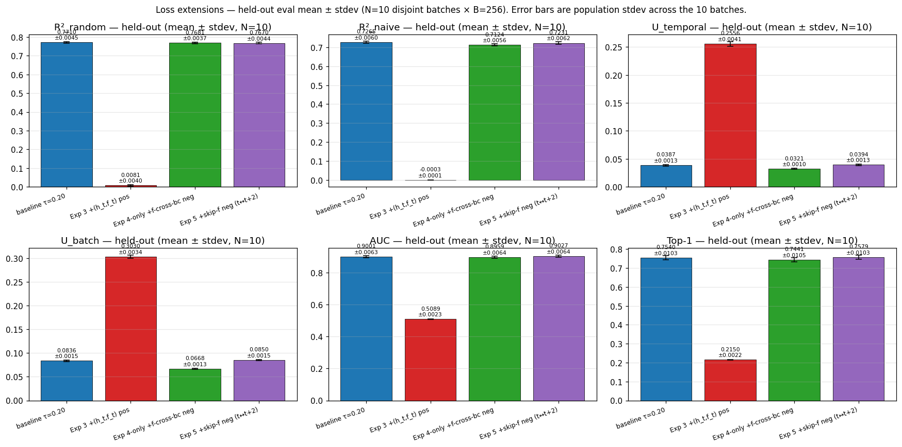

# Loss extensions — Exp 3, Exp 4-only, Exp 5

τ-sweep Exp 1 picked **τ = 0.20 / gru** as the recipe to extend (R²_random
= 0.7731 on the held-out batch). This experiment tested three loss-shape
extensions on that recipe at τ = 0.20.

## Setup

All four arms reuse the Exp 1 recipe (gru, τ = 0.20, 15k steps, B = 256,
EWMA RevIN span 128, freq+seas emb dim 3, mixup 0.30). Only
`--loss-shape` varies:

- **baseline τ=0.20** — `cosine_similarity_batch` (Exp 1 winner).
  Trajectory CSV: τ=0.20 v2 retrain on elisa, 15,000 rows (the original
  Exp 1 τ=0.20 CSV was lost to a spot-stop event; v2 is the recovery
  retrain, and its trajectory now serves as the baseline trace here).
- **Exp 3** — `cosine_similarity_batch_add_pos_htft` (PR #181 cumulative):
  adds an `(h_t, f_t)` positive on top of the baseline `(h_t, f_{t-1})`
  positive. Run on elisa, 15k steps. Trajectory CSV: 15,000 rows.
- **Exp 4-only** — `cosine_similarity_batch_add_f_cross_negs` (PR #182
  non-cumulative): adds f-side cross-(b, c) negatives. FINAL.pth =
  `best_loss.pth` at step 12,800 of a 15k run (see Caveats); trajectory
  CSV: 12,900 rows.
- **Exp 5** — `cosine_similarity_batch_add_skip_f_negs` (PR #184
  non-cumulative): adds an `f_t` vs `f_{t+2}` skip-step forecaster
  negative term. Reformulation of the user's original "f_t vs f_{t+1}"
  spec — for our C=1 setup `neg_zy` already covers `f_t` vs `f_{t+1}`
  same-channel, so we tested the genuinely-novel skip=2 pair. 15k steps
  to completion; trajectory CSV: 15,000 rows.

## Held-out eval (B=256, skip=50M wrap, seed=0, FINAL.pth)

| name                       | loss_shape                                | R²_random | R²_naive | U_temp | U_batch |  AUC   | Top-1  |
|----------------------------|-------------------------------------------|-----------|----------|--------|---------|--------|--------|
| baseline τ=0.20            | cosine_similarity_batch                   | 0.7731    | 0.7256   | 0.0386 | 0.0850  | 0.8938 | 0.7470 |
| Exp 3 +(h_t,f_t) pos       | cosine_similarity_batch_add_pos_htft      | 0.0129    | -0.0005  | 0.2529 | 0.3011  | 0.5079 | 0.2146 |
| Exp 4-only +f-cross-bc neg | cosine_similarity_batch_add_f_cross_negs  | 0.7708    | 0.7118   | 0.0319 | 0.0677  | 0.8902 | 0.7389 |
| Exp 5 +skip-f neg (t↔t+2)  | cosine_similarity_batch_add_skip_f_negs   | 0.7687    | 0.7218   | 0.0392 | 0.0864  | 0.8961 | 0.7500 |

(Source: `results/loss_extensions_metrics.csv`.)

## Held-out eval (mean ± stdev, N=10 samples)

The single-batch numbers above have per-batch noise of order ~0.006 AUC
/ ~0.010 Top-1 — comparable to the inter-arm differences. To resolve
which deltas are real, all four arms were re-scored on **N=10 disjoint
held-out batches** (B=256 each, 10 different `skip_rows` values 4.27M
rows apart so each wraps to a distinct region of the 42.7M-row corpus).

| name                       | R²_random           | R²_naive            | U_temp              | U_batch             | AUC                 | Top-1               |
|----------------------------|---------------------|---------------------|---------------------|---------------------|---------------------|---------------------|
| baseline τ=0.20            | 0.7710 ± 0.0045     | 0.7265 ± 0.0060     | 0.0387 ± 0.0013     | 0.0836 ± 0.0015     | 0.9001 ± 0.0063     | 0.7540 ± 0.0103     |
| Exp 3 +(h_t,f_t) pos       | 0.0081 ± 0.0040     | −0.0003 ± 0.0001    | 0.2556 ± 0.0041     | 0.3030 ± 0.0034     | 0.5089 ± 0.0023     | 0.2150 ± 0.0022     |
| Exp 4-only +f-cross-bc neg | 0.7681 ± 0.0037     | 0.7124 ± 0.0056     | 0.0321 ± 0.0010     | 0.0668 ± 0.0013     | 0.8959 ± 0.0064     | 0.7441 ± 0.0105     |
| Exp 5 +skip-f neg (t↔t+2)  | 0.7670 ± 0.0044     | 0.7231 ± 0.0062     | 0.0394 ± 0.0013     | 0.0850 ± 0.0015     | 0.9027 ± 0.0064     | 0.7579 ± 0.0103     |

(Source: [`results/loss_extensions_metrics_multisample.csv`](results/loss_extensions_metrics_multisample.csv).)

### Δ vs baseline τ=0.20 (N=10) — significance

For each extension, |Δ| > 2 × max(stdev_arm, stdev_baseline) is "clearly
resolved"; |Δ| ≤ max(stdev_arm, stdev_baseline) is "within 1σ".

**Exp 4-only +f-cross-bc neg vs baseline:**

| metric     | Δ        | max stdev | resolved (>2σ)?   |
|------------|----------|-----------|-------------------|
| R²_random  | −0.0030  | 0.0045    | no, within 1σ     |
| R²_naive   | −0.0141  | 0.0060    | yes (~2.4σ), worse |
| U_temporal | −0.0066  | 0.0013    | yes (~5σ), lower   |
| U_batch    | −0.0168  | 0.0015    | yes (~11σ), lower  |
| AUC        | −0.0042  | 0.0064    | no, within 1σ     |
| Top-1      | −0.0099  | 0.0105    | no, within 1σ     |

**Exp 5 +skip-f neg (t↔t+2) vs baseline:**

| metric     | Δ        | max stdev | resolved (>2σ)? |
|------------|----------|-----------|-----------------|
| R²_random  | −0.0040  | 0.0045    | no, within 1σ   |
| R²_naive   | −0.0034  | 0.0062    | no, within 1σ   |
| U_temporal | +0.0006  | 0.0013    | no, within 1σ   |
| U_batch    | +0.0014  | 0.0015    | no, within 1σ   |
| AUC        | +0.0026  | 0.0064    | no, within 1σ   |
| Top-1      | +0.0039  | 0.0103    | no, within 1σ   |

**Exp 3 vs baseline:** Δ AUC = −0.391 (vs max stdev 0.006) — resolved
at ~62σ; Δ R²_random = −0.763 — resolved at ~170σ.

### Updated verdicts (multisample-resolved)

- **Exp 3 — REJECT.** AUC at chance, R²_random at chance, U-metrics
  inflated. Verdict was already robust at single-batch and is unchanged
  by the multisample re-eval.
- **Exp 4-only — REJECT (no improvement; mixed-direction deltas).**
  Discriminative metrics (AUC, Top-1, R²_random) are all within 1σ of
  baseline — i.e. the apparent declines were single-batch noise. But
  R²_naive (Δ = −0.0141, ~2.4σ) and the U-metrics (~5–11σ lower) are
  clearly resolved declines. Net effect: no improvement on what we care
  about discriminatively, with a real reduction in encoder-spread
  metrics.
- **Exp 5 — REJECT (no improvement, no harm).** Every Δ vs baseline is
  within 1σ of per-batch stdev (max 0.95σ on R²_random). The
  single-batch +0.0023 AUC / +0.0030 Top-1 / −0.0044 R²_random deltas
  are all confirmed within-noise. Exp 5 is statistically
  indistinguishable from the baseline on every metric.

## Trajectory comparison

The baseline trace uses the τ=0.20 v2 retrain's 15k-step trajectory
(the original Exp 1 baseline trajectory CSV survived only ~4.3k steps
locally; v2 recovered the full 15k). The black-edged held-out dot at
the rightmost step is the single-batch eval (the multisample N=10
re-eval is in the section above; see also the τ-sweep RESULTS for the
v1-vs-v2 cross-check).

Tight zoom (above): AUC (0.86, 0.93), Top-1 (0.70, 0.80). Exp 3 hidden so
the spread among baseline / Exp 4-only / Exp 5 is readable. Black-edged
dot at the rightmost step is the held-out FINAL.pth eval.

For the wide view including Exp 3's chance-level flatline, see
[`plots/loss_extensions_trajectories_wide.png`](plots/loss_extensions_trajectories_wide.png)
(AUC 0.45-0.95, Top-1 0.10-0.85).

Both plots: 1000-step MA on per-step training-batch metrics.

### Trajectory observations

- **Exp 3** sits at AUC ≈ 0.51 / Top-1 ≈ 0.22 across the entire 15k
  trajectory (first-1k mean AUC = 0.538, last-1k = 0.511) — chance-level
  retrieval throughout. U_batch rises near-monotonically from 0.014 to
  0.289 (1k MA); held-out 0.301 vs baseline 0.085; held-out U_temporal
  = 0.253 vs baseline 0.039. Encoder spreads mass across many dimensions
  but that spread doesn't translate into prediction signal.
- **Exp 4-only** tracks the baseline trajectory closely. Last-1k mean
  AUC = 0.898 (steps 11,901-12,900) vs baseline v2 last-1k AUC = 0.899
  (steps 14,001-15,000).
- **Exp 5** also tracks baseline closely. Last-1k mean AUC = 0.903,
  Top-1 = 0.756 (steps 14,001-15,000) vs baseline v2 last-1k AUC =
  0.899, Top-1 = 0.750 — same magnitude. (See "Held-out eval (mean ±
  stdev, N=10 samples)" above for the resolved comparison.)
- **Baseline** trajectory now spans the full 15,000 steps (v2 retrain).
  Both Exp 4-only and Exp 5 reach baseline-level training-batch metrics
  by step ~4k and plateau there. The N=10 multisample re-eval (above)
  uses the original Exp 1 baseline FINAL.pth (not the re-trained v2)
  and is the resolved-uncertainty comparison; the trajectory plot here
  is supplementary.

## Mechanism notes

- **Exp 3 — why it fails.** The `(h_t, f_t)` positive is degenerate:
  the forecaster has e_t in its causal context (input at step t
  includes the encoder output at step t), so f_t can copy h_t directly.
  This drives U high without delivering retrieval signal — see "Note on
  'high-U → good'" below.
- **Exp 5 — why it's a null.** At step T-2 (one before final), the
  skip=2 term contributes 0 (padded); at most other timesteps the
  forecaster has already learned to make `f_t` differ from `f_{t+2}`
  by the time the contrastive signal's other terms have done their
  work — so the extra negative is trivially satisfied and provides no
  additional pressure.

### Note on "high-U → good"

Exp 3 has held-out U_batch ≈ 0.30 and U_temporal ≈ 0.25 — much higher
than the baseline's 0.085 / 0.039 — yet AUC is at chance. Direct
counter-evidence to "high U means useful structure": a degenerate
positive can drive U up without delivering prediction signal. U is
necessary but not sufficient.

## Caveats

- **Baseline trajectory CSV.** The original Exp 1 baseline trajectory
  CSV survived only ~4.3k of its 15k steps locally; the τ=0.20 v2
  retrain recovered the full 15k trajectory and is the trace shown in
  the trajectory plot. The held-out N=10 eval, however, scores the
  original Exp 1 FINAL.pth (the genuine 15,000-step snapshot) — see
  the τ-sweep RESULTS for the cross-check that v1 and v2 FINAL.pth
  match within ≤1σ on every metric.
- **Exp 4-only's FINAL.pth is `best_loss` at step 12,800 (of 15,000).**
  This matches the launcher's end-of-run promotion exactly; the
  remaining ~2.1k steps would not have changed the promoted FINAL.pth
  because `best_loss` tracks lowest training loss seen so far.
