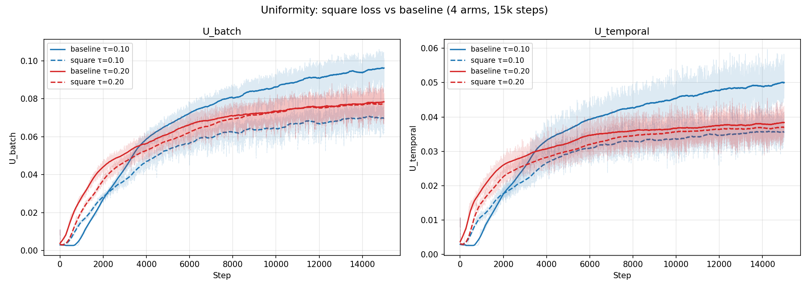

# Experiment: loss_extensions — square cross-batch negatives

## Goal

Compare AUC and Top-1 of the new `cosine_similarity_batch_square` loss
against the baseline `cosine_similarity_batch` loss, at τ=0.10 and τ=0.20.

## New loss: cosine_similarity_batch_square

Adds two cross-batch negative edges on top of `cosine_similarity_batch`:
**neg_cross_batch_forecast** (forecast embedding of element b vs forecast
of b′≠b at the same t) and **neg_cross_batch_embedding** (context h_{b,t+1}
vs h_{b′,t+1}). Together they tile the diagonal that the base loss leaves
untouched, forming a 2×2 square of negatives instead of a 1×2 rectangle.

## Protocol

| Setting | Value |
|---|---|
| Arms | 4: {baseline, square} × {τ=0.10, τ=0.20} |
| Steps | 15 000, batch 256 |
| Dataset | GIFT-pretrain-full-4096 |
| Encoder | GRU, d=384, 6 heads, 6 layers |
| RevNorm | EWMA span=128, mixup p=0.3 |

Baselines = τ=0.10/τ=0.20 arms from prior tau-sweep (identical hyperparams
except loss).

## Final-step values (step 15 000)

| Arm | AUC | Top-1 | U_batch | U_temporal |
|---|---:|---:|---:|---:|
| baseline τ=0.10 | 0.9199 | 0.7765 | 0.0939 | 0.0491 |
| square   τ=0.10 | 0.9209 | 0.7790 | 0.0687 | 0.0346 |
| baseline τ=0.20 | 0.9205 | 0.7804 | 0.0784 | 0.0376 |
| square   τ=0.20 | 0.9183 | 0.7765 | 0.0762 | 0.0360 |

## Plots

## Statistical tests on AUC / Top-1 (Welch t, steps 5 001–15 000, n=10 000 each)

| Comparison | Δ AUC | p_AUC | Δ Top-1 | p_Top-1 |
|---|---:|---:|---:|---:|
| baseline τ=0.10 vs square τ=0.10 | +0.0001 | 6.2e-01 | −0.0001 | 8.3e-01 |
| baseline τ=0.20 vs square τ=0.20 | +0.0037 | 7.9e-49 | +0.0060 | 9.3e-49 |
| baseline τ=0.10 vs baseline τ=0.20 (sanity) | −0.0017 | 2.8e-11 | −0.0038 | 1.7e-19 |
| square τ=0.10 vs square τ=0.20 | +0.0019 | 9.6e-14 | +0.0023 | 1.4e-08 |

**Caveat:** samples are consecutive training steps from a single run, not
i.i.d.; effective sample size is much smaller than n, so Welch p-values
are anti-conservative. Treat as directional, not rigorous.

## Conclusions

- **τ=0.10:** square is statistically indistinguishable from baseline on
  AUC and Top-1 (p=0.62, 0.83) — no regression.
- **τ=0.20:** square is significantly worse than baseline (Δ AUC −0.0037,
  Δ Top-1 −0.0060, p<1e-48).
- **Best arms by final AUC:** square τ=0.10 (0.9209) ≈ baseline τ=0.20
  (0.9205); the other two trail by ≤0.003.
- **Side note:** U_batch and U_temporal are lower under square at both τ
  (see uniformity values in the table) — directional support that the
  extra edges reduce batch-axis collapse, but not statistically tested.
