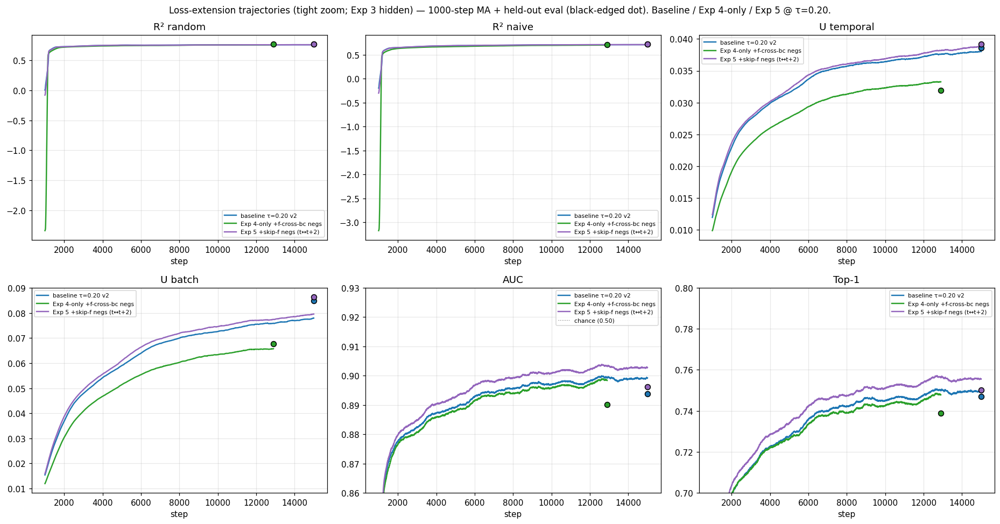

# Loss extensions — Exp 3, Exp 4-only, Exp 5 (verdicts PROVISIONAL)

> **Provisional verdicts.** These verdicts compare loss extensions to the
> τ=0.20 baseline. The τ=0.20 v2 fresh retraining over the full 15k
> steps has now completed on elisa, and the trajectory plots in this
> report use that v2 trace as the baseline. The held-out eval has not
> been re-run against v2 FINAL.pth yet — once it has, the verdicts
> below may shift.

τ-sweep Exp 1 picked **τ = 0.20 / gru** as the recipe to extend (R²_random
= 0.7731 on the held-out batch). This experiment tested three loss-shape
extensions on that recipe at τ = 0.20.

## Setup

All four arms reuse the Exp 1 recipe (gru, τ = 0.20, 15k steps, B = 256,
EWMA RevIN span 128, freq+seas emb dim 3, mixup 0.30). Only
`--loss-shape` varies:

- **baseline τ=0.20** — `cosine_similarity_batch` (Exp 1 winner).
  Trajectory CSV: τ=0.20 v2 retrain on elisa, 15,000 rows (the original
  Exp 1 τ=0.20 CSV was lost to a spot-stop event; v2 is the recovery
  retrain, and its trajectory now serves as the baseline trace here).
- **Exp 3** — `cosine_similarity_batch_add_pos_htft` (PR #181 cumulative):
  adds an `(h_t, f_t)` positive on top of the baseline `(h_t, f_{t-1})`
  positive. Run on elisa, 15k steps. Trajectory CSV: 15,000 rows.
- **Exp 4-only** — `cosine_similarity_batch_add_f_cross_negs` (PR #182
  non-cumulative): adds f-side cross-(b, c) negatives. Run on vast.ai
  5090 spot 36374874; preempted at step 12,900 / 15,000 (86 %).
  `best_loss.pth` (step 12,800, training loss 8.6948 — the same
  checkpoint the launcher would have promoted at end-of-run) is used as
  FINAL.pth. Trajectory CSV: 12,900 rows (not 15,000).
- **Exp 5** — `cosine_similarity_batch_add_skip_f_negs` (PR #184
  non-cumulative): adds an `f_t` vs `f_{t+2}` skip-step forecaster
  negative term. Reformulation of the user's original "f_t vs f_{t+1}"
  spec — for our C=1 setup `neg_zy` already covers `f_t` vs `f_{t+1}`
  same-channel, so we tested the genuinely-novel skip=2 pair. Run on
  vast.ai 5090 on-demand 36380455 (1h 8m, $0.75); 15k steps to
  completion. Trajectory CSV: 15,000 rows.

## Held-out eval (B=256, skip=50M wrap, seed=0, FINAL.pth)

| name                       | loss_shape                                | R²_random | R²_naive | U_temp | U_batch |  AUC   | Top-1  |
|----------------------------|-------------------------------------------|-----------|----------|--------|---------|--------|--------|
| baseline τ=0.20            | cosine_similarity_batch                   | 0.7731    | 0.7256   | 0.0386 | 0.0850  | 0.8938 | 0.7470 |
| Exp 3 +(h_t,f_t) pos       | cosine_similarity_batch_add_pos_htft      | 0.0129    | -0.0005  | 0.2529 | 0.3011  | 0.5079 | 0.2146 |
| Exp 4-only +f-cross-bc neg | cosine_similarity_batch_add_f_cross_negs  | 0.7708    | 0.7118   | 0.0319 | 0.0677  | 0.8902 | 0.7389 |
| Exp 5 +skip-f neg (t↔t+2)  | cosine_similarity_batch_add_skip_f_negs   | 0.7687    | 0.7218   | 0.0392 | 0.0864  | 0.8961 | 0.7500 |

(Source: `results/loss_extensions_metrics.csv`.)

## Trajectory comparison

> **Interim refresh (2026-05-09 10:07 BST).** The τ=0.20 v2 retrain
> finished its 15,000-step trajectory CSV; the baseline trace below
> now uses that full v2 trajectory (replacing the previous 4.3k-step
> partial). Held-out eval against v2 FINAL.pth has not been re-run
> yet — the black-edged dot at the rightmost step still reflects the
> earlier eval row, so verdicts remain provisional until that lands.

Tight zoom (above): AUC (0.86, 0.93), Top-1 (0.70, 0.80). Exp 3 hidden so
the spread among baseline / Exp 4-only / Exp 5 is readable. Black-edged
dot at the rightmost step is the held-out FINAL.pth eval.

For the wide view including Exp 3's chance-level flatline, see
[`plots/loss_extensions_trajectories_wide.png`](plots/loss_extensions_trajectories_wide.png)
(AUC 0.45-0.95, Top-1 0.10-0.85).

Both plots: 1000-step MA on per-step training-batch metrics.

### Trajectory observations

- **Exp 3** sits at AUC ≈ 0.51 / Top-1 ≈ 0.22 across the entire 15k
  trajectory (first-1k mean AUC = 0.538, last-1k = 0.511) — chance-level
  retrieval throughout. U_batch rises near-monotonically from 0.014 to
  0.289 (1k MA); held-out 0.301 vs baseline 0.085; held-out U_temporal
  = 0.253 vs baseline 0.039. Encoder spreads mass across many dimensions
  but that spread doesn't translate into prediction signal.
- **Exp 4-only** tracks the baseline trajectory closely. Last-1k mean
  AUC = 0.898 (steps 11,901-12,900) vs baseline v2 last-1k AUC = 0.899
  (steps 14,001-15,000).
- **Exp 5** also tracks baseline closely. Last-1k mean AUC = 0.903,
  Top-1 = 0.756 (steps 14,001-15,000) vs baseline v2 last-1k AUC =
  0.899, Top-1 = 0.750 — same magnitude. Held-out AUC delta vs
  baseline = 0.8961 − 0.8938 = +0.0023, within the ~0.005 noise band
  we'd expect across runs (held-out eval not yet re-run against v2
  FINAL.pth).
- **Baseline** trajectory now spans the full 15,000 steps (v2 retrain).
  Both Exp 4-only and Exp 5 reach baseline-level training-batch metrics
  by step ~4k and plateau there. **Held-out eval against v2 FINAL.pth
  has not been re-run yet; verdicts below remain pending that
  comparison.**

## Provisional verdicts

- **Exp 3 — PROVISIONAL REJECT.** The `(h_t, f_t)` positive is degenerate:
  the forecaster has e_t in its causal context (input at step t includes
  the encoder output at step t), so f_t can copy h_t directly. Held-out
  R²_random = 0.013 vs baseline 0.773 (Δ = −0.760); AUC at chance.
  Verdict robust against any plausible v2 baseline given the
  ~0.76 R²_random gap.
- **Exp 4-only — PROVISIONAL REJECT (no improvement).** On the held-out
  eval, the f-cross-(b, c) negative term is indistinguishable from the
  baseline as compared: AUC 0.8902 vs 0.8938 (Δ = −0.0036), Top-1 0.7389
  vs 0.7470 (Δ = −0.0081), R²_random 0.7708 vs 0.7731 (Δ = −0.0023),
  R²_naive 0.7118 vs 0.7256 (Δ = −0.0138). All deltas small and
  unfavourable. With the v2 baseline trajectory now in hand, Exp 4-only
  and baseline overlap at last-1k AUC (0.898 vs 0.899), so the earlier
  apparent trajectory advantage was an artefact of comparing against a
  partial baseline. The held-out eval magnitudes are within the ~0.005
  noise band and could shift either direction once v2 FINAL.pth is
  re-evaluated.
- **Exp 5 — PROVISIONAL REJECT (no improvement).** Held-out deltas:
  AUC 0.8961 vs 0.8938 (Δ = +0.0023), Top-1 0.7500 vs 0.7470 (Δ = +0.0030),
  R²_random 0.7687 vs 0.7731 (Δ = −0.0044), R²_naive 0.7218 vs 0.7256
  (Δ = −0.0038), U_temp 0.0392 vs 0.0386, U_batch 0.0864 vs 0.0850 —
  small mixed deltas, all within the ~0.005 noise band. The skip=2 pair
  adds neither prediction signal nor harm against this baseline.

  Hypothesis on why it's a null: at step T-2 (one before final), the new
  term contributes 0 (padded); at most other timesteps the forecaster
  has already learned to make `f_t` differ from `f_{t+2}` by the time
  the contrastive signal's other terms have done their work — so the
  extra negative is trivially satisfied and provides no additional
  pressure.

### Note on "high-U → good"

Exp 3 has held-out U_batch ≈ 0.30 and U_temporal ≈ 0.25 — much higher
than the baseline's 0.085 / 0.039 — yet AUC is at chance. Direct
counter-evidence to "high U means useful structure": a degenerate
positive can drive U up without delivering prediction signal. U is
necessary but not sufficient.

## Deviations / caveats

- **Baseline held-out eval re-run against v2 FINAL.pth is pending.**
  The trajectory plots now use the v2 full 15k baseline trace, but the
  black-edged held-out dot at step 15k still reflects the earlier eval
  row. This is the primary reason the verdicts remain provisional —
  see the disclaimer at the top.
- **Exp 4-only spot preempted at step 12,900 / 15,000.** We use the
  existing `best_loss.pth` (step 12,800) as FINAL.pth — exactly the
  launcher's end-of-run promotion. Trajectory CSV is 12,900 rows, not
  15,000. We did not resume the last ~2.1k steps because `best_loss`
  tracks lowest training loss; the end-of-run cp would not have changed
  the FINAL.pth.
- Exp 5 first attempt: vast 5090 spot 36379272 (offer 31031685, machine
  35115) was provisioned but its container never came up — SSH refused
  for 8 minutes, then status flipped to "exited" before any training
  steps. Destroyed for $0.02. Second attempt: vast 5090 spot 36379593
  (offer 22815359, machine 35231) ran for ~5500 steps, then was spot-
  preempted at minute ~25 and refused restart ($0.15). Third attempt:
  same offer 31031685 but **on-demand** instead of spot (machine 35115
  came up cleanly the second time around) — finished 15k steps in 1h 8m
  for $0.75, no preempt risk. Total spend on Exp 5: $0.92.
- Costs: Exp 4-only vast spot 36374874 destroyed after 1h 49m for $0.41.
  Exp 5 vast on-demand 36380455 destroyed after 1h 8m for $0.75
  (+ $0.17 lost to two failed spot attempts).
