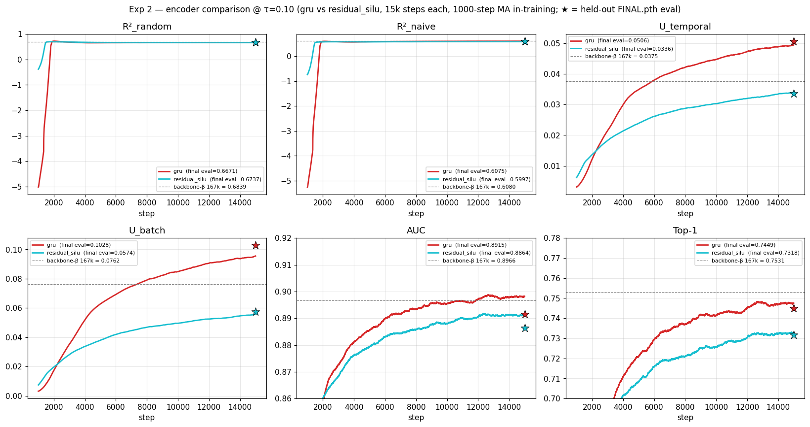

# Exp 2 — encoder swap (gru vs residual_silu) @ τ=0.10

gru wins 5 of 6 held-out metrics over residual_silu at τ=0.10 over 15k
steps; AUC gap is small (~0.005, 0.8915 vs 0.8864), Top-1 gap is
clearer (~0.013, 0.7449 vs 0.7318). residual_silu wins R²_random by
~0.007. Picked winner: **gru**.

## Setup

Single-arm comparison: residual_silu encoder vs the gru encoder used in
the τ-sweep (Exp 1). All other recipe ingredients identical to Exp 1
arm `tau_sweep_0_10`:

- `T_RAW=4096`, `C=1`, `d_model=384`, `num_layers=6`, `n_heads=6`
- `freq_emb_dim=3`, `seasonality_emb_dim=3`
- `RevEWMNorm span=128`
- `loss=cosine_similarity_batch`, fixed τ=0.10
- `mixup_p=0.3`, `batch_size=256`
- AdamW lr 1e-3 wd 0.1, β=(0.9, 0.98)
- 15,000 steps, no grad clip

The only thing that changed is `--encoder-type residual_silu` (vs
`gru` in Exp 1).

- gru baseline: `tau_sweep_0_10` (15k, elisa, from Exp 1).
- residual_silu: `exp2_residual_silu_tau_0_10` (15k, vast 36368320 RTX
  5090). Vast destroyed after final sync. Total spend on the residual_silu
  run: **$1.51** (uptime 2h 12m).

## Held-out eval (FINAL.pth)

Same held-out HF batch as Exp 1 (skip=50M wrap to row 7,260,000;
B=256; eval seed=0). Eval script:
[`experiments/2026-05-08_exp_tau_sweep/scripts/eval_tau_sweep_metrics_v2.py`](../2026-05-08_exp_tau_sweep/scripts/eval_tau_sweep_metrics_v2.py).
Results CSV:
[`experiments/2026-05-08_exp_tau_sweep/results/tau_sweep_metrics_v2.csv`](../2026-05-08_exp_tau_sweep/results/tau_sweep_metrics_v2.csv).

| backbone                       | encoder        | R²_rand | R²_naive | U_t    | U_b    | AUC    | Top1   |
|--------------------------------|----------------|---------|----------|--------|--------|--------|--------|
| tau_sweep_0_10                 | gru            | 0.6671  | **0.6075** | **0.0506** | **0.1028** | **0.8915** | **0.7449** |
| exp2_residual_silu_tau_0_10    | residual_silu  | **0.6737** | 0.5997   | 0.0336 | 0.0574 | 0.8864 | 0.7318 |

Bold = winner per metric. gru wins 5/6; residual_silu wins R²_random.

Reference (backbone-beta_167k on the same held-out batch):
R²_rand 0.6839, R²_naive 0.6080, U_t 0.0375, U_b 0.0762,
AUC 0.8966, Top1 0.7531.

## Trajectory observation

In-training 1000-step MA over the full 15k:

| backbone                       | last step | loss   | AUC_train | Top1_train | U_b_train |
|--------------------------------|-----------|--------|-----------|------------|-----------|
| tau_sweep_0_10                 | 15000     | 7.0414 | 0.9199    | 0.7765     | 0.0939    |
| exp2_residual_silu_tau_0_10    | 15000     | 7.4514 | 0.8895    | 0.7183     | 0.0597    |

residual_silu lands at a higher contrastive loss (7.45 vs 7.04) and
lower in-training AUC/Top1 throughout. On 1000-step MA, residual_silu
starts faster (early-window AUC ~0.67 vs gru ~0.54), but gru overtakes
within the first few thousand steps and stays ahead through step 15k.
The gap is not closing at step 15k.

The plot above shows the full 15k-step trajectory (1000-step MA) for
all six metrics; AUC and Top-1 panels are zoomed to (0.86, 0.92) and
(0.70, 0.78) respectively to make the late-trajectory arm-to-arm
spread legible. Stars at step 15000 mark the held-out FINAL.pth eval
values; the dashed grey line is the backbone-β 167k reference.

## Conclusion

gru wins the held-out eval on AUC, Top-1, R²_naive, U_temporal, and
U_batch; residual_silu wins only R²_random. The training trajectories
are consistent with the held-out gap. **Picked winner: gru** as the
default encoder for the next backbone.

## What this report does not cover

- Other encoder types (mlp, mlp_wide, conv) — only one alternative was
  tested in this experiment.
- Encoder × τ interactions — residual_silu was tested only at τ=0.10.
- Proxy MASE — same blocker as Exp 1.
