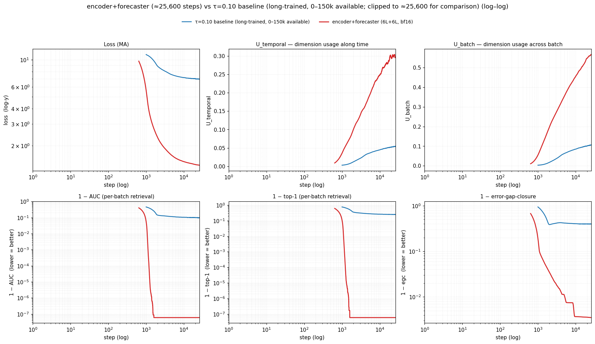
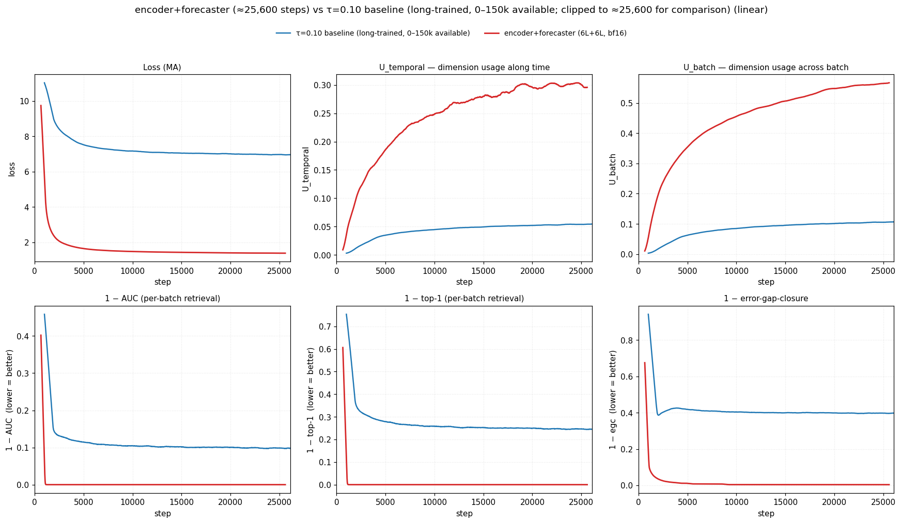

# Encoder+forecaster (6L+6L, bf16, τ=0.10) — training in progress

Training a GRU patch embedding → 6 causal transformer-encoder layers → 6 causal transformer-forecaster layers at τ=0.10 with bf16 autocast, otherwise identical to the τ-sweep baseline (`run_encoder_forecaster.sh` on elisa GPU 1, target 50k steps, batch 256).

**log–log scale**

**linear scale**

## Per-batch training metrics at the shared visible window (~25k)

Means over the last 200 steps of each window. The τ=0.10 baseline is the concatenated long-trained trajectory; its step-25k window (24 801–25 000) is sourced from the second chunk `sync_tau_sweep_0_10_50k/checkpoints/tau_sweep_0_10_50k_r2_losses.csv`.

| arm | step | loss | U_temporal | U_batch | AUC | top-1 | error-gap-closure |
|---|---:|---:|---:|---:|---:|---:|---:|
| τ=0.10 baseline (long-trained) | 24 801–25 000 | 6.942 | 0.054 | 0.106 | 0.9006 | 0.7525 | 0.605 |
| encoder+forecaster (6L+6L, bf16) | 25 401–25 600 | 1.384 | 0.298 | 0.569 | 1.0000 | 1.0000 | 0.996 |

The long-run τ=0.10 baseline is folded directly into the main baseline curve in the plots (chunks 0–15k, 15k–24.5k, 24.5k–50k, 50k–150k concatenated; on overlap the earliest chunk wins). The trajectory is clipped to ≈25.6k on the x-axis so both arms end at the same step.

## What the curves show

On the per-batch training metrics plotted (with `1-metric` on the y-axis for AUC / top-1 / error-gap-closure), the encoder+forecaster arm separates from the τ=0.10 baseline within the first few hundred steps and stays separated through 25.6k. Loss settles around 1.4 vs the baseline's ~7.0 plateau, and the per-batch AUC and top-1 saturate at the numerical 1.0 floor while the baseline holds at ~0.90 / ~0.75. Error-gap-closure tracks the same picture: the new arm closes ~99.6 % of the cosine-similarity gap between the cross-batch reference (`fp`) and a perfect positive, vs ~0.60 for the baseline. Dimension usage is also much higher under the encoder arm (U_temporal 0.30 vs 0.05; U_batch 0.57 vs 0.11 at 25k) and is still rising. The new arm's curves show no sign of degradation across the 25.6k steps seen so far.

## Caveats

- Training has stopped at ~25.6k (run interrupted before 50k target). Numbers reported here are the final per-batch averages, not held-out evaluation.
- All AUC / top-1 / loss / egc values plotted are PER-BATCH on the training distribution (256 samples, in-distribution). They are not held-out and do not directly speak to GIFT-Eval metrics. Per-batch AUC=1.0 means perfect retrieval within a 256-sample minibatch, not zero error on real forecasts.
- The encoder arm's `fp` (cross-batch reference cosine) goes negative, while the baseline keeps `fp` ≈ +0.17. Some of the "egc improvement" is the denominator `(1 - fp)` widening, not the numerator `(1 - ff)` shrinking. Held-out eval is needed to interpret.
