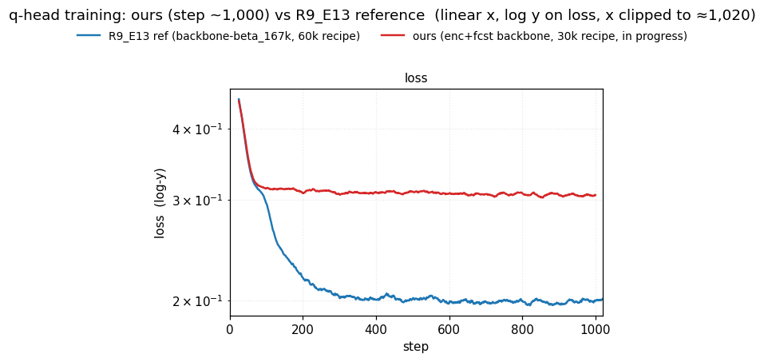

# Encoder+forecaster (6L+6L, bf16, τ=0.10) — training in progress

Training a GRU patch embedding → 6 causal transformer-encoder layers → 6 causal transformer-forecaster layers at τ=0.10 with bf16 autocast, otherwise identical to the τ-sweep baseline (`run_encoder_forecaster.sh` on elisa GPU 1, target 50k steps, batch 256). Training was stopped early at step 25 600 once per-batch metrics had saturated; the `_FINAL.pth` is the checkpoint with the lowest training loss seen up to that point.

## Held-out N=50 multisample eval (`eval_one.py`)

50 disjoint windows from `jeremycochoy/gift-pretrain-full-4096:small_v1`, B=256, T_RAW=4096, identical skip-rows list as `experiments/2026-05-08_exp_tau_sweep/scripts/eval_multisample.py`. Per-sample CSV: `results/encoder_forecaster_metrics_persample_n50.csv`; aggregate: `results/encoder_forecaster_metrics_multisample_n50.csv`.

| arm | AUC | top-1 | r²_naive | r²_random | U_temporal | U_batch |
|---|---:|---:|---:|---:|---:|---:|
| τ=0.10 baseline | 0.8993 ± 0.0054 | 0.7535 ± 0.0099 | 0.6153 ± 0.0095 | 0.6683 ± 0.0074 | 0.0512 ± 0.0012 | 0.1019 ± 0.0015 |
| **encoder+forecaster** | **0.9778 ± 0.0028** | **0.9409 ± 0.0062** | **0.8550 ± 0.0330** | **0.9078 ± 0.0184** | **0.2956 ± 0.0023** | **0.5575 ± 0.0064** |
| Δ | +0.0785 | +0.1874 | +0.2397 | +0.2395 | +0.2444 | +0.4556 |

The baseline numbers reproduce `experiments/2026-05-08_exp_tau_sweep/results/tau_sweep_metrics_multisample_n50.csv` exactly (sanity check: same eval pipeline, same skip-rows list). All deltas are many SEM apart from the baseline mean. Note this evaluates the contrastive backbone alone; downstream MASE on GIFT-Eval requires the q-head pipeline (separate training run).

**log–log scale**

**linear scale**

## Per-batch training metrics at the shared visible window (~25k)

Means over the last 200 steps of each window. The τ=0.10 baseline is the concatenated long-trained trajectory; its step-25k window (24 801–25 000) is sourced from the second chunk `sync_tau_sweep_0_10_50k/checkpoints/tau_sweep_0_10_50k_r2_losses.csv`.

| arm | step | loss | U_temporal | U_batch | AUC | top-1 | error-gap-closure |
|---|---:|---:|---:|---:|---:|---:|---:|
| τ=0.10 baseline (long-trained) | 24 801–25 000 | 6.942 | 0.054 | 0.106 | 0.9006 | 0.7525 | 0.605 |
| encoder+forecaster (6L+6L, bf16) | 25 401–25 600 | 1.384 | 0.298 | 0.569 | 1.0000 | 1.0000 | 0.996 |

The long-run τ=0.10 baseline is folded directly into the main baseline curve in the plots (chunks 0–15k, 15k–24.5k, 24.5k–50k, 50k–150k concatenated; on overlap the earliest chunk wins). The trajectory is clipped to ≈25.6k on the x-axis so both arms end at the same step.

## What the curves show

On the per-batch training metrics plotted (with `1-metric` on the y-axis for AUC / top-1 / error-gap-closure), the encoder+forecaster arm separates from the τ=0.10 baseline within the first few hundred steps and stays separated through 25.6k. Loss settles around 1.4 vs the baseline's ~7.0 plateau, and the per-batch AUC and top-1 saturate at the numerical 1.0 floor while the baseline holds at ~0.90 / ~0.75. Error-gap-closure tracks the same picture: the new arm closes ~99.6 % of the cosine-similarity gap between the cross-batch reference (`fp`) and a perfect positive, vs ~0.60 for the baseline. Dimension usage is also much higher under the encoder arm (U_temporal 0.30 vs 0.05; U_batch 0.57 vs 0.11 at 25k) and is still rising. The new arm's curves show no sign of degradation across the 25.6k steps seen so far.

## Caveats

- Training has stopped at ~25.6k (run interrupted before 50k target). Numbers reported here are the final per-batch averages, not held-out evaluation.
- All AUC / top-1 / loss / egc values plotted are PER-BATCH on the training distribution (256 samples, in-distribution). They are not held-out and do not directly speak to GIFT-Eval metrics. Per-batch AUC=1.0 means perfect retrieval within a 256-sample minibatch, not zero error on real forecasts.
- The encoder arm's `fp` (cross-batch reference cosine) goes negative, while the baseline keeps `fp` ≈ +0.17. Some of the "egc improvement" is the denominator `(1 - fp)` widening, not the numerator `(1 - ff)` shrinking. Held-out eval is needed to interpret.

## Q-head training in progress vs R9_E13 reference

Training a quantile transformer head (R9_E13 recipe: xfmr 12L causal quantile head, `e_then_f` input, cosine schedule + 2k warmup, 30k steps) on top of `enc_fcst_tau_0_10_50k_FINAL.pth`. Reference is R9_E13 itself (same recipe, 60k steps) on `backbone-beta_167k`. Only the backbone differs — this is "different backbone, same head recipe — does ours train faster / lower loss?".

Rendered by `scripts/plot_qhead_compare.py` (re-run on demand; reads CSVs from the main checkout, writes only into this experiment dir).

| arm | step window | mean training loss (last 200) |
|---|---:|---:|
| R9_E13 ref (backbone-beta_167k) at our step | 701–900 | 0.1984 |
| **ours (enc+fcst backbone, in progress)** | **701–900** | **0.3062** |

For context the R9_E13 reference's final 60k-step training loss is 0.1913 — i.e. it had already converged near its asymptote well before step 1k.

At this very early step (~900 of 30k), the two q-head training-loss curves track on top of each other for the first ~60 steps, then the R9_E13 reference drops through ~0.30 and continues down to ~0.20 by step 300, while our arm plateaus around ~0.31 from step ~100 onward and stays there. No conclusions on final head quality yet — the run is <3% of the way through 30k.

### Caveats
- Training is in progress — at step ~700 of 30k as of this writing.
- Per-step head metrics are training losses (per-batch on the streamed training distribution), not held-out evaluations.
- The reference uses a different backbone (`backbone-beta_167k`), so any gap reflects both backbone differences and head warm-up dynamics; held-out + downstream GIFT-Eval are needed to interpret.
