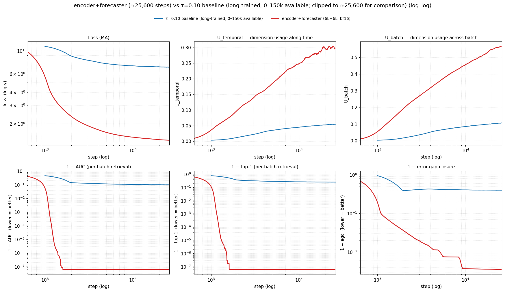
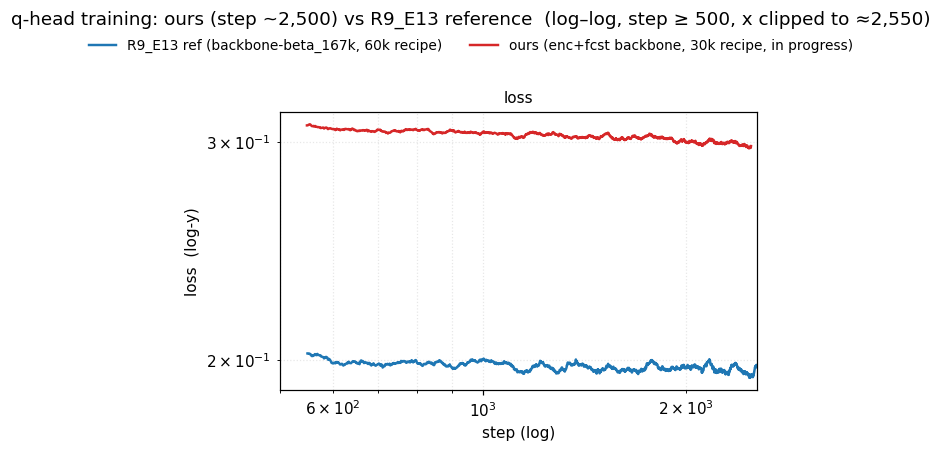

# Encoder + Forecaster — FAILED

**Triage GIFT-Eval GM-Relative MASE = 1.596** vs seasonal naive 1.000 vs R9_E13 reference (same q-head recipe on `backbone-beta_167k`) 0.990. The triage gate (< 1.0 → full eval) failed; full eval was not launched.

## TL;DR

- A 6-layer causal transformer **encoder** inserted between the GRU patch embedding and the existing 6-layer forecaster *appears* to dominate the τ=0.10 baseline on every held-out contrastive number (legacy AUC 0.978 vs 0.899, top-1 0.941 vs 0.754, R²_naive 0.855 vs 0.615).
- It does not transfer downstream. A 12L quantile head trained with the R9_E13 recipe on this backbone plateaus at training loss ≈ 0.28 vs the reference's ≈ 0.20, and the GIFT-Eval triage GM-Relative MASE comes in at **1.596** — 60% worse than seasonal naive and 61% worse than the R9_E13 reference (0.990).
- The legacy contrastive metric only used 4 same-sample temporal negatives at lags {1, 2, 4, 8}. The added encoder layers are deep enough to learn a position counter (causal-attention depth + L2 norm); the counter aces those negatives without encoding forecasting content.
- This was confirmed downstream by the q-head failure (the test that adjudicated) and on synthetic data by the new metric: pure positional encoding scores AUC=1.0 on the legacy metric, AUC=0.333 on `retrieval_auc_topk_batch_temporal` (PR #272), which adds cross-batch negatives at the positive time step.
- Three fixes landed on `experiments` for the follow-up: `--encoder-dropkey p` (PR #268) to make the position-counting shortcut lossy; `retrieval_auc_topk_batch_temporal` (PR #272) so per-batch saturation can no longer hide the shortcut; bf16 q-head training (PR #264). Recommendation: gate early stopping on `auc_bt`, not `auc`.

*Encoder+forecaster (orange) vs τ=0.10 baseline (blue). Per-batch on the training distribution; saturates near AUC=1.0 by step ~1k and stays there.*

## Goal

Test whether a 6-layer causal transformer **encoder** inserted between the existing GRU patch embedding and the existing 6-layer causal forecaster improves the backbone, measured by GIFT-Eval MASE through a quantile head trained on top of the frozen backbone. Same building block as the forecaster (causal `DecoderOnlyTransformerLayer`).

## Protocol

**Backbone (this arm)**: GRU patch embedding → 6× causal transformer encoder layers → 6× causal transformer forecaster layers. H=384, n_heads=6, ffn_mult=4, depthwise_conv=3, dropout=0.1, RevEWMNorm span=128, freq+seasonality embeddings dim=3 each. Total 22.06M params. All hyperparameters identical to the `tau_sweep_0_10` arm (τ=0.10, batch=256, lr=1e-3, AdamW β=(0.9, 0.98), wd=0.1, mixup p=0.3, `cosine_similarity_batch` loss) except for the new encoder stack and bf16 autocast on forward + loss (fp32 master weights and optimizer state). Trained on `jeremycochoy/gift-pretrain-full-4096:small_v1`. Run script: `scripts/run_encoder_forecaster.sh`.

**Training stop**: 25 600 steps. Per-batch AUC and top-1 had saturated at 1.0 by ~1k steps and stayed there; per-batch training loss had plateaued near 1.39 from ~10k onward. The original 50k target was abandoned once that plateau was clear. `enc_fcst_tau_0_10_50k_FINAL.pth` is the `_best_loss.pth` snapshot at this stop. ~2.6 GPU-hours on elisa GPU 1 (RTX 4090, bf16 autocast, ~165 steps/min).

**Q-head**: R9_E13 recipe mirrored exactly — xfmr 12L causal quantile head, `e_then_f` train input, Moirai HPs, cosine schedule with 2k warmup decaying to lr×0.1, `--reconstruction forecaster`. The original R9_E13 ran 60k steps; we budgeted 30k. Rationale from R9_E13's own loss CSV (`sync_qhead_beta_rd9/checkpoints/R9_E13_..._losses.csv`, ±500-step window means):

| step | 10k | 20k | **30k** | 45k | 60k |
| ---- | --: | --: | ------: | --: | --: |
| loss | 0.19435 | 0.19363 | **0.19310** | 0.19270 | 0.19220 |

Δ(30k→60k) = 0.0009 = 0.5% reduction. Training loss is essentially flat past 30k, so the cosine schedule was compressed to 30k. The run was stopped early at step **15 200** once the gap to the reference had been steady for thousands of steps and the per-batch curve had stopped moving — consistent with the project principle "head training ≤ backbone steps" (the backbone here was stopped at 25.6k). Run script: `scripts/run_qhead_training.sh`.

**GIFT-Eval triage**: 11-config subset (`bizitobs_application/10S`, `bizitobs_l2c/{5T,H}`, `bizitobs_service/10S`, `covid_deaths/D`, `electricity/H`, `ett1/{15T,H}`, `ett2/{15T,H}`, `us_births/D` — all `/short`), strategy B4, forecast length 16. Total ~5 min wall. Triage gate: GM-Relative MASE < 1.0 ⇒ launch full eval. Run script: `scripts/run_gift_eval_triage.sh`.

**Cost**: backbone 2.6 h + N=50 held-out eval 7 min + q-head 1.5 h + triage 5 min ≈ **4.2 GPU-hours**. Triage gate saved the ~6 GPU-hours a full GIFT-Eval would have cost.

## Results

### GIFT-Eval triage (the test that adjudicated)

`results/gift_eval_triage/summary.txt`. **GM-Relative MASE** = geometric mean across configs of `(model MASE / seasonal-naive MASE on that config)`; 1.000 = on average parity with seasonal naive.

| arm                                                                       | triage GM-Relative MASE |
| ------------------------------------------------------------------------- | ----------------------: |
| Seasonal naive                                                            |                   1.000 |
| Moirai (leaderboard)                                                      |                   0.809 |
| R9_E13 reference (backbone-beta_167k + same xfmr-12L head recipe)         |                   0.990 |
| **ours (encoder+forecaster + xfmr-12L head, 15.2k head steps)**           |               **1.596** |

Per-config (`results/gift_eval_triage/all_results.csv`): two of 11 below seasonal naive (`bizitobs_l2c/5T` 0.612, `us_births/D` 0.978); high-frequency configs particularly bad (`bizitobs_application/10S` 4.977, `bizitobs_service/10S` 4.588, `electricity/H` 1.942, `covid_deaths/D` 1.800).

### Backbone — legacy contrastive metric (N=50 held-out, looks great, is misleading)

`results/encoder_forecaster_metrics_multisample_n50.csv` — 50 disjoint windows from `jeremycochoy/gift-pretrain-full-4096:small_v1`, B=256, T_RAW=4096. Same eval pipeline as `experiments/2026-05-08_exp_tau_sweep/scripts/eval_multisample.py` (baseline numbers below reproduce the canonical tau-sweep CSV byte-for-byte). **The AUC/top-1 in this table is the legacy `retrieval_auc_top1` — for each query `(b, t, c)` the positive is `h[b, t+1, c, :]` and the only negatives are `h[b, t-k, c, :]` for k ∈ {1, 2, 4, 8}: same sample, same channel, recent past.** There are no cross-batch, no cross-channel, no far-future negatives. AUC = mean over queries of (fraction of negatives the positive beats); top-1 = fraction of queries where the positive beats all four.

| metric (definition)                                                              | τ=0.10 baseline | encoder+forecaster   |      Δ |
| -------------------------------------------------------------------------------- | --------------- | -------------------- | -----: |
| AUC (4 same-sample temporal negs at lags {1,2,4,8})                              | 0.8993 ± 0.0054 | **0.9778 ± 0.0028**  | +0.078 |
| top-1 (positive beats all 4 negs)                                                | 0.7535 ± 0.0099 | **0.9409 ± 0.0062**  | +0.187 |
| R²_naive (1 − E[1−cos(f, h_{t+1})] / E[1−cos(h_t, h_{t+1})]; higher better)        | 0.6153 ± 0.0095 | **0.8550 ± 0.0330**  | +0.240 |
| U_temporal (effective dim usage along time; 1 / (d · mean off-diag cosine²))     | 0.0512 ± 0.0012 | **0.0045 ± 0.0001**  | −0.047 |
| U_batch (effective dim usage along batch; same formula)                          | 0.1019 ± 0.0015 | **0.0209 ± 0.0011**  | −0.081 |

All deltas are many SEM apart. AUC / top-1 / R²_naive look like a strong win. **U_temporal and U_batch drop ~10×**, meaning the held-out encoder latents collapse onto a much narrower subspace than the baseline's — consistent with the encoder allocating most of its representation to a single quantity (time position) instead of distributing capacity across content features.

### Backbone — per-batch training trajectory vs the long-trained τ=0.10 baseline

Means over the last 200 steps of each window. The τ=0.10 baseline is the long-trained tau-sweep arm; its 25k window is taken from `sync_tau_sweep_0_10_50k/checkpoints/tau_sweep_0_10_50k_r2_losses.csv` (steps 24 801 – 25 000). The encoder+forecaster window is from `checkpoints/enc_fcst_tau_0_10_50k_losses.csv` (steps 25 401 – 25 600). **All per-batch metrics — loss / AUC / top-1 / U — are on the training batch (256 in-distribution samples), not held-out.**

| arm                              | step window     | loss  | U_temporal | U_batch | AUC    | top-1  |
| -------------------------------- | --------------: | ----: | ---------: | ------: | -----: | -----: |
| τ=0.10 baseline (long-trained)   | 24 801 – 25 000 | 6.942 |      0.054 |   0.106 | 0.9006 | 0.7525 |
| encoder+forecaster (6L+6L, bf16) | 25 401 – 25 600 | 1.384 |      0.298 |   0.569 | 1.0000 | 1.0000 |

Per-batch U values (training) are an order of magnitude higher than the held-out U values above — the model's "dimension usage" in distribution looks much richer than what survives on held-out windows. The held-out collapse is what the legacy AUC fails to detect.

### Q-head training trajectory — ours vs R9_E13 reference

Backbone is the only difference: same head architecture, same head recipe, same loss, same data. `enc_fcst_qhead_xfmr12L_quant_30k_losses.csv` vs `R9_E13_xfmr12L_quant_moirai_cosine_e_then_f_60k_losses.csv`.

| arm                                    |     step window | mean training loss (last 200) |
| -------------------------------------- | --------------: | ----------------------------: |
| R9_E13 ref (backbone-beta_167k)        |   2 301 – 2 500 |                        0.1960 |
| **ours (encoder+forecaster backbone)** |   2 301 – 2 500 |                    **0.2988** |
| ours, final 200 steps before stop      | 15 001 – 15 200 |                        0.2808 |

For context, the R9_E13 reference's final 60k-step training loss is 0.1913 — already near its asymptote by step ~2k. Our arm sits at ~0.30 by step 2.4k and does not break below ~0.28 across the remaining 12 800 steps. The q-head cannot extract enough forecasting content from the encoder+forecaster latents to close the gap — even when given the same architecture and recipe that closes it on the older backbone.

## Diagnosis: positional-counting shortcut (hypothesis, confirmed downstream and on synthetic data)

**Mechanism (hypothesis).** Six causal transformer encoder layers can implement a position counter trivially: each causal-attention layer can copy a "tick" through self-attention, depth composes into a count. L2-normalizing the encoder output makes that count a unit-norm signal occupying a sub-space of `h[t]`. The legacy `retrieval_auc_top1` then resolves: the positive is at time `t+1`, the four negatives are at times `t−1, t−2, t−4, t−8`. A model that encodes only "I am at time *t*" — and nothing else — distinguishes the positive from each negative perfectly. The contrastive loss with cross-batch negatives at training time also rewards a sharp position channel (different samples at the same time *t* are easy to push apart on content channels, and the gradient finds the easier shortcut first).

**Predicted consequences**, observed:

1. Legacy AUC / top-1 saturate near 1.0 per-batch by ~1k steps and stay there. ✓ (training log)
2. Held-out U_temporal and U_batch collapse to ~0.005 and ~0.02 — the latents lose dispersion as the position channel dominates. ✓ (held-out CSV)
3. R²_naive stays high — the forecast `f[t]` lands close to `h[t+1]` in cosine space because both are dominated by the same position channel, so the cosine error vs the naive `h[t]→h[t+1]` baseline goes way down. ✓
4. A downstream head cannot recover forecasting content the encoder threw away. ✓ (q-head loss plateau at 0.28 vs ref 0.20; triage MASE 1.596 vs ref 0.990).

**Controlled validation on synthetic data** (PR #272 smoke test): a pure positional encoding (`h[b, t, c, :]` identical across batch at each time, `f` independent of batch) scores AUC = 1.0 on `retrieval_auc_top1` (fooled — same-sample temporal negs all have the wrong position) but AUC = 4/12 ≈ 0.333 on `retrieval_auc_topk_batch_temporal` (cross-batch negatives at the positive time tie with the positive on the position channel; strict `>` counts as a miss). This is a synthetic-data check that the legacy metric is blind to the shortcut and the new metric catches it.

**Caveat.** The data does not say whether much longer training (past the 25.6k stop) would eventually transition from the shortcut to content features. Per-batch saturation of the legacy metric is therefore not a trustworthy early-stop signal under this arm.

## Follow-up — three fixes already landed

1. **`--encoder-dropkey p`** (PR #268, merged 2026-05-10). Per-step, per-encoder-layer fresh random mask drops a fraction *p* of below-diagonal attention entries. Above-diagonal stays −∞ (causality preserved); diagonal stays 0 (self always allowed). At p=0.5 a position counter at time *t* becomes ~Binomial(*t*, 0.5) per layer; noise compounds across depth, the marginal value of allocating capacity to a position counter drops, and content features have to carry the contrastive signal.
2. **`retrieval_auc_topk_batch_temporal`** (PR #272, merged 2026-05-10). Adds 8 cross-batch negatives at the positive time step (`h[b', t+1, c, :]` for b' ∈ random subset of `{0..B-1}\{b}`) alongside the legacy 4 temporal negatives. Reports `auc`, `top1`, `top3`. Wired into `eval_multisample.py` as new columns `auc_bt / top1_bt / top3_bt`; future N=50 eval CSVs carry the columns automatically. Cross-channel negatives are deferred (asserts C == 1 until backbone supports C > 1).
3. **bf16 q-head training** (PR #264, merged 2026-05-10). `--amp-dtype {none,bf16,fp16}` on `train_forecasting_head.py`. The 12L head training is the dominant wall-clock in the GIFT-Eval pipeline; bf16 cuts it roughly in half for the next round.

**Open recommendation**: gate early stopping on `auc_bt` (and the rest of the `_bt` columns), not `auc` / `top1`. Train longer — per-batch saturation of the legacy metric is no longer a reliable signal under this architecture class.

## Files in this directory

- `REPORT.md` — this file (the canonical experiment record).
- `results/encoder_forecaster_metrics_multisample_n50.csv` — held-out N=50 aggregates for both arms.
- `results/encoder_forecaster_metrics_persample_n50.csv` — per-window breakdown (50 rows × 2 arms).
- `results/gift_eval_triage/all_results.csv` — per-config triage metrics (MASE / sMAPE / etc., 11 rows).
- `results/gift_eval_triage/summary.txt` — leaderboard-format triage summary (the 1.596 number).
- `results/run_enc_fcst_tau_0_10_50k.log` — backbone training stdout (step 100 → 25 600).
- `results/run_enc_fcst_qhead_xfmr12L_quant_30k.log` — q-head training stdout (step 1 → 15 200).
- `results/eval_one.log` — N=50 held-out eval stdout.
- `plots/progress.png`, `plots/progress_linear.png` — backbone per-batch trajectory vs τ=0.10 baseline (log-log and linear). Rendered by `scripts/plot_progress.py`.
- `plots/qhead_compare.png`, `plots/qhead_compare_loglog.png` — q-head training loss vs R9_E13 reference, log-x, skip step < 500. Rendered by `scripts/plot_qhead_compare.py`.
- `scripts/run_encoder_forecaster.sh` — backbone training launcher (elisa GPU 1, bf16, τ=0.10, 50k target, stopped 25.6k).
- `scripts/run_qhead_training.sh` — q-head training launcher (R9_E13 recipe, 30k budget, stopped 15.2k).
- `scripts/run_gift_eval_triage.sh` — 11-config GIFT-Eval triage launcher.
- `scripts/eval_one.py` — N=50 held-out eval (reuses `experiments/2026-05-08_exp_tau_sweep/scripts/eval_multisample.py` helpers).
- `scripts/plot_progress.py`, `scripts/plot_qhead_compare.py`, `scripts/plot_trajectory.py` — plotters.
