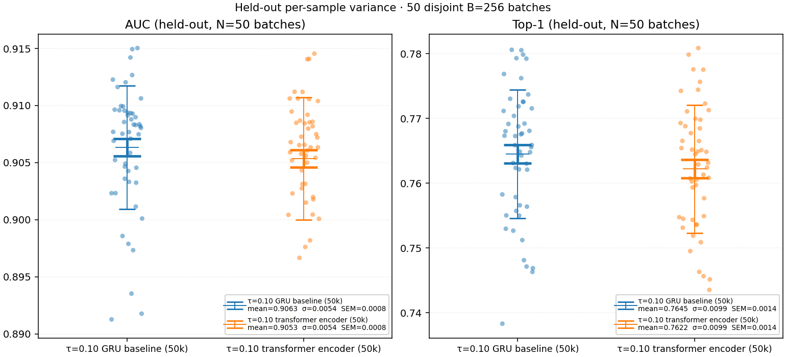
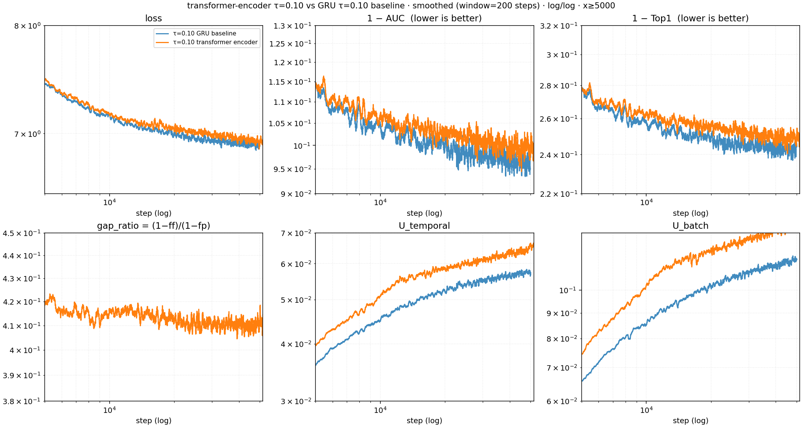

# Transformer encoder vs GRU+skip — RESULTS

## Goal / question

Does swapping the per-patch GRU+linear-skip encoder for a small (2-layer)
within-patch decoder-only transformer change the encoder's
representation quality, retrieval discrimination, dimension usage, and
forecast-match metrics? The question matters because the GRU+skip is
the patch-level building block under every backbone-beta and τ-sweep
arm so far, and the contrastive forecasting recipe carries arbitrary
inductive biases from that choice.

## Protocol

### Architecture diff vs τ=0.10 baseline

Everything except the per-patch encoder is identical to the
`tau_sweep_0_10` arm at
[experiments/2026-05-08_exp_tau_sweep/RESULTS.md](../2026-05-08_exp_tau_sweep/RESULTS.md):
6-layer × 384-D backbone, T_RAW=4096, B=256, AdamW lr=1e-3
(weight_decay=0.1, betas=(0.9, 0.98)), RevEWMNorm span=128,
freq_emb_dim=3, seasonality_emb_dim=3, mixup_p=0.3, τ=0.10 fixed,
loss=`cosine_similarity_batch`, 50,000 steps from scratch.

| component | baseline (`tau_sweep_0_10`) | this run (`transformer_encoder_tau_0_10_50k`) |
|---|---|---|
| per-patch encoder | bidirectional GRU on the W=16 (or W'=22 with freq+seas) scalar sequence + `Linear(W', H)` skip + LayerNorm | `Linear(1, H=384)` per scalar position + 2 decoder-only causal transformer layers attending across the 22 tokens of one patch + last-token pool |
| backbone | 6L decoder-only causal transformer, d=384, 6 heads, ffn_mult=4, depthwise causal conv kernel=3 | identical |

The within-patch transformer attends across the 22 tokens of a single
patch (the 16 raw scalars plus 3 freq + 3 seas embedding values
concatenated as additional positions). Each (B, T, C) triple is
encoded independently in parallel — same axis the GRU operated on.
Encoder layer recipe matches the backbone (norm-first, depthwise
causal conv kernel=3, GeLU, no bias, ffn_mult=4).

### Held-out evaluation

50 disjoint B=256 batches drawn from
`jeremycochoy/gift-pretrain-full-4096/small_v1` at skip_rows
50,000,000 + i × (42,740,000 / 50) for i ∈ [0, 50). Same skip_rows
list as the τ-sweep eval, so the per-batch values are directly
comparable to the τ-sweep table. `eval_held_out.py` rebuilds each
backbone from its state_dict, runs in fp32 with `model.eval()`, and
computes the 6 metrics below.

### Metrics tracked

| metric | what it measures |
|---|---|
| `R²_random` | forecast-match vs random pair — improvement over a baseline that pairs forecasts with arbitrary held-out targets |
| `R²_naive` | forecast-match vs naive last-step — improvement over a "no-change" baseline that copies the previous encoder output as the prediction |
| `U_temporal` | dimension usage along the time axis — how much of the 384-D encoder-output space is spanned by one series across its time positions (averaged over batch) |
| `U_batch` | dimension usage along the batch axis — how much of the 384-D space is spanned by different series at the same time position (averaged over time) |
| `AUC` | retrieval discrimination — per-query, fraction of past-window negatives that the positive ranks above |
| `Top-1` | retrieval discrimination, strict — fraction of queries where the positive beats every past-window negative simultaneously |

All values are means across the N=50 held-out batches. `±` shows the
sample standard deviation across the 50 batches; SEM = stdev/√50 is
reported separately.

A new training-time CSV column `gap_ratio = (1−ff)/(1−fp)` was added
on this run (forecast-vs-future cosine gap normalised by past-vs-future
gap; lower is better, ff→1 drives the numerator to 0). It's a per-step
diagnostic only and not a held-out comparison metric.

## What we learned

### Held-out N=50 (mean ± stdev)

| backbone | encoder | R²_random | R²_naive | U_temporal | U_batch | AUC | Top-1 |
|---|---|---|---|---|---|---|---|
| `tau_sweep_0_10` | GRU+skip | 0.6683 ± 0.0074 | 0.6153 ± 0.0094 | 0.0512 ± 0.0012 | 0.1019 ± 0.0015 | 0.8993 ± 0.0053 | 0.7535 ± 0.0098 |
| `transformer_encoder_tau_0_10_50k` | 2L within-patch transformer | 0.6606 ± 0.0073 | 0.6128 ± 0.0091 | **0.0649 ± 0.0017** | **0.1402 ± 0.0035** | **0.9053 ± 0.0054** | **0.7622 ± 0.0099** |
| Δ (transformer − GRU) |  | −0.0077 | −0.0025 | **+0.0137** | **+0.0383** | **+0.0060** | **+0.0087** |
| Δ in SEM units (paired) |  | −5.4σ | −1.4σ | +47σ | +71σ | +5.6σ | +6.3σ |

The transformer encoder beats the GRU+skip on retrieval (AUC, Top-1)
by ~5-6 SEM and on representation spread (U_temporal, U_batch) by
~50-70 SEM. It loses on R²_random by ~5σ and is statistically tied
on R²_naive.

### Per-sample distribution

Across the 50 held-out batches, the transformer encoder's per-batch
AUC and Top-1 distributions sit *above* the GRU baseline's. The mean
shift is uniform; it is not driven by a few outlier batches.

### In-training trajectory

(Smoothed, rolling window=200 steps. log/log axes. x ≥ 5,000 to skip
the early-step transient.)

In-batch training-time AUC and Top-1 *plateau slightly below* the GRU
baseline. The held-out N=50 numbers are *higher*, so the transformer's
representation generalises with a smaller train→eval gap than the GRU
does. U_temporal and U_batch grow continuously above the baseline
across the whole 5k-50k window and the gap is widening at step 50k —
they had not plateaued.

## Verdict

The within-patch transformer encoder is a Pareto improvement on the
GRU+skip for retrieval (AUC +0.0060, Top-1 +0.0087, both well above
SEM) and for dimension usage (U_temporal +27%, U_batch +38% relative,
both at >40σ). It pays a small but real cost on R²_random
(−0.0077, −5σ) and is tied on R²_naive. The same axis-of-trade
appears in the τ-sweep across τ values: AUC/U go one way, R² the
other.

### Caveats

- The transformer encoder is heavier in compute: ~14.5 M parameters
  total vs ~10.5 M for the GRU baseline; ~1.1 s/step on a single
  RTX 4090 vs ~0.3 s/step for the baseline (under bf16 autocast,
  N=65k length-22 sequences chunked at chunk_size=16384, with
  activation checkpointing inside the encoder).
- A within-patch transformer over a 22-token sequence at 384-d width
  is likely overdimensioned for the task; the result confirms that
  the GRU was the limiting block but does not by itself prove the
  transformer is the *best* replacement. A 1-layer or 0-layer
  ablation (Linear(1→H) followed by no transformer) would isolate
  how much of the gain comes from the per-scalar projection alone
  versus the within-patch attention.
- All numbers are at 50k steps. U_temporal / U_batch had not plateaued
  by step 50k — the relative gap may grow further with more training,
  or compress.

### Next steps

1. **Encoder-over-T arm.** Add a separate transformer encoder that
   attends *across* T patches (between the patch encoder and the
   forecaster), keeping the GRU patch encoder for single-variable
   comparison vs `tau_sweep_0_10`.
2. **Within-patch ablation.** 0-layer / 1-layer / 2-layer (this run)
   variants with the same Linear(1→H) front-end, to isolate the
   per-scalar projection from the within-patch attention.

## Reproducing

Code lives on branch `transformer-encoder-experiment` (PR #254) and
`experiments/2026-05-10_exp_transformer_encoder/`:
- `scripts/run.sh` — 50k from-scratch trainer
- `scripts/eval_held_out.py` — N=50 multisample held-out eval (handles
  both transformer and GRU encoders by detecting type from state_dict)
- `scripts/plot_transformer_vs_baseline.py` — trajectory plot
- `scripts/plot_persample_variance.py` — per-sample variance plot
- `EXECUTION_LOG.md` — operational notes (memory adaptations for the
  24 GB elisa GPU; not part of the reproducible recipe)

The held-out eval CSVs (one row per arm, plus per-sample CSVs) live
under `results/`.
