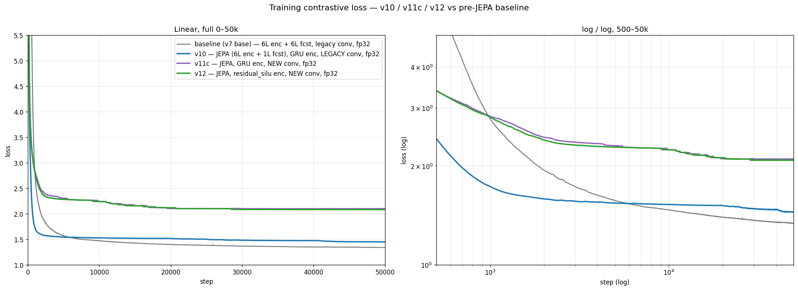
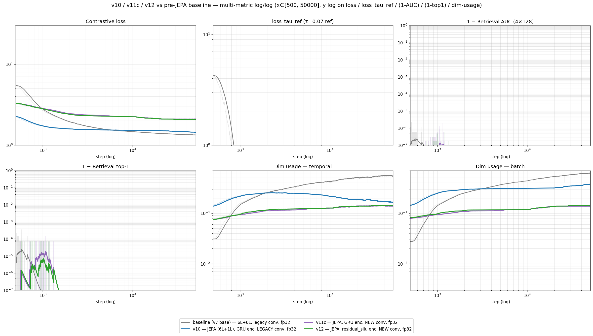

# encoder-forecaster v2 — backbone sweep + fp16/bf16 stability

## Goal

Find the best JEPA-style encoder-forecaster backbone (GRU patch encoder
→ causal encoder → causal forecaster) by full GIFT-Eval, and determine
whether partial-fp16 training is a safe speedup.

**Metric.** GM-Relative MASE = geometric mean over configs of
(model MASE ÷ seasonal-naive MASE). Lower is better; 1.0 = seasonal
naive. "Full" = 97 configs, "triage" = 11-config screen. Held-out
forecasting accuracy on GIFT-Eval; says nothing about contrastive
in-training fit.

## Backbone sweep — verdict

Full GIFT-Eval (97 configs), 2L transformer q-head:

| Backbone | Full GM-MASE | Note                                  |
|----------|-------------:|---------------------------------------|
| **v11c** |    **1.292** | best — enc6/fcst1, dropkey 0.9 shared |
| v16      |        1.335 | enc6/fcst1, dropkey 0.7               |
| v17      |        1.409 | enc6/fcst1, dropkey 0.95              |
| v13      |        1.451 | fcst-bottleneck d=128, 4 heads        |
| v15      |        1.558 | enc6/fcst4, dropkey 0.9               |
| v14      |        1.661 | enc6/fcst6, dropkey 0.9               |

Triage-only reference (11 configs, no full eval run): v7 baseline
1.512, v10 (JEPA) 1.437, v12 (residual-SiLU) 1.514.

**v11c wins decisively.** Best forecaster depth = 1 layer; deeper
forecasters (v15 fcst4, v14 fcst6) monotonically worsen. dropkey
0.9 > 0.7 > 0.95. None beat the GIFT-Eval gate (1.0) or seasonal naive.

**Triage is an optimistic-direction-but-noisy proxy.** Triage(11) ran
~7% pessimistic vs full(97) for v11c/v15/v16, only +4% for v13, and
+22% for v17 — ranking is preserved at the top but the gap to mid-pack
is compressed. Trust full eval for any decision finer than ~10%.

## Why the winning lineage uses new-conv placement

**Question.** Every winning arm above moves the depthwise causal conv
(kernel 3) off the residual stream onto the self-attention input only
("new" placement) instead of applying it in place on the residual
("legacy"). Does that placement help, and is contrastive loss a good
guide to it?

**Vocabulary.** *dropkey 0.9* — 90 % of attention keys randomly masked
each step; the bottleneck that forces the contrastive task to be hard.
*Dim usage (temporal / batch)* — fraction of representation dimensions
carrying non-trivial variance along the time / batch axis; higher =
information spread over more dimensions, lower = collapse into few.
*Retrieval AUC / top-1* — how well a forecast embedding retrieves its
own future among in-batch negatives (1.0 = perfect).

**Arms** — fresh init, step 0, 50 k steps, identical except where
noted: pre-JEPA baseline (v7, 6 L enc + 6 L fcst, legacy conv) · v10
(JEPA, GRU enc, 1 L fcst, **legacy** conv) · v11c (JEPA, GRU enc,
**new** conv) · v12 (JEPA, residual-SiLU enc, **new** conv).

New-conv arms (v11c, v12) plateau at contrastive loss ≈ 2.10 — ≈ 0.65
**above** legacy-conv v10 (≈ 1.45) and ≈ 0.75 above the baseline
(≈ 1.34, still descending). v11c ≈ v12 throughout, so the gap is the
conv placement, not the encoder variant.

Dim usage gives the same ranking (temporal axis, final values):
new-conv arms ≈ 0.14, legacy-conv v10 ≈ 0.16 (after peaking ≈ 0.25
mid-run then declining), baseline ≈ 0.5 +; the batch panel shows the
same order. Retrieval AUC and top-1 are saturated (1 − metric ≈ 1e-7,
off-scale after ~1 k steps) and non-discriminating.

**Result — the contrastive-training signal does not explain the
ranking.** New-conv v11c trains to ≈ 0.65 *higher* contrastive loss
than legacy-conv v10 and to lower dim-usage than both v10 and the
baseline, yet v11c is the decisive, reproducible best backbone on full
GIFT-Eval (sweep table above, GM-MASE **1.292**). Triage is
directionally consistent (v11c 1.388 < v10 1.437 < v7 baseline 1.512)
but the v11c–v10 gap (~3 %) is within triage noise, so the curves
here — not triage — carry the point. Sharper still: v11c and v12 share
an identical loss curve and dim-usage (same conv placement) yet differ
by ~9 % in triage MASE (1.388 vs 1.514) — the encoder variant is
invisible to the contrastive loss but decisive downstream.

Contrastive loss, dim-usage and retrieval are therefore unreliable
proxies for forecasting quality here; only held-out GIFT-Eval ranks
these arms (triage ±7–22 % noisy — read as directional; full eval is
the decision metric).

**Hypothesis (not measured).** Legacy in-place conv (k = 3) leaks ±2
positions into the residual stream *upstream* of the dropkey-0.9-masked
attention; stacked over 6 encoder layers this partially bypasses the
dropkey bottleneck, inflating in-training contrastive fit without
improving the representation. New placement (conv on the SA input only)
removes the leak, so the contrastive task is genuinely harder but the
backbone forecasts better. A lower-dropkey ablation on the legacy arm
would test this directly.

> Reproducible: `python3 scripts/plot_v10_v11c_v12_vs_baseline.py` and
> `…_multi_metric.py` regenerate these plots from the training-loss
> CSVs in `results/train_losses/` (pulled from elisa, byte-verified).

## Reproducibility & robustness

- **v11c is not a lucky-init outlier.** A fresh q-head retrain on the
  same frozen v11c backbone reproduced triage **1.388 exactly**.
  v11c at a 50k backbone snapshot scored **1.365** (better than the
  earlier snapshot) — v11c keeps improving with more backbone training,
  so it is a real effect, not seed luck.
- **2L q-head beats 12L.** A 12L transformer head *hurts* well-trained
  backbones (v11c 1.388 → 1.519) and only *helps* over-constrained ones
  (v17 1.718 → 1.576, v15 1.671 → 1.602). 2L is the right head.

## fp16 / bf16 stability — verdict

Goal: replace the fp32 GRU/RevEWMNorm path with fp16/bf16 for a
~25-30% speedup. Tested on the v11c/v16 recipes.

**Fresh-init partial-fp16 diverges in every tested combination:**
all-fp16-body, attn-fp32-rest-fp16, and residual-fp32-rest-fp16 all
blow up (loss → 10+) within 1k–3k steps. dropkey 0.7 only *delays*
divergence (v19: ~38k vs v18: ~2.8k) — it does not prevent it.

**The only robust speedup is fp32 warmup (~5k steps) → fp16.** v20
(fresh seed, 5k fp32 warmup then fp16 body) is healthy and stable past
41k steps at report time (loss ~2.11). A separate warm-resume
"precision-envelope" sweep — resuming the *trained* v11c_5k checkpoint
under five fp16/bf16 axes — was stable on all five to 15k. So the
fragility is specific to **fresh-init** fp16; once the residual stream
is warmed up, fp16 holds.

**Mechanism.** Instrumentation shows the residual-stream max-abs
amplitude grows unbounded with depth and training (forecaster block:
~80 at step 200 → ~1070 by step 2800, an >8× blowup), while attention
QK logits stay bounded (~30-60). fp16's narrow mantissa cannot
represent the growing residual magnitudes; fp32 warmup lets the
network settle into a lower-amplitude regime before the cast.

Run-by-run divergence steps, the full amplitude tables, the
precision-envelope and at40k/12L apples-to-apples sets, and the git
branch-divergence note are in
[`EXPERIMENT_LOG_2026-05-15_fp16_precision.md`](notes/EXPERIMENT_LOG_2026-05-15_fp16_precision.md).

## What we learned

1. **Best backbone = v11c** (enc6 / fcst1 / dropkey 0.9 shared),
   full GM-MASE **1.292**. Shallow forecaster + high shared dropkey
   wins; it improves with more training and reproduces exactly.
2. **No arm beats seasonal naive** on full GIFT-Eval — the
   encoder-forecaster architecture as configured is not competitive
   yet; this is an architecture ceiling, not undertraining or seed.
3. **Fresh-init fp16 is unsafe; fp32-warmup→fp16 is safe.** Caused by
   unbounded residual-amplitude growth, not attention. Use the v20
   recipe for any future fp16 speedup.
4. **Use a 2L q-head and trust full (not triage) eval** for decisions
   finer than ~10%.
5. **Contrastive loss does not predict forecasting accuracy.**
   New-conv placement raises contrastive loss yet improves GM-MASE
   (MASE: v11c < v10 < baseline); v11c and v12 share a loss curve but
   differ ~9 % in MASE. Rank arms by held-out eval, never by
   contrastive loss / dim-usage.
