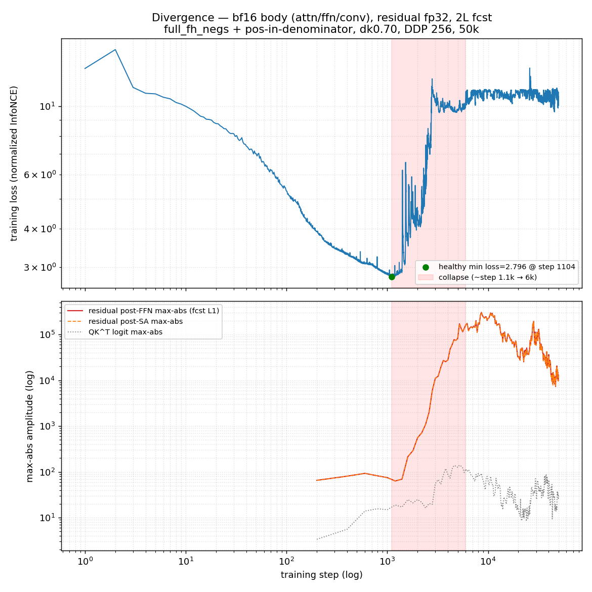
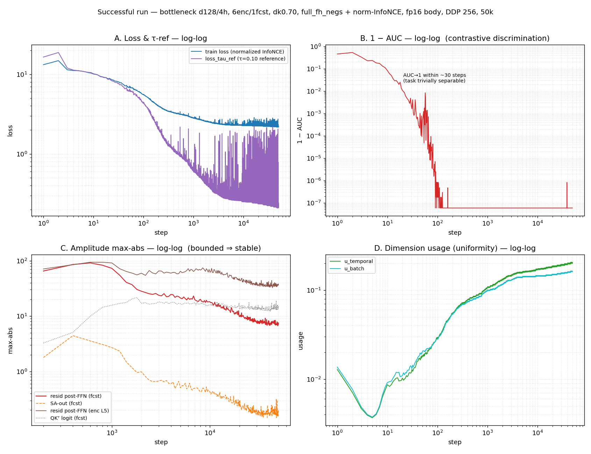
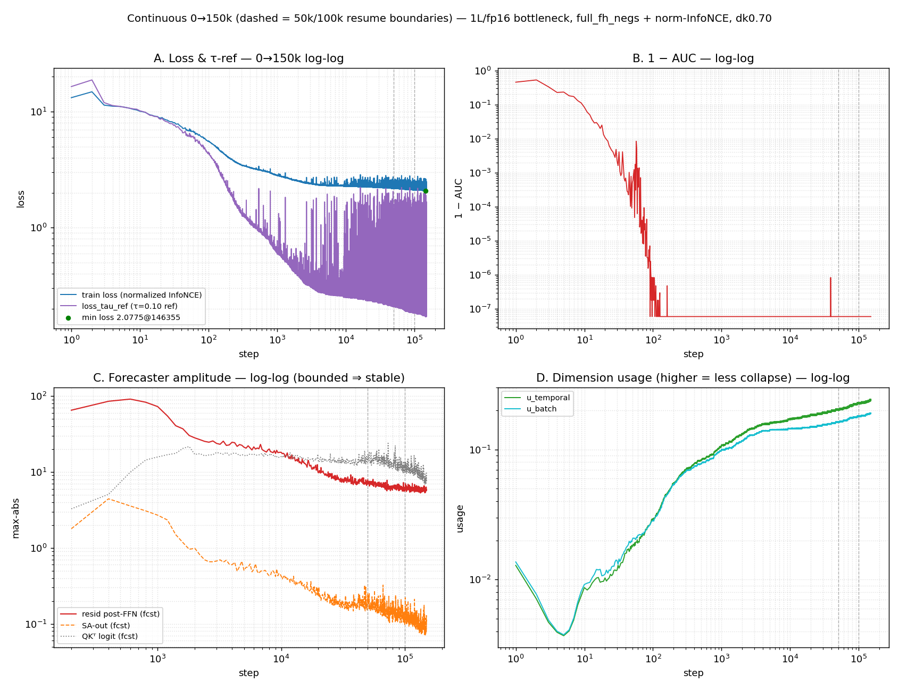

# Bottleneck + full-fh-negs (normalized InfoNCE) + 2-GPU DDP

**Q.** On the v13 forecaster-bottleneck (6-layer encoder @ d384/6h → d128/4h
forecaster), does the new all-(fₜ,hₗ)-negatives loss (every
forecast×future-step pair as a negative) under **normalized
InfoNCE** (`--pos-in-denominator`, loss ≥ 0), dropkey 0.70 (per-step
attention key-dropout), AdamW β2 0.95, 2-GPU DDP (256 global, full
cross-rank negatives) (a) train stably, and (b) beat prior backbones on
held-out GM-Relative MASE (geo-mean of model÷seasonal-naive MASE over
GIFT-Eval; 1.0 = seasonal naive, lower better)?

**A. Stability depends on depth+precision; accuracy is not competitive.**

| Arm | forecaster | body precision | outcome | min loss |
|---|---|---|---|---|
| 1 | **2L** | attn/ffn/conv **bf16**, resid fp32 | **diverged ~step 1.1k** | 2.80 then →10 |
| 2 | **1L** | attn/ffn/conv **fp16**, resid fp32 | **stable, full 50k** | **2.174** |

The only change that mattered was depth+precision: 2-layer/bf16 blew up;
**1-layer/fp16 trained cleanly to 50k** (top-1 → 1.0, no divergence).

*Arm 1: forecaster residual max-abs explodes 65 → 3.0e5 while **forecaster**
QKᵀ stays O(10–100) (the value/residual path overflows, not the softmax;
encoder QKᵀ also blows up) — the documented fresh-init failure.*

*Arm 2: (A) loss 13→2.18, `loss_tau_ref` 16→0.21; (B) 1−AUC → ~0 by step
~30 (contrastive task trivially separable); (C) amplitudes **bounded** —
fcst residual post-FFN 65 → 7 (vs Arm 1's 3.0e5): the stability
mechanism; (D) embedding dimension-usage (higher = less collapse) rises
0.01 → 0.20.*

**Held-out eval & training horizon.** Standard 2L causal-transformer
q-head (30k, `e_then_f`, bf16) on the Arm-2 backbone at three
continuous-optimizer checkpoints, official GIFT-Eval:

| backbone | triage (11) | **full GM-MASE (97)** |
|---|---|---|
| 50k | 1.5611 | 1.4377 |
| **100k** | 1.5492 | **1.3936** |
| 150k | 1.5740 | 1.4090 |
| v11c (prior best, no bottleneck) | — | 1.292 |
| seasonal-naive gate | — | 1.000 |

More training helps only marginally (50k→100k 1.438→1.394) then goes
flat/noisy (150k 1.409); it never approaches v11c (1.292) or the
seasonal-naive ceiling (1.0).

*Across the full 150k the
contrastive loss & `loss_tau_ref` keep dropping and forecaster
amplitudes stay bounded (65→6, no divergence) — yet held-out GM-MASE is
flat. Training the contrastive objective harder does not transfer to
forecasting: **the limit is architectural, not training horizon.***

**Takeaway.** The new loss + normalized InfoNCE + dk0.70 is a **stability**
result (1L/fp16 trains where 2L/bf16 diverges; amplitudes stay bounded),
**not** a held-out-accuracy gain — it trails the plain dk0.7/dk0.9
backbones, more training to 150k does not change that, and the
seasonal-naive ceiling persists. The lever is architectural (next:
[`RESEARCH_PLAN.md`](RESEARCH_PLAN.md)); recipe in
[`RUN_PLAN.md`](RUN_PLAN.md).
