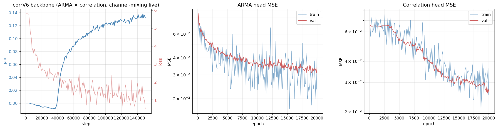
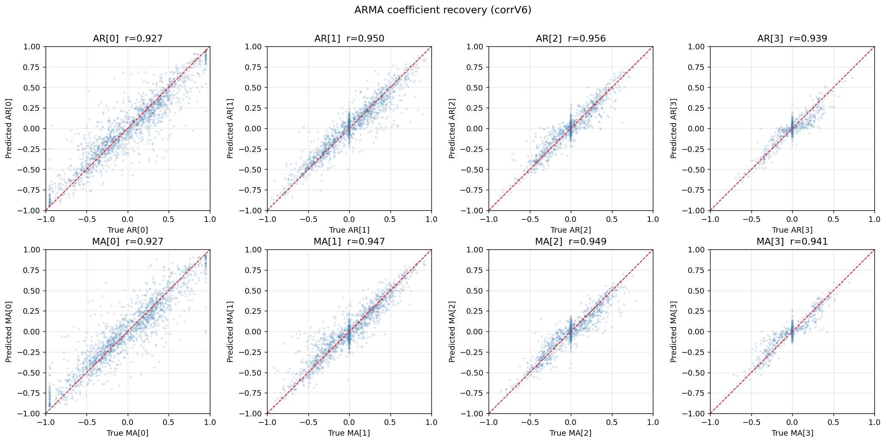
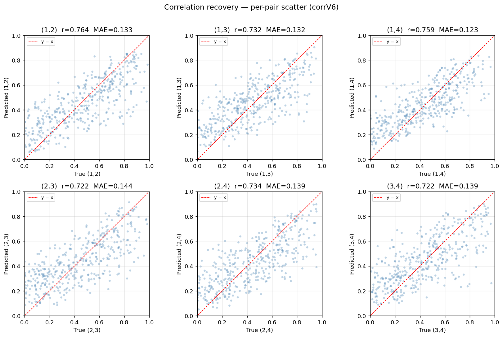
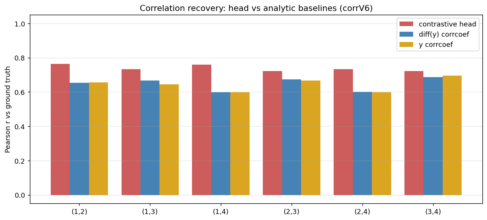

# Joint ARMA + Correlation Recovery, Channel-Mixing on Top

## Goal

Train one contrastive backbone with a channel-mixing block on top of a
per-channel transformer, then recover from the same frozen backbone
both per-channel ARMA coefficients and the per-sample 4×4 correlation
matrix using two small heads.

## Protocol

Data: 4-channel ARMA(p,q) processes with p, q ∈ {1..4} and T = 4096
timesteps, driven by Cholesky-correlated innovations whose covariance
is a per-sample 4×4 correlation matrix drawn iid per off-diagonal pair
with PSD rejection. Each channel is z-scored. See `data.py`.

Backbone: a per-channel GRU encoder, a 12-layer transformer that runs
one channel at a time (`[B*C, T, H]`), and a channel-mixing block on
top. Hidden size H=1024. The contrastive loss is
`cosine_similarity_batch_no_time_neg`: a same-channel time-shifted
positive plus same-time cross-channel and time-shifted cross-batch
negatives. 150 k steps, batch 16, lr 7e-5, no grad clipping.

Heads (frozen backbone): a `GRURecoveryHead` reads the per-channel
encoder output `h` and predicts the eight AR/MA coefficients per
channel; a correlation head reads the channel-mixed forecaster output
`h_hat` and predicts the six off-diagonal entries of the per-sample
correlation matrix.

Two design choices we vary:

- **Channel-mixing block**: `simple` (linear `kron(I,R) + kron(mask,Q)`,
  one R and Q for all samples) vs `attention` (per-time-step softmax
  attention across channels; Q/K/V are 1×1 conv on H so the projections
  are sample-independent, but the attention scores Q·Kᵀ depend on each
  sample's joint channel content).
- **Correlation head**: `projected` (sample-independent
  `Linear(C·H → H)` ahead of a small GRU) vs `direct` (GRU with
  `input_size = C·H` reads the flattened latent directly).

| Setting | Value |
|---|---|
| Channels C, hidden H, patch W | 4, 1024, 32 |
| Transformer layers, heads | 12, 8 |
| Backbone steps, batch, lr | 150 000, 16, 7e-5 |
| Head training epochs, batch, lr | 20 000, 16, 3e-4 |

## Backbone trains stably

The contrastive loss settles, and the model develops a small but real
forecast gap (FF − FP ≈ 0.13–0.14) between same-channel time-shifted
positives and same-time persistence. Cross-batch similarity drops to
near zero, so different samples are well-separated.

## ARMA recovery succeeds

The frozen encoder output carries enough per-channel structure that a
small bidirectional GRU recovers all eight AR/MA coefficients cleanly,
regardless of which channel-mixing block sits on top. Per-coefficient
Pearson correlation is in the 0.93–0.95 range, sign agreement around
94 %, and MSE roughly 7× lower than predicting zero.

## Correlation recovery: only attention mixing + direct head works

Correlation recovery is sensitive to **both** design choices:

|                       | projected head | direct head |
|-----------------------|----------------|-------------|
| simple channel mix    | r ≈ 0          | r ≈ 0       |
| attention channel mix | r ≈ 0          | **r ≈ 0.74** |

With attention mixing in the backbone *and* the direct GRU head, the
correlation head recovers each pair with Pearson r in the 0.72–0.76
range, 9× better than predicting zero, 2.2× better than predicting the
unconditional mean, and 2.9× better than the trivial `corrcoef(diff(y))`
estimator computed directly from the raw series. The head beats the
strongest baseline available.

Every other combination predicts the unconditional mean of the
correlation distribution and produces per-pair r indistinguishable
from zero — including the same direct head trained on the
simple-mixing backbone, and the projected head trained on the
attention-mixing backbone. So the success is not solely the head or
solely the backbone: the backbone has to carry per-sample correlation
into `h_hat`, *and* the head has to keep the C dimension alive long
enough to read it.

## Why: where the cross-channel signal lives and where it dies

The two failed combinations each break the chain at a different place.

The simple mixing block applies one fixed Kronecker map to every
sample, so the cross-channel mix is sample-independent. Per-sample
correlation lives in the joint distribution of channels (specifically
in second-order quantities like `cov(y^{c1}, y^{c2})` over time), but
a sample-independent linear map cannot turn that joint structure into
a per-sample shift in `h_hat`. Both heads then fail equally because
the signal is not in `h_hat`.

Attention mixing fixes this. The Q/K/V projections are still
sample-independent, but the attention scores `softmax(Q · Kᵀ /
sqrt(d))` are computed per (sample, time, head) from the per-sample
features, so each sample gets a different mixing matrix at each time
step. That is the information path from the per-sample correlation
matrix into `h_hat`.

The projected head then loses what attention earned by applying
`Linear(C·H → H)` ahead of the GRU. That projection is also
sample-independent, and a linear map across the concatenated channel
features cannot reconstruct the second-order cross-channel quantities
the attention mix encoded. After the projection the GRU has no
channel axis to attend across. The direct head, by feeding `[B, T,
C·H]` straight into a GRU with `input_size = C·H`, lets the recurrent
gates accumulate the relevant cross-channel statistics over time and
read out per-sample correlation.

## Artifacts

Plots embedded above live in `plots/`. The successful run is
`checkpoints/corrV8_best_gap.pth` (attention channel mixing,
`Simple_channel_mixing_module` replaced by `AttentionChannelMixing`
in `src/blocks.py`); the corresponding heads are
`checkpoints/corrV8_head_arma_best.pth` and
`checkpoints/corrV8_head_corr_direct_best.pth`. Numerical summaries
are in the matching `*_results.json` files. Operational notes,
including the earlier failed configurations and the loss bug fixed
mid-experiment, are in `experiment_log.md`.
