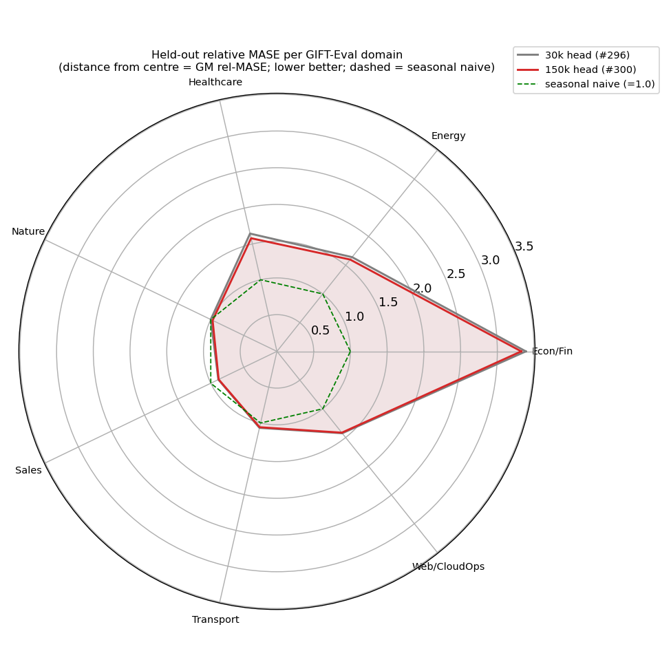
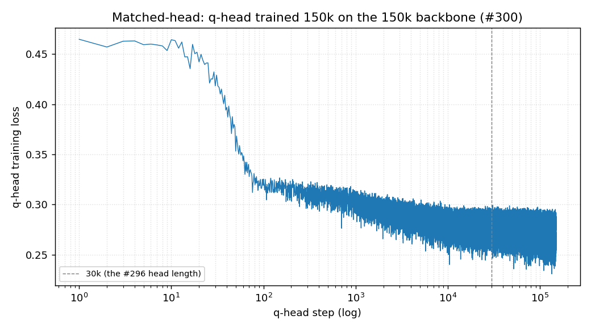

# #300 — Does a longer-trained q-head close the bottleneck-fullfh gap?

**Verdict — partial.** Matching q-head training to the body (30k →
**150k** steps; same 150k body, same 2L causal arch — a clean
**one-variable** test, unlike #296's bundle) lowers full GM-MASE
**1.4090 → 1.3822** (−1.9%): the best point in this line, below #296's
prior best (1.3936). It does **not** reach v11c (1.292) or beat
seasonal-naive overall (1.0). So #296's 30k head was *mildly*
undertrained — a small real effect, **not** the explanation for the
gap. (Single seed; full-97 is the trusted metric, triage ~7–10% noisy.)

*Per GIFT-Eval domain; distance from centre = GM relative MASE, dashed =
seasonal naive (1.0). The 150k head (red) sits uniformly just inside the
30k head (grey) — a small, broad gain. Strongly heterogeneous:
**Sales 0.88 and Nature 0.97 beat seasonal naive**, while
**Econ/Fin ≈3.3** dominates the geomean — the aggregate shortfall is
mostly one domain, not a uniform deficit.*

## Question (#300)

Is #296's GM-MASE gap caused by an undertrained q-head? #296 reused one
30k head across all body checkpoints, so head length was never a tested
variable. This isolates it: 30k vs 150k head on the fixed 150k body.

## Result (150k body; official GIFT-Eval)

| q-head on 150k body | triage (11) | **full GM-MASE (97)** |
|---|---|---|
| 30k (the #296 head) | 1.5740 | 1.4090 |
| **150k (matched)** | **1.5314** | **1.3822** |
| best in #296 (100k body, 30k head) | — | 1.3936 |
| v11c (prior best) / seasonal-naive | — | 1.292 / 1.000 |

The matched head closes ≈23% of the 1.409→1.292 gap.

*Head loss 0.47 → 0.28; most of the drop is well before 30k (dashed) —
consistent with only a small marginal gain from the extra 120k steps.*

## Takeaway

Head-undertraining is a **minor, real, isolated** contributor (−1.9%),
not the cause of the bottleneck-fullfh gap; the remaining ≈7% to v11c
lies elsewhere (still the untested-hypothesis territory of #296, which
confounds bottleneck/dropkey/loss/precision). Largest single lever for
future work: the **Econ/Fin** collapse (≈3.3), not aggregate tuning.
Recipe: same as #296 (`../2026-05-17_bottleneck_fullfh_ddp/scripts/run_ddp.sh`)
with the q-head trained 150k instead of 30k.
