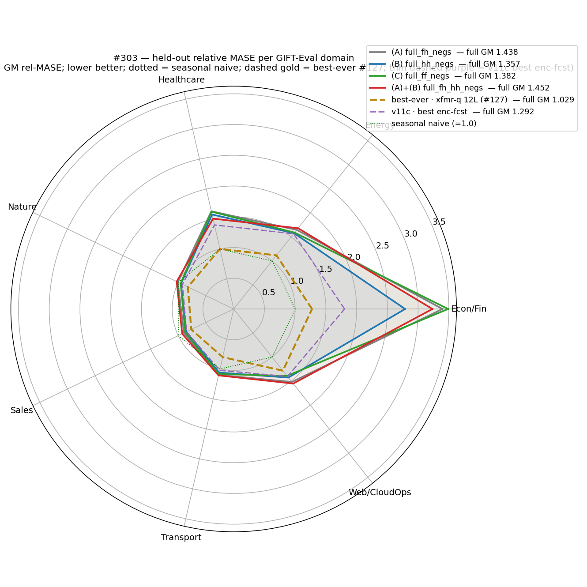
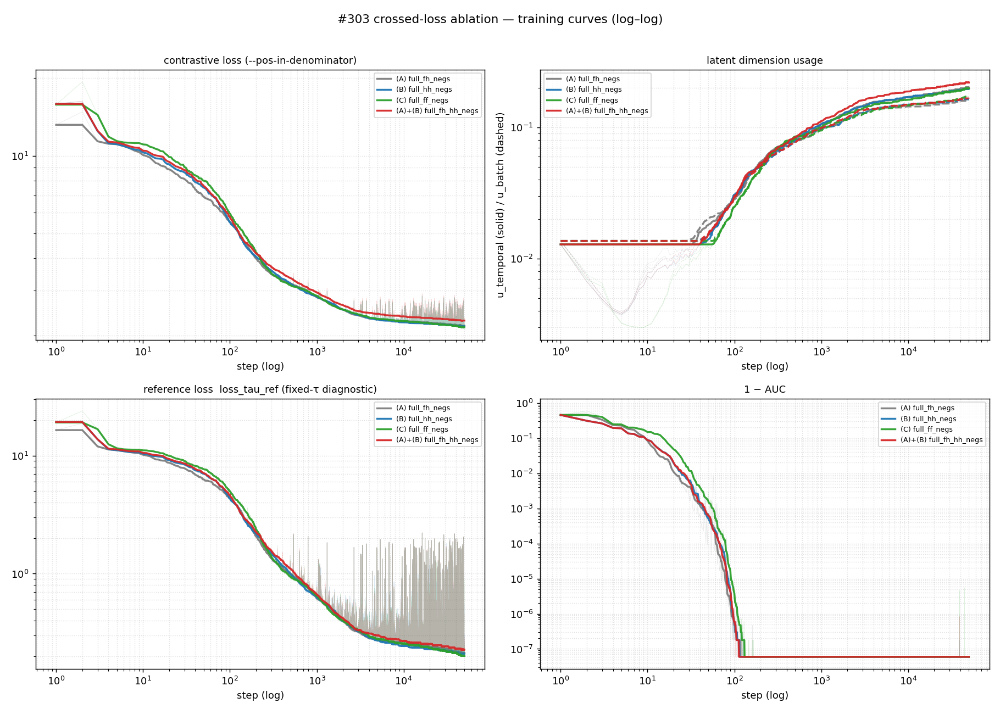
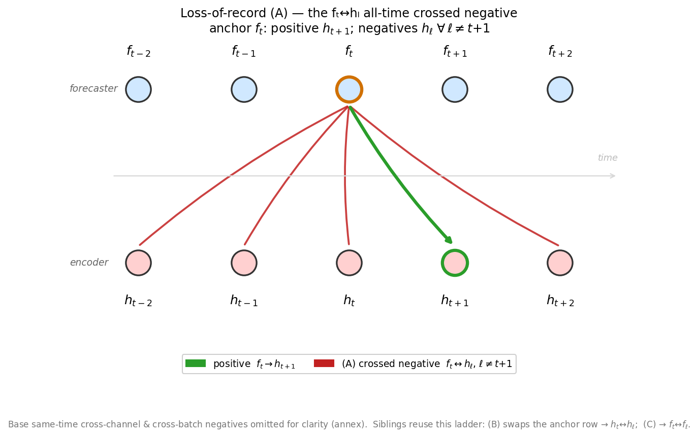

# Is the forecast↔encoder crossed negative (fₜ↔hₗ) the cause of the bottleneck-fullfh gap, or do its encoder↔encoder / forecaster↔forecaster siblings behave the same?

The bottleneck-fullfh loss-of-record adds one extra contrastive negative
— each forecast fₜ pushed away from the encoder latent hₗ at *every*
time l (the **fₜ↔hₗ** term; arm **A**). This ablation swaps it for the
two structurally identical siblings — encoder↔encoder **hₜ↔hₗ** (arm
**B**), forecaster↔forecaster **fₜ↔fₗ** (arm **C**) — and the union A+B.

**Verdict.** The siblings do **not** behave like A. On the trusted
full-97 GIFT-Eval metric, swapping fₜ↔hₗ for hₜ↔hₗ (B) lowers GM-MASE
**1.4377 → 1.3572 (−5.6%)**, B beating A in **all 7 domains**; fₜ↔fₗ (C)
gives −3.9%. Carrying both (A+B) lands at 1.4517 ≈ A — re-adding fₜ↔hₗ
on top of B erases B's gain. These three single-seed, internally
consistent points **point to fₜ↔hₗ as the harmful term** (per-arm CI
needs multiple seeds — see Follow-up). Not the whole gap: best (B,
1.357) is still ≈5% above v11c (1.292), the remainder in #296's
bottleneck/dropkey/precision confound.

*Per GIFT-Eval domain; distance from centre = GM relative MASE, dashed
hexagon = seasonal naive (1.0), lower = better. (B) (blue) sits inside
(A) (grey) on all seven domains; the geomean is dominated by **Econ/Fin**
(A 3.40 → B 2.79), the same single-domain driver #300 flagged. Only
**Sales** (B 0.855) and **Nature** (B 0.951) beat seasonal naive.*

**Held-out GM-Relative MASE** (official GIFT-Eval; standard 2L causal
q-head trained 30k on each backbone; 1.0 = seasonal naive, lower better):

| loss arm | crossed negative | triage (11) | **full (97)** | vs (A) |
|---|---|---|---|---|
| **(A)** `full_fh_negs` *(of record, #296)* | fₜ↔hₗ ∀ l≠t+1 | 1.5611 | **1.4377** | — |
| **(B)** `full_hh_negs` | hₜ↔hₗ ∀ l≠t | 1.4461 | **1.3572** | **−5.6 %** |
| **(C)** `full_ff_negs` | fₜ↔fₗ ∀ l≠t | 1.5185 | **1.3822** | −3.9 % |
| **(A)+(B)** `full_fh_hh_negs` | both | 1.5426 | **1.4517** | +1.0 % |
| v11c (prior best) / seasonal-naive | — | — | 1.292 / 1.000 | — |

Single seed per arm (matched to (A) for a clean one-variable contrast);
triage (11-cfg) is ≈7–10 % noisy (#296), full-97 is the trusted metric.
The four full-97 deltas exceed the ≈3 % checkpoint spread #296 treated as
within-noise, and the sign pattern repeats on triage (B < C < A,A+B) and
in the per-domain sweep (B beats A in 7/7) — but a confidence interval
per arm would need multiple seeds (not run; see Follow-up).

*Contrastive loss, latent dimension usage (u_temporal / u_batch), the
fixed-τ `loss_tau_ref` diagnostic, and 1−AUC, all log–log, four arms
overlaid (thick = rolling-median smoothed, raw faint behind —
`loss_tau_ref`/1−AUC are step-to-step spiky). (A), (B), (C) are
near-identical (final loss 2.18 / 2.18 /
2.15, `loss_tau_ref` 0.20–0.21, u_temporal ≈0.20, u_batch ≈0.16–0.17,
1−AUC ≈6e-8 — positives fully separated from negatives); (A)+(B) sits
~5% higher in contrastive loss (2.29, `loss_tau_ref` 0.23, u_temporal
0.22), as expected from its strictly larger negative set. No arm
diverged (post-warmup max loss ≤3.5). Crucially the contrastive-proxy
ranking does **not** track GM-MASE — (A) and (B) reach near-identical
proxies yet differ 5.6% in transfer — so the GM-MASE separation is not
explained by training-objective fit, echoing #296 ("training the
objective harder did not transfer").*

## Question

The bottleneck-fullfh gap (full 1.438 vs v11c 1.292, seasonal-naive
1.0) is confounded across loss / bottleneck / dropkey / precision (#296);
#300 ruled out q-head undertraining. This isolates the **loss** axis:
replace the of-record fₜ↔hₗ all-time crossed negative with each
structurally identical sibling and measure held-out GIFT-Eval.
*GM-Relative MASE* = geomean over configs of model MASE ÷ seasonal-naive
MASE (1.0 = seasonal naive, lower better).

## Protocol

Each arm is `cosine_similarity_batch` with its single l=t
forecaster–encoder negative **replaced by** the all-time crossed term
(A+B carries both) — the identical transform that defines A; logsumexp,
`--pos-in-denominator`. **Only `--loss-shape` changes** from A's
backbone-of-record (#296 run `a1`: 1L forecaster, fp16 group, 2-GPU DDP
global-batch 256, 50k, seed 20260517) — `run_ddp.sh`'s literal 2L/bf16
form diverged (#296 RESULTS.md), so the controlled test starts from the
1L/fp16 run #296/#300 evaluate. Per backbone: 30k 2L-causal q-head +
official GIFT-Eval (triage 11, full 97). Commands:
[`scripts/run_all.sh`](scripts/run_all.sh). Tests: 6 closed-form/mask
pins (`TestCrossedLossSiblings`) + 113-test loss suite green; baseline A
independently re-audited positive-free
([`scripts/verify_A_positive_exclusion.py`](scripts/verify_A_positive_exclusion.py),
all PASS). Wall-clock in the back annex.

*The loss-of-record A on a time ladder: anchor fₜ has one positive
(h_{t+1}, green) and is pushed from the encoder hₗ at every other l (red,
the **fₜ↔hₗ** term). Siblings reuse the same ladder — (B) swaps the
anchor row to hₜ↔hₗ, (C) to fₜ↔fₗ (annex). Base same-time cross-channel
& cross-batch negatives (shared by all arms) omitted for clarity.*

## What we learned

1. **Contrastive-objective fit does not predict transfer.** A/B/C reach
   near-identical contrastive proxies (loss, `loss_tau_ref`, 1−AUC,
   dim-usage) yet differ up to 5.6% in GM-MASE; A+B has the highest
   contrastive loss (~5% above, from its larger negative set) and among
   the worst transfer. No arm diverged. The separation is held-out
   transfer, not training fit (echoes #296).
2. **fₜ↔hₗ is an isolated, harmful contributor — not the whole gap.** B
   beats A in all 7 domains and A+B collapsing back to ≈A pins fₜ↔hₗ as
   the culprit; yet best (B, 1.357) is still ≈5% above v11c (1.292),
   beating seasonal naive only in Sales/Nature, so the residual stays in
   #296's bottleneck/dropkey/precision confound. *(Hypothesis, not
   measured: fₜ↔hₗ penalises the forecast for resembling nearby-in-time
   encoder states it legitimately should resemble in autocorrelated
   series; the same-modality hₜ↔hₗ / fₜ↔fₗ spreads do not.)*

## Follow-up

- **Multi-seed confirmation** of (B) vs (A): the −5.6 % is a single-seed
  delta; 2–3 extra seeds would put an interval on it.
- **Adopt (B) `full_hh_negs`** as the bottleneck-fullfh loss default and
  re-attack the residual ≈5 % to v11c on the still-confounded
  bottleneck / dropkey / precision axes (#296).
- **Econ/Fin** (≈2.8 even under (B)) remains the dominant geomean term —
  the single largest lever (per #300), not aggregate tuning.

---

### Annex — loss-arm definitions

All four are `cosine_similarity_batch` (paper loss: cross-time +
cross-channel + cross-batch negatives, logsumexp, normalized InfoNCE)
with the single l=t forecaster–encoder negative `log_neg_xy_hat`
(= cos(hₜ, fₜ)) **replaced** by an all-time crossed term, same (b, c),
masking only the degenerate pair:

| arm | `loss_shape` | replacement negative term | masked l |
|---|---|---|---|
| (A) | `cosine_similarity_batch_full_fh_negs` | cos(fₜ, hₗ) ∀ l | l = t+1 (the positive) |
| (B) | `cosine_similarity_batch_full_hh_negs` | cos(hₜ, hₗ) ∀ l | l = t (self, cos≡1) |
| (C) | `cosine_similarity_batch_full_ff_negs` | cos(fₜ, fₗ) ∀ l | l = t (self, cos≡1) |
| (A)+(B) | `cosine_similarity_batch_full_fh_hh_negs` | both (A) and (B) terms | resp. t+1 / t |

xy (cos(hₜ,h_{t+1}) cross-channel), xx (cross-channel same-time), zy
(f_{t+1}↔fₜ cross-channel), and the cross-batch term are byte-for-byte
identical to `cosine_similarity_batch` across all arms. Distinct from
`cosine_similarity_batch_square`'s batch-crossed h×h / f×f (b≠b', fixed
t): these siblings are **time-crossed** (l≠t, same b, c).

### Annex — per-domain full GM relative MASE

| domain | (A) | (B) | (C) | (A)+(B) | best |
|---|---|---|---|---|---|
| Econ/Fin | 3.397 | **2.788** | 3.488 | 3.233 | B |
| Energy | 1.646 | **1.577** | 1.589 | 1.680 | B |
| Healthcare | 1.630 | 1.576 | 1.624 | **1.507** | A+B |
| Nature | 1.010 | **0.951** | 0.958 | 1.029 | B |
| Sales | 0.898 | **0.855** | 0.873 | 0.929 | B |
| Transport | 1.100 | **1.061** | 1.086 | 1.108 | B |
| Web/CloudOps | 1.518 | 1.427 | **1.392** | 1.552 | C |
| **full GM (97)** | 1.4377 | **1.3572** | 1.3822 | 1.4517 | B |

### Annex — wall-clock breakdown

Backbone = 50k DDP (2× RTX 4090). Downstream = 30k q-head + GIFT-Eval
triage (11) + full (97), single GPU. B/C/A+B: idle box, back-to-back,
2026-05-19 (controlled). (A): #296 session, GPUs shared (reference only).

| arm | backbone 50k | q-head 30k | triage (11) | full (97) | downstream Σ |
|---|---|---|---|---|---|
| (B) `full_hh_negs` | 1 h 59 m | 1 h 10 m | 3 m | 1 h 36 m | 2 h 49 m |
| (C) `full_ff_negs` | 1 h 57 m | 1 h 10 m | 3 m | 1 h 34 m | 2 h 47 m |
| (A)+(B) `full_fh_hh_negs` | 1 h 59 m | 1 h 16 m | 3 m | 1 h 32 m | 2 h 51 m |
| (A) `full_fh_negs` *(#296, shared)* | ≈3 h 29 m | — | — | — | ≈2 h 47 m |

Phase 1 (3 backbones, serial — DDP holds both GPUs): 5 h 55 m.
Phase 2 (downstream — B+C concurrent on GPU0/GPU1, then A+B alone):
5 h 39 m. **End-to-end (3 new arms, code→eval): 11 h 34 m.** Backbone
time is loss-variant-independent (B/C/A+B all ≈1 h 58 m — the extra term
costs no measurable time); (A)'s longer ≈3 h 29 m is its shared #296
session, not the loss, so it is not a controlled timing point.
