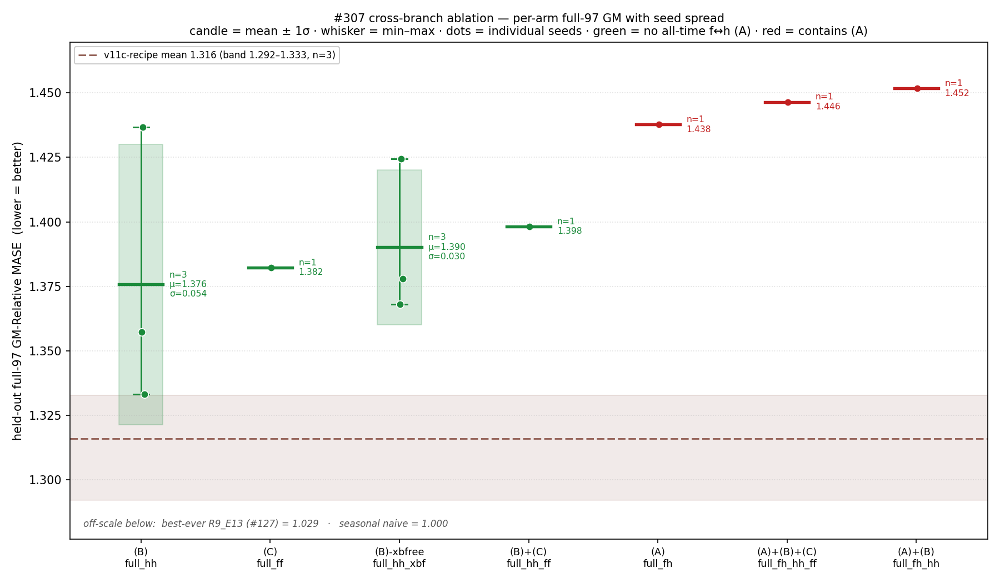
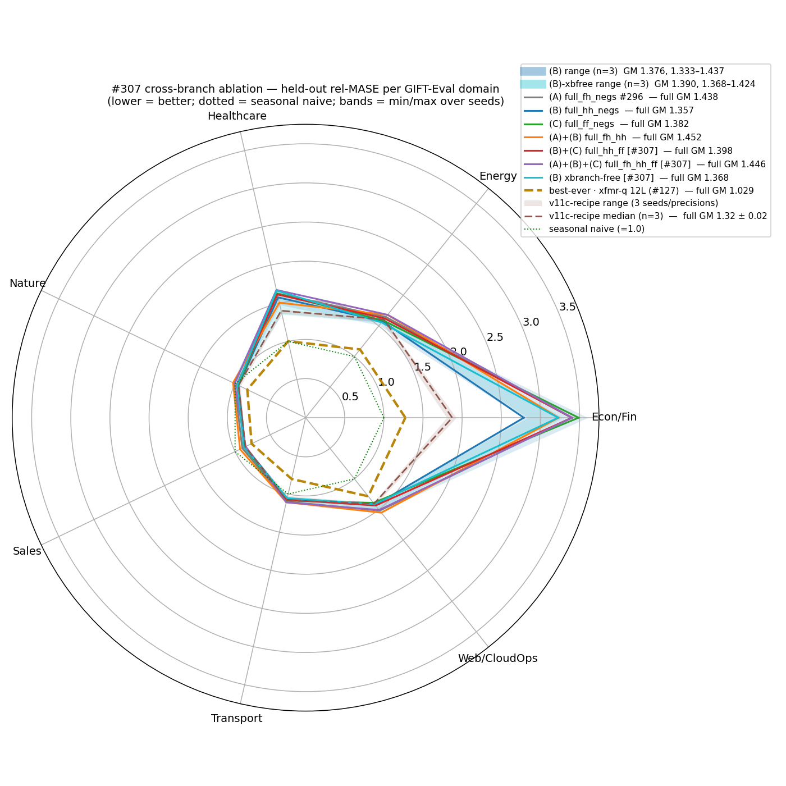
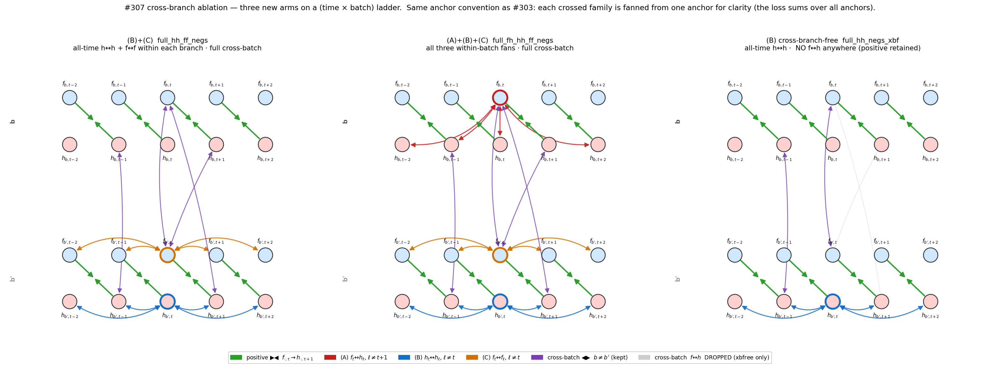
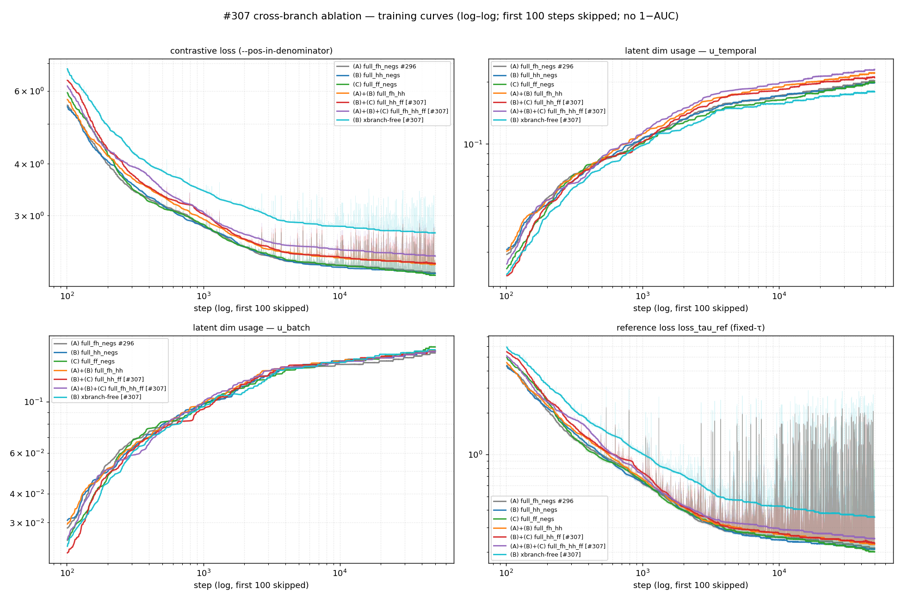

# Does the cross-branch f↔h negative carry any useful signal, or is the whole f↔h family inert?

#303 found arm **(A)** — the all-time forecast↔encoder (f↔h) negative in the loss-of-record — is harmful: swapping it for the within-branch siblings **(B)** h↔h or **(C)** f↔f lowered held-out error. This continuation adds three arms to pin down the f↔h family: **(B)+(C)** (both siblings, no f↔h), **(A)+(B)+(C)** (all three), and **(B)-xbfree** (arm B with the f↔h *cross-batch* negative also dropped — so no f↔h negative anywhere; the f↔h positive is kept).

*Metric: GM-Relative MASE = geomean over GIFT-Eval configs of model ÷ seasonal-naive MASE (1.0 = naive, lower better). Full-97 is the trusted metric; triage-11 is ~7–10 % noisy.*

## Answer

**(B) `full_hh` is the best arm; (A) all-time f↔h is the only clearly harmful one.** (B) has the lowest held-out GM of every arm (mean 1.376 over 3 seeds). The other within-branch arms (C, B+C, B-xbfree) land *inside* (B)'s per-seed spread — none beats it. In particular **(B)-xbfree, which removes the f↔h cross-batch negative, does not improve on (B)** (its mean is, if anything, slightly higher): there is **no evidence that dropping cross-batch f↔h helps**. Only the (A)-containing arms separate, sitting clearly worse — re-running at three seeds shows that gap is the one effect larger than the per-seed noise. And every arm trails the v11c backbone recipe, so the loss-shape is a minor lever next to the backbone itself.

*Per-arm GM ordered by mean (candle = mean ± 1σ, whisker = min–max, dots = seeds; n=3 for B and B-xbfree, n=1 otherwise). Green = no (A); red = contains (A). (B) has the lowest mean; the other green arms fall inside its spread (none beats it, and B-xbfree does not), so they don't separate; the red arms sit clearly above. v11c band at the floor.*

*Same arms per GIFT-Eval domain (lower = better; dotted green = naive). The (B) and (B)-xbfree seed bands overlap on every spoke; Econ/Fin is the widest spoke and drives most of the spread.*

Sorted by full-97 (non-A arms first, then the A-containing cluster):

| loss arm | crossed negatives kept | triage (11) | **full (97)** |
|---|---|---|---|
| **(B)** `full_hh_negs` *(#303)* | h↔h | 1.4461 | **1.3572** |
| **(B)-xbfree** `full_hh_negs_xbfree` *(#307)* | h↔h, no f↔h anywhere | 1.4843 | **1.3681** |
| **(C)** `full_ff_negs` *(#303)* | f↔f | 1.5185 | **1.3822** |
| **(B)+(C)** `full_hh_ff_negs` *(#307)* | h↔h + f↔f | 1.5259 | **1.3982** |
| **(A)** `full_fh_negs` *(#296, #303)* | f↔h | 1.5611 | **1.4377** |
| **(A)+(B)+(C)** `full_fh_hh_ff_negs` *(#307)* | f↔h + h↔h + f↔f | 1.6315 | **1.4465** |
| **(A)+(B)** `full_fh_hh_negs` *(#303)* | f↔h + h↔h | 1.5426 | **1.4517** |
| *ref:* v11c backbone recipe (n=3) | — | — | 1.29 – 1.33 |
| *ref:* #10 backbone + 12L q-head = R9_E13 (#127) | — | 0.990 | **1.029** |

Multi-seed spread for the two leading arms (full-97):

| arm | n | mean | std | min / max |
|---|---|---|---|---|
| **(B)** | 3 | 1.376 | 0.054 | 1.333 / 1.437 |
| **(B)-xbfree** | 3 | 1.390 | 0.030 | 1.368 / 1.424 |

(A) at 1.438 is +4.5 % above (B)'s mean — outside its ±1σ; the non-A arms all fall inside it.

## Protocol

Continuation of #303: identical backbone-of-record recipe (1L forecaster, fp16 groups, 2-GPU DDP global-batch 256, 50k steps, seed 20260517, EWMA-RevIN), **only `--loss-shape` changes per arm**; then a 30k 2L-causal q-head + official GIFT-Eval (triage 11 + full 97) on each backbone. (B) and (B)-xbfree were re-run at seeds 20260518/20260519 for the variance estimate. The three new loss branches are covered by 11 closed-form/mask tests (full 124-test loss suite green).

*Each panel fans one arm's negatives from a single anchor: blue h↔h, orange f↔f, red f↔h; green = the retained positive. (B)-xbfree (right) drops the f↔h cross-batch links entirely. ▶◀ = attract (positive), ◀▶ = repel (negative).*

*All seven arms converge near-identically (contrastive loss, dim usage, loss_tau_ref); no arm collapses. Training fit does not predict held-out GM — the signal is in transfer, not optimization.*

## What we learned

- **(B) `full_hh` is the best candidate.** It has the lowest mean GM; the other non-A arms (C, B+C, B-xbfree) fall inside its per-seed spread, so we can't prove (B) strictly beats them — but none beats (B) either. #303's single-seed "(B) is the unique winner" overstated the certainty; (B) remains the leading estimate.
- **Removing the f↔h cross-batch negative is not shown to help.** (B)-xbfree (no f↔h negative anywhere) lands within (B)'s spread, not below it — no evidence the cross-batch f↔h term hurts or that dropping it gains anything. The harmful term is specifically the *all-time* f↔h fan (A), not f↔h negatives in general.
- **(A)'s harm is the one robust effect** — the only between-arm gap larger than the per-seed noise. But the loss is a small lever: every arm trails the v11c backbone recipe.

---

### Annex — arm definitions

All arms are `cosine_similarity_batch_<shape>` (cross-time + cross-channel + cross-batch negatives, logsumexp, `--pos-in-denominator`), differing only in the indicated negatives; the positive cos(fₜ, hₜ₊₁) is unchanged throughout.

| arm | `loss_shape` | within-branch negative | cross-batch |
|---|---|---|---|
| (A) | `…_full_fh_negs` | cos(fₜ, hₗ) ∀ l≠t+1 | full |
| (B) | `…_full_hh_negs` | cos(hₜ, hₗ) ∀ l≠t | full |
| (C) | `…_full_ff_negs` | cos(fₜ, fₗ) ∀ l≠t | full |
| (A)+(B) | `…_full_fh_hh_negs` | (A) ∪ (B) | full |
| (B)+(C) | `…_full_hh_ff_negs` | (B) ∪ (C) | full |
| (A)+(B)+(C) | `…_full_fh_hh_ff_negs` | (A) ∪ (B) ∪ (C) | full |
| (B)-xbfree | `…_full_hh_negs_xbfree` | (B) only | hh + ff only (no f↔h) |

### Annex — per-domain full GM

| domain | (A) | (B) | (C) | (A)+(B) | (B)+(C) | (A)+(B)+(C) | (B)-xbfree |
|---|---|---|---|---|---|---|---|
| Econ/Fin | 3.397 | 2.788 | 3.488 | 3.233 | 3.407 | 3.406 | 3.228 |
| Energy | 1.646 | 1.577 | 1.589 | 1.680 | 1.623 | 1.682 | 1.557 |
| Healthcare | 1.630 | 1.576 | 1.624 | 1.507 | 1.614 | 1.674 | 1.666 |
| Nature | 1.010 | 0.951 | 0.958 | 1.029 | 0.973 | 1.008 | 0.968 |
| Sales | 0.898 | 0.855 | 0.873 | 0.929 | 0.859 | 0.849 | 0.872 |
| Transport | 1.100 | 1.061 | 1.086 | 1.108 | 1.074 | 1.110 | 1.054 |
| Web/CloudOps | 1.518 | 1.427 | 1.392 | 1.552 | 1.435 | 1.508 | 1.412 |
| **full GM** | 1.4377 | 1.3572 | 1.3822 | 1.4517 | 1.3982 | 1.4465 | 1.3681 |

### Annex — variance seeds (full GM per seed)

| seed | (B) | (B)-xbfree |
|---|---|---|
| 20260517 (of-record) | 1.3572 | 1.3681 |
| 20260518 | 1.3331 | 1.3779 |
| 20260519 | 1.4368 | 1.4244 |

### Annex — reproducibility

- **Backbones** (resume-capable: `FINAL.pth + _optimizer.pth + losses + log`): 3 of-record arms in `artifacts/<arm>/`; 4 variance seeds in `artifacts/variance/<arm>_seed<seed>/`.
- **Q-heads + GIFT-Eval CSVs** (`gift_eval_{triage,full}/{all_results.csv,summary.txt}`): committed for every backbone above.
- **Tests**: `tests/test_loss.py::{TestCrossBranchAblationExtended, TestCrossBranchNegativeFree}` (11 pins, incl. the analytic `log(2(T+3))` value for B-xbfree). Full loss suite green.
- **Scripts**: `scripts/box_run.sh` + `local_downstream.sh` (of-record), `box_variance_run.sh` + `elisa_variance_run.sh` (variance seeds), `plot_results.py`, `plot_variance.py`, `plot_loss_diagram.py`.
