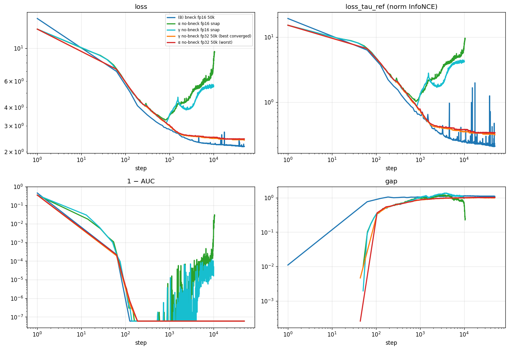
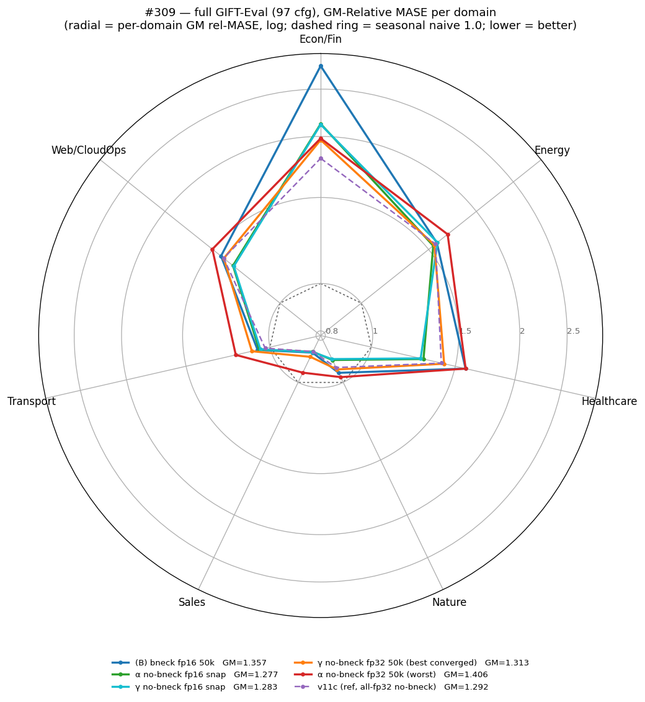

# #309 Bottleneck × β2 confound on (B): can α match v11c?

## Question

(B) — the `cosine_similarity_batch_full_hh_negs` variant of the
bottleneck-fullfh recipe — reaches full-97 GM-MASE 1.3572 (#303),
still **+5%** above v11c 1.292. Of the ≥6 axes that differ between (B)
and v11c, the cheap ones to test are the forecaster **bottleneck**,
AdamW **β2**, and (follow-up) the contrastive temperature **τ**. Does
isolating these close the gap?

*Metric:* full-97 GM-Relative MASE = geometric mean over 97 GIFT-Eval
configs of (model MASE ÷ seasonal-naive MASE); lower is better, 1.0 =
seasonal naive. All backbones get a 30k 2L-causal q-head before eval.

## Verdict

**The gap to v11c is closable — but by raising τ on the BOTTLENECK
arm, the opposite of the issue's hypothesis.** `β-τ0.8` (bottleneck
kept, β2 0.98, **τ 0.8**, fp16) reaches **1.2942 ≈ v11c 1.292** — a
converged fp16 backbone that keeps the small forecaster. Removing the
bottleneck (α/γ) does the reverse of helping:

1. **The no-bottleneck arms can't be trained in fp16.** Removing the
   bottleneck (forecaster d=128→384) makes the fp16 body diverge at
   fresh init — at *every* τ (τ=0.1 by step ~900, τ=0.8 even faster).
   β (bottleneck kept) is fp16-stable.
2. **fp32 trains them, but to a worse place.** Fresh all-fp32 (fp16's
   only blocker removed), the no-bottleneck arms converge to
   **1.31–1.41** — all worse than v11c, and worse than the
   under-trained fp16 snapshots below. Prolonged contrastive training
   over-specializes the representation and hurts forecasting transfer.
3. **The earlier "α beats v11c" was under-training.** The fp16
   pre-divergence snapshots (≈step 900) score α 1.2767 / γ 1.2829 —
   below v11c — but that is ~900 steps, not a converged backbone; the
   advantage evaporates by 50k.

So the bottleneck was an **fp16-stability crutch, not a perf limiter**:
keeping it and tuning **β2 0.95→0.98** then **τ 0.1→0.8** walks (B)
1.3572 → β 1.3272 → β-τ0.8 1.2942, landing on v11c — in fp16, with the
small forecaster. Removing the bottleneck only hurts.

## Headline: every arm by full-97 GM

Only the green fp16 **pre-divergence snapshots** and **β-τ0.8** (blue,
bottleneck, converged) reach the v11c line (1.292). Every red
**fp32-converged** no-bottleneck arm is right of it (worse).
α-τ0.1-fp32 (β2=0.98) is the worst arm of all.

| Arm | bneck | precision | τ | β2 | Full-97 GM | vs v11c |
|-----|:-----:|-----------|--:|---:|----------:|-------:|
| α no-bneck **fp16 snapshot** (~step 900) | no | fp16 | 0.1 | 0.98 | **1.2767** | −1.0% |
| γ no-bneck **fp16 snapshot** (~step 900) | no | fp16 | 0.1 | 0.95 | **1.2829** | −0.7% |
| **v11c** (ref: dropkey 0.9, plain loss) | no | fp32 | 0.1 | 0.98 | **1.292** | — |
| **β bneck fp16 50k** (matches v11c) | yes | fp16 | 0.8 | 0.98 | **1.2942** | +0.2% |
| γ no-bneck **fp32 50k** | no | fp32 | 0.1 | 0.95 | **1.3132** | +1.6% |
| β bneck fp16 50k | yes | fp16 | 0.1 | 0.98 | **1.3272** | +2.7% |
| α no-bneck **fp32 50k** | no | fp32 | 0.8 | 0.98 | **1.3274** | +2.7% |
| γ no-bneck **fp32 50k** | no | fp32 | 0.8 | 0.95 | **1.3424** | +3.9% |
| (B) bneck fp16 50k | yes | fp16 | 0.1 | 0.95 | **1.3572** | +5.0% |
| α no-bneck **fp32 50k** | no | fp32 | 0.1 | 0.98 | **1.4057** | +8.8% |

## Training curves — fp16 diverges, fp32 is stable

(B) blue and the fp32 arms descend monotonically and hold (1−AUC at
floor, gap ~1.0). The fp16 no-bottleneck snapshots (α/γ) bottom near
step 900 then climb — loss up, 1−AUC spikes, gap collapses. fp32
removes that instability entirely; the loss plateaus a touch above the
bottleneck arms (~2.3–2.4 vs ~2.1), and as the GIFT-Eval shows, that
fully-trained representation transfers worse than the brief snapshot.

## Per-domain (τ=0.1)

The fp16 snapshots (α, γ) sit inside v11c on most domains; the
fp32-converged arms (esp. α) bulge out past v11c — worse — confirming
the aggregate ranking holds per-domain, not just on average.

## τ closes the gap — on the bottleneck arm

**Bottleneck arm (fp16, converged), the path to v11c:**

| step | recipe change | Full-97 GM |
|------|---------------|----------:|
| (B)     | bneck, β2 0.95, τ 0.1 | 1.3572 |
| β       | β2 0.95 → **0.98**    | 1.3272 |
| β-τ0.8  | τ 0.1 → **0.8**       | **1.2942** ≈ v11c |

β2 and τ stack additively on the bottleneck recipe to reach v11c — in
fp16, keeping the small forecaster. This is the practical win.

**No-bottleneck arm (fresh fp32, converged) — the confound's actual α/γ:**

|        | β2 = 0.98 (α) | β2 = 0.95 (γ) |
|--------|--------------:|--------------:|
| τ = 0.1 | 1.4057       | **1.3132**    |
| τ = 0.8 | 1.3274       | 1.3424        |

- **β2 = 0.95 ≫ 0.98 at τ=0.1** (1.313 vs 1.406). At the under-trained
  snapshots β2 was noise (1.277 vs 1.283); trained out, β2=0.98
  over-specializes much worse.
- **τ helps the worse arm, hurts the better one.** τ=0.8 lifts
  β2=0.98 (1.406→1.327) but drags β2=0.95 (1.313→1.342). No
  no-bottleneck cell reaches v11c — the best (γ-τ0.1, 1.313) still
  trails the bottleneck β-τ0.8 (1.294).

## Mechanism (hypothesis)

The (B) fp16 body is load-bearing on the bottleneck. The 2026-05-15
fp16-precision log shows the forecaster residual-stream amplitude grows
unbounded with depth/training (~80 @ step 200 → ~1070 @ step 2800), and
"fresh-init partial-fp16 diverges in every tested combination". The
d=128 bottleneck constrains forecaster capacity → constrains residual
growth → fp16 stays bounded. Removing it (α, γ) removes that constraint
→ fp16 diverges. fp32's wide exponent represents the growth, so it
trains — but then the over-specialization of prolonged contrastive
pretext training dominates the transfer outcome.

## What we learned

1. **β-τ0.8 matches v11c (1.294 vs 1.292)** — keep the bottleneck,
   set β2=0.98 and τ=0.8. A converged fp16 backbone with the small
   forecaster, reached by tuning two scalars on (B). This is the
   actionable result.
2. The bottleneck is an **fp16-stability crutch**, not a performance
   limiter — *removing* it is strictly harmful (diverges in fp16;
   over-specializes in fp32, 1.31–1.41, all worse than v11c).
3. **Under-training flatters this backbone.** fp16 pre-divergence
   snapshots (1.277/1.283) beat their own fp32 50k versions
   (1.41/1.31) on held-out forecasting — the contrastive pretext,
   trained out, transfers worse.
4. **β2=0.95 > 0.98** for the no-bottleneck recipe at convergence
   (invisible early, large late); but on the *bottleneck* arm β2=0.98
   is better — the β2 optimum flips with the bottleneck.
5. **τ=0.8 helps the bottleneck arm and the β2=0.98 no-bneck arm,
   hurts the β2=0.95 no-bneck arm** — τ's sign depends on the recipe.

## Limitations

- **Single seed per cell.** The #307 variance estimate is ±0.02 at
  n=3, so differences under ~3% (snapshots vs v11c) are borderline; the
  big ones (snapshot 1.28 vs fp32 1.41, fp16 divergence, β2 7% swing)
  are well outside it.
- **v11c confound.** v11c is no-bneck/fp32/τ0.1/β2.98 but with dropkey
  **0.9** and the plain `cosine_similarity_batch` loss; these arms use
  dropkey 0.7 + `hh-negs`. So "no-bneck can't match v11c" is entangled
  with dropkey+loss — untested here is a dropkey-0.9 / plain-loss fp32
  run, which is essentially v11c itself.
- q-head + GIFT-Eval sample windows are single-seed.

## Annex

### Arms
- **(B)** #303 cl_hh_50k: bneck d=128, fp16 body, τ0.1, β2 0.95, dropkey 0.7.
- **α / γ** (issue arms): no bneck, β2 0.98 / 0.95. fp16 → diverge ~step 900;
  `_50k` "FINAL" is the best_loss snapshot before divergence.
- **β**: bneck kept, β2 0.98. fp16-stable, converges.
- **\*-fp32 50k**: fresh all-fp32 from scratch to 50k (the fp16 pre-divergence
  window is only ~900/50k steps, so a warmup/resume buys nothing — fresh fp32
  is the clean comparison). Naming `bb_<arm>_tau{01,08}_fp32_50k`.

### Compute
τ=0.1 fp16 arms + snapshots: 1× RTX 4090 prosumer on vast (offer 35882331,
$0.55/h), **$2.66** total. All fp32 continuations + τ=0.8 + every downstream
ran on elisa (free). α/γ SIGTERM'd at ~step 10k in the original fp16 runs to
save doomed compute.

### Code
Branch `experiment/2026-05-20-bottleneck-beta2-confound`. Runner
`scripts/elisa_run.sh <arm> <tau> <runtag> <gpus> <prec>` (fp16|fp32);
downstream `scripts/downstream.sh <arm> <gpu>`; plots
`scripts/{plot_results.py (radar+curves, τ=0.1), plot_summary.py (GM matrix)}`.
