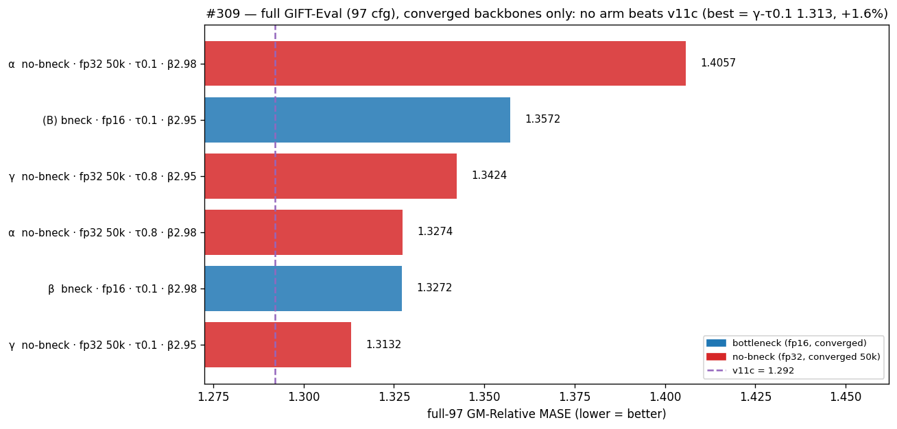
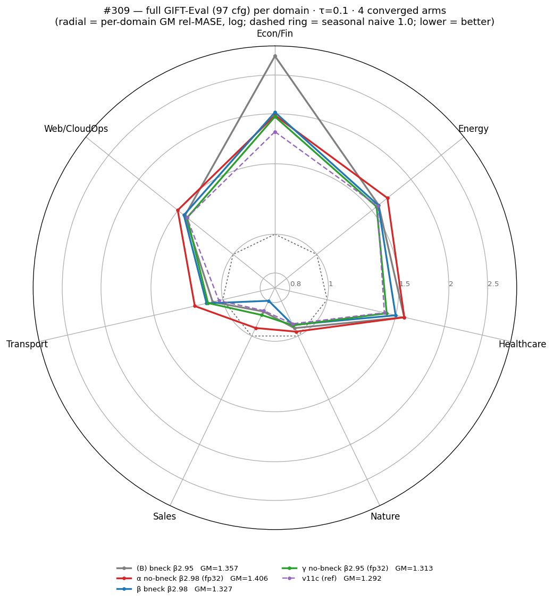
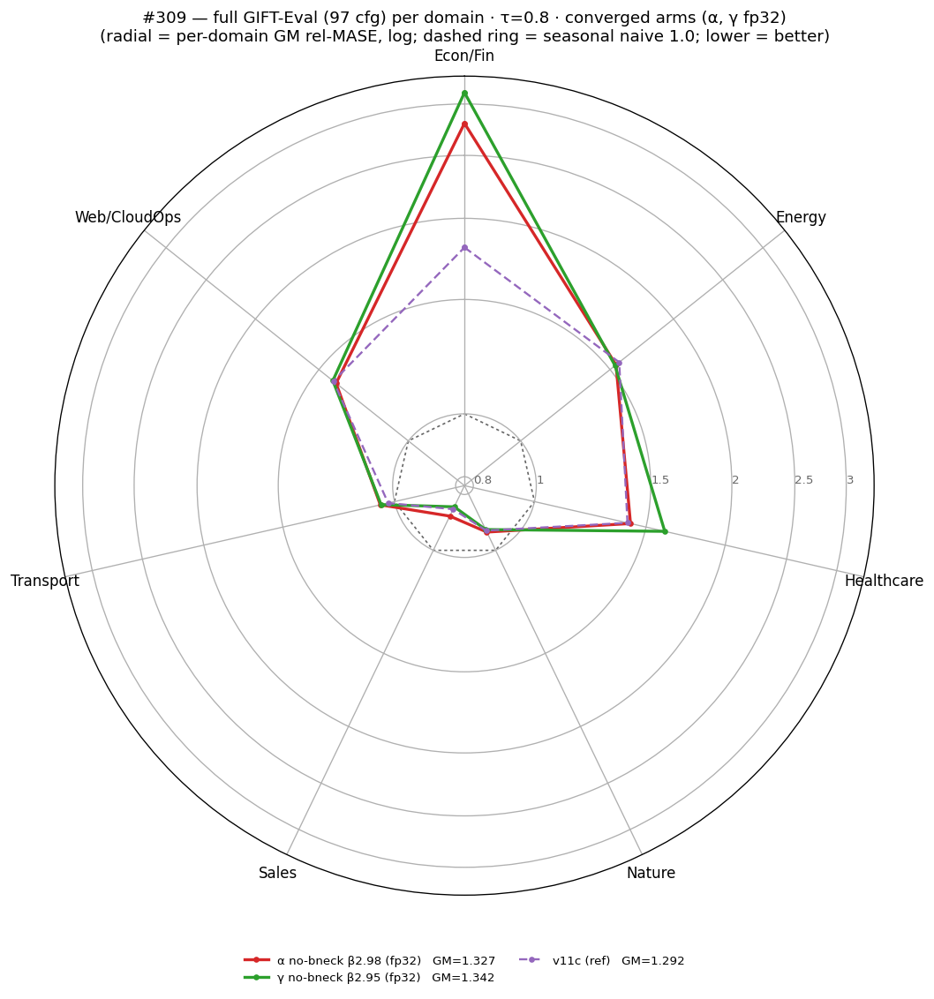
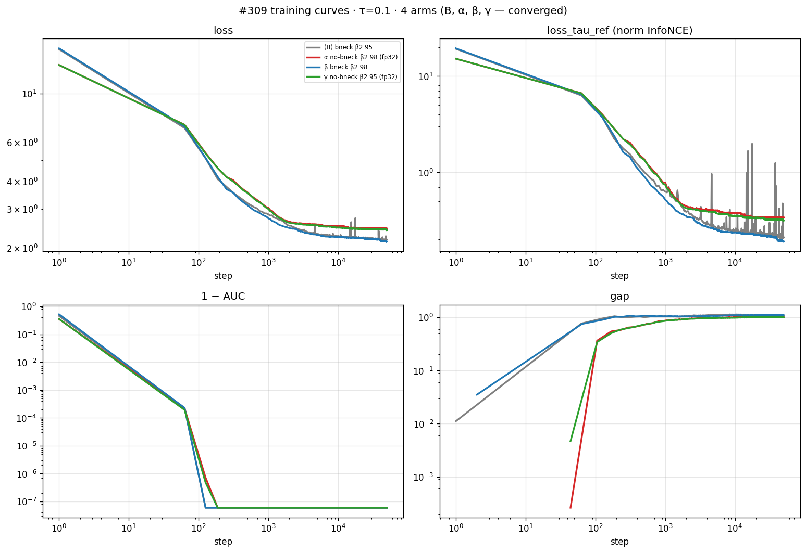
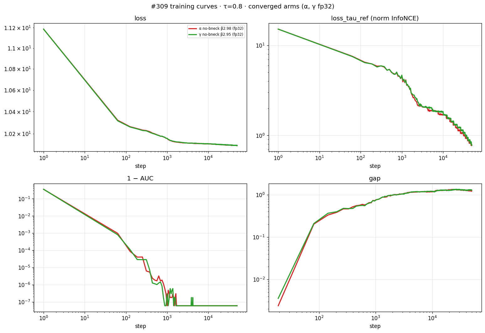
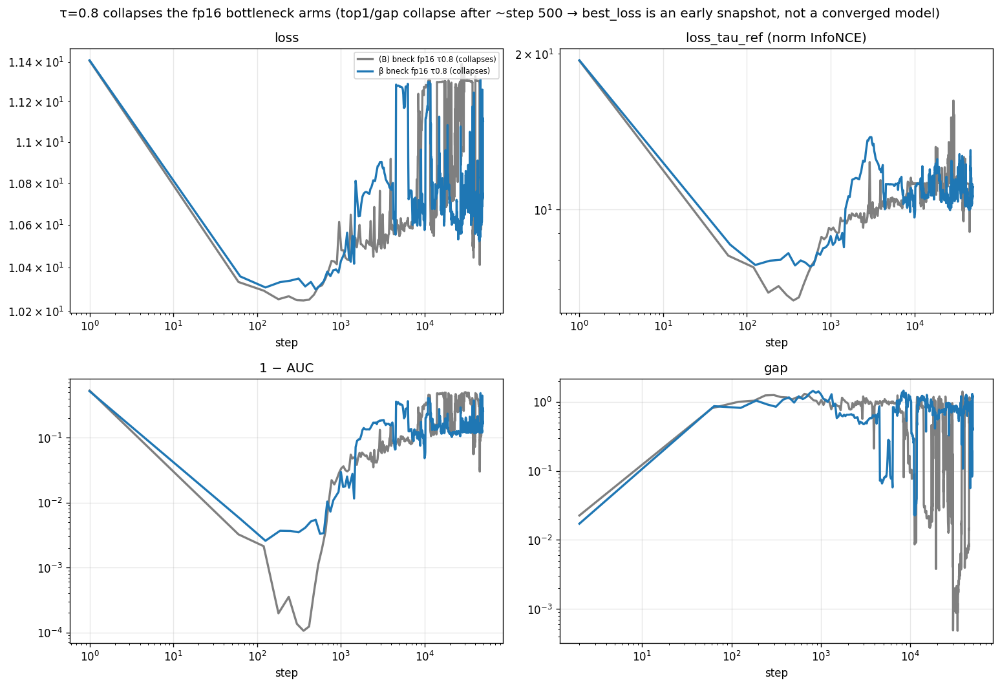
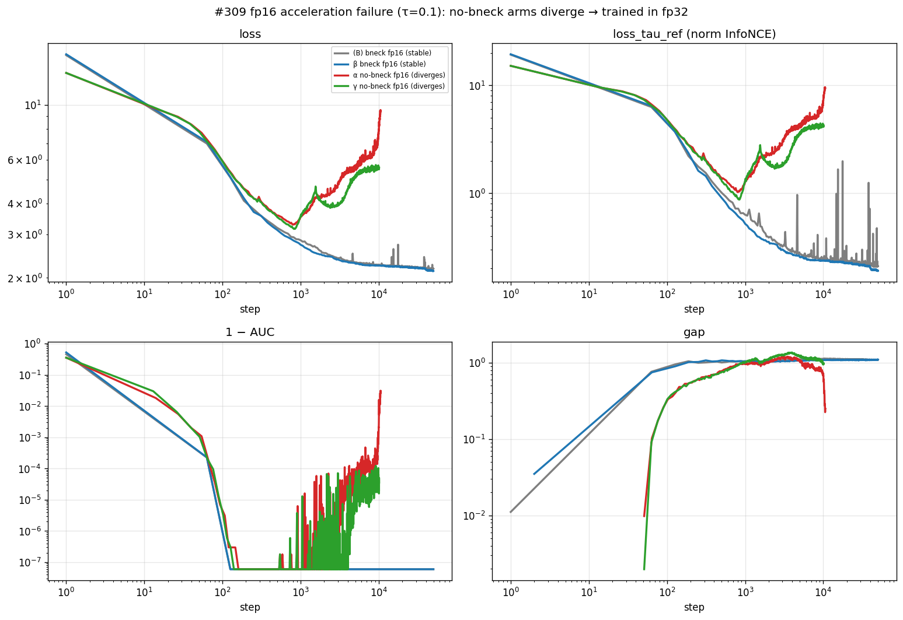

# #309 Bottleneck × β2 × τ on (B): can we match v11c?

## Question

The bottleneck-fullfh recipe **(B)** reaches full-97 GM-MASE 1.3572
(#303), ~5% above the encoder-forecaster champion **v11c** (1.292).
Three cheap knobs might close the gap: the forecaster **bottleneck**,
AdamW **β2**, and the contrastive temperature **τ**. This card tests
them.

*Metric:* full-97 GM-Relative MASE = geometric mean over 97 GIFT-Eval
configs of (model MASE ÷ seasonal-naive MASE); **lower is better**,
1.0 = seasonal naive. Each backbone gets a 30k 2L-causal q-head before
eval.

## Arms

All four share the (B) recipe (GRU patch-encoder → 6L causal encoder →
1L forecaster, dropkey 0.70, loss `cosine_similarity_batch_full_hh_negs`,
50k steps, global batch 256, seed 20260520). They differ on two knobs:

| Arm | forecaster bottleneck | AdamW β2 | change vs (B) |
|-----|-----------------------|---------:|---------------|
| **(B)** | kept (d=128) | 0.95 | baseline |
| **α** | **removed** (d=384) | **0.98** | −bottleneck, +β2 |
| **β** | kept (d=128) | **0.98** | +β2 |
| **γ** | **removed** (d=384) | 0.95 | −bottleneck |

Each arm is run at **τ = 0.1** and **τ = 0.8** (the v11c temperature is
0.1). v11c is the reference throughout (no-bottleneck, all-fp32, dropkey
0.9, plain `cosine_similarity_batch` loss).

## Verdict

**No converged arm beats v11c.** Of the six arms that train to a
genuinely converged backbone, the best is **γ-τ0.1 (fp32) = 1.3132**,
still **+1.6%** over v11c (1.292); the rest land 1.327–1.406. So:

- **Removing the bottleneck does not help.** Every converged
  no-bottleneck arm (α, γ at both τ) is 1.31–1.41 — none reaches v11c.
  The bottleneck was not what held (B) back.
- **Raising τ to 0.8 collapses the fp16 bottleneck arms.** (B)-τ0.8 and
  β-τ0.8 train fine for a few hundred steps, then their contrastive
  metrics collapse (top1 (B) 0.97→0.01, β 0.45→0.01; gap and AUC fall
  off after ~step 500). Their `best_loss` checkpoint — which is what
  `_FINAL.pth` points to and what got eval'd — is a **collapse-onset
  snapshot at step ~324 (B) / ~500 (β)**, not a converged 50k backbone.
  This is a **training failure**, the same class as the fp16
  no-bottleneck divergence below.
- A consistent **under-training artifact** runs through both failure
  modes: early / pre-collapse / pre-divergence checkpoints (step
  ~300–900) score **1.23–1.29** on GIFT-Eval — better than any
  converged model and better than v11c — but they are **not usable
  backbones** (their own training has collapsed/diverged). The
  earlier-reported sub-1.29 numbers ((B)-τ0.8 1.2335, β-τ0.8 1.2942,
  the fp16 no-bneck snapshots 1.277/1.283) are all of this kind.

**Caveats (do not discount).** Every cell is a **single seed**.
#307's variance estimate is ±0.02 (n=3); the converged ordering above
(γ-τ0.1 1.313 < β-τ0.1 1.327 ≈ α-τ0.8 1.327 < γ-τ0.8 1.342 < (B)-τ0.1
1.357 < α-τ0.1 1.406) has cells within that band, so the within-group
ranking is soft. The headline — *no converged arm reaches v11c* — holds
across the full spread (best converged is +1.6%). Reproduce on a second
seed before relying on any single margin.

## Results — converged backbones, by arm and τ

Converged arms only (best → worst; lower = better). The two fp16
bottleneck arms at τ=0.8 collapse in training and are **excluded** here
— see the artifacts/failures section.

| Arm | bottleneck | β2 | τ | precision | full-97 GM |
|-----|:----------:|---:|--:|:---------:|-----------:|
| **v11c (ref)** | removed | 0.98 | 0.1 | fp32 | **1.292** |
| γ | removed | 0.95 | **0.1** | fp32 | **1.3132** |
| β | kept | 0.98 | 0.1 | fp16 | 1.3272 |
| α | removed | 0.98 | 0.8 | fp32 | 1.3274 |
| γ | removed | 0.95 | 0.8 | fp32 | 1.3424 |
| (B) | kept | 0.95 | 0.1 | fp16 | 1.3572 |
| α | removed | 0.98 | 0.1 | fp32 | 1.4057 |

**Every converged cell is worse than v11c (1.292).** The best,
γ-τ0.1 (1.3132), is +1.6%. The same numbers laid out by (arm, τ):

| Arm | bottleneck | β2 | τ=0.1 | τ=0.8 |
|-----|:----------:|---:|------:|------:|
| (B) | kept | 0.95 | 1.3572 | *collapsed* |
| β   | kept | 0.98 | 1.3272 | *collapsed* |
| γ   | removed | 0.95 | **1.3132** | 1.3424 |
| α   | removed | 0.98 | 1.4057 | 1.3274 |
| v11c (ref) | removed | 0.98 | **1.292** | — |

The fp16 bottleneck arms have no converged τ=0.8 cell — they collapse
(below).

### Per-domain (full GIFT-Eval), v11c dashed

τ=0.1 (4 converged arms):

τ=0.8 (converged arms only — α, γ fp32; the fp16 bneck arms collapsed):

The converged arms sit on or outside the v11c ring across domains; none
sits cleanly inside it. The per-domain picture tracks the aggregate.

### Training curves (converged)

τ=0.1 (4 arms):

τ=0.8 (converged α, γ fp32):

The converged arms descend monotonically and hold (1−AUC at floor, gap
~1.0).

## τ = 0.1 vs τ = 0.8

τ's effect depends on the recipe — and on the **converged** arms it is
mixed, not uniformly helpful:

| Arm | τ=0.1 | τ=0.8 | Δ (τ0.8 − τ0.1) |
|-----|------:|------:|------:|
| γ no-bneck β2.95 (fp32) | 1.3132 | 1.3424 | **+0.029 (hurts)** |
| α no-bneck β2.98 (fp32) | 1.4057 | 1.3274 | −0.078 (helps a weak arm) |
| (B) bneck β2.95 (fp16) | 1.3572 | *collapses* | — |
| β bneck β2.98 (fp16)   | 1.3272 | *collapses* | — |

- **No-bottleneck β2=0.95 (γ): τ=0.8 *hurts*** (1.313 → 1.342). γ-τ0.1
  is the best converged cell in the whole sweep, and raising τ drags it.
- **No-bottleneck β2=0.98 (α): τ=0.8 helps a lot** (1.406 → 1.327) but
  only rescues a poor arm — still +2.7% over v11c.
- **fp16 bottleneck arms ((B), β): τ=0.8 collapses them.** Both train
  normally for a few hundred steps, then top1/gap/AUC collapse (see
  below). There is no converged τ=0.8 bottleneck cell to compare; the
  earlier 1.2335 / 1.2942 readings were the collapse-onset snapshots,
  not τ=0.8 results.

So τ=0.8 is neither a clean win nor a single closing knob: it hurts the
best converged arm (γ), partly rescues a weak one (α), and breaks the
fp16 bottleneck arms.

## β2 and the bottleneck (converged arms only)

- **At τ=0.1, β2 = 0.95 better than 0.98 for the no-bottleneck arm**
  (γ 1.313 vs α 1.406); the τ=0.1 bottleneck arms (β 1.327, (B) 1.357)
  are the only converged bottleneck cells, since the τ=0.8 bottleneck
  arms collapse.
- **Removing the bottleneck never reaches v11c at convergence**: the
  best converged no-bottleneck cell (γ-τ0.1, 1.313) still trails v11c
  (1.292). The bottleneck is not what held (B) back from v11c.

## Failures and under-training artifacts (not results)

Three checkpoint classes here score well on GIFT-Eval but are **not
converged backbones**. They are diagnostics, not entries in the results
table.

### fp16 bottleneck arms collapse at τ=0.8 ((B)-τ0.8, β-τ0.8)

(B)-τ0.8 and β-τ0.8 (bottleneck, fp16) train fine briefly, then collapse:

| arm | best_loss step | top1 there | top1 by ~step 1k | gap by ~30k | AUC by ~30k |
|-----|---------------:|-----------:|-----------------:|------------:|------------:|
| (B)-τ0.8 | **324** | 0.97 | 0.12 | ~0.00 | ~0.50 |
| β-τ0.8 | **494 (~500)** | 0.45 | 0.11 | ~0.82 | ~0.88 |

`_FINAL.pth` is byte-identical (md5) to `_best_loss.pth` for both arms,
so the eval'd backbone is this **collapse-onset snapshot**, not a 50k
model. Their GIFT-Eval readings — (B)-τ0.8 = 1.2335, β-τ0.8 = 1.2942 —
are therefore **under-training artifacts**, the same phenomenon as the
fp16 no-bneck pre-divergence snapshots below: a barely-trained snapshot
transfers *better* than a converged one, but it is not a usable model.

### fp16 no-bottleneck arms diverge (α, γ at fresh init)

The no-bottleneck arms (α, γ) **diverge under fp16 at fresh init** (loss
bottoms ~step 900, then climbs; top1/AUC/R² collapse); both bottleneck
arms are fp16-stable at τ=0.1. Consistent with the unbounded forecaster
residual-amplitude growth in
`experiments/2026-05-11_exp_encoder_forecaster/EXPERIMENT_LOG_2026-05-15_fp16_precision.md`.
This is a **technical failure of the fp16 speedup, not a result**: α and
γ are trained in fp32 instead (stable — the precision v11c uses; those
are the converged α/γ numbers in the table).

An fp16 pre-divergence checkpoint (~step 900) scored 1.277/1.283 — a
mid-divergence snapshot, not a converged backbone; the same arms trained
to 50k in fp32 land at 1.31–1.41. Detail in EXECUTION_LOG.md.

## What we learned

1. **No converged arm reaches v11c.** Best converged = γ-τ0.1 (fp32) =
   1.3132, +1.6% over v11c (1.292); the rest are 1.327–1.406. None of
   the three knobs closes the gap at convergence.
2. **Removing the bottleneck does not help** — every converged
   no-bottleneck arm (α, γ, both τ) is 1.31–1.41, none reaching v11c.
   The bottleneck was not what held (B) back.
3. **Raising τ to 0.8 collapses the fp16 bottleneck arms** ((B), β):
   top1/gap/AUC collapse after ~step 500, so their best_loss/`_FINAL`
   checkpoint is a collapse-onset snapshot (step ~324/500), not a
   converged model. A training failure, not a τ=0.8 result.
4. **On the converged arms τ=0.8 is mixed** — it hurts the best arm
   (γ 1.313 → 1.342) and only rescues a weak one (α 1.406 → 1.327,
   still short of v11c).
5. **The sub-1.29 numbers are under-training artifacts.** (B)-τ0.8
   1.2335, β-τ0.8 1.2942, and the fp16 no-bneck snapshots 1.277/1.283
   all come from early/collapse-onset/pre-divergence checkpoints
   (step ~300–900) — they transfer better than converged models but
   are not usable backbones, so they are not results.

*Why an early snapshot transfers better than a converged one, and why
τ=0.8 collapses the fp16 bottleneck arms, is not investigated here.* We
have no representation-vs-step instrumentation beyond the contrastive
metrics, so any causal story would be speculation. Treat the collapse
and the artifact pattern as measured single-seed observations.

## Limitations

- **Single seed per cell.** #307's variance estimate is ±0.02 (n=3).
  The converged within-group ordering has cells inside that band; the
  headline (no converged arm reaches v11c; best is +1.6%) holds across
  the spread. Confirm on a second seed before relying on a single
  margin.
- **τ=0.8 fp16 bottleneck arms collapsed**, so there is no converged
  τ=0.8 bottleneck measurement. A stable τ=0.8 bottleneck run (e.g.
  fp32, or with a stabilizing change) would be needed to measure τ's
  effect on the bottleneck recipe at convergence.
- **fp16 no-bneck divergence** forced α/γ to fp32; v11c is also fp32,
  so the comparison is precision-matched, but the fp16 path for these
  arms is unavailable.
- **v11c confound.** v11c additionally differs in dropkey (0.9 vs 0.7)
  and loss (plain vs `hh-negs`); the no-bottleneck arms' shortfall vs
  v11c is entangled with them.
- q-head + GIFT-Eval sample windows are single-seed.

## Annex

### Compute
τ=0.1 fp16 arms: 1× RTX 4090 prosumer on vast (offer 35882331,
$0.55/h), **$2.66** total. All fp32 (no-bneck) arms, all τ=0.8 arms,
and every downstream ran free on elisa.

### Code
Branch `experiment/2026-05-20-bottleneck-beta2-confound`. Runner
`scripts/elisa_run.sh <arm> <tau> <runtag> <gpus> <prec>`
(arm ∈ {bbase=(B), alpha, beta, gamma}; prec ∈ {fp16, fp32});
downstream `scripts/downstream.sh <arm> <gpu>`; figures
`scripts/{plot_results.py (radars + curves per τ + fp16-divergence +
tau08-bneck-collapse), plot_summary.py (GM matrix, converged only)}`.
