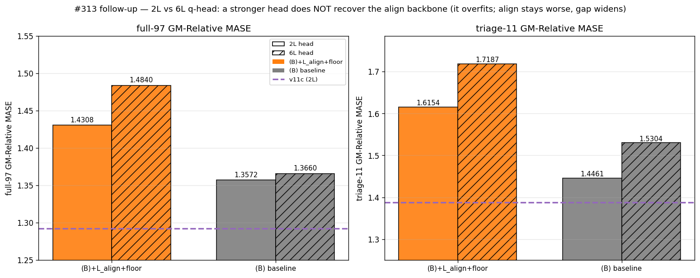

# #313 — L_align + contrastive-floor subtraction on (B): can it match v11c?

**Verdict: no — it moves the wrong way.** Adding the BYOL alignment term
`L_align` (λ=1) to the **(B)** recipe makes full GIFT-Eval transfer *worse*,
not better: full-97 GM-MASE **1.4308** vs (B) 1.3572 (**+5.4%**) and vs the
**v11c** target 1.2920 (**+10.7%**); triage-11 **1.6154** vs (B) 1.4461 / v11c
1.3878. The contrastive-floor flag is gradient-neutral (cosmetic), so `L_align`
is the only change to the objective — and it widens the gap to v11c rather than
closing it. A 6-layer q-head (vs the matched 2-layer) does **not** rescue it —
the gap *widens*, ruling out a readout-capacity explanation (§6-layer re-eval).

*(GM-Relative MASE = geometric mean, across GIFT-Eval configs, of our MASE
divided by the seasonal-naive MASE; 1.0 = seasonal-naive parity, lower = better.)*

*Full GIFT-Eval (97 configs). The (B)+L_align+floor bar (orange) sits further
from the v11c target line than plain (B) — the term hurts.*

## Result

| Arm | full-97 GM-MASE | triage-11 GM-MASE |
|-----|----------------:|------------------:|
| v11c (target) | 1.2920 | 1.3878 |
| (B)  bneck·fp16·τ0.1·β2.95 | 1.3572 | 1.4461 |
| **(B) + L_align + floor** | **1.4308** | **1.6154** |

The degradation is consistent across the 11-config triage, the full 97 configs,
and most domains:

*Per-domain GM-Relative MASE (log radial; dashed ring = seasonal-naive 1.0).
The new arm (orange) is outside v11c on 6 of 7 domains and outside (B) on 4 of 7
— worse on net.*

This is **not a training failure**, and — importantly — the loss-plot gap is
**not** the alignment term. The forecaster reaches cos(f, h⁺) ≈ 0.999 with or
without `L_align` ((B) gets there on its own, cos ≈ 0.998), so at convergence
`L_align` ≈ 0.003 — essentially redundant.

*Both curves re-based by the same gradient-neutral InfoNCE floor
(`log(1+N·e^(−1/τ))` = 1.94). **Left** — total loss on a common baseline: the new
arm plateaus ~0.35 above (B); since `L_align` ≈ 0.003 at convergence, that gap is
a higher converged **contrastive** loss at the training τ, not the align term.
**Right** — `loss_tau_ref` (fixed reference τ; align/floor don't enter it): the
new arm tracks (B), marginally lower and without (B)'s late spikes.*

So the contrastive training signal is small and mixed (training-τ loss slightly
*higher*, `loss_tau_ref` slightly *lower*) and does not account for the large
transfer gap. The damage is visible only downstream: adding `L_align` moves the
representation somewhere that forecasts *worse* — under the matched 2-layer head,
and (next section) under a 6-layer one too.

## Protocol

- **Arm** = the exact **(B)** recipe (`cl_hh_50k`, from
  `2026-05-19_crossed_loss_ablation`: forecaster bottleneck d=128/h=4, fp16 body
  + fp32 residual/patch-emb, τ=0.10, β2=0.95, dropkey 0.70 shared, loss_shape
  `cosine_similarity_batch_full_hh_negs`, pos-in-denominator, seed 20260520, 50k)
  **plus the two opt-in loss flags** (PR #312), nothing else changed:
  - `--align-loss-weight 1.0`: adds `L_align = λ·(2 − 2·cos(f_t, sg(h_{t+1})))`
    to the loss — stop-grad on the encoder target `h_{t+1}`; per-cosine gradient
    a constant −2λ (non-saturating, independent of the negatives). **Affects
    gradients.**
  - `--subtract-contrastive-floor`: re-bases the logged loss by the constant
    `log(1 + N·e^(−1/τ))` (the normalized-InfoNCE uniformity floor; effective
    negatives N = B·(3C + T + B − 3) = B·(T+B) at this run's C=1). A detached
    scalar — **gradient-neutral**, so it changes the loss
    *curve* only, never the model.
- **Downstream** (identical to #309, so the numbers are comparable to (B)/v11c):
  2-layer causal transformer quantile q-head, 30k steps, `--reconstruction
  forecaster`; GIFT-Eval triage (11) + full (97), strategy B4, forecast-len 16.
  q-head promoted from the step-30k checkpoint (best-ema also fell at step 30k).
- **Compute**: elisa, free. The full-97 eval was sharded across both GPUs to
  halve wall time; the merge recomputes the GM over the union and was validated
  to reproduce (B)'s 1.3572 exactly. Triage ran separately with the #309 filter.
  See `EXECUTION_LOG.md` for the sharding mechanics.

## What we learned

- **`L_align` (λ=1) on (B) does not match v11c — it hurts** (+5.4% full / +11.7%
  triage worse than (B); further still from v11c).
- **Not explained by the contrastive training signal.** `L_align` is near-
  redundant — the forecaster aligns to the next-step latent anyway (cos ≈ 0.999
  with it, 0.998 without) — and the contrastive signal vs (B) is small and mixed
  (training-τ loss slightly higher, `loss_tau_ref` slightly lower). So this is
  not a convergence/optimization issue; the damage is purely in downstream
  transfer.
- The **floor subtraction is purely a readability aid** (gradient-neutral); it
  has no effect on the trained model, only on the logged loss.
- **Robust to readout capacity.** A 6-layer q-head (vs the 2-layer above) does
  *not* recover the align backbone — it transfers *worse* for both arms (the
  bigger head overfits) and the align−(B) gap *widens* to +8.6% / +12.3%
  (see below). So the harm is not a small-head readout limit.

## 6-layer head re-eval — does a stronger head recover the align backbone?

A fair objection (per review): maybe the align term yields a *better*
representation that the matched 2-layer head simply cannot read out. To test it,
a **6-layer** transformer q-head (everything else identical; 2L→6L) was trained
on both backbones and re-evaluated. **It does not recover — the gap widens.**

| q-head | (B)+align+floor | (B) | align − (B) |
|--------|----------------:|----:|------------:|
| 2-layer | 1.4308 / 1.6154 | 1.3572 / 1.4461 | +5.4% / +11.7% |
| **6-layer** | **1.4840 / 1.7187** | **1.3660 / 1.5304** | **+8.6% / +12.3%** |

*(full-97 / triage-11 GM-Relative MASE, lower = better; v11c 1.2920 / 1.3878.)*

Two observations, both pointing the same way:
- **A bigger head does not help — it overfits.** The 6-layer head transfers
  *worse* than the 2-layer for **both** backbones, so the 2L verdict was not a
  readout-capacity limit.
- **The align backbone is over-specialised.** Its 6-layer head reached a *lower*
  training loss (ema 0.212 vs (B)'s 0.245) yet transferred *worse* — the align
  representation is easier to fit but generalises less. The "better
  representation, weak readout" hypothesis is therefore **rejected**: align is
  genuinely worse for forecasting transfer, and more readout capacity widens
  the gap rather than closing it.

## Follow-up

- λ=1 may be too strong. A small λ (≈0.05–0.2) might keep the apparent
  late-training smoothing (right panel) without the transfer cost — untested.
- Consistent with the broader #309 theme: extra contrastive shaping on (B) tends
  to over-specialise and degrade GIFT-Eval transfer. The gap to v11c is closed
  by temperature (β-τ0.8 ≈ 1.294 in #309), not by added loss terms.

*Caveat: one seed per arm. The conclusion rests on a consistent, large
degradation across two independent config sets (full-97 and triage-11) and both
head sizes, well beyond typical eval noise, while training stayed healthy (no
divergence; the contrastive signal vs (B) is small and mixed).*
