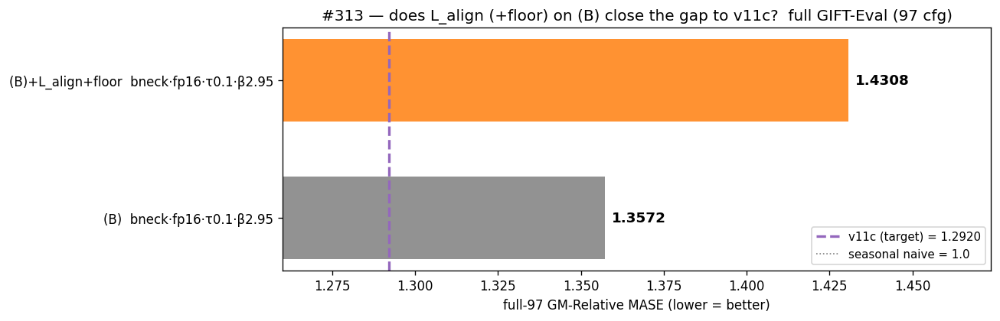
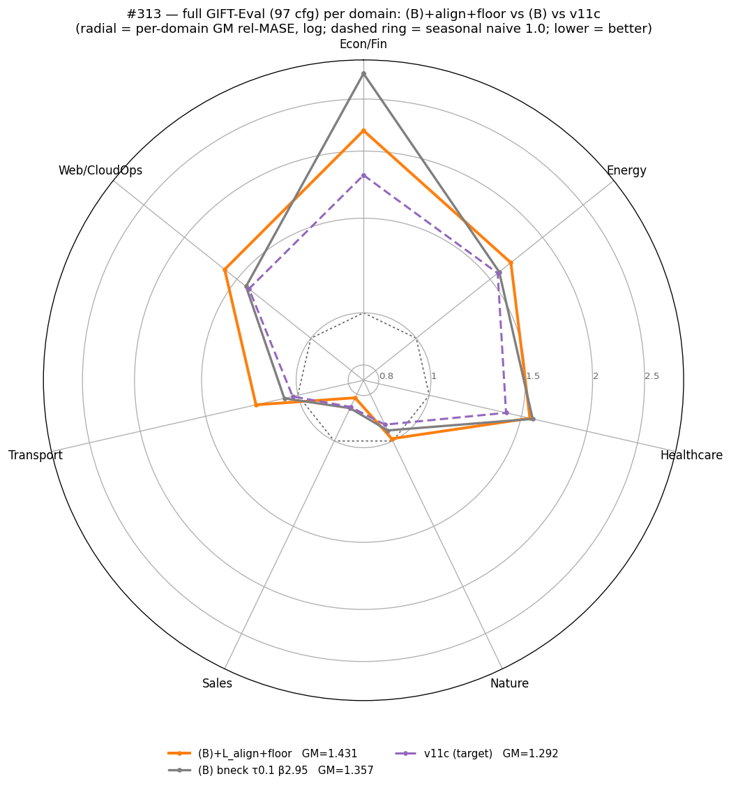
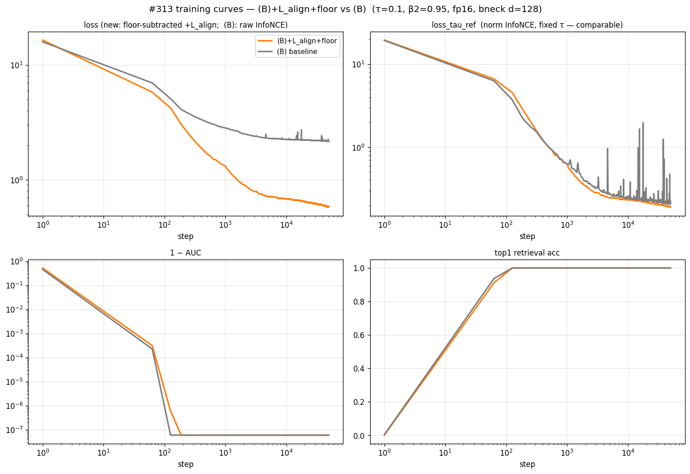

# #313 — L_align + contrastive-floor subtraction on (B): can it match v11c?

**Verdict: no — it moves the wrong way.** Adding the BYOL alignment term
`L_align` (λ=1) to the **(B)** recipe makes full GIFT-Eval transfer *worse*,
not better: full-97 GM-MASE **1.4308** vs (B) 1.3572 (**+5.4%**) and vs the
**v11c** target 1.2920 (**+10.7%**); triage-11 **1.6154** vs (B) 1.4461 / v11c
1.3878. The contrastive-floor flag is gradient-neutral (cosmetic), so `L_align`
is the only change to the objective — and it widens the gap to v11c rather than
closing it.

*(GM-Relative MASE = geometric mean, across GIFT-Eval configs, of our MASE
divided by the seasonal-naive MASE; 1.0 = seasonal-naive parity, lower = better.)*

*Full GIFT-Eval (97 configs). The (B)+L_align+floor bar (orange) sits further
from the v11c target line than plain (B) — the term hurts.*

## Result

| Arm | full-97 GM-MASE | triage-11 GM-MASE |
|-----|----------------:|------------------:|
| v11c (target) | 1.2920 | 1.3878 |
| (B)  bneck·fp16·τ0.1·β2.95 | 1.3572 | 1.4461 |
| **(B) + L_align + floor** | **1.4308** | **1.6154** |

The degradation is consistent across both the 11-config triage and the full 97
configs, and across nearly every domain:

*Per-domain GM-Relative MASE (log radial; dashed ring = seasonal-naive 1.0).
The new arm (orange) is outside both (B) and v11c on 6 of 7 domains.*

Crucially, by the contrastive metrics `L_align` looks **neutral-to-favourable,
not harmful**: separability (1 − AUC) and top-1 retrieval of the true future are
identical to (B) (both reach perfect separation by ~step 150), and the
comparable normalized-InfoNCE diagnostic `loss_tau_ref` runs marginally *lower*
than (B) late in training (~8% below its median) and without (B)'s spikes. The
contrastive objective is, if anything, slightly *better* — yet transfer is worse.

*Panel 1: the new arm's floor-subtracted total loss (orange) descends to ~0.6
while (B)'s raw InfoNCE (grey) plateaus near ~2.18; the ~1.56 gap between the
curves is the subtracted floor (less the small L_align residual) — the floor
flag working as designed (cosmetic). Panels 3–4 (1 − AUC, top1) overlay exactly.
Panel 2 (`loss_tau_ref`): the new arm runs marginally below (B) late in training
and without (B)'s spikes — the contrastive diagnostic is slightly better, not
worse.*

So this is **not a training failure** — the model still separates futures
perfectly. The alignment pull simply moves the representation in a direction
that transfers *worse* to forecasting.

## Protocol

- **Arm** = the exact **(B)** recipe (`cl_hh_50k`, from
  `2026-05-19_crossed_loss_ablation`: forecaster bottleneck d=128/h=4, fp16 body
  + fp32 residual/patch-emb, τ=0.10, β2=0.95, dropkey 0.70 shared, loss_shape
  `cosine_similarity_batch_full_hh_negs`, pos-in-denominator, seed 20260520, 50k)
  **plus the two opt-in loss flags** (PR #312), nothing else changed:
  - `--align-loss-weight 1.0`: adds `L_align = λ·(2 − 2·cos(f_t, sg(h_{t+1})))`
    to the loss — stop-grad on the encoder target `h_{t+1}`; per-cosine gradient
    a constant −2λ (non-saturating, independent of the negatives). **Affects
    gradients.**
  - `--subtract-contrastive-floor`: re-bases the logged loss by the constant
    `log(1 + N·e^(−1/τ))` (the normalized-InfoNCE uniformity floor; effective
    negatives N = B·(3C + T + B − 3) = B·(T+B) at this run's C=1). A detached
    scalar — **gradient-neutral**, so it changes the loss
    *curve* only, never the model.
- **Downstream** (identical to #309, so the numbers are comparable to (B)/v11c):
  2-layer causal transformer quantile q-head, 30k steps, `--reconstruction
  forecaster`; GIFT-Eval triage (11) + full (97), strategy B4, forecast-len 16.
  q-head promoted from the step-30k checkpoint (best-ema also fell at step 30k).
- **Compute**: elisa, free. The full-97 eval was sharded across both GPUs to
  halve wall time; the merge recomputes the GM over the union and was validated
  to reproduce (B)'s 1.3572 exactly. Triage ran separately with the #309 filter.
  See `EXECUTION_LOG.md` for the sharding mechanics.

## What we learned

- **`L_align` (λ=1) on (B) does not match v11c — it hurts** (+5.4% full / +11.7%
  triage worse than (B); further still from v11c).
- The harm is **invisible in (indeed, opposite to) the contrastive metrics** —
  AUC and top-1 match (B) and `loss_tau_ref` runs marginally *lower* — so it is
  not a convergence/optimization problem. The extra constant pull toward the
  (stop-grad) next-step latent reshapes the representation in a way the
  contrastive objective rewards slightly but forecasting transfer penalises.
- The **floor subtraction is purely a readability aid** (gradient-neutral); it
  has no effect on the trained model, only on the logged loss.

## Follow-up / hypotheses (not tested here)

- λ=1 may be too strong. A small λ (≈0.05–0.2) might keep the apparent
  late-training smoothing (panel 2) without the transfer cost — untested.
- Consistent with the broader #309 theme: extra contrastive shaping on (B) tends
  to over-specialise and degrade GIFT-Eval transfer. The gap to v11c is closed
  by temperature (β-τ0.8 ≈ 1.294 in #309), not by added loss terms.

*Caveat: one seed per arm. The conclusion rests on a consistent, large
degradation across two independent config sets (full-97 and triage-11), well
beyond typical eval noise, while contrastive-training health is equal-or-better
than (B) (AUC/top1 identical, `loss_tau_ref` marginally lower).*
