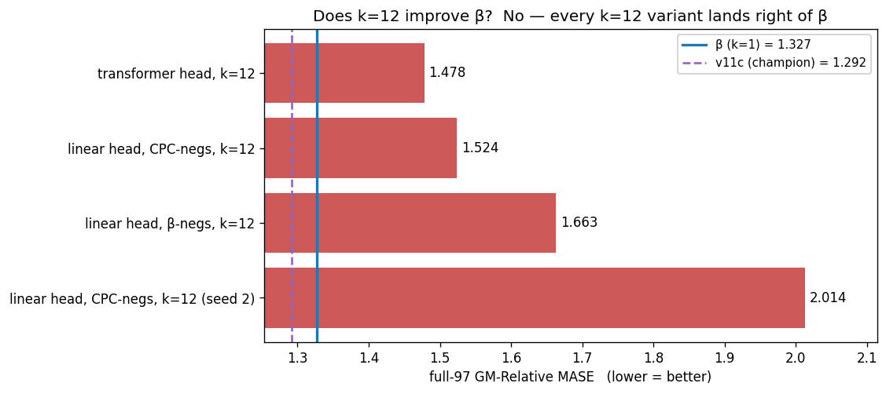
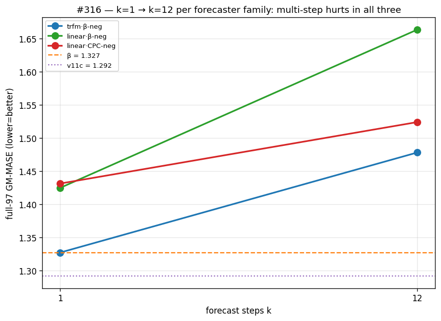
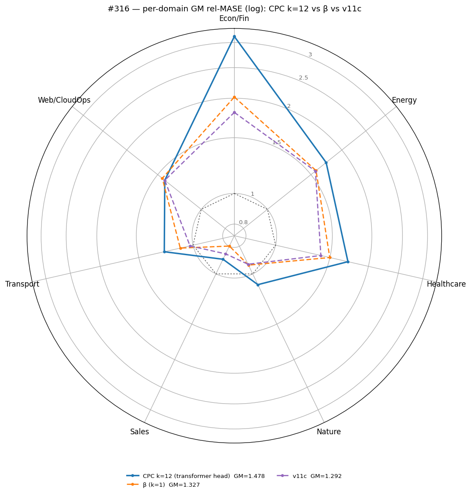
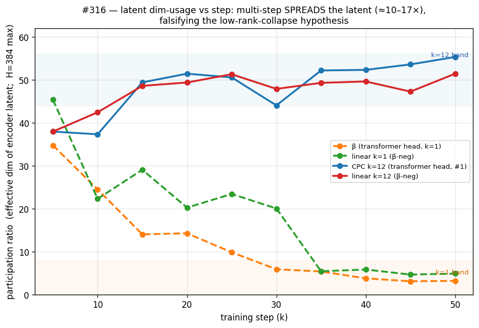
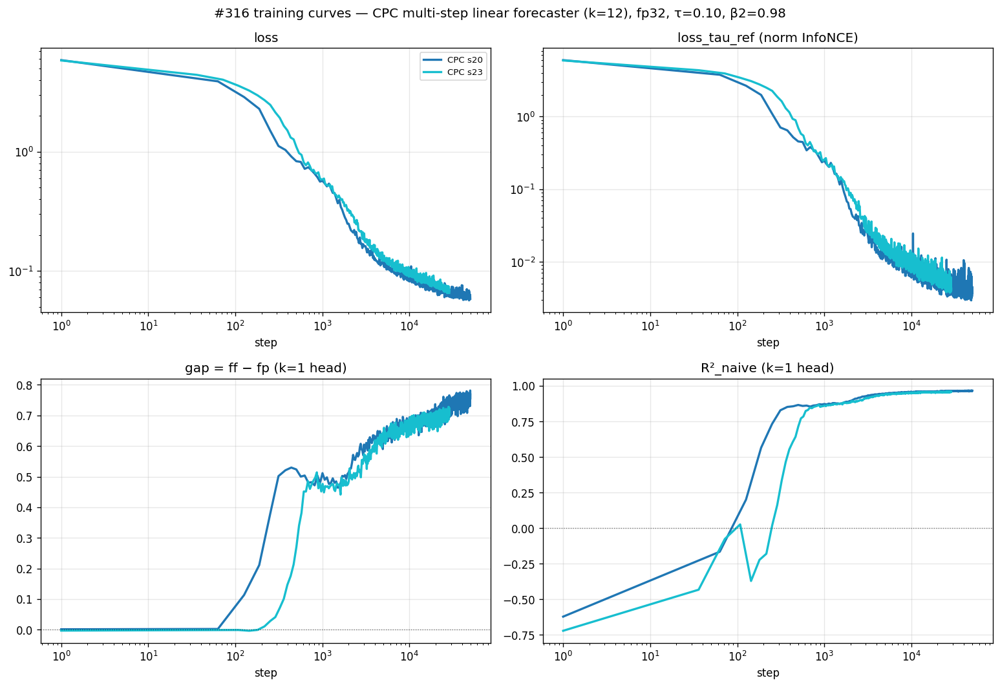

# #316 — Does multi-step forecasting (k=12) improve β?

## Question

The backbone is trained by **contrastive forecasting**: a causal encoder turns
each patch of a series into a latent *h_t*; a small **forecaster** predicts the
next latent; an InfoNCE loss pulls the prediction toward the true future latent
*h_{t+1}* and away from negatives (other times, channels, series). The backbone
is then frozen and a quantile head is trained on its latents for **GIFT-Eval**,
scored as **GM-Relative MASE** — the geometric mean over 97 configs of
(model MASE ÷ seasonal-naive MASE); **lower is better**, 1.0 = seasonal naive.

The strongest recipe on this line, **β** (a 1-layer causal-transformer
forecaster with a d=128 bottleneck, AdamW β2=0.98), reaches **1.3272**, still
+2.7 % over the champion **v11c (1.292)**. β predicts only the **next** latent
(*k = 1*). Contrastive Predictive Coding (van den Oord et al. 2018) predicts
**several** steps ahead, on the theory that it forces the latent to hold more
forecastable structure. So:

> Holding β's architecture and negatives fixed, does predicting **k = 12** steps
> ahead instead of one improve transfer — or not change it, or hurt?

## Result

**It hurts — consistently.** Replacing β's single forecaster with **K = 12
transformer-1L heads** (each *architecturally identical* to β's forecaster;
head *k* predicts *h_{t+k}*), keeping β's negatives unchanged and changing
**only** the number of forecast steps (at k=1 the loss is byte-identical to β),
gives full-97 GM-MASE **1.4781** (small head) — **+11.4 %** over β (1.3272) and
+14 % over v11c. The deeper 6-layer head recovers a little (1.4212) but comes
nowhere near β.

### The trend is the same in every variant

To rule out the forecaster *type* and the *negative set* as explanations, the
same k=1→k=12 change was run in three families. In **all three**, k=12 is worse
than k=1 (small-head full-97 GM-MASE; lower = better):

| forecaster family | k = 1 | k = 12 | k effect |
|---|---:|---:|---:|
| **transformer-1L heads, β negatives**  (k=1 ≡ β) | **1.3272** | **1.4781** | **+0.151 (worse)** |
| linear heads, β negatives                        | 1.4248 | 1.6635 | **+0.239 (worse)** |
| linear heads, CPC negatives                       | 1.4313 | 1.5240 | **+0.093 (worse)** |

_References: v11c = 1.292, β = 1.3272, (B) = 1.3572 (all small-head full-97)._

Multi-step prediction does not close the gap to v11c — it **widens** it, in
**every** forecaster/negative combination (k=12 is +0.09 to +0.24 worse than
k=1). A secondary, orthogonal effect: the **transformer forecaster beats the
linear one even at k=1** — β (transformer, k=1) = 1.3272, vs linear k=1 ≈ 1.43 —
so the linear families start worse and the multi-step penalty compounds. The
transformer-head k=12 is the least-bad k=12, but still well short of β.

### Per domain (full GIFT-Eval), v11c reference

Across the 7 GIFT-Eval domains, the k=12 transformer-head ring sits **outside**
(worse than) both β and v11c on 6 of 7 — tying only on Web/CloudOps. The deficit
is broad, not a domain-specific trade-off.

### Why: multi-step keeps the latent diffuse; β concentrates it

A natural hypothesis (raised in review) is that the multi-step objective forces
the latent to *collapse* onto a low-dimensional, linearly-extrapolable subspace.
The data **refutes it — the opposite happens.** Measuring the **participation
ratio** of the encoder latent (effective dimensionality, PR = (Σλ)²/Σλ² of the
latent covariance; 1 = one direction, H = 384 = full) on a fixed real-data batch
across training:

| latent dim-usage @ 50k | k = 1 | k = 12 |
|---|---:|---:|
| transformer head (k=1 ≡ β) | **3.2** | **55.3** |
| linear head, β negatives | **4.9** | **51.4** |

The **k=1** recipes *concentrate* the latent over training, collapsing to **~3–5
effective dimensions**; the **k=12** recipes hold it **~10–17× wider (~50)**.
Predicting 12 steps ahead requires the latent to stay linearly extrapolable far
out, so it remains diffuse; predicting only the next step lets the encoder pack
variance into a few sharp, highly-predictive directions. The best-transferring
recipe is the most concentrated one — and the trend is identical in both
forecaster families, so it is the *horizon*, not the head type.

This agrees with the **forecast gap** — cos(f_t, h_{t+1}) − cos(f_t, h_t), how
much more the forecast resembles the next latent than the current one — which
settles at **~1.09 for k=1** but only **~0.65 for k=12**: the k=12 latent is both
higher-dimensional *and* less sharply one-step-predictable. A tight,
low-dimensional latent transfers best; the diffuse multi-step latent transfers
worse.

## Protocol

**One axis changes from β: the number of forecast steps.** β's forecaster is a
single 1-layer causal transformer (d=128 bottleneck, 4 heads) predicting
*h_{t+1}*. The k=12 arm replaces it with **K = 12 such heads** in parallel, head
*k* mapping the encoder output *h_t* to a prediction of *h_{t+k}*. The loss is
β's exact `cosine_similarity_batch_full_hh_negs` negative pool (encoder
all-time + cross-channel + cross-batch, batch-pooled) with the positive
**averaged over the K horizons**; at K=1 it is byte-for-byte β (verified
numerically). Everything else = β: 6-layer causal encoder, DropKey 0.70, τ=0.10,
β2=0.98, lr 1e-3, 50 k steps, global batch 256, single channel, fp32.

**Control families** (to isolate the k effect from the head/negatives): the
same k=1→k=12 change with **linear** heads (W_k: H→H) under **β negatives** and
under **CPC-canonical negatives**. β itself is the k=1 transformer/β-negs cell.

**Downstream (unchanged from β / #315).** Each frozen backbone → a quantile
forecasting head (forecast length 16, reconstruction = forecaster, 30 k steps),
**full-97 + triage-11 GM-MASE**. The headline arm (#1) is evaluated with both a
small 2-layer and a 6-layer head; the control families use the small head for
the trend comparison.

**Precision = fp32** (the v11c champion's precision; the multi-step objective is
unstable under β's fp16 body at lr 1e-3 — detail in EXECUTION_LOG.md).

## What we learned

1. **Multi-step (k=12) does not improve β — it worsens transfer**, by +11 %
   (transformer head, the clean test: 1.4781 vs 1.3272), and the gap to v11c
   widens. The CPC hypothesis (predict-further → richer latent → better
   transfer) is not supported here.
2. **The penalty is consistent across forecaster type and negative set** — every
   k=12 family is worse than its k=1 counterpart. So it is the *multi-step
   objective itself*, not the linear head or a particular negative pool.
3. **It is diffusion, not collapse.** k=12 trains as a healthy contrastive model,
   and — contra the natural low-rank-collapse hypothesis — its latent is
   *higher*-dimensional than β's (effective dim **~50 vs ~3**), not lower. The
   multi-step constraint keeps the latent diffuse and longer-horizon-linear,
   away from the sharp, low-dimensional 1-step structure (forecast gap ~0.65 vs
   ~1.09) that transfer rewards.
4. **Among k=12 variants, a stronger per-step predictor helps**: transformer-1L
   heads (1.4781) beat linear heads (1.5240 / 1.6635) — but not enough to
   matter. The next-step forecaster β remains the best recipe on this line.

## Limitations

- **Single seed per cell** (#307's variance estimate on this metric is ±0.02);
  the +0.15 k-effect far exceeds it, but a second seed would harden each margin.
- The k=12 arm bundles K=12 heads (more parameters) with the multi-step
  objective; the control families share the K-head structure, so the consistent
  trend isolates the objective, but a same-parameter single-head multi-target
  variant is untested.
- fp16 (β's body precision) is unavailable for this objective (diverges at
  lr 1e-3); the comparison is fp32-matched to v11c, not to β's fp16.
- The dim-usage probe is one participation-ratio measurement on a single fixed
  batch; absolute PR is batch-dependent, but the **relative** k=1≪k=12 gap is
  large, monotonic over training, and identical in both families.

## Annex

### Metric & references
full-97 / triage-11 **GM-Relative MASE**, geometric mean of (model ÷
seasonal-naive) MASE; lower better. v11c = 1.292, β = 1.3272, (B) = 1.3572.
#1 also: 6L-head full-97 = 1.4212.

### Code
Branch `experiment/2026-05-23-cpc-multistep-linear`. `forecaster_kind` ∈
{transformer (β), cpc (#1, K transformer-1L heads), linear_cpc (#2/#3, K linear
heads)}; losses `cpc_multistep` (β negatives) and `cpc_multistep_cpcnegs`
(CPC-canonical), both = β's loss at K=1 for their family. CPC heads auto-detected
downstream. Launchers `scripts/elisa_run.sh` (#1) and `scripts/elisa_run_linear.sh`
(#2/#3); `scripts/downstream.sh`; figures `scripts/plot_results.py` and
`scripts/dim_usage.py` (participation ratio vs step); CPU tests
`scripts/test_cpc.py` (incl. k=1 ≡ β `full_hh_negs`, 7.468332).
