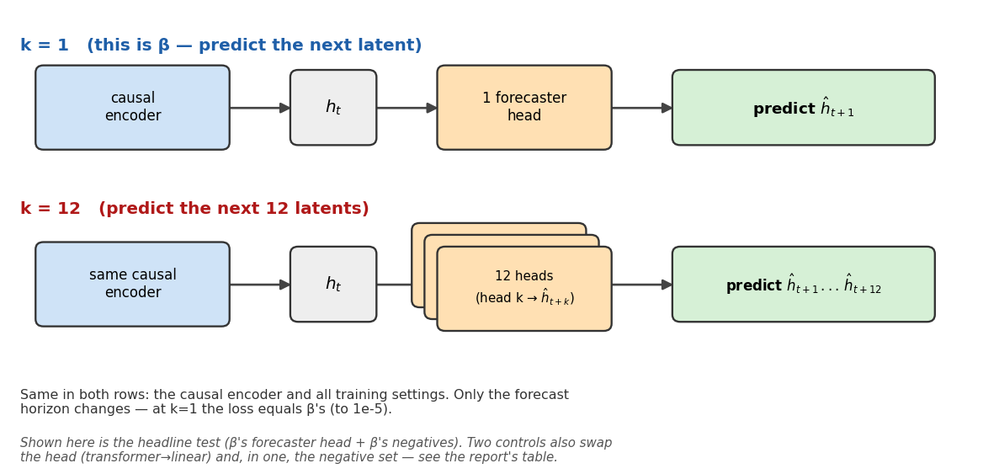
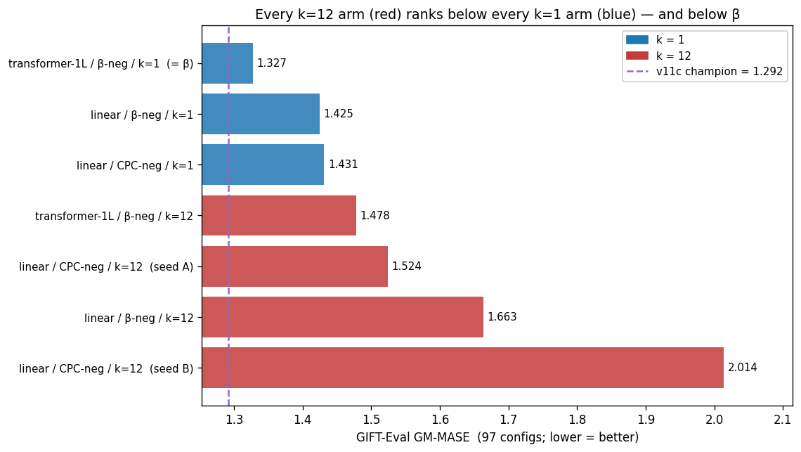
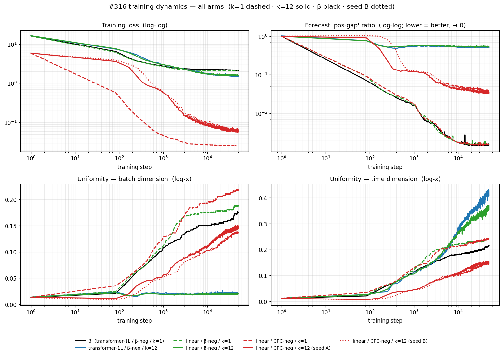

# #316 — Does predicting 12 steps ahead (k=12) beat 1 step (k=1)?

**No.** Every k=12 backbone we trained transfers worse than β (k=1). The exact
gap is smaller than the seed-to-seed noise, so the *direction* is reliable, the
*size* is not.

## What was tested

β's forecaster predicts the **next** latent (**k=1**). We test predicting
**k=12** ahead (the CPC idea: van den Oord 2018). Three things vary:

| axis | values |
|---|---|
| **k** — forecast steps | 1, 12 |
| **head** — the forecaster module | **transformer-1L** (β's own head) · **linear** |
| **negatives** — the pool the InfoNCE loss pushes against | **β-neg** · **CPC-neg** |

- **β-neg** = β's negative pool (cross-channel + cross-batch + every encoder
  time-step). Used by β and unchanged in most arms.
- **CPC-neg** = the original CPC pool (in-sequence + cross-batch only). The
  negatives are changed **only** in the two *CPC-neg* arms — a deliberate control
  to check the result is not an artifact of β's pool.

Each arm is identified by **head / negatives / k**. β itself = *transformer-1L /
β-neg / k=1*.

**Metric:** GM-Relative MASE over 97 GIFT-Eval configs (model MASE ÷
seasonal-naive MASE, geometric mean; **lower = better**). β = 1.327; the current
champion v11c = 1.292.

## Result

Every k=12 arm ranks below every k=1 arm — and below β:

Within each identical setup (same head + negatives; only k changes), k=12 is
worse than k=1:

| head | negatives | k=1 | k=12 |
|---|---|---:|---:|
| transformer-1L | β-neg | **1.327** (= β) | **1.478** |
| linear | β-neg | 1.425 | 1.664 |
| linear | CPC-neg | 1.431 | 1.524  ·  2.014 ¹ |

¹ The *linear / CPC-neg / k=12* cell was trained with **two seeds** → 1.524 and
2.014, **0.49 apart** — larger than every k=1→k=12 gap above. So the **direction**
(k=12 worse) holds but the **exact penalty** is not resolved. Every other cell is
a single seed.

### Per domain

The k=12 deficit is **broad**: every k=12 arm sits outside β (worse) on most of
the 7 GIFT-Eval domains, not concentrated in one. Each domain aggregates only
~14 configs, so per-domain numbers are noisier than the overall score — read the
broad pattern, not single domains.

## Latent dimensionality (measured)

Effective number of dimensions the encoder latent uses (participation ratio;
max = 384), measured across training for the β-neg families: **k=12 settles at
~50, k=1 at ~3–5.** k=12 makes the latent use *more* dimensions, not fewer — the
opposite of a collapse onto a low-rank subspace.

## Training dynamics

The four logged signals over training, all arms (k=1 dashed, k=12 solid, β black):

- **Loss** (log-log) — per-arm convergence. Loss *magnitudes* are not comparable
  across arms (the negative-pool size and the k-averaging change the scale); read
  each curve's own trend, not cross-arm levels.
- **Forecast "pos-gap" ratio** (log-log) — cos(forecast, current latent) ÷
  cos(forecast, next latent); → 0 means the forecast points at the future, not
  the present (lower = better). β drives it to ~0.001; the k=12 arms stall near
  ~0.5.
- **Uniformity, batch and time dimensions** (log-x) — how spread the latents are
  along each axis as training proceeds.

## Protocol

- **Backbones:** one per arm. 6-layer causal encoder + forecaster head; 50k
  steps, batch 256, τ=0.10, fp32. At k=1 the loss is byte-identical to β
  (verified, `test_cpc.py`).
- **k=12 head:** K=12 parallel heads; head *k* predicts the latent *k* steps
  ahead. The InfoNCE positive is averaged over the 12 horizons; negatives are the
  arm's pool (β-neg or CPC-neg).
- **Downstream:** freeze the backbone, train a quantile forecasting head, score
  GIFT-Eval full-97. The headline arm was also run with a 6-layer head.

## All computed numbers

GM-Relative MASE (lower = better). "s20/s23" = training seed.

| head | negatives | k | seed | full-97, small head | full-97, 6L head | triage-11, small head |
|---|---|---:|---|---:|---:|---:|
| transformer-1L | β-neg | 1 | — | **1.3272** (β) | — | — |
| transformer-1L | β-neg | 12 | s20 | 1.4781 | 1.4212 | 1.5852 |
| linear | β-neg | 1 | s20 | 1.4248 | — | 1.6251 |
| linear | β-neg | 12 | s20 | 1.6635 | — | 1.8219 |
| linear | CPC-neg | 1 | s20 | 1.4313 | — | 1.6704 |
| linear | CPC-neg | 12 | s20 | 1.5240 | 1.4722 | 1.7054 |
| linear | CPC-neg | 12 | s23 | 2.0137 | — | 2.0799 |

References (full-97): v11c = 1.292, (B) = 1.3572.

Latent dimensions (participation ratio @ 50k steps): transformer-1L β-neg —
k=1 = 3.2, k=12 = 55.3; linear β-neg — k=1 = 4.9, k=12 = 51.4.

Code: branch `experiment/2026-05-23-cpc-multistep-linear`. `forecaster_kind` ∈
{transformer (β), cpc (K transformer-1L heads), linear_cpc (K linear heads)};
scripts `diagram.py`, `plot_results.py`, `dim_usage.py`, `test_cpc.py`.
