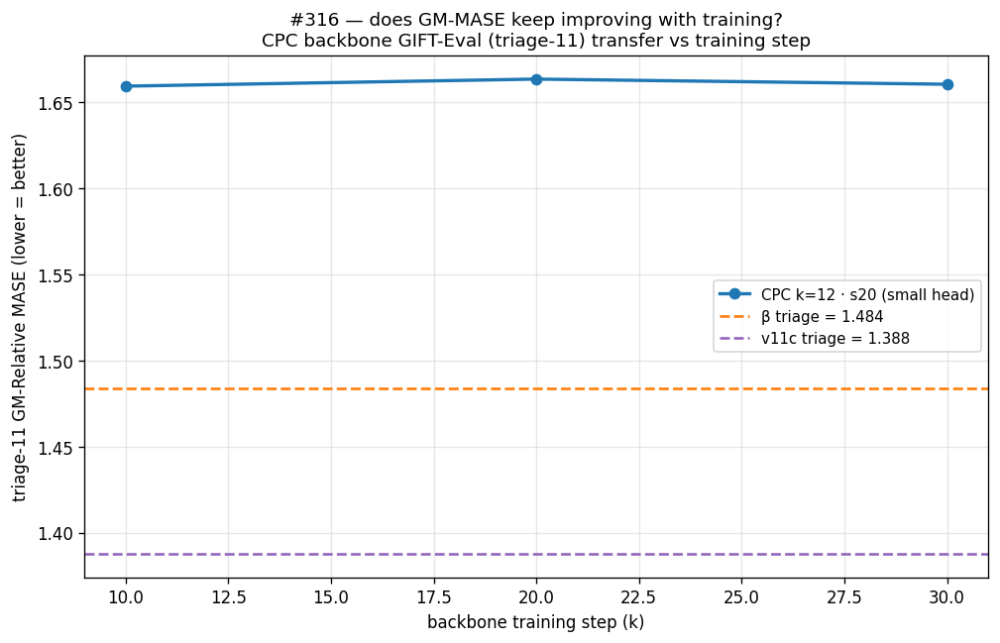

# #316 — CPC-style multi-step forecast on β (k=12)

> **⚠ Under revision (PR #317 review).** The design was corrected after review:
> the loss now uses **β's exact negatives** (only the positive becomes
> multi-step; k=1 ≡ β, verified), and the forecaster is **K transformer-1L
> heads** (β's architecture per head), not linear — removing the
> forecaster-type confound. The numbers below (1.4722 / 1.5240) are from the
> earlier confounded (linear + CPC-negatives) family and will be **reframed as
> study arm #3**; the headline #1 (transformer-head, β-negatives) is re-running.
> Verdict and figures below will be rewritten once #1–#3 land.

## Question

The encoder-forecaster backbone is trained by **contrastive forecasting**:
a causal encoder turns each patch of a series into a latent *h_t*, a
forecaster predicts the next latent, and an InfoNCE loss pulls the
prediction toward the true future latent while pushing it away from
negatives (other times, channels, and series). Transfer is measured on
**GIFT-Eval** as **GM-Relative MASE** — the geometric mean over 97 configs
of (model MASE ÷ seasonal-naive MASE); **lower is better**, 1.0 = seasonal
naive. Each backbone is frozen and a small quantile forecasting head is
trained on its latents before evaluation.

The best backbone on this line is **v11c = 1.292**. The strongest recipe
from #309, **β** (the (B) recipe + AdamW β2 = 0.98), reaches **1.3272** —
still **+2.7 %** over v11c. β's forecaster predicts only the **next** latent
(*k = 1*). One-step prediction does not force the latent to carry *all*
forecastable structure: the encoder can satisfy "predict the next latent +
separate from negatives" while drifting away from longer-horizon
forecasting, so more contrastive training need not improve GM-MASE.

Contrastive Predictive Coding (van den Oord, Li & Vinyals 2018) predicts
**several** steps ahead with simple linear heads, precisely to push the
representation toward the predictable structure of the signal. This card
asks:

> Does replacing β's transformer forecaster with a CPC-style **multi-step
> linear forecast** (predict the next **k = 12** latents with linear heads)
> close the gap to v11c — and does GM-MASE keep improving with training
> instead of flattening?

## Result

**No — the multi-step linear forecast does not close the gap; it widens it.**
The CPC backbone transfers **worse** than β on **both** heads: full-97 GM-MASE
**1.4722** (6L head) and **1.5240** (small head), vs β **1.3272** and v11c
**1.292** — **+11 % to +18 %** over the references. _[PENDING: seed B both
heads → seed-spread sentence.]_

| backbone / head | full-97 GM-MASE | vs v11c |
|---|---:|---:|
| **v11c** (champion, ref) | **1.292** | — |
| **β** (bneck, β2=0.98, ref) | **1.3272** | +2.7 % |
| (B) (ref) | 1.3572 | +5.0 % |
| **CPC k=12 · seed A · 6L head** | **1.4722** | **+14.0 %** |
| **CPC k=12 · seed A · small head** | **1.5240** | **+18.0 %** |
| CPC k=12 · seed B · 6L / small | _[PENDING]_ | |

Both heads land well outside β: the deeper 6L head recovers a little (a
stronger decoder partly compensates for a weaker backbone) but neither
approaches β, let alone v11c.

### Per domain (full GIFT-Eval), v11c reference

_[PENDING radar interpretation — the CPC ring is expected to sit outside
(worse than) both β and v11c across domains, consistent with the aggregate.]_

### Does GM-MASE keep improving with training?

**No.** Downstream transfer is **flat across training** and pinned above β
throughout: the small-head triage GM-MASE is 1.659 / 1.663 / 1.660 / 1.705 at
10 k / 20 k / 30 k / 50 k steps (β triage = 1.484, v11c triage = 1.388) — if
anything slightly *worse* by 50 k. More contrastive training does not move the
downstream number toward the references — the very decoupling the multi-step
objective was meant to remove. _[PENDING: seed B trace.]_

### Training curves — a healthy contrastive backbone that doesn't transfer

The backbone itself trains cleanly: the loss descends monotonically to ~0.06,
the forecast-vs-future gap (cos(f_t, h_{t+1}) − cos(f_t, h_t)) **rises** to
~0.75, R²_naive reaches ~0.96, retrieval AUC/Top-1 saturate at 1.0, and
dim-usage climbs (0.013 → ~0.15). Crucially the gap and loss optima sit
**together** near convergence (best_gap @ 45.6 k ≈ best_loss @ 49.2 k) — so at
the contrastive-metric level there is **no** "gap peaks early, then training
hurts" decoupling. Yet that steadily-improving contrastive backbone yields a
**flat, worse-than-β** downstream number (above). The decoupling the card set
out to fix is gone *internally* but reappears at the **transfer** level: a
better multi-step-contrastive latent is not a better forecasting backbone here.

## Protocol

**One axis changes vs β.** β's forecaster (a 1-layer causal transformer with
a d = 128 bottleneck) is replaced by **K = 12 linear heads** W_k : H → H.
Head *k* maps the causal 6-layer encoder output *h_t* to a prediction of the
encoder latent *k* steps ahead, *h_{t+k}*. There is no attention and no
bottleneck in the forecaster — the linear heads *are* the forecaster.

**Loss (`cpc_multistep`).** For each *k* the InfoNCE positive is
cos(W_k h_t, h_{t+k}); negatives are encoder latents *h* drawn from (a) other
series in the batch at the matched target time and (b) all other times in the
same series (the single target *h_{t+k}* masked out). Cosines are taken on
L2-normalised latents and divided by τ = 0.10; the per-step normalized-InfoNCE
losses (positive in the denominator, so ≥ 0) are averaged over *k*. The k = 1
head doubles as the single forecaster latent the downstream head consumes, so
the evaluation protocol is identical to β / #315.

**Everything else = β:** GRU patch-encoder → 6-layer causal encoder
(DropKey 0.70, shared across heads and layers) → forecaster; loss τ = 0.10,
AdamW β2 = 0.98, lr 1e-3, weight-decay 0.1, 50 k steps, global batch 256,
RevEWMNorm span 128, frequency + seasonality embeddings, mixup 0.3,
single channel, T_raw 4096 (T = 256 patches of W = 16).

**Precision = fp32** — the precision the v11c champion uses (the multi-step
objective is unstable under β's fp16 body at lr 1e-3; detail in EXECUTION_LOG.md).

**Two seeds** (20260520 = β's seed; 20260523), identical recipe, for a
variance estimate — the single-seed ±0.02 spread is the standing caveat of
this line.

**Downstream (unchanged from #309/#315).** Each frozen backbone is evaluated
with **two** quantile forecasting heads — a **small** 2-layer causal
transformer head and a **6-layer** head — trained 30 k steps (forecast
length 16, reconstruction = forecaster, encoder-then-forecaster input).
Both **triage (11 configs)** and **full (97 configs)** GM-Relative MASE are
reported so the numbers line up with β and v11c.

## What we learned

1. **The multi-step linear forecast does not close the gap to v11c — it
   widens it.** CPC k=12 lands at full-97 1.4722 (6L head) / 1.5240 (small
   head), ~+11–18 % over β (1.3272) and v11c (1.292). _[PENDING: seed B
   confirms.]_ The hypothesis that one-step prediction was *the* thing holding
   β back is not supported: predicting 12 steps with linear heads makes
   transfer worse, not better.
2. **Downstream GM-MASE is flat across training** (10 k→30 k triage ≈ 1.66,
   above β's 1.484) — more contrastive training buys no transfer improvement.
   The "more-training-doesn't-help" decoupling the card targeted is not fixed.
3. **The failure is not undertraining or collapse.** The backbone is a
   healthy contrastive model: monotone loss, rising gap (→0.75) and R²_naive
   (→0.96), saturated retrieval (AUC/Top-1 = 1.0), rising dim-usage, and — unlike
   β's reported best_gap≪best_loss split — gap and loss optima coincide near
   convergence. The decoupling moved from *inside* the contrastive metrics to
   the **contrastive→transfer** link: a better multi-step latent is simply not
   a better GIFT-Eval backbone here.
4. **Swapping β's 1-layer transformer forecaster for 12 linear heads changed
   the objective enough to hurt.** The forecaster's role on this line is not
   just "predict further ahead"; a deliberately weak (linear) multi-step
   predictor steers the encoder toward latents it can linearly extrapolate,
   which is not what transfer rewards.

*Hypothesis (not tested here): the linear k-step constraint pushes the latent
toward low-frequency, linearly-extrapolable structure and discards the
higher-frequency detail a more expressive forecaster lets the encoder keep —
the detail GIFT-Eval transfer needs. Confirming this would need a
representation-frequency probe, out of scope for this card.*

## Limitations

- _[PENDING: confirm seed spread once both seeds' GM-MASE are in.]_ Each cell
  is otherwise a single downstream draw; #307's variance estimate on this
  metric is ±0.02.
- The fp16 body that β uses is unavailable for this objective (it diverges at
  lr 1e-3); the comparison to β is therefore precision-mismatched (CPC fp32 vs
  β fp16), though it is precision-matched to the v11c champion (also fp32).
- v11c additionally differs from this recipe in DropKey (0.9 vs 0.70) and the
  encoder-side loss terms; any residual gap to v11c is entangled with those.

## Annex

### Why these choices
- **k = 12** is CPC's published horizon (van den Oord et al. 2018); fixed, not
  swept, to keep this a single-axis change from β.
- **Linear heads** (not an MLP/transformer) follow CPC: the prediction map is
  deliberately weak so that *forecastable* structure must live in the encoder
  latent, not in the forecaster.
- **Negatives** mirror β's pool (cross-batch + in-sequence cross-time on the
  encoder latents *h*) so the only change from β is one-step → multi-step.

### Metric
full-97 / triage-11 **GM-Relative MASE** = geometric mean over GIFT-Eval
configs of (model MASE ÷ seasonal-naive MASE). 1.0 = seasonal naive; lower is
better. References: **v11c = 1.292**, **β = 1.3272**, **(B) = 1.3572**.

### Code
Branch `experiment/2026-05-23-cpc-multistep-linear`.
`forecaster_kind="linear_cpc"` + `--cpc-k-steps` (src/blocks.py, src/models.py);
`cpc_multistep` loss (src/loss.py); multi-step `forward_step`
(experiments/2026-04-27_freq-embedding/scripts/train.py); CPC auto-detect in
the q-head trainer + GIFT-Eval. Runner `scripts/elisa_run.sh <seed> <gpu> fp32`;
downstream `scripts/downstream.sh <backbone> <head_layers> <gpu>`; figures
`scripts/plot_results.py`; CPU tests `scripts/test_cpc.py`.
