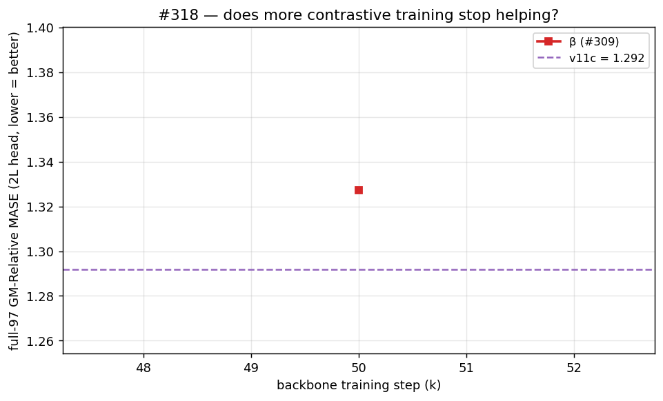

# #318 — Deny the positional shortcut: cross-series, same-step h↔h negatives

> **Status: results landing.** The backbone finished training; the q-head +
> GIFT-Eval matrix is grinding through on elisa. Tables and the verdict below
> update as cells complete; the design and protocol are final.

## The question

Our contrastive backbone is trained to make a forecast `f_t` look like the
*next* encoder state `h_{t+1}` and unlike a set of negatives. The strongest
recipe on this line, **β**, includes a within-series **cross-time** negative:
push `h_t` away from `h_l` for every other step `l`. That term has a cheap
escape hatch. A model can satisfy "`h_t` differs from `h_l`" by stamping each
step with a **positional fingerprint** — a code that says *"I am step 17"* —
that is **identical across all series**. Distinctness is achieved, but it costs
nothing in forecastable structure, and the encoder is then free to discard the
content that actually predicts the future.

Two standing observations on this line are consistent with that escape hatch
being taken: **bigger evaluation heads do not help**, and **more contrastive
training does not improve (often worsens) transfer**. Both are what you'd see
if the backbone were spending capacity on a content-free positional code.

**This card asks:** if we directly forbid the shortcut — repel, at *every*
step `l`, what *different* series share at that step (`cos(h_{b,l}, h_{b',l})`,
b ≠ b') — does the backbone move distinctness onto series-specific
(forecastable) content, and so transfer better than β?

## The idea, as one clean change

At a fixed step `l`, two *different* series share essentially one thing: the
positional component. So a **cross-series, same-step** encoder repulsion
targets exactly the shortcut and nothing else. β has **no** cross-series h↔h
term today (only a cross-series f↔h term). We add it as a single, isolated edit
on top of β:

1. **ADD** `cos(h_{b,l}, h_{b',l})` for b ≠ b', at **every** step `l` — the
   cross-series, same-step encoder negative. (The `square` loss once added a
   cross-series h↔h edge, but only at the prediction target step `t+1`, and
   bundled with other changes. Here it acts at every step, alone.)
2. **REMOVE** the duplicated adjacent negative `cos(h_t, h_{t+1})`. For the
   single-channel training config it is byte-for-byte the `l = t+1` slice
   already inside β's all-time `cos(h_t, h_l)` term, so dropping it
   de-duplicates rather than weakening the objective.

Everything else is byte-for-byte β. The new loss shape is
`cosine_similarity_batch_full_hh_negs_xshh` (`src/loss.py`); its exact term set
is pinned against an independent fp64 reference in
`tests/test_loss.py::TestCrossSeriesSameStepHH`.

## Protocol

**Backbone.** Byte-identical to the #309 **β** arm except `--loss-shape`:
GRU patch-encoder → 6-layer causal encoder → 1-layer forecaster with a
d = 128 bottleneck, AdamW β2 = 0.98, temperature τ = 0.10, dropkey 0.70 shared,
fp16 body / fp32 residual + patch-embedding, EWMA RevNorm span 128, seed
20260520, 50k steps, global batch 256, normalized-InfoNCE objective
(`--pos-in-denominator`). Single 4090.

**Evaluation.** Each frozen backbone gets a fresh **30k quantile q-head**
(transformer, causal, forecast-len 16) and is scored on GIFT-Eval. To separate
*backbone* quality from *head* capacity we train **two** heads — a **2-layer**
(small) and a **6-layer** — exactly as in #315/#316. Protocol is byte-identical
to #309/#315 so the numbers compare directly.

**Metric.** *GM-Relative MASE* = geometric mean over GIFT-Eval configs of
(model MASE ÷ seasonal-naive MASE). **Lower is better; 1.0 = seasonal naive.**
Reported on **full-97** (all 97 configs, the trusted metric) and **triage-11**
(11-config fast subset, noisier). It measures point-forecast accuracy relative
to the seasonal-naive baseline; it does **not** measure calibration or
probabilistic sharpness.

**References.** β (#309): full-97 = **1.3272**, triage-11 = **1.4836** (2L head).
v11c (the encoder-forecaster champion): full-97 = **1.292**. Seasonal naive = 1.0.

## Results

### Headline — frozen-backbone GM-Relative MASE

_(landing)_

| Backbone | head | full-97 GM | triage-11 GM |
|----------|:----:|-----------:|-------------:|
| **β** (#309) | 2L | 1.3272 | 1.4836 |
| **β** (#309) | 6L | _(landing)_ | _(landing)_ |
| **xshh** (this card) | 2L | _(landing)_ | _(landing)_ |
| **xshh** (this card) | 6L | _(landing)_ | _(landing)_ |
| v11c (ref) | 2L | 1.292 | — |

### Does more contrastive training stop helping?

_(landing — full-97 GM-Relative MASE, 2L head, at 20k / 35k / 50k for xshh and β.)_

### Per-domain transfer (collateral-damage check)

_(landing — flags whether the repulsion removes genuinely shared structure,
e.g. same-frequency seasonal phase, on strongly seasonal domains.)_

### Training dynamics

The two runs share every hyperparameter, so their contrastive curves isolate
the effect of the new negative on the training task itself.

## What we learned

_(verdict landing — will state plainly whether the cross-series same-step
repulsion beats β / v11c, whether the decoupling shrank, and any collateral
damage, with single-seed caveats flagged.)_
