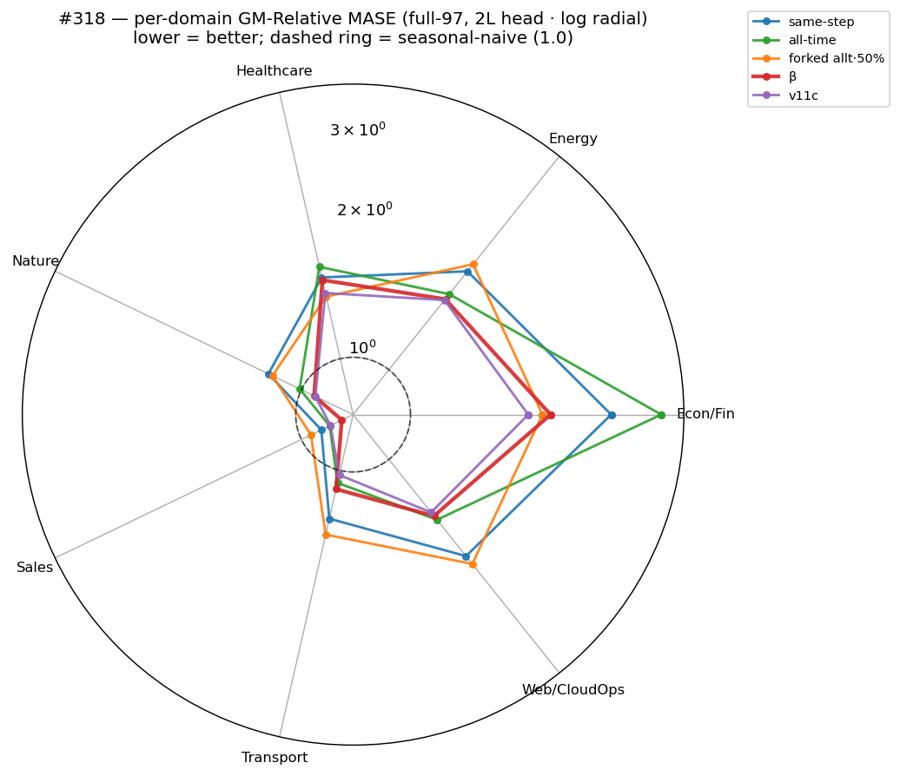
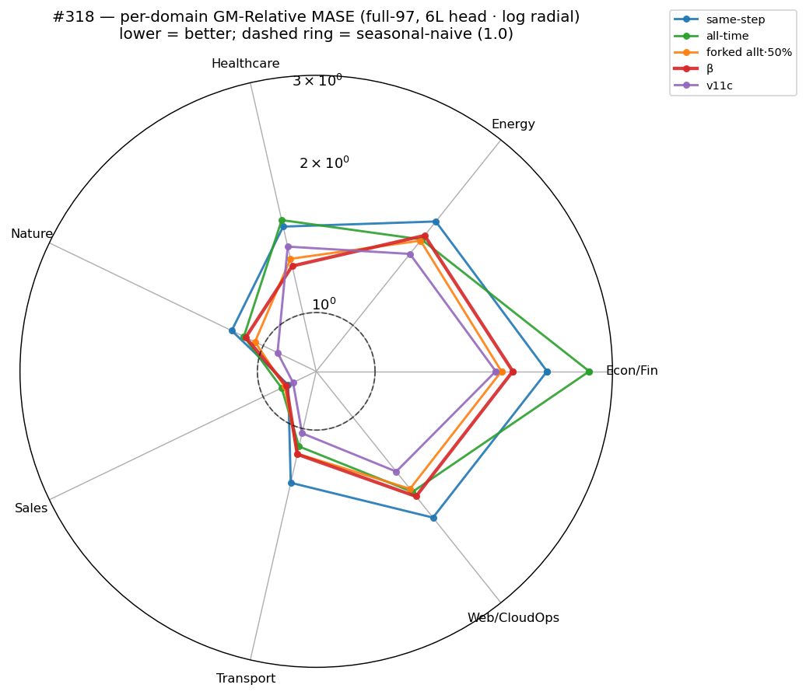

# #318 — Deny the positional shortcut: loss-side vs data-side

**Verdict.** Two ways to deny the shortcut, tested as separate arms. **Loss-side**
(cross-series h↔h repulsion — same-step, all-time): both **hurt**, +22% / +6.6% vs
β at the 2L head. **Data-side** (forked continuations — identical past, divergent
futures): **head-dependent** — worst arm at 2L (1.637), best backbone here at 6L
(full-97 **1.4065**), the only denial arm to beat β on any domain — but its 50%
synthetic mix confounds a data shift with the fork, so an isolating 2/batch re-run
is in flight. **β·2L (1.3272) is best overall.**

*GM-Relative MASE, lower = better; 1.0 = seasonal-naive. Every arm × {2L, 6L};
forked 2/batch (brown) appears once it lands.*

## Question

β denies within-series cross-time distinctness (`h_t` ≠ `h_l` ∀l), but a
**positional fingerprint** shared across all series satisfies that for free —
distinctness at no cost in forecastable content (consistent with the standing
observations: bigger eval heads don't help, more contrastive training doesn't
transfer). We forbid the shortcut two ways: through the **loss** (repel what
different series share at a step) and through the **data** (pairs whose identical
past has divergent futures, so position *cannot* encode the future).

## Result

Each frozen backbone is scored with a fresh 2-layer and 6-layer quantile q-head,
separating backbone quality from readout capacity. Numbers are on the gm_summary
bars above and in the **[full scoreboard](#scoreboard--every-arm--head)** at the end.

*GM-Relative MASE = geometric mean over configs of model-MASE ÷ seasonal-naive-MASE
(1.0 = parity, lower better); full-97 = all 97 configs, triage-11 = noisy fast
subset. Single seed per cell (line spread ≈ ±0.02, #307).*

- **Loss-side hurts; tighter targeting hurts more.** same-step (the precise
  positional-code denier) is worst, broad all-time less so. A 6L head rescues
  neither (even β degrades 2L→6L), so the regression is in the **backbone** —
  what different series share at a step is forecastably useful, not a free code.
- **Data-side (forked) is head-dependent**: worst at 2L, best-of-6L at 6L (a 0.23
  swing vs β's 0.12), so the representation needs a deeper head to read out. The
  50%-mix result is **confounded** by its synthetic fraction; two minimal-injection
  arms (one pair per batch) isolate the fork — on the **all-time** loss and on the
  **β** loss — both in flight.

### Per-domain (full-97), by q-head

*Log radial; dashed ring = seasonal-naive (1.0); innermost = best. **2L** (top):
β/v11c tightest; the loss-side arms bulge out (same-step worse than β on all 7
domains, no seasonal signature); forked·allt·50% is the only arm inside β anywhere
(Econ/Fin, Healthcare). **6L** (bottom): forked·allt·50% closes most of the gap —
the fork's head-dependence shows per-domain. Forked 2/batch + β·2/batch join both
panels when they land.*

### Training dynamics

*All log–log, warm-up (step < 1000) skipped. **Loss − floor**: floors β 1.55 /
same-step 2.04 / all-time 5.27 grow with the 52×-spanning negative pool (forked
shares all-time's); all converge to a similar excess (+0.54…+0.64). **gap-ratio**
(1−ff)/(1−fp) (forecast↔future vs ↔present; 0 = perfect). **Dimension usage**
U = 1/(d·mean cos²) ∈ (0,1] (1 = full use, →0 = collapse), temporal and batch.* The
contrastive objective is learned near-identically across arms, yet transfer spans
22% — for the loss-side arms the structure is learned but wrong.

## Latent dimensionality

*Frozen encoder latent `h` (d=384), one real-HF batch (B=128, T=64 → 8,192
positions, CPU). **Left**: normalised singular-value spectrum of mean-centred `h`
(log-y). **Right**: dimension-usage effective rank = `U·H`, `U = 1/(d·mean_{i≠j}
cos²)` (method from the 2026-05-08 init-u-sweep), batch and time axes. Colours
match the scoreboard.*

All arms are deeply collapsed — effective rank 1–8 of 384 (the post-training
collapse the init-u-sweep flagged). **forked β·2/b is a clear outlier** — eff-rank
≈ 7.8 (PR 10.2), ~4–8× every other arm. But latent rank does **not** order the arms
by transfer: β has the best transfer (1.327) at a middling rank (1.45), while
all-time carries the higher rank (1.93) yet transfers worse (1.414) — the same
loss↔transfer decoupling seen above. (forked β·2/b's own transfer is still in eval.)

| arm | eff-rank (batch / time) | PR |
|---|:--:|:--:|
| same-step | 1.26 / 1.60 | 2.78 |
| all-time | 1.93 / 1.95 | 7.53 |
| forked allt·50% | 1.01 / 1.69 | 4.14 |
| **forked β·2/b** | **7.82 / 7.29** | **10.19** |
| β | 1.45 / 1.57 | 3.17 |

*eff-rank = `dim_usage · 384` over the batch / time axes; PR = participation ratio
of the squared spectrum. forked allt·2/b omitted — backbone still training. Script:
`scripts/latent_dim.py`.*

## Protocol

All arms are byte-identical to the #309 **β** recipe except the denial edit: GRU
patch-encoder → 6L causal encoder → 1L forecaster (d=128), AdamW β2=0.98, τ=0.10,
dropkey 0.70, fp16 body / fp32 residual, EWMA RevNorm span 128, seed 20260520,
50k steps, batch 256, `--pos-in-denominator`. **Loss-side** changes only
`--loss-shape …_{xshh,xshh_allt}` (fp64-pinned in `tests/test_loss.py`);
**data-side** adds no loss term — it injects a forked-ARIMA mix
(`src/synthetic_forked_arma.py`): 50% or one pair/256 on the all-time loss, and
one pair/256 on the β loss. The all-time loss costs **~2.2×** the step time
(6.4→2.9 sps); the β-loss arms run at the β rate. Eval: fresh 30k q-head (2L/6L), GIFT-Eval
strategy B4, byte-identical to #309/#315. Refs: β 1.3272, v11c 1.292,
seasonal-naive 1.0.

## Scoreboard — every arm × head

| arm | head | full-97 | triage-11 | Δ full vs β·2L |
|---|:--:|---:|---:|---:|
| β (#309) | 2L | **1.3272** | 1.4836 | — |
| β (#309) | 6L | 1.4489 | 1.5271 | +9.2% |
| loss-side · same-step | 2L | 1.6194 | 1.9816 | +22.0% |
| loss-side · same-step | 6L | 1.6181 | 1.8762 | +21.9% |
| loss-side · all-time | 2L | 1.4143 | 1.6126 | +6.6% |
| loss-side · all-time | 6L | 1.4748 | 1.7028 | +11.1% |
| data-side · forked allt·50% | 2L | 1.6366 | 1.8824 | +23.3% |
| data-side · forked allt·50% | 6L | **1.4065** | 1.5339 | +6.0% |
| data-side · forked allt·2/b | 2L · 6L | *in flight* | *in flight* | — |
| data-side · forked β·2/b | 2L · 6L | *in flight* | *in flight* | — |
| v11c (reference) | 2L | 1.292 | — | −2.7% |

*GM-Relative MASE, lower = better; Δ vs the best arm β·2L (1.3272).*

## Annex — exact negatives (per anchor, C=1; pooled N = B·Σ)

| family | repels | β | same-step | all-time / forked |
|---|---|:--:|:--:|:--:|
| `xy` adjacent h↔h | `cos(h_t, h_{t+1})` | 1 | — | — |
| `zy` forecaster f↔f | `cos(f_{t+1}, f_t)` | 1 | 1 | 1 |
| `hh_all` within-series ∀l | `cos(h_t, h_l)`, l≠t | T−1 | T−1 | T−1 |
| `cross_fe` cross-series f↔h | `cos(f_{b,t}, h_{b',t+1})` | B−1 | B−1 | B−1 |
| `xshh` cross-series same-step | `cos(h_{b,t}, h_{b',t})` | — | B−1 | — |
| `xs_allt` cross-series ∀l | `cos(h_{b,t}, h_{b',l})` | — | — | (B−1)·T |
| **pooled N** (B=256, T=64) | | **81,920** | **146,944** (1.79×) | **4,259,584** (52×) |

Latent T = 64 (HF crops to T_RAW=1024, ÷ patch-16; holds for β/v11c too). Data-side
arms add no loss term — the fork is in the *data*; each shares its base loss's
negatives (all-time-forked → all-time column; β-forked → β column).

## Other artifacts (trained, not evaluated)

A 6L-forecaster variant of both loss-side arms (1L → 6L *forecaster*) was trained
— `bb_xshh_6Lf_50k`, `bb_xshh_allt_6Lf_50k` (50k each, on disk) — but downstream
eval was paused to prioritise the fork (one cell: same-step-6Lf 2L triage 1.5177).
See [`EXECUTION_LOG.md`](EXECUTION_LOG.md).
