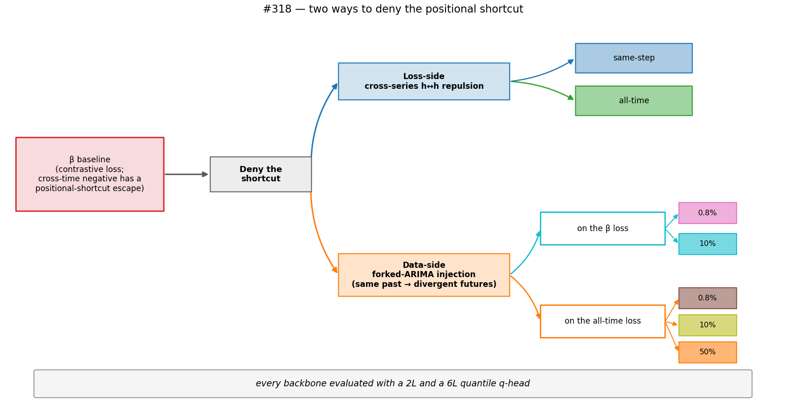
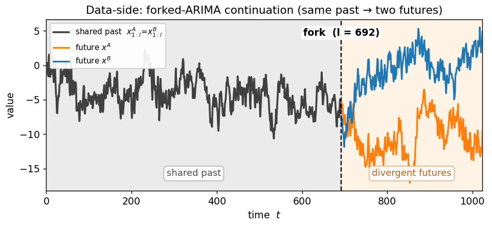
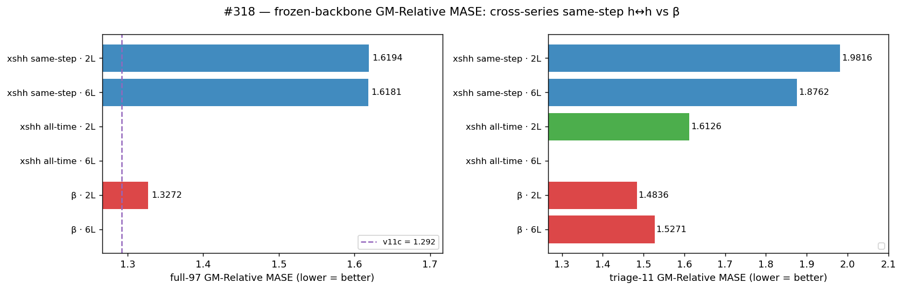
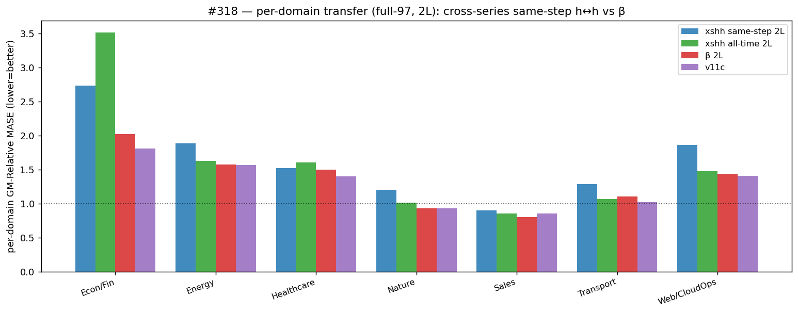
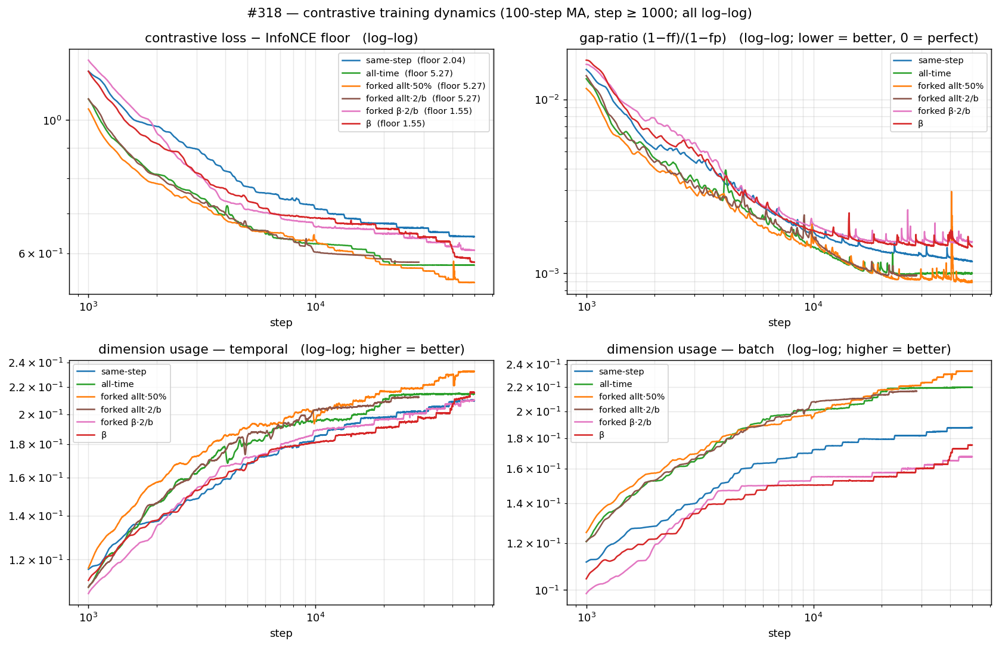
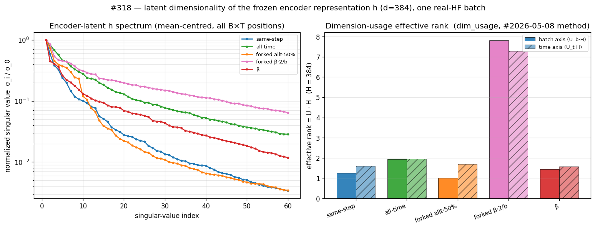

# #318 — Deny the positional shortcut: loss-side vs data-side

**Verdict.** Two ways to forbid the "positional shortcut" β can exploit. Through the
**loss** (cross-series h↔h repulsion) it **hurts** — same-step +22%, all-time +6.6%.
Through the **data** (forked continuations — identical past, divergent futures) only
one setting helps: a **β-loss fork at ≈10% injection beats β at both seeds and both
q-heads** — the only reproducing gain here; every other fraction/loss hurts. The gain
is real but modest, landing **between β and v11c**, not at v11c (the single-seed
β·10%·6L = v11c was seed-1 luck — 1.3271 at seed 2).

**References** (GM-Relative MASE, lower = better): β = the #309 baseline recipe,
1.3272; v11c = prior in-project best, 1.292; seasonal-naive = 1.0.

## Design

β's cross-time negative (`h_t` ≠ `h_l` ∀l) can be satisfied by a content-free
**positional code** shared across series — distinctness bought at no
forecastable-content cost. We test whether denying that code improves transfer, two
ways — repel it in the **loss**, or remove it in the **data**:

*Loss-side: cross-series h↔h repulsion (same-step / all-time). Data-side:
forked-ARIMA injection — 0.8/10% on the β loss, 0.8/10/50% on the all-time loss.
Each backbone is scored with a 2L and a 6L q-head.*

*The data-side fork — a pair shares an exact past, then diverges, so position
cannot encode the future.*

## Results

*GM-Relative MASE = geometric mean over GIFT-Eval configs of (model MASE ÷
seasonal-naive MASE); 1.0 = seasonal-naive, lower = better. Left full-97 (all 97
configs), right triage-11 (11 fixed configs). β·10% is the only arm to beat β·2L
(both heads land left of it); of those, only its 6L head reaches the v11c line
(dashed). Every other arm — loss-side and all other forked fractions — sits right of
β. Whiskers (→/←) mark each multi-seed cell's second seed — β·10%·6L's crosses back
above v11c, so that match is seed-fragile. Per-arm numbers: [scoreboard](#scoreboard).*

A 6L q-head rescues no loss-side arm — the regression points to the backbone, not
the readout.

*Per-domain, every arm at its best q-head (log radial; dashed ring = seasonal-naive
1.0; innermost = best). For the two multi-seed arms (β·10% cyan, β red) the shade
spans both seeds and the line marks the better one. β·10% sits with β and v11c in the
inner cluster; loss-side arms bulge outward, worst on Econ/Fin (all-time's 3.5 clips
at the rim).*

*Log–log, warm-up (< 1000 steps) cropped. Loss − InfoNCE floor; gap-ratio
(1−ff)/(1−fp), forecast↔future vs ↔present, 0 = perfect; live training-time
dimension usage (dropkey **on**, ≈ 0.2), temporal & batch, higher = better. All
four track near-identically across arms — yet the same-step arm transfers 22% worse
than β (scoreboard): the training signal does not separate the arms that transfer
from those that don't.*

*Frozen encoder latent `h` (d=384, one HF batch, **eval-mode — dropkey off**):
singular-value spectrum (left), effective rank = U·384 (right). Eval-mode rank
collapses to 1–8 of 384 — far below the dropkey-on ≈ 0.2 training-time usage above.
forked β·0.8% is the lone outlier (~7.8) — a β-loss × fork interaction in this batch,
not the fork alone. Rank does not order transfer (table in annex).*

### Second seed — sign reproduces, magnitude doesn't pin down

β·10% beats β at **all four** seed × head cells (sign reproduces), but the magnitude
does not: GMs swing ≫ ±0.02 across seeds, so the single-seed β·10%·6L = v11c does not
survive ([table](#second-seed-seed-20260521)). Follow-ups: a third seed to tighten the
magnitude; a 50% *unforked*-synthetic control to isolate the fork from the
synthetic-data fraction.

## Protocol

All arms byte-identical to the #309 **β** recipe except the denial edit: GRU
patch-encoder → 6L causal encoder → 1L forecaster (d=128), AdamW β2=0.98, τ=0.10,
dropkey 0.70, fp16 body / fp32 residual, EWMA RevNorm span 128, 50k steps, batch
256, `--pos-in-denominator`, seed 20260520. **Loss-side** changes only
`--loss-shape …_{xshh,xshh_allt}` (fp64-pinned, `tests/test_loss.py`);
**data-side** injects a forked-ARIMA mix (`src/synthetic_forked_arma.py`) at
0.8% (2 forked pairs per 256-row batch) / 10% / 50% on the all-time or β loss. Eval:
fresh 30k quantile q-head (2L and 6L), GIFT-Eval strategy B4, byte-identical to
#309/#315.

## Annex

### Scoreboard

| arm | head | full-97 | triage-11 | Δ full vs β·2L |
|---|:--:|---:|---:|---:|
| β (#309) | 2L | **1.3272** | 1.4836 | — |
| β (#309) | 6L | 1.4489 | 1.5271 | +9.2% |
| loss-side · same-step | 2L | 1.6194 | 1.9816 | +22.0% |
| loss-side · same-step | 6L | 1.6181 | 1.8762 | +21.9% |
| loss-side · all-time | 2L | 1.4143 | 1.6126 | +6.6% |
| loss-side · all-time | 6L | 1.4748 | 1.7028 | +11.1% |
| data-side · forked allt·50% | 2L | 1.6366 | 1.8824 | +23.3% |
| data-side · forked allt·50% | 6L | 1.4065 | 1.5339 | +6.0% |
| data-side · forked allt·0.8% | 2L | 1.4049 | 1.6083 | +5.9% |
| data-side · forked allt·0.8% | 6L | 1.5100 | 1.6348 | +13.8% |
| data-side · forked β·0.8% | 2L | 1.5302 | 1.4376 | +15.3% |
| data-side · forked β·0.8% | 6L | 1.4412 | 1.4027 | +8.6% |
| data-side · forked allt·10% | 2L | 1.6130 | 2.0115 | +21.5% |
| data-side · forked allt·10% | 6L | 1.5304 | 1.9293 | +15.3% |
| data-side · **forked β·10%** | 2L | **1.3030** | 1.4559 | −1.8% † |
| data-side · **forked β·10%** | 6L | **1.2889** | 1.4747 | −2.9% † |
| v11c (reference) | 2L | 1.292 | — | −2.7% |

*Lower = better; Δ vs β·2L 1.3272. † β·10% is single-seed here; the controlled
quantity is the within-seed paired gap (reproducibly negative — second-seed table).*

### Second seed (seed 20260521)

| arm · head | seed 1 | seed 2 | β·10% − β (s1 / s2) |
|---|---:|---:|---:|
| β·10% · 2L | 1.3030 | 1.3805 | −0.024 / −0.079 |
| β·10% · 6L | 1.2889 | 1.3271 | −0.160 / −0.043 |
| β · 2L | 1.3272¹ | 1.4591 | |
| β · 6L | 1.4489¹ | 1.3702 | |

¹ seed-1 β is the #309 reference; seed-2 β is the matched forked-launcher recipe
(mix 0). The within-seed **paired gap** (β·10% − β) is the controlled quantity —
negative at both seeds.

### Latent dimensionality

| arm | eff-rank (batch / time) | PR |
|---|:--:|:--:|
| same-step | 1.26 / 1.60 | 2.78 |
| all-time | 1.93 / 1.95 | 7.53 |
| forked allt·50% | 1.01 / 1.69 | 4.14 |
| forked allt·0.8% | 1.08 / 2.09 | 2.82 |
| **forked β·0.8%** | **7.82 / 7.29** | **10.19** |
| β | 1.45 / 1.57 | 3.17 |

*eff-rank = `dim_usage · 384`; PR = participation ratio of the squared spectrum.
Script: `scripts/latent_dim.py`.*

### Exact negatives (per anchor, C=1; pooled N = B·Σ)

| family | repels | β | same-step | all-time / forked |
|---|---|:--:|:--:|:--:|
| `xy` adjacent h↔h | `cos(h_t, h_{t+1})` | 1 | — | — |
| `zy` forecaster f↔f | `cos(f_{t+1}, f_t)` | 1 | 1 | 1 |
| `hh_all` within-series ∀l | `cos(h_t, h_l)`, l≠t | T−1 | T−1 | T−1 |
| `cross_fe` cross-series f↔h | `cos(f_{b,t}, h_{b',t+1})` | B−1 | B−1 | B−1 |
| `xshh` cross-series same-step | `cos(h_{b,t}, h_{b',t})` | — | B−1 | — |
| `xs_allt` cross-series ∀l | `cos(h_{b,t}, h_{b',l})` | — | — | (B−1)·T |
| **pooled N** (B=256, T=64) | | **81,920** | **146,944** (1.79×) | **4,259,584** (52×) |

Latent T = 64 (HF crops to T_RAW=1024, ÷ patch-16). Data-side arms add no loss
term — the fork is in the *data*; each shares its base loss's negatives.

### Operational notes

Infrastructure, the 50% → 0.8% fork-fraction correction, and a trained-but-unevaluated
6L-*forecaster* variant: [`EXECUTION_LOG.md`](notes/EXECUTION_LOG.md).
